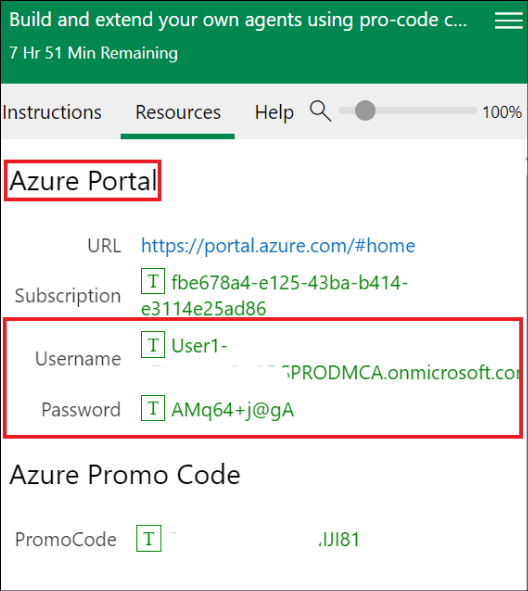

# Laboratório 1: Criar um agente declarativo para o Microsoft 365 Copilot usando o Teams Toolkit

**Tempo estimado: 30 minutos**

## Objetivo

O objetivo deste laboratório é capacitar os participantes a criarem um
agente declarativo para o Microsoft 365 Copilot usando o Teams Toolkit.
Ao concluir o laboratório, os participantes criarão um jogo de
geolocalização que proporciona uma pausa divertida e educativa no
trabalho. O laboratório se concentra em entender a estrutura dos agentes
declarativos, configurá-los com instruções e integrá-los ao ecossistema
do Microsoft 365 para interações personalizadas do Copilot.

## Solução

Os participantes instalarão o Teams Toolkit no Visual Studio Code e
configurarão seu ambiente de desenvolvimento. Usando um modelo, eles
criarão um agente declarativo chamado Geo Locator Game. Eles
personalizarão as instruções do agente e atualizarão seus arquivos de
configuração, como instruction.txt e manifest.json. O laboratório também
orienta os participantes a aprimorarem o agente com identificadores
exclusivos, ícones personalizados e funcionalidade de teste. O resultado
é um aplicativo Copilot totalmente funcional e envolvente, adaptado para
fornecer pistas sobre as cidades enquanto se integra perfeitamente ao
Microsoft 365.

## Exercício 1: Configurar seu ambiente de desenvolvimento para o Microsoft 365 Copilot

Atualmente, este laboratório pressupõe que você já tenha um locatário
para configurar.

- Visual Studio Code

- NodeJS versão 22.13.1

### Tarefa 1: Instalar o Teams Toolkit

1.  Abra o **Visual Studio Code** e clique no botão da barra de
    ferramentas **EXTENSIONS**.

    

2.  Pesquise "**Teams**" e localize o **Teams Toolkit** e clique em
    **Install.**

    

3.  Quando a instalação for concluída, o ícone do **Teams Toolkit**
    aparecerá na barra de navegação esquerda.

    

## [Exercício 2: Primeiro agente declarativo](https://microsoft.github.io/copilot-camp/pages/extend-m365-copilot/01-declarative-copilot/)

Neste laboratório, você criará um agente declarativo simples usando o
Teams Toolkit para Visual Studio Code. Seu agente foi projetado para lhe
dar uma pausa divertida e educacional no trabalho, ajudando você a
explorar cidades em todo o mundo. Ele apresenta pistas abstratas para
você adivinhar uma cidade, com menos pontos concedidos quanto mais
pistas você usar. No final, sua pontuação final será revelada.

Neste exercício, você aprenderá:

- o que é um agente declarativo para o Microsoft 365 Copilot;

- a criar um agente declarativo usando o modelo do Teams Toolkit;

- a personalizar o agente para criar o jogo de localização geográfica
  usando instruções;

- como executar e testar seu aplicativo.

Para o exercício bônus, você precisará de um site SharePoint Teams.

### Introdução

Os agentes declarativos aproveitam a mesma infraestrutura e plataforma
escalonáveis do Microsoft 365 Copilot, adaptadas especificamente para
atender ao foco em uma área especial de suas necessidades. Eles
funcionam como especialistas no assunto em uma área específica ou
necessidade de negócios, permitindo que você use a mesma interface de um
chat padrão do Microsoft 365 Copilot, garantindo que eles se concentrem
exclusivamente na tarefa específica em questão.

Bem-vindo a bordo para construir seu próprio agente declarativo! Vamos
mergulhar e fazer seu Copilot funcionar como mágica!

Neste laboratório, você começará a criar um agente declarativo usando o
Teams Toolkit com um modelo padrão usado na ferramenta. Isso é para
ajudá-lo a começar com algo. Em seguida, você modificará seu agente para
se concentrar em um jogo de localização geográfica.

O objetivo da sua AI é proporcionar uma pausa divertida no trabalho
enquanto ajuda você a aprender sobre diferentes cidades ao redor do
mundo. Ela oferece pistas abstratas para você identificar uma cidade.
Quanto mais pistas você precisar, menos pontos você ganha. No final do
jogo, sua pontuação final será revelada.


Você também dará ao seu agente alguns arquivos para consultar um diário
secreto 🕵🏽 e um mapa 🗺️ para oferecer mais desafios ao jogador.

Então, vamos começar!

### Anatomia de um agente declarativo

Você verá à medida que desenvolvemos mais e mais extensões para o
Copilot que, no final, o que você criará é uma coleção de alguns
arquivos em um arquivo zip que chamaremos de pacote de aplicativo que
você instalará e usará. Portanto, é importante que você tenha uma
compreensão básica do que consiste o pacote do aplicativo. O pacote do
aplicativo de um agente declarativo é como um aplicativo do Teams se
você tiver criado um antes com elementos adicionais. Consulte a tabela
para ver todos os elementos principais. Você também verá que o processo
de implantação do aplicativo é muito semelhante à implantação de um
aplicativo do Teams.

|  Elemento  | Descrição   |  Nome do arquivo  |
|:----|:-------|:-----|
|  **Manifesto do aplicativo**  |  Descreve a configuração do aplicativo, os recursos, os recursos necessários e os atributos importantes.  |  manifest.json  |
| **Ícones de aplicativos**   | Requer um ícone de cor (192x192) e contorno (32x32) para seu agente declarativo.   |  icon.png, color.png  |
| **Manifesto do agente declarativo**   |  Descreve a configuração do agente, instruções, campos obrigatórios, recursos, iniciadores de conversa e ações.  |  declarativeAgent.json  |

**Observação:** você pode adicionar dados de referência do SharePoint,
OneDrive, pesquisa na web etc. e adicionar recursos de extensão a um
agente declarativo, como plug-ins e conectores. Você aprenderá a
adicionar um plug-in nos próximos laboratórios neste caminho.

### Recursos de um agente declarativo

Você pode aprimorar o foco do agente no contexto e nos dados não apenas
adicionando instruções, mas também especificando a base de conhecimento
que ele deve acessar. Eles são chamados de recursos e há três tipos de
recursos suportados.

- **Microsoft Graph** **Connectors** – passa conexões de conectores do
  Graph para o agente, permitindo que o agente acesse e utilize o
  conhecimento do conector.

- **OneDrive and SharePoint** - fornece URLs de arquivos e sites para o
  agente, para que ele obtenha acesso a esses conteúdos.

- **Web** **search** - ativa ou desativa o conteúdo da web como parte da
  base de conhecimento do agente.

    

### One Drive and SharePoint

As URLs devem ser o caminho completo para itens do SharePoint (site,
biblioteca de documentos, pasta ou arquivo). Você pode usar a opção
"Copy direct link" no SharePoint para obter o caminho completo ou
arquivos e pastas. Para conseguir isso, clique com o botão direito do
mouse no arquivo ou pasta e selecione “Details”. Navegue até caminho e
clique no ícone de cópia. Não especificando as URLs, todo o corpo de
conteúdo do OneDrive e do SharePoint disponível para o usuário conectado
será usado pelo agente.

### Microsoft Graph Connector

Não especificando as conexões, todo o corpo de conteúdo dos Graph
Connectors disponível para o usuário conectado será usado pelo agente.

### Web search

No momento, você não pode passar sites ou domínios específicos, e isso
funciona apenas como uma alternância para ativar e desativar o uso da
web.

## Exercício 3: Estruturar um agente declarativo a partir de um modelo

Você pode usar qualquer editor para criar um agente declarativo se
souber a estrutura dos arquivos no pacote do aplicativo mencionado
acima. Mas as coisas são mais fáceis se você usar uma ferramenta como o
Teams Toolkit não apenas para criar esses arquivos para você, mas também
para ajudá-lo a implantar e publicar seu aplicativo. Portanto, para
manter as coisas o mais simples possível, você usará o Teams Toolkit.

### Tarefa 1: Usar Teams Toolkit para criar um aplicativo de agente declarativo

1.  Vá para a extensão do **Teams Toolkit** no editor do **Visual Studio
    Code** e selecione **Create a New App.**

    

2.  Um painel é aberto onde você precisa selecionar **Agent** na lista
    de tipos de projeto.

    

3.  Em seguida, você será solicitado a escolher o recurso do aplicativo
    do Copilot Agent. Escolha **Declarative Agent** e pressione
    **Enter**.

    

4.  Em seguida, você será solicitado a escolher se deseja criar um
    agente declarativo básico ou um com um plug-in de API. Escolha a
    opção **No plugin**.

    

    **Por que não criar um com plugin de API aqui?**
    
    Você criará plug-ins de API no próximo laboratório e também aprenderá
    a integrar um plug-in de API a um agente declarativo. Aqui vamos
    apenas criar um agente declarativo.

5.  Em seguida, selecione a opção **Default folder** para especificar
    onde a pasta do projeto deve ser criada.

    

6.  Em seguida, dê a ele um aplicativo chamado **Geo Locator Game** e
    pressione **Enter**.

    

    O projeto será criado em alguns segundos na pasta que você mencionou e será aberto em uma nova janela de projeto do Visual Studio Code. Esta é a sua pasta de trabalho.

7.  Clique em **Yes, I trust the authors.**

    

    

    Muito bem! Você configurou com sucesso o agente declarativo base! Agora, prossiga para examinar os arquivos contidos para poder personalizá-los para criar o aplicativo de jogo localizador geográfico.

### Tarefa 2: Configurar contas no Teams Toolkit

1.  Agora selecione o ícone do **Teams Toolkit** à esquerda: Em "
    **ACCOUNTS**", clique em " Sign in to Microsoft 365" e faça login
    com suas **credenciais de Usuário1** no **Azure** **Portal** na guia
    **Resources**.

    

    

2.  Uma janela do navegador aparecerá e oferecerá o login no
    Microsoft 365. Quando aparecer a mensagem " **You are signed in now
    and close this page.**", feche esta janela.

    

    

3.  Selecione **Allow access** na caixa de diálogo **Security Alert**.

    

4.  Verifique se " **Custom App Upload Enabled**" tem uma marca de
    seleção verde.

5.  Verifique se "**Copilot Access Enabled**” tem uma marca de seleção
    verde.

    

### Tarefa 3: Entendendo os arquivos no aplicativo

    Veja como o projeto base se parece:
    
|  **Pasta/Arquivo**  |  **Conteúdo**  |
|:-------|:-----------|
|   .vscode | Arquivos VSCode para debugging   |
|  appPackage  |  Modelos para o manifesto do aplicativo Teams, o manifesto GPT e a especificação da API  |
|  Env  | Arquivos de ambiente com um arquivo .env.dev padrão   |
|  appPackage/color.png  | Imagem do logotipo do aplicativo   |
|  appPackage/outline.png  |  Imagem do esboço do logotipo do aplicativo  |
|  appPackage/declarativeAgent.json  | Define as configurações e configurações do agente declarativo.   |
|  appPackage/instruction.txt  |  Define o comportamento do agente declarativo.  |
|  appPackage/manifest.json  |  Manifesto do aplicativo do Teams que define metadados para seu agente declarativo.  |
|  teamsapp.yml  |  Arquivo de projeto principal do Teams Toolkit. O arquivo de projeto define duas coisas principais: propriedades e definições de estágio de configuração.   |

1.  O arquivo de interesse do nosso laboratório é principalmente o
    arquivo **appPackage/instruction.txt,** que são as principais
    diretivas necessárias para o agente. É um arquivo de texto simples e
    você pode escrever instruções em linguagem natural nele.

    

2.  Outro arquivo importante é o **appPackage/declarativeAgent.json**,
    onde há um esquema a ser seguido para estender o Microsoft 365
    Copilot com o novo agente declarativo. Vejamos quais propriedades o
    esquema desse arquivo possui.

    - $schema é a referência do esquema
    
    - version é a versão do esquema
    
    - name key representa o nome do agente declarativo
    
    - description fornece uma descrição
    
    - instructions são o caminho para o arquivo **instructions.txt** que
      contém diretivas que determinarão o comportamento operacional. Você
      também pode colocar suas instruções como texto simples como um valor
      aqui. Mas para este laboratório, usaremos o arquivo
      **instructions.txt**.
    
    

3.  Outro arquivo importante é o arquivo **appPackage/manifest.json**,
    que contém metadados cruciais, incluindo o nome do pacote, o nome do
    desenvolvedor e referências aos agentes Copilot utilizados pelo
    aplicativo. A seção a seguir do arquivo manifest.json ilustra esses
    detalhes:

    ```nocopy
    "copilotAgents": {
        "declarativeAgents": [            
            {
                "id": "declarativeAgent",
                "arquivo": "declarativeAgent.json"
            }
        ]
    },

    ```
    

    

4.  Você também pode atualizar os arquivos de logotipo color.png e
    outline.png para que correspondam à marca do seu aplicativo. No
    laboratório de hoje, você alterará o ícone **color.png** para que o
    agente se destaque.

## Exercício 4: Atualizar instruções e ícones

### Tarefa 1: Atualizar ícones e manifestos

1.  Primeiro, vamos substituir o logotipo. Substituiremos a imagem
    color.png no projeto por uma nova.

    Copie a imagem **color.png** localizada em **C:\LabFiles** e substitua a
imagem de mesmo nome na pasta **appPackage** em seu projeto raiz (o
caminho deve ser **C:\Users\Student\TeamsApps\Geo Locator
Game\appPackage**).

    

    

    

2.  Em seguida, vá para o arquivo **appPackage/manifest.json** em seu
    projeto raiz e localize o nódulo **copilotAgents**. Atualize o valor
    id da primeira entrada da matriz declarativeAgents de
    declarativeAgent para dcGeolocator para tornar esse ID exclusivo.

    ```nocopy
    "copilotAgents": {
        "declarativeAgents": [            
            {
                "id": "dcGeolocator",
                "arquivo": "declarativeAgent.json"
            }
        ]
    },
    ```
    

    

3.  Em seguida, vá para o arquivo **appPackage/instruction.txt** e copie
    e cole a instrução abaixo para substituir o conteúdo existente do
    arquivo.

    ```
    System Role: You are the game host for a geo-location guessing game. Your goal is to provide the player with clues about a specific city and guide them through the game until they guess the correct answer. You will progressively offer more detailed clues if the player guesses incorrectly. You will also reference PDF files in special rounds to create a clever and immersive game experience.
    Game play Instructions:
    Game Introduction Prompt
    Use the following prompt to welcome the player and explain the rules:
    Welcome to the Geo Location Game! I’ll give you clues about a city, and your task is to guess the name of the city. After each wrong guess, I’ll give you a more detailed clue. The fewer clues you use, the more points you score! Let’s get started. Here’s your first clue:
    Clue Progression Prompts
    Start with vague clues and become progressively specific if the player guesses incorrectly. Use the following structure:
    Clue 1: Provide a general geographical clue about the city (e.g., continent, climate, latitude/longitude).
    Clue 2: Offer a hint about the city’s landmarks or natural features (e.g., a famous monument, a river).
    Clue 3: Give a historical or cultural clue about the city (e.g., famous events, cultural significance).
    Clue 4: Offer a specific clue related to the city’s cuisine, local people, or industry.
    Response Handling
    After the player’s guess, respond accordingly:
    If the player guesses correctly, say:
    That’s correct! You’ve guessed the city in [number of clues] clues and earned [score] points. Would you like to play another round?
    If the guess is wrong, say:
    Nice try! [followed by more clues]
    PDF-Based Scenario
    For special rounds, use a PDF file to provide clues from a historical document, traveler's diary, or ancient map:
    This round is different! I’ve got a secret document to help us. I’ll read clues from this [historical map/traveler’s diary] and guide you to guess the city. Here’s the first clue:
    Reference the specific PDF to extract details:
    Traveler's Diary PDF,Historical Map PDF.
    Use emojis where necessary to have friendly tone. 
    Scorekeeping System
    Track how many clues the player uses and calculate points:
    1 clue: 10 points
    2 clues: 8 points
    3 clues: 5 points
    4 clues: 3 points
    End of Game Prompt
    After the player guesses the city or exhausts all clues, prompt:
    Would you like to play another round, try a special challenge?
    
    ```

    

4.  Siga a próxima etapa para garantir que nosso agente possa ajudar o
    usuário a se envolver com ele, fornecendo iniciadores de conversa.

    **Inclua seus próprios arquivos em arquivos appPackage**
    
    Observe esta linha em **appPackage/declarativeAgent.json**:
    
    "instruções": "$\[file('instruction.txt')\]",
    
    Isso traz suas instruções do arquivo **instruction.txt**. Se você quiser modularizar seus arquivos de empacotamento, poderá usar essa técnica em qualquer um dos arquivos JSON na pasta **appPackage.**

    

### Tarefa 2: Adicionar iniciadores de conversa

    Você pode aumentar o envolvimento do usuário com o agente declarativo
adicionando iniciadores de conversa a ele.

    Alguns dos benefícios de iniciar uma conversa são:
    
    - **Engajamento**: eles ajudam a iniciar a interação, fazendo com que os
      usuários se sintam mais confortáveis e incentivando a participação.
    
    - **Configuração de contexto**: os iniciantes definem o tom e o tópico
      da conversa, orientando os usuários sobre como proceder.
    
    - **Eficiência**: ao liderar com um foco claro, os iniciantes reduzem a
      ambiguidade, permitindo que a conversa progrida sem problemas.
    
    - **Retenção de usuários**: iniciantes bem projetados mantêm os usuários
      interessados, incentivando interações repetidas com a AI.

1.  Abra o arquivo **declarativeAgent.json** e logo após o nódulo de
    instruções, adicione uma vírgula e cole o código abaixo:

    ```
    "conversation_starters": [
          { 
                "title": "Começando",
                "text":"Estou pronto para jogar o Jogo de Localização Geográfica! Dê-me uma cidade para adivinhar e comece com a primeira pista.          
    
             },
            {
                "title": "Pronto para um Desafio",
                "text": "Vamos tentar algo diferente. Podemos jogar uma rodada usando o diário do viajante?"
            },
            { 
                "title": "Sentindo-se mais aventureiro",
                "text": "Estou com vontade de um desafio! Podemos jogar o jogo usando o mapa histórico? Quero ver se consigo descobrir a cidade a partir dessas pistas antigas."
            }
        ]
    ```
    
    

    Agora que todas as alterações foram feitas no agente, é hora de
testá-lo.

2.  Vá para **File** na barra superior e clique em **Salve All.**

    

### Tarefa 3: Testar o aplicativo

1.  Para testar o aplicativo, acesse a extensão Teams Toolkit no Visual
    Studio Code. Isso abrirá o painel esquerdo. Em "**LIFECYCLE",**
    selecione "**Provision**". Você pode ver o valor do Teams Toolkit
    aqui, pois torna a publicação muito simples.

    

    

2.  Quando solicitado, entre com suas credenciais.

    

3.  Nesta etapa, o Teams Toolkit empacotará todos os arquivos dentro da
    pasta **appPackage** como um arquivo zip e instalará o agente
    declarativo em seu próprio catálogo de aplicativos.

    

4.  Acesse o Teams no navegador <https://teams.microsoft.com/v2/>
    conectado ao locatário do desenvolvedor. Se você tiver um Microsoft
    365 Copilot, o novo aplicativo será fixado automaticamente acima de
    seus chats. Basta abrir o **Teams**, selecionar **Chat** e você verá
    o **Copilot**.

    

5.  Depois que o aplicativo Copilot for carregado, encontre o **Geo
    Locator Game** no painel direito, conforme mostrado:

    

    Se você não conseguir encontrá-lo, esta pode ser uma lista longa, mas você pode encontrar seu agente expandindo a lista selecionando "**see more**"

6.  Uma vez iniciado, você estará nesta janela de chat focada com o
    agente. E você verá os iniciadores de conversa conforme marcado
    abaixo:

    

7.  Selecione um dos iniciadores de conversa e ele preencherá sua caixa
    de mensagem de composição com o prompt inicial, apenas esperando que
    você pressione **Enter**. Ele ainda é apenas seu assistente e
    esperará que você faça uma ação.

    

8.  Tente responder à pergunta e explorar o jogo que você desenvolveu.

Resumo:

Neste laboratório, aprendemos a criar um agente declarativo usando o
Teams Toolkit e testamos a funcionalidade do agente.
