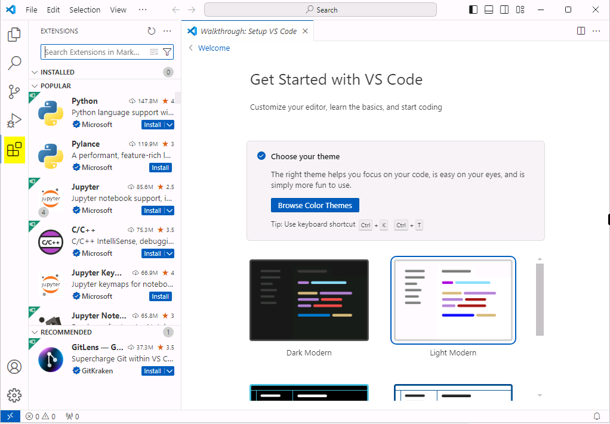
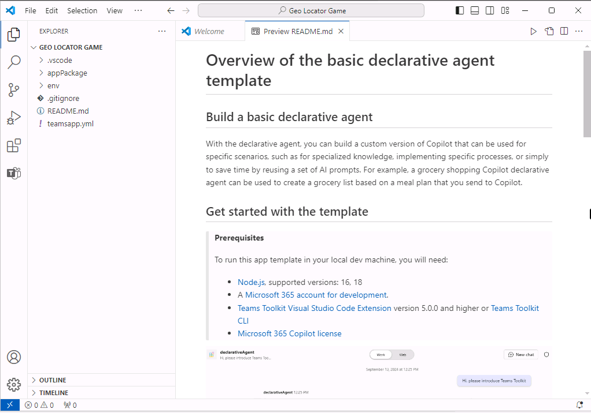
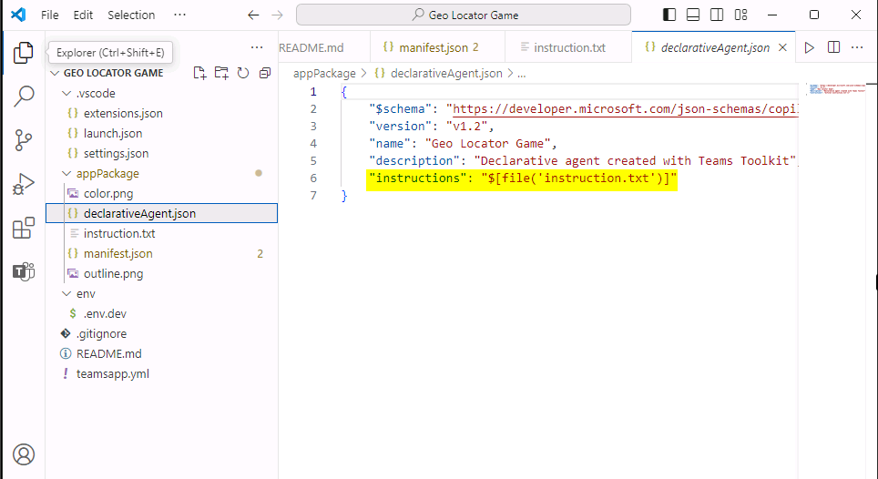
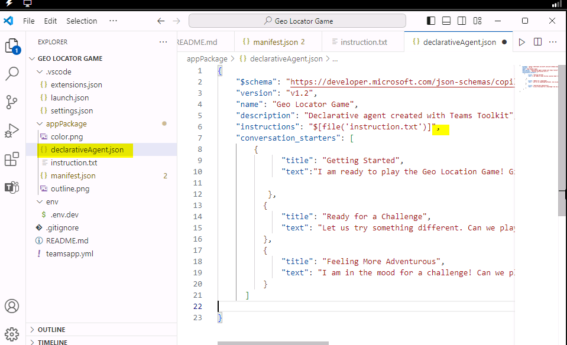
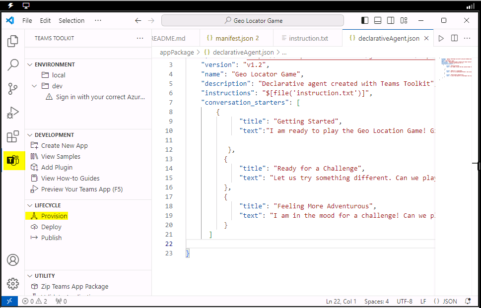
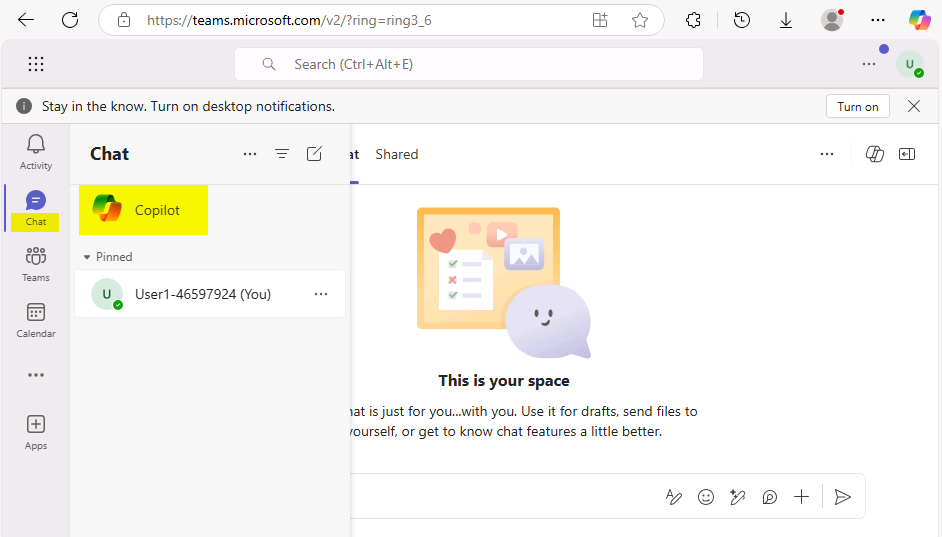
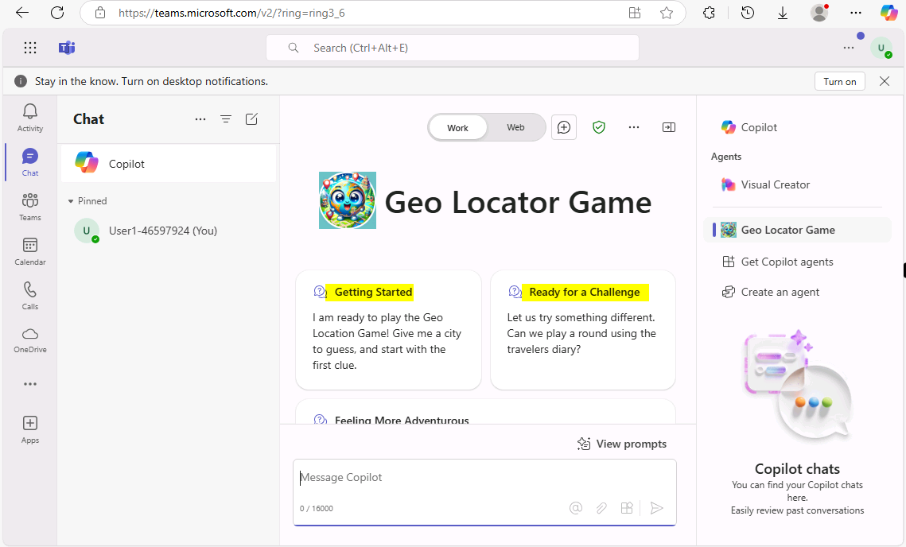
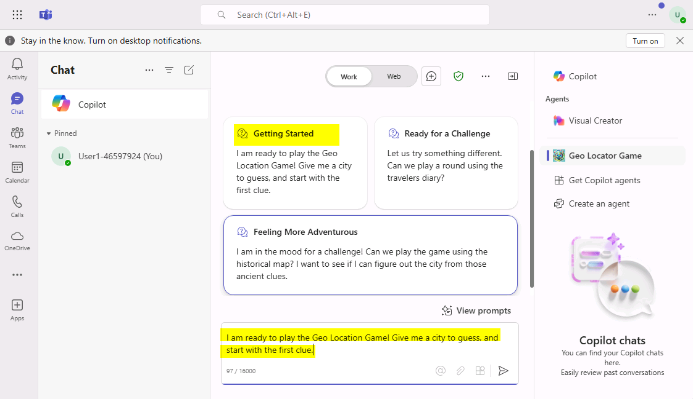

# Laboratorio 1: Creación de un agente declarativo para Microsoft 365 Copilot utilizando Teams Toolkit

**Tiempo estimado: 30 minutos**

## Objetivo

El objetivo de este laboratorio es capacitar a los participantes para
construir un agente declarativo para Microsoft 365 Copilot utilizando
Teams Toolkit. Al completar el laboratorio, los participantes habrán
creado un juego de geo-localización que ofrece un descanso divertido y
educativo del trabajo. El laboratorio se centra en entender la
estructura de los agentes declarativos, configurarlos con instrucciones
e integrarlos en el ecosistema de Microsoft 365 para interacciones
personalizadas con Copilot.

## Solución

## Los participantes instalarán Teams Toolkit en Visual Studio Code y configurarán su entorno de desarrollo. Utilizando una plantilla, crearán un agente declarativo denominado "Geo Locator Game". Personalizarán las instrucciones del agente y actualizarán sus archivos de configuración, como instruction.txt y manifest.json. El laboratorio también guía a los participantes en la mejora del agente con identificadores únicos, íconos personalizados y la funcionalidad de prueba. El resultado será una aplicación Copilot completamente funcional y atractiva, diseñada para ofrecer pistas sobre ciudades mientras se integra de manera fluida con Microsoft 365.

## Ejercicio 1: Configuración del entorno de desarrollo para Microsoft 365 Copilot

En este laboratorio, se asume que ya se dispone de un tenant de
Microsoft 365 configurado.

- Visual studio code

- NodeJS version 22.13.1

### Tarea 1: Instale Teams Toolkit

Siga los pasos que se muestran en la siguiente captura de pantalla.

1. Abra Visual Studio Code y haga clic en el botón de la barra de
herramientas de Extensions.

    

2.  Busque "**Teams**" y localice Teams **Toolkit,** luego haga clic en
    **Install.**

    

3.  Una vez finalizada la instalación, aparecerá el ícono **Teams
    Toolkit** en la barra de navegación de la izquierda.

    

## [Ejercicio 2: Primer agente declarativo](https://microsoft.github.io/copilot-camp/pages/extend-m365-copilot/01-declarative-copilot/) 

En este laboratorio, construirá un agente declarativo simple utilizando
Teams Toolkit para Visual Studio Code. El agente está diseñado para
ofrecerle un descanso divertido y educativo del trabajo, ayudándole a
explorar ciudades de todo el mundo. Presenta pistas abstractas para que
adivine una ciudad, otorgando menos puntos a medida que utiliza más
pistas. Al final, se revelará su puntaje final.

### En este ejercicio aprenderá: 

    • Qué es un agente declarativo para Microsoft 365 Copilot. 
    
    • Cómo crear un agente declarativo utilizando la plantilla de Teams Toolkit. 
    
    • Cómo personalizar el agente para crear el juego de geo-localización utilizando instrucciones. 
    
    • Cómo ejecutar y probar su aplicación. 
    
    • Como ejercicio adicional, necesitará un sitio de SharePoint en Teams.

### Introducción 

Los agentes declarativos aprovechan la misma infraestructura escalable y
plataforma de Microsoft 365 Copilot, adaptada específicamente para
centrarse en áreas particulares de sus necesidades. Funcionan como
expertos en un área o necesidad empresarial específica, permitiéndole
utilizar la misma interfaz que el chat estándar de Microsoft 365
Copilot, asegurando que se enfoquen exclusivamente en la tarea en
cuestión.  
¡Bienvenido a la creación de su propio agente declarativo! ¡Vamos a
sumergirnos y hacer que su Copilot haga magia!  
En este laboratorio, comenzará a construir un agente declarativo
utilizando Teams Toolkit con una plantilla predeterminada incluida en la
herramienta. Esto le ayudará a empezar con algo básico. Luego,
modificará su agente para centrarlo en un juego de geo-localización.  
  
El objetivo de su IA es ofrecer un descanso divertido del trabajo
mientras le ayuda a aprender sobre diferentes ciudades del mundo.
Proporciona pistas abstractas para que identifique una ciudad. Cuantas
más pistas necesite, menos puntos ganará. Al final del juego, se
revelará su puntaje final.


También le dará a su agente algunos archivos para consultar un diario
secreto 🕵🏽 y un mapa 🗺️ para dar más desafíos al jugador.

¡Empecemos!

### Anatomía de un agente declarativo

A medida que desarrollemos más extensiones para Copilot, al final lo que
creará será una colección de archivos empaquetados en un archivo
comprimido, conocido como un paquete de aplicación, que posteriormente
instalará y utilizará. Por lo tanto, es fundamental comprender la
estructura de este paquete de aplicación. El paquete de la aplicación de
un agente declarativo es similar a una aplicación de Teams (en caso de
haber creado una previamente), pero con elementos adicionales. Consulte
la tabla para conocer los principales componentes. Además, observará que
el proceso de implementación de la aplicación es muy similar al de
implementar una aplicación de Teams.

|  Elemento  | Descripción   |  Nombre del archivo |
|:----|:-------|:-----|
|  **Manifiesto de la aplicación**  |  Describe la configuración, las capacidades, los recursos necesarios y los atributos importantes de la aplicación.  |  manifest.json  |
| **Íconos de aplicaciones**   | Se requiere un ícono de color (192x192) y un ícono de contorno (32x32) para su agente declarativo.   |  icon.png, color.png  |
| **Manifiesto declarativo del agente**   |  Describe la configuración del agente, las instrucciones, los campos requeridos, las capacidades, los iniciadores de conversación y las acciones.  |  declarativeAgent.json  |

**Nota:** Puede añadir datos de referencia de SharePoint, OneDrive,
búsqueda web, etc. y añadir capacidades de extensión a un agente
declarativo como plugins y conectores. Aprenderá cómo añadir un plugin
en los próximos laboratorios de esta ruta.

### Capacidades de un agente declarativo

Puede mejorar el enfoque del agente en el contexto y los datos no sólo
añadiendo instrucciones, sino también especificando la base de
conocimientos a la que debe acceder. Se denominan capacidades y existen
tres tipos de capacidades admitidas.

    - **Microsoft Graph Connectors:** Permite que el agente reciba las
      conexiones de los conectores de Graph, lo que le permite acceder y
      utilizar el conocimiento del conector.
    
    - **OneDrive y SharePoint:** Proporciona las URL de los archivos y
      sitios al agente, permitiéndole acceder a esos contenidos.
    
    - **Búsqueda web:** Habilita o deshabilita el contenido web como parte
      de la base de conocimientos del agente.
    
    

### One Drive y SharePoint

Las URL deben ser la ruta completa a los elementos de SharePoint (sitio,
biblioteca de documentos, carpeta o archivo). Puede usar la opción
"Copiar enlace directo" en SharePoint para obtener la ruta completa de
archivos y carpetas. Para lograr esto, haga clic derecho en el archivo o
carpeta, seleccione "Detalles", luego navegue hasta "Ruta" y haga clic
en el ícono de copiar.

Si no se especifican las URL, el agente utilizará todo el corpus de
contenido disponible de OneDrive y SharePoint para el usuario que haya
iniciado sesión.

### Microsoft Graph Connector

Si no se especifican las conexiones, el agente utilizará todo el corpus
de contenido de los conectores de Graph disponible para el usuario que
haya iniciado sesión.

Búsqueda web

En este momento, no se pueden pasar sitios web o dominios específicos;
esto actúa únicamente como un interruptor para habilitar o deshabilitar
el uso de contenido web.

## Ejercicio 3: Cree un agente declarativo a partir de una plantilla

Se puede usar cualquier editor para crear un agente declarativo si se
conoce la estructura de los archivos en el paquete de la aplicación
mencionado anteriormente. Sin embargo, las cosas son más sencillas si se
utiliza una herramienta como Teams Toolkit, que no solo crea estos
archivos, sino que también ayuda a implementar y publicar la aplicación.
Por lo tanto, para simplificar las cosas, utilizará Teams Toolkit.

### Tarea 1: Utilice Teams Toolkit para crear una aplicación de agente declarativo

1.  Vaya a la extensión Teams Toolkit en el editor de código de Visual
    Studio y seleccione **Create a New App.**

    

2.  Se abre un panel en el que debe seleccionar **Agent** de la lista de
    tipos de proyecto.

    

3.  A continuación, se le pedirá que elija la característica de la
    aplicación del Agente Copilot. Elija **declarative agent** y
    presione la tecla Intro.


4.  A continuación, se le pedirá que elija si desea crear un agente
    declarativo básico o uno con un plugin de API. Elija la opción **No
    Plugin.** 

    

5.  A continuación, seleccione la opción **Default folder** para
    especificar dónde debe crearse la carpeta del proyecto.

    

6.  A continuación, asígnele el nombre de aplicación **Geo Locator
    Game** y presione la tecla Intro.

    

El proyecto se generará en breve en la carpeta indicada y se abrirá automáticamente en una nueva ventana de Visual Studio Code. Esta será la carpeta de trabajo donde se gestionarán los archivos y configuraciones del proyecto.

7.  Haga clic en **Yes, I trust the authors.**

    

    

¡Excelente trabajo! Ha configurado con éxito el agente declarativo base. Ahora, proceda a revisar los archivos que contiene para poder personalizarlo y desarrollar la aplicación del juego de geo-localización. 

### Tarea 2: Configure las cuentas en Teams Toolkit

1.  Ahora seleccione el ícono de Teams Toolkit en la parte izquierda. En
    Accounts, haga clic en **Sign in to Microsoft 365** e inicie sesión
    con sus **User1 credentials** en la sección **Azure Portal** de la
    pestaña **Resources.**

    

    

2.  Se abrirá una ventana del navegador que ofrecerá iniciar sesión en
    Microsoft 365. Cuando aparezca el mensaje " You are signed in now
    and close this page", proceda a cerrarla.

    

    

3.  Seleccione **Allow access** en el cuadro de diálogo Alerta de
    seguridad.

    

4.  Verifique que la casilla "**Custom App Upload Enabled**" tiene una
    marca de verificación de color verde.

5.  Verifique que la casilla "**Copilot Access Enabled**" tiene una
    marca de verificación de color verde.

    

### Tarea 3: Conozca los archivos de la aplicación

Este es el aspecto del proyecto base:

|  **Carpeta/Archivo**  |  **Contenido**  |
|:-----|:------|
|  .vscode  |  Archivos VSCode para depuración.  |
|  appPackage  |  Plantillas para el manifiesto de la aplicación Teams, el manifiesto GPT y la especificación API.  |
|  env  | Archivos de entorno con un archivo .env.dev por defecto.   |
|  appPackage/color.png  |   Imagen del logotipo de la aplicación. |
|  appPackage/outline.png  | Imagen de contorno del logotipo de la aplicación.  |
|  appPackage/declarativeAgent.json  | Define los ajustes y configuraciones del agente declarativo.   |
|  appPackage/instruction.txt  |  Define el comportamiento del agente declarativo.  |
|  appPackage/manifest.json |  Manifiesto de la aplicación de Teams que define los metadatos para el agente declarativo.  |
|  teamsapp.yml  | Archivo principal del proyecto en Teams Toolkit. Este archivo define dos aspectos clave: propiedades y definiciones de etapas de configuración.   |

1.  El archivo de interés para nuestro laboratorio es principalmente el
    archivo **appPackage/instruction.txt** que es el núcleo de
    directivas necesarias para su agente. Es un fichero de texto plano y
    puede escribir instrucciones en lenguaje natural en él.

    

2.  Otro archivo importante es **appPackage/declarativeAgent.json**
    donde hay un esquema a seguir para extender Microsoft 365 Copilot
    con el nuevo agente declarativo. Veamos qué propiedades tiene el
    esquema de este fichero:

    - $schema, es la referencia al esquema.
    
    - Versión, indica la versión del esquema.
    
    - Name, representa el nombre del agente declarativo.
    
    - Description, proporciona una descripción.
    
    - Instructions, define la ruta al archivo **instructions.txt**, que
      contiene directivas para determinar el comportamiento operativo.
      También es posible ingresar las instrucciones como texto plano en este
      valor. Sin embargo, en este laboratorio se utilizará el archivo
      **instructions.txt**.

    

3.  Otro archivo relevante es **appPackage/manifest.json**, que contiene
    metadatos esenciales, como el nombre del paquete, el desarrollador y
    las referencias a los agentes Copilot utilizados por la aplicación.
    La siguiente sección de manifest.json ilustra estos detalles:

    ```nocopy
    "copilotAgents": {
            "declarativeAgents": [            
                {
                    "id": "declarativeAgent",
                    "file": "declarativeAgent.json"
                }
            ]
        },
    ```

    

4.  También puede actualizar los archivos de logotipo color.png y
    outline.png para que coincida con la marca de su aplicación. En el
    laboratorio de hoy cambiará el ícono **color.png** para que el
    agente destaque.

## Ejercicio 4: Actualice las instrucciones y los íconos

### Tarea 1: Actualice los íconos y los archivos de manifiesto

1.  En primer lugar, se reemplazará el logotipo, sustituyendo la imagen
    **color.png** del proyecto por una nueva.

    Copie la imagen **color.png** ubicada en **C:\LabFiles** y reemplácela
por la imagen del mismo nombre en la carpeta **appPackage** dentro del
directorio raíz del proyecto. (La ruta debe ser: **C:\Users\Student\TeamsApps\Geo Locator Game\appPackage**).

    

    

    

2.  A continuación, vaya al archivo **appPackage/manifest.json** en el
    directorio raíz de su proyecto y busque el nodo **copilotAgents**.
    Actualice el valor de **id** en la primera entrada del array
    **declarativeAgents**, cambiando **declarativeAgent** a
    **dcGeolocator** para hacer que este ID sea único.

    ```nocopy
    "copilotAgents": {
            "declarativeAgents": [            
                {
                    "id": "dcGeolocator",
                    "file": "declarativeAgent.json"
                }
            ]
        },
    ```

    

    

3.  A continuación, vaya al archivo **appPackage/instruction.txt** y
    copie y pegue la siguiente instrucción para sobrescribir el
    contenido existente del archivo:

    ```
    
    System Role: You are the game host for a geo-location guessing game. Your goal is to provide the player with clues about a specific city and guide them through the game until they guess the correct answer. You will progressively offer more detailed clues if the player guesses incorrectly. You will also reference PDF files in special rounds to create a clever and immersive game experience.

    Game play Instructions:

    Game Introduction Prompt

    Use the following prompt to welcome the player and explain the rules:

    Welcome to the Geo Location Game! I’ll give you clues about a city, and your task is to guess the name of the city. After each wrong guess, I’ll give you a more detailed clue. The fewer clues you use, the more points you score! Let’s get started. Here’s your first clue:

    Clue Progression Prompts

    Start with vague clues and become progressively specific if the player guesses incorrectly. Use the following structure:

    Clue 1: Provide a general geographical clue about the city (e.g., continent, climate, latitude/longitude).

    Clue 2: Offer a hint about the city’s landmarks or natural features (e.g., a famous monument, a river).

    Clue 3: Give a historical or cultural clue about the city (e.g., famous events, cultural significance).

    Clue 4: Offer a specific clue related to the city’s cuisine, local people, or industry.

    Response Handling

    After the player’s guess, respond accordingly:
    If the player guesses correctly, say:

    That’s correct! You’ve guessed the city in [number of clues] clues and earned [score] points. Would you like to play another round?

    If the guess is wrong, say:

    Nice try! [followed by more clues]

    PDF-Based Scenario

    For special rounds, use a PDF file to provide clues from a historical document, traveler's diary, or ancient map:

    This round is different! I’ve got a secret document to help us. I’ll read clues from this [historical map/traveler’s diary] and guide you to guess the city. Here’s the first clue:

    Reference the specific PDF to extract details:
    Traveler's Diary PDF,Historical Map PDF.
    Use emojis where necessary to have friendly tone. 
    Scorekeeping System

    Track how many clues the player uses and calculate points:

    1 clue: 10 points

    2 clues: 8 points

    3 clues: 5 points

    4 clues: 3 points

    End of Game Prompt

    After the player guesses the city or exhausts all clues, prompt:

    Would you like to play another round, try a special challenge?

    ```

    

4.  Siga el siguiente paso para asegurarse de que nuestro agente puede
    ayudar al usuario a comprometerse con él dándole iniciadores de
    conversación. **Incluya sus propios archivos en la carpeta appPackage del proyecto**

    Fíjese en esta línea de **appPackage/declarativeAgent.json**:

    "instructions": "$\[file('instruction.txt')\]",

    Esto trae sus instrucciones desde el archivo instruction.txt. Si desea modularizar sus archivos de empaquetado, puede utilizar esta técnica en cualquiera de los archivos JSON de la carpeta appPackage.
    
    

### Tarea 2: Añada temas de conversación

Puede mejorar el compromiso del usuario con el agente declarativo
añadiéndole iniciadores de conversación.

Algunas de las ventajas de tener iniciadores de conversación son:

    - **Compromiso:** Ayudan a iniciar la interacción, haciendo que los
      usuarios se sientan más cómodos y fomentando la participación.
    
    - **Establecimiento de contexto**: Los iniciadores fijan el tono y el
      tema de la conversación, guiando a los usuarios sobre cómo proceder.
    
    - **Eficiencia**: Al iniciar con un enfoque claro, los iniciadores
      reducen la ambigüedad, permitiendo que la conversación avance sin
      problemas.
    
    - **Retención de usuarios:** Los iniciadores bien diseñados mantienen el
      interés de los usuarios, fomentando interacciones repetidas con la IA.

1.  Abra el archivo declarativeAgent.json y justo después del nodo de
    instrucciones añada una coma , y pegue el siguiente Código:

    ```
    "conversation_starters": [
        { 
                "title": "Getting Started",
                "text":"I am ready to play the Geo Location Game! Give me a city to guess, and start with the first clue."          

            },
            {
                "title": "Ready for a Challenge",
                "text": "Let us try something different. Can we play a round using the travelers diary?"
            },
            { 
                "title": "Feeling More Adventurous",
                "text": "I am in the mood for a challenge! Can we play the game using the historical map? I want to see if I can figure out the city from those ancient clues."
            }
        ]
    ```

    

    Ahora que ya se han realizado todos los cambios en el agente, es hora de
probarlo.

2.  Vaya a **Files** en la barra superior y haga clic en el botón **Save
    All.**

    

### Tarea 3: Pruebe la aplicación

1.  Para probar la aplicación, vaya a la extensión **Teams Toolkit** en
    **Visual Studio Code**. Se abrirá el panel izquierdo. En
    **LIFECYCLE**, seleccione **Provision**. Aquí podrá ver el valor de
    **Teams Toolkit**, ya que facilita el proceso de publicación de
    manera muy sencilla.

    

    

2.  Cuando se le solicite, inicie sesión con sus credenciales.

    

3.  En este paso, el kit de herramientas Teams empaquetará todos los
    archivos dentro de la carpeta appPackage como un archivo zip e
    instalará el agente declarativo en su propio catálogo de
    aplicaciones.


4.  Vaya a **Teams** en el navegador en
    <https://teams.microsoft.com/v2/> e inicie sesión con su cuenta de
    desarrollador. Si tiene **Microsoft 365 Copilot**, la nueva
    aplicación se anclará automáticamente encima de sus chats. Solo
    deberá abrir Teams, seleccionar "Chats" y verá **Copilot**.

    

5.  Una vez cargada la aplicación Copilot, busque el **Geo Locator
    Game** en el panel de la derecha, tal y como se muestra.

    

    Si no lo encuentra, es posible que la lista sea larga. Puede encontrar su agente ampliando la lista y seleccionando **See more.**

6.  Una vez iniciado, estará en esta ventana de chat enfocada con el
    agente. Verá los iniciadores de conversación como se muestra a
    continuación:

    

7.  Seleccione uno de los iniciadores de conversación y el cuadro de
    redacción del mensaje se llenará con la pregunta del iniciador,
    esperando que presione la tecla **Intro**. El asistente continuará
    esperando a que usted actúe.

    

8.  Intente responder a la pregunta y explore el juego que ha creado.

Resumen:

En este laboratorio, hemos aprendido a crear un agente declarativo
utilizando **Teams Toolkit** y a probar la funcionalidad del agente.
