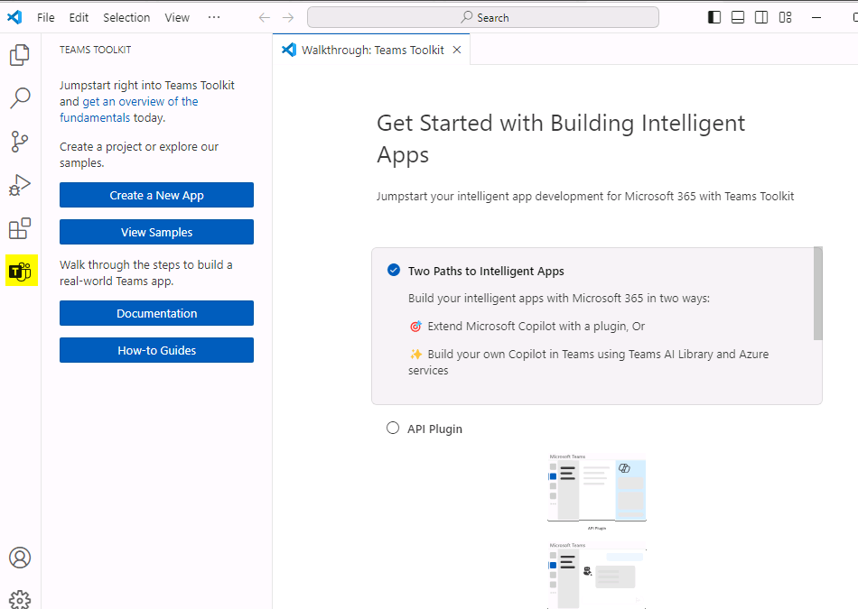
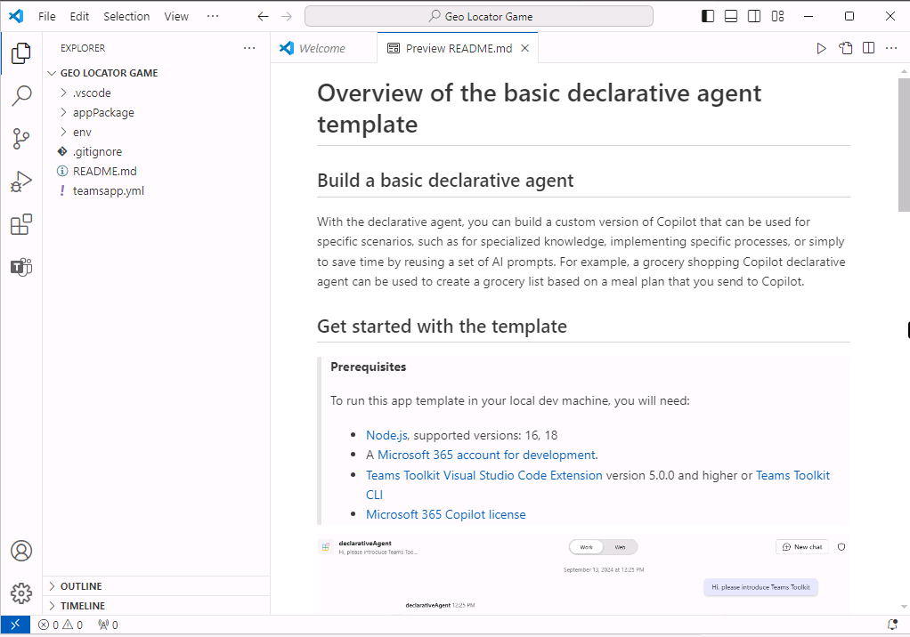
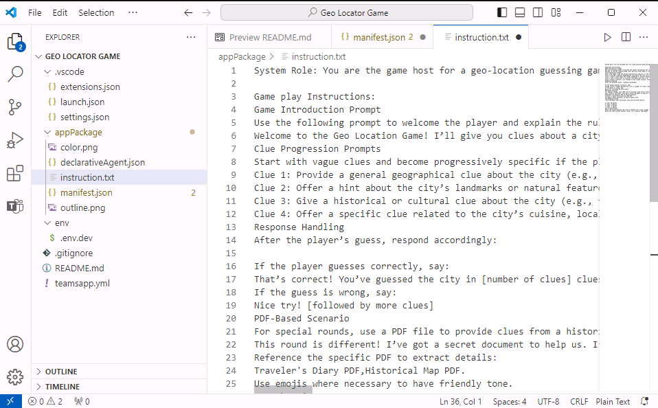
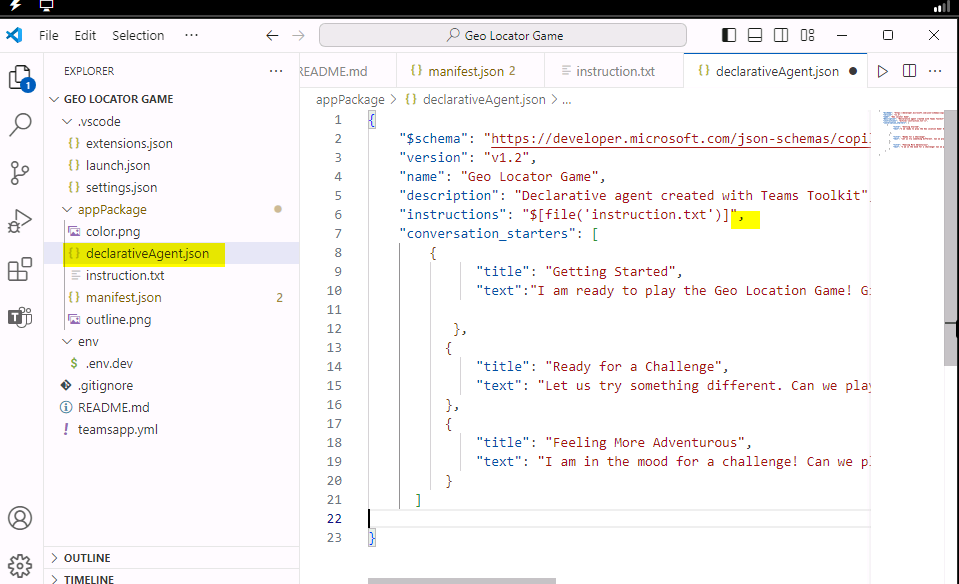

# 실습 1: Microsoft 365 Copilot을 위한 declarative agent를 Teams Toolkit로 구축

**예상 소요 시간: 30분**

**목표**

이 실습의 목표는 참가자가 Teams Toolkit를 사용해 Microsoft 365 Copilot용
declarative agent를 구축할 수 있도록 지원하는 것입니다. 이 실습을
완료함으로써, 업무 중 즐겁고 교육적인 휴식을 제공하는 지리 위치 생성하게
됩니다. 이 실습에서는 declarative agent의 구조를 이해하고, agent를 지침
따라 구성하며, Microsoft 365 에코시스템에 이를 통합하여 맞춤형 Copilot
상호작용을 구현하는 데 중점을 둡니다.

**솔루션**

참가자들은 Visual Studio Code에 Teams Toolkit을 설치하고 개발 환경을
설정합니다.제공된 템플릿을 활용해 Geo Locator Game이라는 declarative
agent의 기본 구조를 생성합니다. instruction.txt와 manifest.json과 같은
구성 파일을 업데이트하고 에이전트의 지침을 사용자 위해 맞춤화합니다. 이
실습은 참가자들이 에이전트에 고유 식별자, 맞춤형 아이콘 추가 및 기능을
테스트하는 방법도 안내합니다. 그 결과, 다양한 도시에 대한 단서를
제공하면서 Microsoft 365와 자연스럽게 연동되는, 몰입감 있는 Copilot
애플리케이션을 개발하게 됩니다.

## 연습 1: Microsoft 365 Copilot 개발 환경 설정하기

### 작업 1: Teams Toolkit 설치

이 실습들은 [Teams Toolkit version
5.0](https://marketplace.visualstudio.com/items?itemName=TeamsDevApp.ms-teams-vscode-extension)
기반으로 진행됩니다. 아래 스크리샷에 표시된 단계 대로 실습을 진행하세요.

1.  Visual Studio Code을 열고 Extensions 도구 모음 버튼을 클릭하세요.

    

2.  +++**Teams**+++을 검색하고  **Teams Toolkit** 찾아 **Install**을
    클릭하세요.

    

3.  설치가 완료되면, **Teams Toolkit** 아이콘이 왼쪽 검색창에
    표시됩니다.

   

## 엽습 2: 첫 번째 declarative agent

이번 실습에서는 Teams Toolkit for Visual Studio 사용해 간단한
declarative agent를 생성하게 될 것입니다. 이 에이전트를 통해 전 세계
도시를 탐험하며, 업무 중 재미있고 유익한 휴식을 즐길 수 있습니다. 도시를
맞히기 위한 추상적인 단서들이 제시되며, 단서를 많이 사용할수록 획득할 수
있는 점수는 낮아집니다. 모든 문제가 끝나면 최종 점수가 공개됩니다.

이 연습에서는 다음을 배우게 될 것입니다:

- Microsoft 365 Copilot용 declarative agent란

- Teams Toolkit 템플릿을 사용해 declarative agent 생성

- 지침을 활용해 지리 위치 게임을 생성하도록 에이전트를 맞춤화하기

- 앱을 실행 및 테스트하는 방법 알아보기

- 보너스 연습을 위해서는 SharePoint 팀 사이트가 필요함

**소개**

Declarative agent는 Microsoft 365 Copilot의 확장 가능한 인프라와
플랫폼을 그대로 활용하면서, 사용자의 특정한 요구에 초점을 맞춰 설계된
맞춤형 Copilot입니다이 에이전트들은 특정 분야 또는 비즈니스 니즈에 대한
전문 지식을 갖춘 조력자로 작동하며, 일반적인 Microsoft 365 Copilot 채팅
인터페이스를 그대로 사용하면서도 지정된 과업에만 집중할 수 있도록
구성되었습니다.

나만의 declarative agent를 만드는 여정에 오신 것을 환영합니다! 지금부터
Copilot의 마법을 여러분만의 방식으로 구현해볼 시간이에요!

이번 실습에서는 Teams Toolkit에 내장된 기본 템플릿을 활용해 declarative
agent를 만드는 것부터 시작합니다. 초기 템플릿은 쉽게 시작할 수 있도록
도와주는 출발점이며, 이후 이 에이전트를 지리 위치 게임에 맞게
커스터마이징하게 됩니다.

여러분이 생성한 AI의 목표는 업무 중에 잠깐 재미있는 휴식을 주면서, 세계
여러 도시에 대해 자연스럽게 배울 수 있도록 지원하는 것입니다. 도시를
맞히기 위해 추상적인 단서를 제공하고, 단서를 많이 쓸수록 점수는
낮아집니다. 게임이 끝나면 최종 점수가 공개됩니다.


에이전트는 비밀 일기장 🕵🏽와 지도 🗺️ 같은 파일을 참고해 플레이어에게 한층
더 흥미로운 도전을 제공합니다.

그럼, 지금 바로 시작해볼까요?

**Declarative agent 구조**

Copilot 확장을 계속 개발해 나가다 보면, 결국 여러분이 만들게 되는 것은
몇 개의 파일로 구성된 ZIP 파일입니다. 이를 앱 패키지(App Package)라고
하며, 이 패키지를 설치하고 사용할 것입니다. 따라서 앱 패키지가 어떤 구성
요소로 이루어져 있는지 이해하는 것이 중요합니다. 이전에 Teams 앱을
만들어 본 경험이 있다면 Declarative agent의 앱 패키지이 익숙하게 느껴질
수 있습니다. 기본 구조는 유사하지만 몇 가지 요소가 더해진 형태라고
보시면 됩니다. 핵심 구성 요소는 아래 표에서 확인이 가능하며, 앱 배포
방식도 Teams 앱 배포하는 과정과 매우 유사합니다.

| **구성 요소** | **설명** | **파일명** |
|----|----|----|
| **App manifest** | 앱 구성, 기능, 필요한 리소스 및 중요한 특성에 대한 설명 | manifest.json |
| **App icons** | Declarative agent위해 컬러 아이콘(192x192) 및 외곽선(outline) 아이콘(32x32) 필요 | icon.png, color.png |
| **Declarative agent manifest** | 에이전트 구성, 설정 지침, 필수 필드, 기능, 대화 시작 문구 및 실행 작업에 대해 설명| declarativeAgent.json |

**참고:** SharePoint, OneDrive, 웹 검색 등에서 참조 데이터를 추가하고,
declarative agent에 플러그인 및 커넥터 같은 확장 기능을 추가할 수
있습니다. 이 경로의 향후 실습에서 플러그인을 추가하는 방법을 배우게 될
것입니다.

**Declarative agent 기능**

에이전트의 컨텍스트와 데이터에 대한 이해도를 향상시키기 위해, 단순히
지침만 추가하는 것이 아니라 참조할 지식 베이스(knowledge base)를 지정할
수 있습니다. 이를 기능(capabilities)이라고 하며, 세 가지 유형이
지원됩니다.

- **Microsoft Graph Connectors** - Graph 커넥터의 연결 정보를 에이전트에
  전달하여, 에이전트가 해당 커넥터의 지식을 활용할 수 있도록 합니다.

- **OneDrive 및 SharePoint** - 파일 및 사이트의 URL을 에이전트에
  제공하여, 관련 콘텐츠에 접근할 수 있게 합니다.

- **Web search** - 에이전트가 웹 콘텐츠를 지식 베이스의 일부로 활용할 수
  있도록 설정할 수 있습니다(활성화/비활성화 가능).


**One Drive 및 SharePoint**

URL은 SharePoint 항목(사이트, 문서 라이브러리, 폴더 또는 파일)의 전체
경로여야 합니다. SharePoint에서 "Copy direct link" 옵션을 사용해 파일
또는 폴더의 전체 경로를 가져올 수 있습니다. 이를 위해 파일 또는 폴더를
오른쪽 클릭하고 Details을 선택합니다. Path로 이동하여 복사 아이콘
클릭하면 됩니다. URL을 명시하지 않으면, 로그인한 사용자가 접근할 수 있는
전체 OneDrive 및 SharePoint 콘텐츠가 에이전트에 의해 사용됩니다.

**Microsoft Graph Connector**

별도로 연결을 지정하지 않으면, 에이전트는 로그인한 사용자가 접근할 수
있는 모든 Graph Connectors 콘텐츠를 자동으로 활용하게 됩니다.

**Web search**

현재로서는 특정 웹사이트나 도메인을 지정할 수 없으며, 웹 검색 기능은
단순히 사용 여부를 켜고 끄는 토글 역할만 합니다.

**연습 3: 템플릿을 사용하여 declarative agent의 기본 구조 생성**

위에서 언급한 앱 패키지의 파일 구조를 이해하고 있다면, 어떤 편집기를
사용하셔도 declarative agent를 생성할 수 있습니다. 그러나 Teams
Toolkit과 같은 도구를 사용하면 파일 생성은 물론, 앱 배포와 게시까지
지원해주기 때문에 훨씬 더 수월합니다. 따라서 가능한 한 간단하게 진행하기
위해 Teams Toolkit을 사용하실 것입니다.

### 작업 1: Teams Toolkit을 사용해 declarative agent 앱 생성

1.  Visual Studio Code 편집기에서 Teams Toolkit 확장 기능으로 이동하여
    **Create a New App** 선택하세요.

    

2.  패널이 열리면, 프로젝트 유형 목록에서**Agent** 선택해야 합니다.

    

3.  다음으로 Copilot Agent의 앱 기능을 선택하라는 메시지가 표시됩니다.
    **Declarative agent** 선택하세요.

    

4.  다음으로, 기본 declarative agent를 생성할지, 아니면 API 플러그인 API
    플러그인이 포함된 에이전트를 생성할지 선택하라는 옵션이
    표시됩니다. **No Plugin** 옵션을 선택하세요.

    

5.  다음으로, 프로젝트 폴더가 생성될 위치를 지정하기 위해 **Default**
    폴더 옵션을 선택하세요.

    

6.  이제 애플리케이션 이름을 +++**Geo Locator Game**+++로 지정하고 Enter
    선택하세요.

    

프로젝트는 지정한 폴더에 몇 초 내로 생성되며, Visual Studio Code의
새로운 프로젝트 창에서 열립니다. 이 폴더가 여러분의 작업 폴더가 됩니다.

7.  소스의 신뢰 여부를 묻는 메시지가 표시되면, **Yes, I trust the
    authors** 선택하세요.

    

    

    잘하셨습니다! 기본 declarative agent가 성공적으로 설정되었습니다. 이제 포함된 파일들을 살펴보며, 이를 Geo Locator 게임 앱에 맞게 커스터마이징해 보세요.

### 작업 2: Teams Toolkit에서 계정 설정

1.  이제 왼쪽에서 Teams Toolkit 아이콘을 선택하고, **Accounts**에서
    **Sign in to Microsoft 365**를 클릭하고 **Resources** 탭의 **Azure
    Portal** 섹션에서 **User1 credentials** 사용해 로그인하세요.

    

    

2.  Security Alert 대화 상자에 **Allow access** 선택하세요.

    

3.  브라우저 창이 열리고 Microsoft 365에 로그인하라는 메시지가
    표시됩니다. "You are signed in now and close this page"가 표시되면
    페이지를 닫아주세요.

    

    

4.  **Custom App Upload Enabled** 체크 아이콘에 녹색 체크표시가 있는지
    확인하세요.

5.  **Copilot Access Enabled** 체크 아이콘에 녹색 체크표시가 있는지
    확인하세요.

    

### 작업 3: 앱의 파일 이해

기본 프로젝트의 형태는 다음과 같습니다:

| **Folder/File** | **Contents** |
|----|----|
| .vscode | 디버깅을 위한 VSCode 파일 |
| appPackage | Teams 애플리케이션 매니페스트, GPT 매니페스트 및 API 사양을 위한 템플릿 |
| env | 기본 .env.dev 파일이 있는 환경 파일 |
| appPackage/color.png | 애플리케이션 로고 이미지 |
| appPackage/outline.png | 애플리케이션 로고 아웃라인 이미지 |
| appPackage/declarativeAgent.json | Declaractive agent의 설정 및 구성을 정의 |
| appPackage/instruction.txt | Declarative agent의 동작 정의 |
| appPackage/manifest.json | Declarative agent에 대한 메타데이터를 정의하는 Teams 애플리케이션 매니페스트 |
| teamsapp.yml | 주요 Teams Toolkit 프로젝트 파일. 이 프로젝트 파일은 두 가지 주요 항목을 정의합니다: 속성 및 구성 단계 정의 |

1.  이번 실습에서 중요한 파일은 주로 **appPackage/instruction.txt**
    파일입니다. 이 파일은 에이전트에게 필요한 핵심 지침을 담고 있으며,
    텍스트 형식으로 자연어 지침을 작성할 수 있습니다.

    

2.  또 다른 중요한 파일은 **appPackage/declarativeAgent.json**입니다. 이
    파일에는 Microsoft 365 Copilot을 새로운 declarative agent로 확장하기
    위해 따라야 할 스키마가 포함되어 있습니다. 이 파일의 스키마가 가진
    속성들은 다음과 같습니다:

    - $schema: 스키마 참조

    - 버전: 스키마 버전입니다

    - name 키: Declarative agent의 이름을 나타내는 키

    - Description: 설명을 제공

    - Instructions: 지침 파일인 **instructions.txt** 파일의 경로로, 운영
      동작을 결정하는 지침들이 포함되어 있습니다. 여기에 값을 텍스트로
      입력할 수도 있습니다. 그러나 이번 실습에서는 **instructions.txt**
      파일을 사용할 것입니다.

    

3.  또 다른 중요한 파일은 **appPackage/manifest.json** 파일입니다. 이
    파일에는 패키지 이름, 개발자 이름, 애플리케이션에서 사용되는 Copilot
    agents에 대한 참조 등 중요한 메타데이터가 포함되어 있습니다. 아래는
    manifest.json 파일의 해당 섹션으로, 이 내용을 보여줍니다:

    ```nocopy
    "copilotAgents": {
            "declarativeAgents": [            
                {
                    "id": "declarativeAgent",
                    "file": "declarativeAgent.json"
                }
            ]
        },
    ```

    

4.  You could also update the logo files color.png and outline.png to
    make it match your application's brand. In today's lab you will
    change **color.png** icon for the agent to stand out.

## 연습 4: 지침 및 아이콘 업데이트

### 작업 1: 아이콘 및 매니페스트 업데이트

1.  먼저, 로고를 교체합니다. 프로젝트에서 **color.png** 이미지를 새
    이미지로 교체할 것입니다**. C:\LabFiles**에 위치한 **color.png**
    이미지를 복사하여 프로젝트의 **appPackage** 폴더에 있는 동일한
    이름의 이미지로 교체하세요. (경로는 **C:\Users\Student\TeamsApps\Geo
    Locator Game\appPackage**이어야 합니다.)

    

    

    

2.  다음으로, 프로젝트의 루트에서**appPackage/manifest.json** 파일을
    열고 **copilotAgents** 노드를 찾으세요. 열의 첫 번째 항목에서 id
    값을 'declarativeAgent'에서 '+++dcGeolocator+++'로 업데이트하여 이
    ID가 고유하게 만드세요.

    ```nocopy
    "copilotAgents": {
            "declarativeAgents": [            
                {
                    "id": "dcGeolocator",
                    "file": "declarativeAgent.json"
                }
            ]
        },
    ```

    

    

3.  다음으로, **appPackage/instruction txt** 파일로 이동하여 아래 지침을
    복사하여 파일의 기존 내용을 덮어씁니다..

    ```
    
    System Role: You are the game host for a geo-location guessing game. Your goal is to provide the player with clues about a specific city and guide them through the game until they guess the correct answer. You will progressively offer more detailed clues if the player guesses incorrectly. You will also reference PDF files in special rounds to create a clever and immersive game experience.

    Game play Instructions:

    Game Introduction Prompt

    Use the following prompt to welcome the player and explain the rules:

    Welcome to the Geo Location Game! I’ll give you clues about a city, and your task is to guess the name of the city. After each wrong guess, I’ll give you a more detailed clue. The fewer clues you use, the more points you score! Let’s get started. Here’s your first clue:

    Clue Progression Prompts

    Start with vague clues and become progressively specific if the player guesses incorrectly. Use the following structure:

    Clue 1: Provide a general geographical clue about the city (e.g., continent, climate, latitude/longitude).

    Clue 2: Offer a hint about the city’s landmarks or natural features (e.g., a famous monument, a river).

    Clue 3: Give a historical or cultural clue about the city (e.g., famous events, cultural significance).

    Clue 4: Offer a specific clue related to the city’s cuisine, local people, or industry.

    Response Handling

    After the player’s guess, respond accordingly:
    If the player guesses correctly, say:

    That’s correct! You’ve guessed the city in [number of clues] clues and earned [score] points. Would you like to play another round?

    If the guess is wrong, say:

    Nice try! [followed by more clues]

    PDF-Based Scenario

    For special rounds, use a PDF file to provide clues from a historical document, traveler's diary, or ancient map:

    This round is different! I’ve got a secret document to help us. I’ll read clues from this [historical map/traveler’s diary] and guide you to guess the city. Here’s the first clue:

    Reference the specific PDF to extract details:
    Traveler's Diary PDF,Historical Map PDF.
    Use emojis where necessary to have friendly tone. 
    Scorekeeping System

    Track how many clues the player uses and calculate points:

    1 clue: 10 points

    2 clues: 8 points

    3 clues: 5 points

    4 clues: 3 points

    End of Game Prompt

    After the player guesses the city or exhausts all clues, prompt:

    Would you like to play another round, try a special challenge?

    ```

    

4.  **appPackage/declarativeAgent.json**에서 다음 문장을 확인하세요 :

    "instructions": "$\[file('instruction.txt')\]",

    이렇게 하면 instruction.txt 파일에서 지침을 가져옵니다. 패키지 파일을 모듈화하려면, 이 방법을 appPackage 폴더 내 다른 JSON 파일에도 적용할 수 있습니다.


### 작업 2 : 대화 스타터 추가

Declarative agent에 대화 시작 문구를 추가하여 사용자 참여를 향상시킬 수
있습니다.

대화 시작 문구를 사용하는 주요 이점은 다음과 같습니다:

- **참여**: 상호 작용을 유도하여 사용자가 더 편안하게 느끼고 참여하도록
  장려합니다.

- **맥락 설정**: 스타터는 대화의 분위기와 주제를 설정하고 사용자에게
  진행 방법을 안내합니다.

- **효율성**: 명확한 초점으로 대화를 이끌어 가며, 불필요한 혼란을 줄여
  대화가 원활하게 진행될 수 있도록 합니다.

- **사용자 유지**: 설계된 시작 문구는 사용자의 관심을 끌어들여 AI와의
  반복적인 상호작용을 유도합니다.

1.  **declarativeAgent.json** 파일을 열고 지침 노드 바로 뒤에 쉼표를
    추가하고 Enter 키를 누른 다음 코드 아래에 붙여넣습니다.

    ```
    "conversation_starters": [
        { 
                "title": "Getting Started",
                "text":"I am ready to play the Geo Location Game! Give me a city to guess, and start with the first clue." 
            },
            {
                "title": "Ready for a Challenge",
                "text": "Let us try something different. Can we play a round using the travelers diary?"
            },
            { 
                "title": "Feeling More Adventurous",
                "text": "I am in the mood for a challenge! Can we play the game using the historical map? I want to see if I can figure out the city from those ancient clues."
            }
        ]
    ```

    

이제 에이전트에 대한 모든 변경 사항이 완료되었으므로 테스트할
차례입니다.

2.  상단 표시줄에서 **Files**로 이동하여 **Save All**을 클릭하세요.

    

### 작업 3: 앱 테스트

1.  앱을 테스트하기 위해 Visual Studio Code Teams Toolkit 확장 기능으로
    이동하세요. 그러면 왼쪽 창이 열립니다. **LIFECYCLE**에서
    **Provision**을 선택하세요. Teams Toolkit의 가치를 확인할 수
    있습니다. 이 도구는 게시를 매우 간단하게 만들어 줍니다.

    

    

2.  메시지가 표시되면 자격 증명으로 로그인하세요.

    

3.  이 단계에서는 Teams Toolkit이 appPackage 폴더 안의 모든 파일을 ZIP
    파일로 묶고, declarative agent를 사용자 앱 카탈로그에 설치합니다.

    

4.  브라우저에서 Teams로 이동하세요:
    +++<https://teams.microsoft.com/v2/+++%C2%A0logged> 개발자 테넌트에
    로그인한 후, Microsoft 365 Copilot이 있다면 새 앱이 자동으로 채팅
    위에 고정됩니다. Teams를 열고 ‘chats’을 선택하면 Copilot을 확인할 수
    있습니다.

    

5.  Copilot 앱이 로드되면 그림과 같이 오른쪽 패널에서 +++Geo Locator
    Game+++을 찾으세요.

    

    찾을 수 없는 경우, 목록이 길 수 있으니 “see more”를 선택하여 목록을
확장한 후 에이전트를 찾을 수 있습니다.

6.  실행되면, 에이전트와의 집중된 채팅 창에 들어가게 됩니다. 아래에
    표시된 대화 시작 문구를 확인할 수 있습니다:

    

7.  대화 시작 문구 중 하나를 선택하면, 메시지 작성 상자에 시작 문구가
    자동으로 입력됩니다. 이제 'Enter' 키를 누르기만 하면 됩니다. AI는
    당신의 명령을 기다립니다.

    

8.  질문에 답하고 개발한 게임을 탐색해 보세요.

**요약:**

이번 실습에서는 Teams Toolkit을 활용해 declarative agent를 생성하는
방법과, 이 에이전트의 기능을 테스트하는 방법을 배웠습니다.
