# **실습 2 - Copilot Studio를 활용한 Autonomous Copilot 에이전트로 IT 지원 운영 간소화**

**예상 소요 시간: 60분**

**목표**

이 실습의 목적은 참가자들이 Contoso Solutions의 IT 지원 운영을
autonomous Copilot 에이전트를 통해 간소화하는 방법을 배우는 것입니다.
참가자들은 Microsoft Copilot Studio를 설정하고, IT Support Agent를
구성하며, Power Apps 및 Dataverse와 통합하고, 지식 베이스(knowledge
base)를 통해 봇의 기능을 향상시키고, Power Automate를 통해 티켓 생성
자동화를 구현하는 방법을 실습하게 됩니다. 이 실습 중심의 랩을 통해
참가자들은 IT 워크플로우를 개선하고 수작업을 줄이며, 지원 효율성을
향상시키는 기술을 습득할 수 있습니다.

**솔루션**

참가자들은 Microsoft Copilot Studio를 사용하여 맞춤형 Contoso IT Support
Agent를 생성하고, 일반적인 IT 문제를 처리할 수 있도록 구성하며, 지원
데이터를 저장하기 위해 Dataverse와 통합합니다. 개발 환경을 설정하고,
지식 소스를 추가하며, 사용자와의 상호작용을 개선하기 위해 봇의 대화
흐름을 정제합니다.

## 연습 1: Power Apps 시작

이 연습은 참가자들에게 Power Apps와 Dataverse를 소개합니다. 목표는 Power
Apps에 로그인하고, 작업 환경을 설정한 후 , Excel 파일에서 데이터를
가져와 Dataverse 테이블을 생성하는 것입니다. 이를 통해 참가자들은 데이터
기반 애플리케이션을 다루는 데 필요한 기본적인 기술을 배우게 됩니다.

### 작업 1: Power Apps에 로그인

1.  Power apps 웹사이트
    +++https://www.microsoft.com/en-us/power-platform/products/power-apps+++로
    이동한 후 **Try for Free** 버튼을 클릭하세요.

    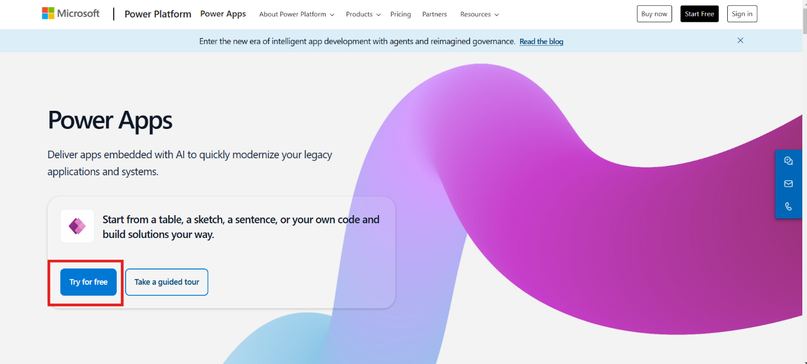

2.  **Resources** 탭의 Office 365 Tenant 섹션에서 **Administrative
    Username**을 **email field**에 입력하고 **Start free** 버튼을
    클릭하세요.

    

3.  Country/ Region, Phone number 입력하고 확인란을 선택한 후, **Get
    started**을 클릭하세요.

    

4.  계정 세부 정보를 확인한 후 **Get started**를 클릭하세요.

    

5.  Stay signed in 탭에서 **Yes**를 선택하세요.

    

### 작업 2: Dataverse Table 설정

1.  Power Apps 홈페이지의 위쪽에서 개발 환경을 선택하세요. 이 경우에는
    **Dev One**에서 참가자는 자신의 환경을 선택할 수 있습니다.

    

2.  왼쪽 탐색 모음에서 **Tables**을 선하세요**.** 테이블 섹션 상단
    표시줄에서 **+ New table**을 클릭한 후, **Create new tables**
    선택하세요.

    

3.  **Import an Excel file or CSV** 옵션을 선택하여 새 테이블을
    생성하세요.

    

4.  **Select form device** 옵션을 클릭하고**C:\LabFiles** 폴더에서
    **Support Ticket** 엑셀 파일을 선택하세요.

    

5.  테이블을 선택하고 **View data**를 클릭하여 테이블을 확인하세요.

    >[!Note] **참고:** 이 경우 테이블 이름은 *Employee Technical Support
Record*입니다. 이름은 각 실행에 따라 달라질 수 있습니다. 나중에 참조할
수 있도록 테이블 이름을 저장하세요. 열 이름도 실행 따라 달라질 수
있습니다.

    

6.  테이블 데이터로 이동하여  **Technical Issue Description** 필드 옆에
    있는 드롭다운 메뉴를 선택하고 **Edit column**을 선택한 후, 데이터
    유형을 **Text** 🡪 **Multiple line** 🡪 **Plain Text** 로 설정하고,
    **Update**를 클릭하세요. 열 이름은 경우에 따라 다를 수 있습니다.

    >[!Note] **참고:** **열 이름은 약간 다를 수 있지만**, Copilot이 생성한
것이므로 문제 설명과 유사한 이름일 것입니다.

    

    

7.  **Current Status** 필드 옆에 있는 드롭다운 메뉴를 선택하고 **Edit
    column**을 선택하세요. Choices을 +++**Unresolved**+++,
    +++**Resolved**+++, +++**Processing**+++로 설정하세요. Default
    choice 를 **Unresolved**으로 설정한 후 **Update** 클릭하세요.

    

8.  오른쪽 상단에서 **Save and exit**를 클릭하여 테이블을 저장하세요.

    

**결론**

이 연습을 완료하면 참가자는 다음을 배우게 됩니다:

1.  Office 365 관리자 테넌트 자격 증명을 사용하여 Power Apps에
    액세스하고 탐색하는 방법

2.  데이터를 가져와서 Dataverse 테이블을 생성하고 구성하는 단계

- 앱 개발 워크플로를 지원하기 위한 환경 설정에 대한 실용적인 지식

## 연습 2: Contoso IT Support Agent 생성

이 연습은 Microsoft Copilot Studio에 로그인하고, Contoso의 IT 지원
운영에 맞춤화된 Copilot 에이전트를 생성하는 데 중점을 둡니다. 참가자들은
Copilot Studio를 탐색하고, 환경을 설정하며, IT 워크플로를 효율화하는 AI
기반 에이전트를 구축하는 실습을 통해 경험을 쌓게 됩니다.

### 작업 1: Microsoft Copilot Studio에 로그인하기

1.  Copilot studio 웹사이트로 이동한 후
    +++https://www.microsoft.com/en-us/microsoft-copilot/microsoft-copilot-studio+++
    **Try free** 클릭하세요.

    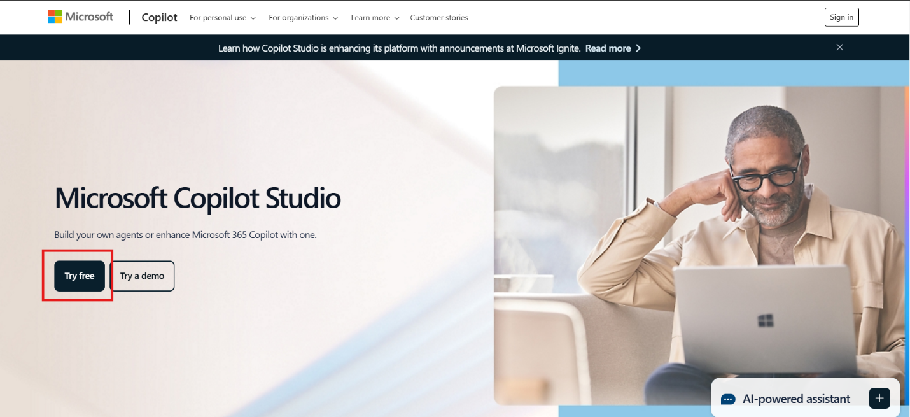

2.  **Resources** 탭의 **Office 365 Tenant** 섹션에서 **Administrative
    Username**을 이메일 필드에 입력하고 **Start free** 버튼을
    클릭하세요.

    

    

3.  해당 필드에**Country or Region** 및 **Business phone number**를
    입력하세요. 확인란을 선택하고 **Get started** 버튼을 클릭하세요.

    

4.  Confirmation(확인) 세션에서 다시 **Get Started** 버튼을 클릭하세요.

    

5.  Copilot Studio 시작 화면에서 **Get Started**을 클릭하세요.

    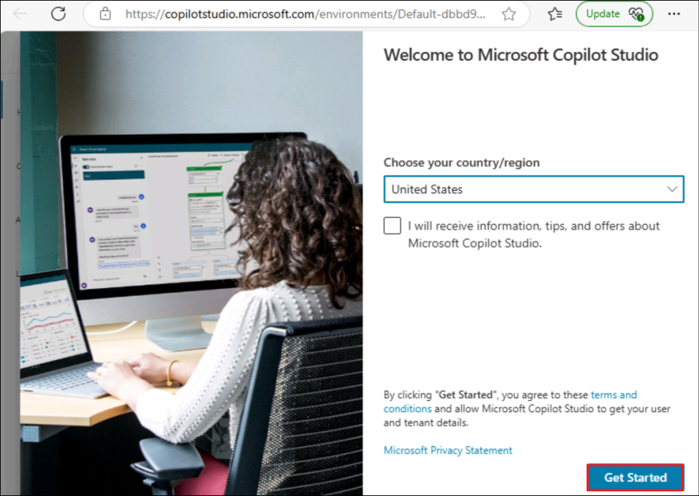

### 작업 2: Contoso IT Support Agent 생성 및 설정

1.  오른쪽 상단의 Copilot Studio 홈 섹션에서 **environment**을 선택하고
    **DevOne** 환경을 선택하세요.

    

2.  Welcome copilot studio 탭에서 **Skip**을 클릭하여 다음 단계로
    이동하세요.

    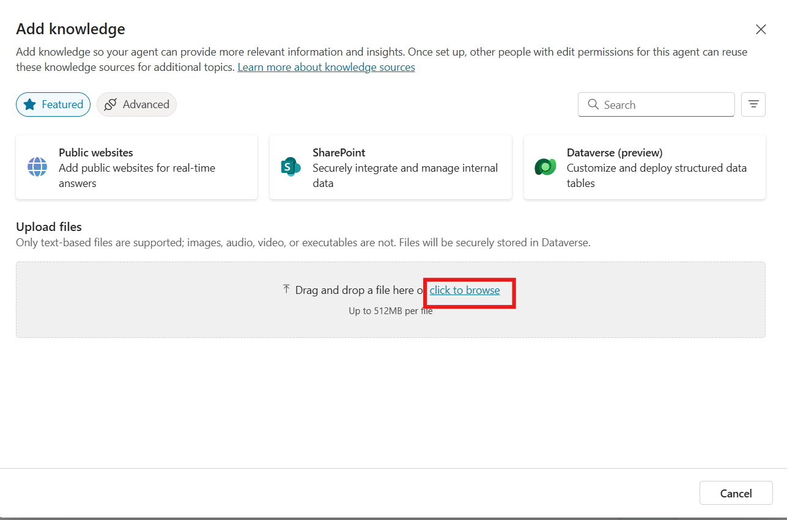

3.  왼쪽 탐색 모음에서 **create**를 선택한 후, **New agent**를 선택하여
    새 에이전트를 생성하기 시작하세요.

    

4.  왼쪽 상단에서 **Skip to configure** 버튼을 클릭하세요.

    

5.  에이전트의 **Name, Description and Instruction**을 다음과 같이
    입력하고 **Create** 버튼을 클릭하세요.

    **Name:** +++Contoso IT Support Agent+++
    
    **Description:** +++Create a Contoso IT Support Agent which transforms IT support at Contoso Solutions by providing instant troubleshooting for common issues, automating ticket creation for unresolved problems, and storing all interactions in Dataverse. This solution enhances response times, reduces manual workloads, and boosts employee productivity.+++
    
    **Instruction:** +++Create the Copilot Agent and configure it to handle IT support operations. Add a knowledge source containing solutions for common IT issues like hardware troubleshooting, connectivity, and software glitches. Set up a trigger to detect incoming emails from employees describing unresolved issues. Create an action to save these technical issues into a Dataverse table, ensuring all details are stored for tracking and reporting. Test the agent to validate its troubleshooting accuracy and ticket automation workflow before deployment.+++

    

6.  Contoso IT Support Agent 개요 페이지에서, 에이전트에 대한
    오케트레이터를 **Enable** 설정하세요.

    

7.  에이전트의 개요 페이지에서 “**Allow the AI to use its own general
    knowledge**” 옵션을 **Disable**설정하세요.

    

8.  에이전트의 오른쪽 상단에서 **Settings** 버튼을 클릭하세요.

    

9.  Generative AI 섹션으로 이동하여Generative AI (Preview)를 선택하여
    content moderation을 **Medium**으로 설정하고 **Save** 을 클릭하여
    설정을 저장하세요.

    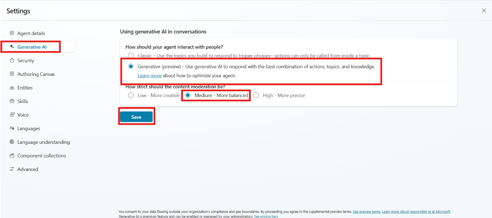

**결론**

이 연습을 완료하면 참가자는 다음을 배우게 됩니다:

- Microsoft Copilot Studio에 접근하고 설정하는 방법

- 맞춤형 Copilot 에이전트를 생성하고 구성하는 단계

- 에이전트를 위한 generative AI 및 오케스트레이터 설정을 활성화하는
  실용적인 기술

- 티켓 생성 자동화와 AI를 활용한 문제 해결로 IT 운영을 향상시키는 방법

## 연습 3: 봇 기능 강화

이 실습은 Contoso IT 지원 에이전트의 기능을 향상시키기 위해 지식
베이스를 추가하고, 봇 주제를 맞춤화하여 상호작용을 개선하는 데 중점을
둡니다. 참가자들은 봇의 응답을 개선하고, 사용자 문제 해결 및
에스컬레이션을 효과적으로 지원할 수 있도록 봇을 최적화합니다.

### 작업 1: 지식 베이스 추가

1.  Contoso agent 개요 페이지에서 아래로 스크롤하여 **+ Add
    Knowledge** 버튼을 클릭하세요.

    

2.  **Click to browse** 버튼을 선택하여 **C:\LabFiles**  폴더에서
    **Contoso Common IT Issue.docx** 추가한 후, **Add** 클릭하여 파일을
    저장하세요.

    

    

3.  Agent개요 페이지에 다시 이동하고 아래로 스크롤한 후, **+ Add
    knowledge** 클릭하세요.

    

4.  **Dataverse (preview)** 옵션을 데이터 소스로 선택하세요.

    

5.  오른쪽 상단 검색 창에서 +++**Employee**+++ 를 입력한 후 검색고
    **Employee Technical Support Record** 테이블을 선택하세요. 그
    후 **Next, Next** 및 **Add** 버튼을 클릭하여 지식 소스에 추가하세요.

    **참고:**  **테이블 이름은 Copilot에서 생성한 테이블 이름이므로 귀하의
경우에** 다를 수 있습니다.

    

    

    >[!Alert]**중요 사항:** Knowledge 페이지에서 추가된 지식 소스가
성공적으로 업로드되었는지 확인하세요. 이 작업은 완료하는 데 약 10-15분
정도 걸립니다.

### 작업 2: Conversation Start Topic 맞춤화하기

1.  상단 표시줄 옵션에서 **Topics**를 클릭한 후, **Conversation
    Start** topic를 클릭하여 여세요.

    

2.  아래로 스크롤하여 메시지 노드로 이동하세요. 아래와 같이 봇 이름 뒤의
    메시지를 업데이트하세요:

    Hello. I’m Bot Name, a virtual assistant. +++How can I help you?+++

    

3.  상단에서 **Save**를 클릭하여 주제를 저장하세요.

    

### 작업 3: Fallback Topic 업데이트

1.  상단 표시줄 옵션에서 Topics를 클릭한 후, **Fallback** topic를
    클릭하고 여세요.

    

2.  아래로 스크롤하여 메시지 노드로 이동하세요. 아래와 같이 메시지를
    업데이트하세요:

    +++I’m sorry. This information is not available in my system. You can raise the support ticket via mail for this issue.+++

    

3.  오른쪽 상단에서 **Save** 버튼을 클릭하여 주제를 저장하세요.

    

**결론**

이 연습을 완료하면 참가자는 다음을 배우게 됩니다:

- 봇의 기능을 향상시키기 위해 지식 베이스를 업로드하고 통합하는 방법

- 더 매력적인 사용자 경험을 위한 대화 시작 메시지 맞춤화 단계

- 지원되지 않는 쿼리를 더 잘 처리할 수 있도록 대체 응답을 업데이트하는
  기술

## 연습 4: 에이전트 테스트

이 실습은 참가자들이 Contoso IT Support Agent를 테스트하여 기능을
검증하는 과정입니다. 참가자들은 봇이 지식 베이스와 대체 주제(fallback
topic)를 사용해 프롬프트를 처리하는 방식에 대해 확인하며, 원활한
상호작용과 에스컬레이션이 이루어지도록 점검합니다.

1.  오른쪽 상단에서 **Test** 버튼을 클릭하세요. 테스트 섹션에서
    **Map**을 클릭하고 **On**을 클릭 한 후, **Refresh**를 클릭하세요.

    

2.  +++**My printer is not working how to fix it**+++라는 프롬프트를
    입력하세요 . 지식 소스에 따라 솔루션을 제공합니다.

    

3.  +++**Two factor Authentication (2FA) issue**+++ 라는 프롬프트를
    입력하세요.

    

4.  2FA 문제와 해결책은 지식 소스에 없으므로 대체 주제(fallback topic)로
    이동하여 티켓 생성(Raise Ticket)과 관련된 메시지를 제공합니다.

    

**결론**

이 연습을 완료하면 참가자는 다음을 배우게 됩니다:

- AI 에이전트를 테스트하고 문제 해결을 위해 활성화하는 방법

- 봇이 지식 베이스를 사용하여 응답할 수 있는 능력 검증

- 대체 주제가 지원되지 않는 쿼리를 처리하고 사용자를 효과적으로
  리디렉션하는 방법

## 연습 5: Power Automate를 사용하여 지원 티켓 생성 자동화

이 실습은 Power Automate를 사용하여 지원 티켓 생성을 자동화하고 이를
Contoso IT Support Agent와 통합하는 방법을 보여줍니다. 참가자들은 문제
보고를 간소화하고, 데이터를 Dataverse에 기록하며, 지원 엔지니어에게
이메일로 알림을 보내는 플로우를 생성하게 됩니다.

1.  에이전트의 개요 페이지로 이동하여 아래로 스크롤하여 **+ Add
    action**을 클릭하세요.

    

2.  Choose an action 창의 왼쪽 상단에서 **+ New Action**을 클릭하고
    **New Power Automate Flow**를 선택하세요.

    

3.  Power automate 플로우에서 **Run a flow from copilot** 를 클릭한 후,
    **Add an Input**를 선택하세요.

    

4.  입력의 데이터 유형으로 **Text**를 선택하고 입력 이름을 +++Name+++로
    변경하세요.

    

    

5.  같은 절차를 따라 아래 제공된 세부 사항에 맞춰 더 많은 입력을
    생성하세요.

    | **Input Name** | **Data Type** |
    |----------------|---------------|
    | +++ID+++             | Text          |
    | +++Email+++          | Text          |
    | +++Details+++        | Text          |

    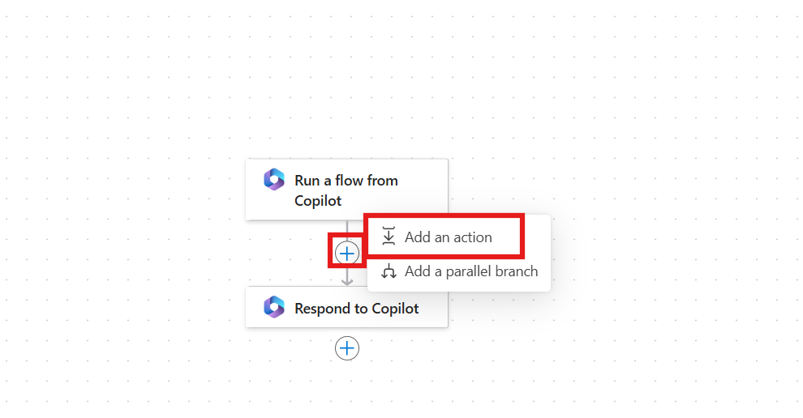

6.  Run a flow from copilot아래 **(+)** 기호를 클릭하고 **Add an
    action**를 선택하세요.

    

7.  Add an action 검색창에 +++**Add a new row**+++ 를 입력하세요. 그
    후,  Microsoft Dataverse 섹션에서 **Add a new row**를 선택하세요.

    

    참고: 경우에 따라 Dataverse 연결이 자동으로 생성되지 않을 수 있습니다.
이 경우, **OAuth** 인증을 통해 다시 자격 증명으로 **sign in**해야 할
수도 있습니다..

    

8.  **Table Name** 섹션에서 +++Employee Technical Support Record+++(또는
    생성된 해당 테이블 이름)를 검색하여 선택하세요.

    

9.  아래 테이블 이름에서 **Show all** 선택한 후, 해당 필드를 클릭하고
    동적 콘텐츠 버튼(번개 모양)을 사용하여 아래 제공된 필드에 맞게
    입력을 추가하세요. **Current Status** 필드는 드롭다운 메뉴에서
    **Unresolved**로 선택해야 합니다.

    | Section                     | Input Variable          |
    |-----------------------------|-------------------------|
    | Employee Name               | 이름 (Dynamic Input)   |
    | Email Address               | 이메일 (Dynamic Input)  |
    | Employee ID                 | ID (Dynamic Input)    |
    | Technical Issue Description | 세부 정보 (Dynamic Input) |

    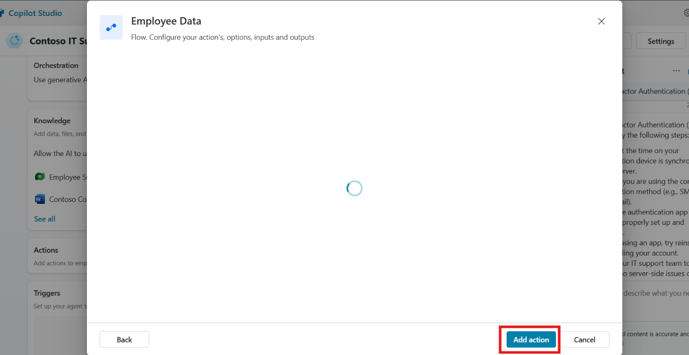

    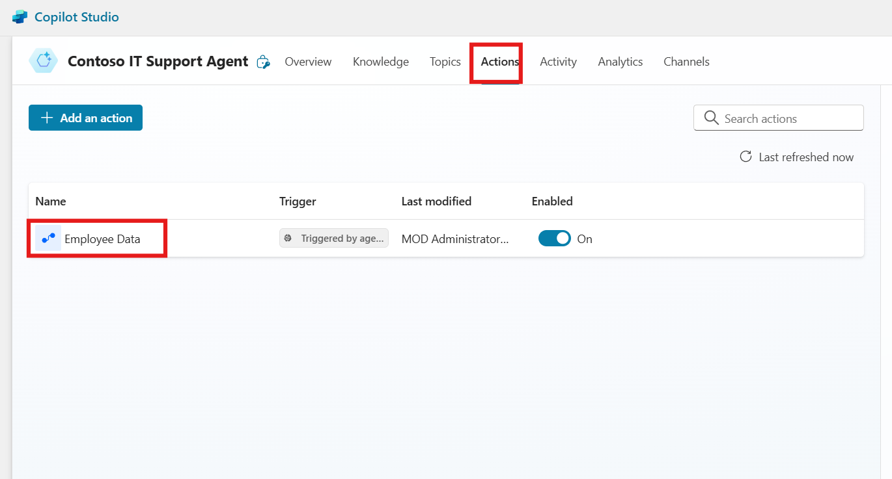

10. Add a new row 액션 아래 (+)를 클릭하고 **Add an action**를
    선택하세요.

    

11. Add an action 섹션에 +++**Send an email**+++ 입력하고 office 365
    섹션에서 **send an email (V2)** 를 선택하세요.

    

12. send an email 섹션에서 해당 섹션에 아래와 같은 정보를 입력하세요:

    **To**
    
    
    Enter support engineer email (**Use any email ID** - It will be to this id, the mail will be sent by the agent to when Support Ticket is raised) 


    **Subject**
    
    ```
    New Technical Support Ticket Raised 
    ```

    **Body**

    ```
    A new technical support ticket has been raised and requires your attention. Please find details below:
    
    Employee Name: < Name >
    Employee ID: < ID > 
    Technical Issue: < Details >
    
    Thank you for your prompt attention to this matter.'
    
    Best Regards
    ```

    

13. 왼쪽 상단에서 플로우 이름을 +++**Employee Data**+++로 변경하세요.

    

14. 상단 표시줄에서 **Save draft** 클릭한 후 **Publish** 클릭하세요.

    

15. Copilot 창으로 다시 돌아가서 **Refresh** 버튼을 클릭하세요.

    

16. Choose an action 창에서 **Employee Data** flow를 선택하세요.

    

17. **Add action** 버튼을 클릭하여 플로우를 추가하세요.

    

18. **Employee Data** flow 클릭하여 열고, 열린 후에는 입력 옵션을
    선택하세요.

    

    

19. 해당 입력 필드에 주어진 설명을 입력하고 설명을 입력한 후 **Save**
    버튼을 클릭하세요.

    | Section | Details |
    |----|----|
    | Name -- Description | +++Enter the name of the employee.+++ |
    | ID -- Description | +++Enter the employee ID in the field.+++ |
    | Email -- Description | +++Enter the email address of the employee from whom the email is received.+++ |
    | Details -- Description | +++Enter the email details of the employee.+++ |

    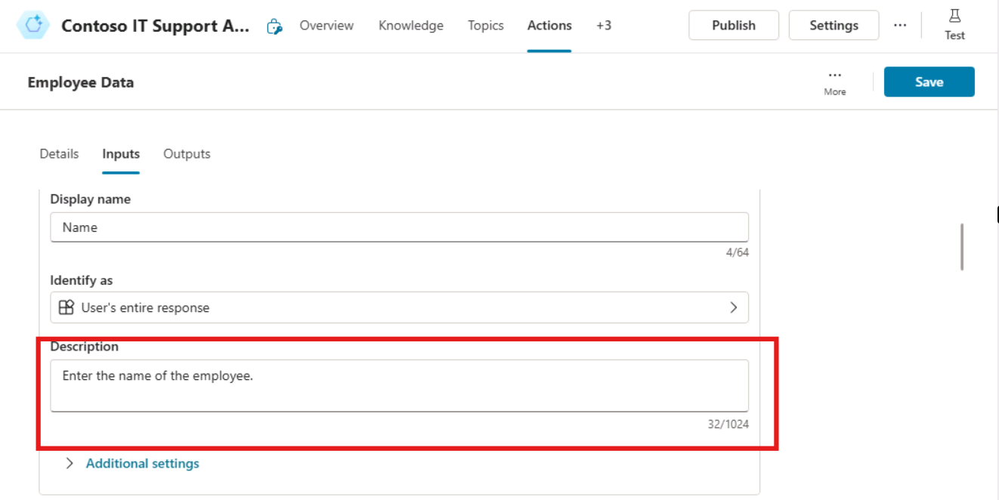

    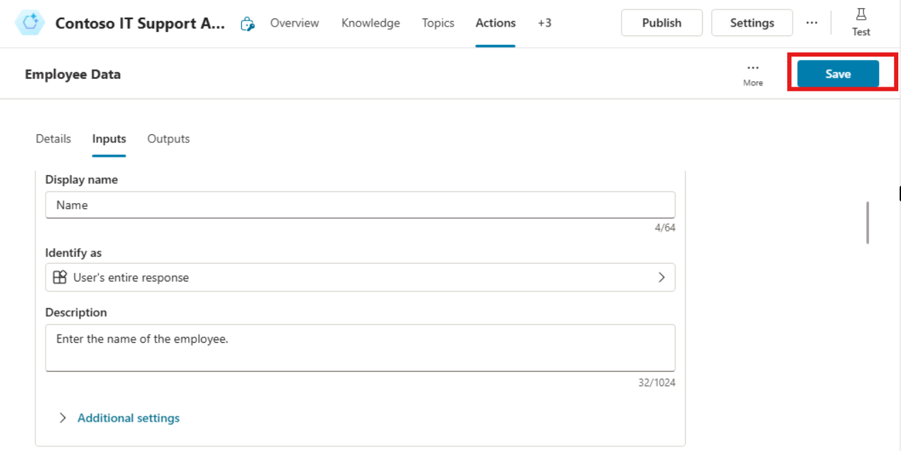

**결론**

실습을 통해 참가자들은 다음을 학습하게 됩니다:

- Power Automate 흐름을 Copilot 에이전트와 통합하여 티켓을 자동 생성하는
  방법

- 사용자 상호작용에서 입력 데이터를 동적으로 수집하고 매핑하는 단계

- 기술 문제 에스컬레이션을 위한 이메일 알림 자동화 방법

- 효율적인 지원 티켓 관리를 위한 워크플로우 구성 능력

## 실습 6: 자동화된 동작을 위한 이메일 기반 트리거 구성

지원 티켓 생성 자동화의 연속으로, 이번 실습은 이메일 입력과 자동화된
Power Automate flow를 연결하기 위해 Contoso IT Support Agent에서
트리거를 설정하는 데 중점을 둡니다. 참가자들은 트리거를 구성하고
에이전트를 배포 준비 상태로 마무리합니다.

1.  에이전트의 개요 페이지로 이동하여 아래로 스크롤하여 **+ Add
    trigger**를 클릭하세요.

    

2.  Add trigger 창에서 **When a new email arrives (V3)** 트리거를
    선택하세요.

    

3.  Copilot과 Outlook의 연결이 성공적으로 이루어지고 녹색 체크 표시가
    나타나면 **Next** 버튼을 클릭하세요.

    

4.  폴더 필드에서 폴더 아이콘을 선택하고 **Inbox** 폴더를 선택한 후,
    **Create trigger**를 선택하세요.

    

    

5.  **Time to test your trigger** 프롬프트를 닫으세요. Support agent
    개요 페이지에서 아래로 스크롤하고 트리거 섹션에서 세 개의
    점**(…)**을 클릭하고 **Edit in Power Automate**을 선택하세요.

    

6.  When a new email arrives 트리거를 마우스 오른쪽 버튼으로 클릭하고
    **Delete** 선택하세요.

    

7.  Add a trigger를 클릭하고 +++**When new email arrives**+++ 를 검색한
    후, **Office 365 outlook** 섹션에서  **When a new email arrives**을
    선택하세요.

    

8.  **Send a prompt to the specified copilot for processing** 클릭하고,
    body/message 섹션에 다음 프롬프트를 입력하세요:

    +++**Run Create an Employee Support Ticket flow and use content from Body From.**+++ Replace **Body** and **From** as dynamic content variable.

    

9.  플로우를 **Save** 및 **Publish**하고 Power Automate 창을 닫고
    Copilot 창으로 돌아가세요.

    

10. 개요 섹션으로 이동하여 오른쪽 상단에서 **Publish**를 클릭하고
    **Publish**를 다시 클릭하여 copilot을 게시하세요.

    

    

**결론**

이 연습을 완료하면 참가자는 다음을 배우게 됩니다:

- Copilot에서 이메일 입력을 기반으로 워크플로를 자동화하는 트리거 설정
  방법

- 이메일 콘텐츠를 Power Automate flow에 동적으로 매핑하는 단계

- AI 에이전트를 운영용으로 게시하고 최종 설정하는 과정

- Outlook과 같은 커뮤니케이션 도구를 자동화된 워크플로와 연결하는
  실용적인 기술

## 연습 7: 에이전트 테스트하기

이 연습은 Contoso IT Support Agent을 Power Automate 및 Outlook과 통합한
기능을 테스트하는 데 중점을 둡니다. 참가자들은 에이전트가 이메일을
처리하고, 지원 티켓을 생성하며, 자동화된 워크플로를 효과적으로 트리거할
수 있는지 확인합니다.

1.  에이전트의 개요 페이지로 이동하여 아래로 스크롤하여 트리거에서
    **(…)** 클릭하고 **Edit in power automate** 선택하세요.

    

2.  Power Automate flow로 이동하면, 상단 표시줄에서 **Test** 버튼을
    클릭한 후, **Manually**를 선택하고 다시 **Test**를 클릭하세요.

    

    

3.  **액션을 트리거**하기 위해 다른 메일박스에서 365 관리자 테넌트
    이메일 ID로 **이메일을 전송하세요.** 메일에는 문제를 설명하고, 아래
    스크린샷과 유사하게 직원 ID와 같은 세부 정보를 포함해야 합니다. 예시
    내용은 다음과 같습니다:

    ```
    Hi Support Team,
    
    I hope this message finds you well.
    Iam Mark Brown, working as a Software Engineer at Contoso. My employee ID is CONTOSO099
    Issue: Monitor is completely balank and not functioning.
    Kindly raise a support ticket and assist in resolving this issue at the earlierst.
    Thank you for your support.

    Best Regards,
    Mark Brown
    ```
    
    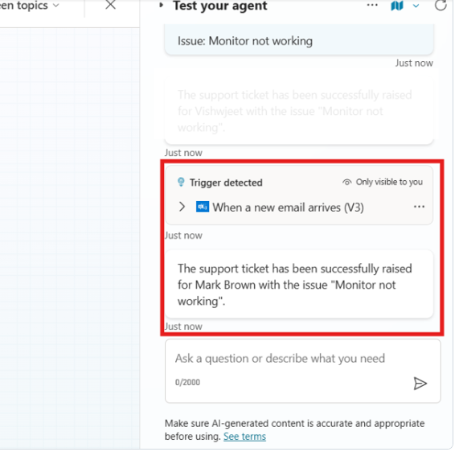

    

4.  copilot 에이전트 개요 페이지로 이동하여 아래로 스크롤하여 **Test
    trigger** 선택하세요.

    

5.  **Start testing** 클릭하면 테스트 절차가 시작됩니다.

    

6.  테스트 섹션에서 **Connect**를 클릭하면 연결 창이 열립니다.

    

7.  **Connect**를 다시 클릭한 후, **Submit**을 선택하세요.

    

    

8.  Copilot studio 창으로 이동하여 **Test** 다시 실행하세요.

    

9.  지원 요청은 자동으로 생성됩니다.

    

10. Power Apps로 이동하여 직원 지원 티켓 기록 테이블로 이동하여 세부
    정보를 확인하세요.

    

11. Power Automate flow에서 이메일을 전송하도록 구성한 지원 이메일을
    확인하세요. 이메일은 자동으로 지원 팀에 전송됩니다.

    

12. 테스트 창으로 이동하여 사용자 +++**Mark Brown Ticket Current
    Status**+++ 라는 쿼리를 입력하세요. 문제의 상태가
    '미해결(Unresolved)'로 표시됩니다.

    

13. 지원 엔지니어(Support Engineer)로서 테스트 섹션에 다음 프롬프트를
    작성합니다. +++**I want to know about all Unresolved ticket**+++ .

    

**결론**

이번 실습을 통해 참가자들은 다음과 같은 내용을 학습했습니다:

- 실제 시나리오를 시뮬레이션해 에이전트의 기능을 테스트하는 방법

- 이메일 기반 워크플로우와 Power Automate에서의 티켓 생성이 제대로
  작동하는지 검증하는 절차

- Dataverse에서 생성된 기록을 검토하고, 지원팀에 알림이 전송되었는지
  확인하는 방법

- 자동화 워크플로우를 디버깅하고 마무리하는 실전 감각

**실습 가이드 최종 요약**

이 실습 가이드는 참가자들이 Contoso Solutions의 IT 지원 데스크를 위한
Autonomous Copilot Agent를 배포하는 과정을 직접 체험할 수 있도록
구성되었습니다.

단계별 실습을 통해 참가자들은 다음을 수행했습니다:

1.  **Copilot Studio 설정**: 참가자들은 Copilot Studio에 로그인하고, IT
    지원 에이전트를 생성 및 구성하는 방법, 또는 문제 해결 및 티켓
    자동화를 효과적으로 수행할 수 있도록 generative AI와
    오케스트레이터와 같은 핵심 설정을 활성화하는 방법을 배웠습니다.

2.  **Power Apps 탐색**: 참가자들은 Power Apps에 로그인하고, Dataverse
    테이블을 설정하며, Excel 데이터를 가져와 지원 티켓을 효율적으로
    확인하고 관리하는 방법에 대한 실전 지식을 습득했습니다.

3.  **봇 기능 향상**: 이 연습에서는 봇에 지식 베이스를 추가하고, 대화
    시작 주제 및 예외 처리 주제(fallback)를 맞춤화하여 사용자와의
    상호작용을 개선하는 데 중점을 두었습니다.

4.  **IT 지원 작업 자동화**: 참가자들은 Power Automate를 활용해 지원
    티켓 생성 프로세스를 자동화하는 방법도 배웠습니다. 이를 통해
    해결되지 않은 문제에 대한 처리 능력을 강화하고, IT 팀의 업무
    효율성을 높일 수 있게 되었습니다.

이러한 일련의 실습을 통해 참가자들은 신속한 응답, 수작업 감소, 전반적인
생산성 향상이 가능한 강력한 자율형 IT 지원 시스템을 구현할 수 있게
되었습니다.
