# Laboratorio 2 - Optimización de las operaciones de soporte IT con el agente autónomo Copilot en Contoso Solutions 

**Tiempo estimado: 60 minutos** 

## Objetivo 

El objetivo de este laboratorio es optimizar las operaciones de soporte
de IT en Contoso Solutions mediante la creación de un agente Copilot
autónomo. Los participantes aprenderán a instalar Microsoft Copilot
Studio, configurar el agente de soporte de IT, integrar Power Apps y
Dataverse, mejorar las capacidades del bot mediante una base de
conocimientos y automatizar la creación de tickets utilizando Power
Automate. Este laboratorio práctico proporcionará a los usuarios las
habilidades necesarias para mejorar los flujos de trabajo de IT, reducir
el esfuerzo manual y aumentar la eficiencia en el soporte. 

## Solución 

Los participantes crearán un agente de soporte de IT personalizado para
Contoso utilizando Microsoft Copilot Studio, configurándolo para
gestionar problemas de IT comunes e integrándolo con Dataverse para el
almacenamiento de datos de soporte. Configurarán un entorno de
desarrollo, añadirán fuentes de conocimiento y optimizarán los flujos de
conversación del bot para mejorar la interacción con el usuario. A
través de Power Apps, los participantes crearán una tabla en Dataverse
para gestionar los registros de soporte de IT. Utilizando Power
Automate, automatizarán la creación de tickets y las notificaciones por
correo electrónico para los problemas no resueltos. Finalmente, los
participantes probarán el agente para validar su efectividad en la
resolución de problemas y la automatización de flujos de trabajo,
garantizando operaciones de soporte de IT eficientes. 

## Ejercicio 1: Introducción a Power Apps

Este ejercicio introduce a los participantes a Power Apps y Dataverse.
El objetivo es iniciar sesión en Power Apps, configurar un entorno de
trabajo y crear una tabla en Dataverse importando datos desde un archivo
Excel. Los participantes desarrollarán habilidades fundamentales para
trabajar con aplicaciones basadas en datos.

### Tarea 1: Inicie sesión en Power Apps

1.  Navegue hasta el sitio web de Power Apps
    <https://www.microsoft.com/en-us/power-platform/products/power-apps>
    y haga clic en el botón **Try for Free.**

    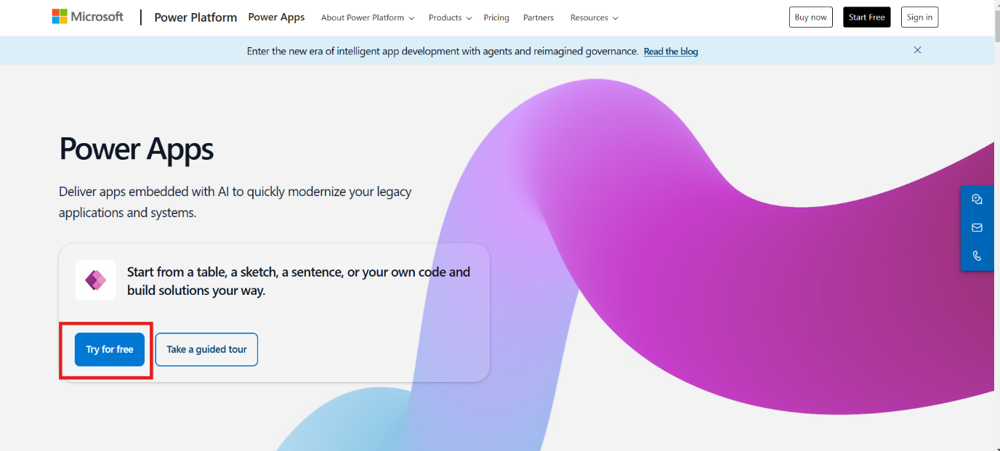

2.  Ingrese el **Administrative Username** de la sección **Office 365
    Tenant** de la pestaña **Resources** en el campo de correo
    electrónico y haga clic en el botón **Start free.**

    

3.  Ingrese el país/región, el número de teléfono, seleccione la casilla
    de verificación y haga clic en el botón **Get started**.

    

4.  Confirme los datos de la cuenta y haga clic en el botón **Get
    started**.

    

5.  En la pestaña **Stay signed in**, seleccione **Yes.**

    

### Tarea 2: Configuración de una tabla en Dataverse

1.  En la página de inicio de Power Apps, seleccione en la parte
    superior el entorno de desarrollo. En este caso, el entorno es **Dev
    One**, pero los participantes pueden elegir su propio entorno según
    corresponda.

    

2.  En la barra de navegación izquierda seleccione **Tables.** En la
    barra superior de la sección tablas, haga clic en **+ New table** y
    seleccione **Create new tables**.

    

3.  Seleccione la opción **Import an Excel file or CSV** para crear una
    nueva tabla.

    

4.  Haga clic en la opción **Select form device** y seleccione el
    archivo Excel de **Support Ticket** desde la carpeta
    **C:**\\**LabFiles.**

    

5.  Elija la tabla y haga clic en **View data** para ver la tabla.

    **Nota:** En mi caso, la tabla se denomina *Employee Technical Support
Record*, aunque su nombre puede variar en cada ejecución. Guarde este
nombre para futuras consultas.

    

6.  Vaya a los datos de la tabla, seleccione el menú desplegable situado
    junto al campo **Technical Issue Description,** seleccione **Edit
    column**, establezca el tipo de datos como **Text** **Multiple
    line** **Plain Text** y haga clic en **Update**. El nombre de la
    columna puede ser diferente en cada caso.

    **Nota:** El nombre de la columna puede ser ligeramente diferente, pero
será algo similar a la descripción de la incidencia, ya que está
generada por Copilot.

    

    

7.  Seleccione el menú desplegable junto al campo **Current Status** y
    luego seleccione **Edit columna**. Establezca la opción como
    **Unresolved,** **Resolved, Processing**. Establezca las opciones
    por defecto como **Unresolved** y haga clic en el botón **Update.**

    

8.  En la parte superior derecha, haga clic en **Save and exit** para
    guardar la tabla.

    

### Conclusión

A través de este ejercicio, los participantes adquirirán conocimientos
sobre:

- Cómo acceder y navegar por Power Apps utilizando credenciales.

- Instrucciones para crear y configurar una tabla en Dataverse a través
  de la importación de datos.

- Conocimiento práctico de la configuración de un entorno para apoyar
  los flujos de trabajo de desarrollo de aplicaciones.

## Ejercicio 2: Creación del agente de soporte IT de Contoso

Este ejercicio se enfoca en iniciar sesión en Microsoft Copilot Studio y
crear un agente Copilot personalizado para las operaciones de soporte de
IT en Contoso. Los participantes ganarán experiencia práctica en la
navegación por Copilot Studio, la configuración de entornos y la
creación de un agente basado en IA, diseñado para agilizar los flujos de
trabajo de IT.

### Tarea 1: Inicie sesión en Microsoft Copilot Studio

1.  Navegue hasta el sitio web de copilot studio
    +++https://www.microsoft.com/en-us/microsoft-copilot/microsoft-copilot-studio+++
    y haga clic en **Try free.**

    

2.  Ingrese el **Administrative Username** de la sección **Office 365
    Tenant** de la pestaña **Resources** en el campo de correo
    electrónico y haga clic en el botón **Start free**.

    **Nota:** Para este laboratorio, se están utilizando credenciales de
administrador. Los participantes pueden utilizar su identificación de
trabajo o escolar para iniciar la prueba gratuita.

    

    

3.  Ingrese el **Country or Region** y el **Business phone number** en
    los campos correspondientes. Seleccione la casilla de verificación y
    haga clic en el botón **Get started.**

    

4.  En la sección de confirmación, haga clic de nuevo en el botón **Get
    Started.**

    

5.  Seleccione Get Started en la pantalla de bienvenida de Copilot
    Studio.

    

###  Tarea 2: Cree y configure el agente de soporte IT de Contoso 

1.  En la sección de inicio de Copilot Studio, arriba a la derecha,
    seleccione el **environment** y elija el entorno **Dev One.**

    

2.  En la pestaña de bienvenida de copilot studio, haga clic en **Skip**
    para avanzar.

    

3.  En la barra de navegación de la izquierda, seleccione **Create** y,
    a continuación, **New agent** para empezar a crear un nuevo agente.

    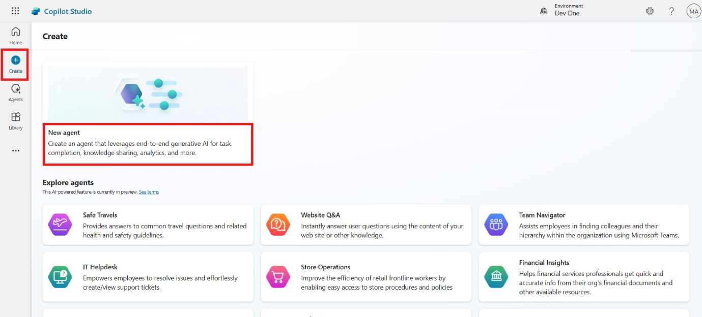

4.  En la esquina superior derecha, haga clic en el botón **Skip to
    configure**.

    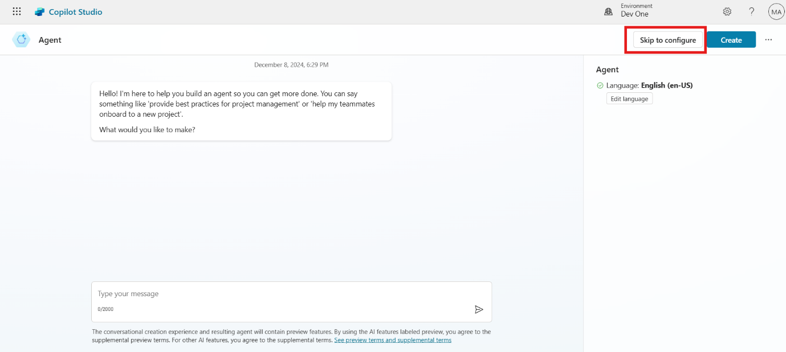

5.  Ingrese el **nombre, descripción** e **instrucciones** del agente
    como se indica a continuación y haga clic en el botón **Create.**

    **Name:** +++Contoso IT Support Agent+++
    
    **Description:** +++Create a Contoso IT Support Agent which transforms IT support at Contoso Solutions by providing instant troubleshooting for common issues, automating ticket creation for unresolved problems, and storing all interactions in Dataverse. This solution enhances response times, reduces manual workloads, and boosts employee productivity.+++
    
    **Instruction:** +++Create the Copilot Agent and configure it to handle IT support operations. Add a knowledge source containing solutions for common IT issues like hardware troubleshooting, connectivity, and software glitches. Set up a trigger to detect incoming emails from employees describing unresolved issues. Create an action to save these technical issues into a Dataverse table, ensuring all details are stored for tracking and reporting. Test the agent to validate its troubleshooting accuracy and ticket automation workflow before deployment.+++

    

6.  En la página de descripción general de Contoso IT Support Agent,
    habilite el orquestador para el agente haciendo clic en **Enable.**

    

7.  En la página de descripción general del agente, **Disable** la
    opción “**Allow the AI to use its own general knowledge**”.

    

8.  En la esquina superior derecha del agente, haga clic en el botón
    **Settings**.

    

9.  A continuación, vaya a la sección Generative AI, seleccione
    Generative AI (Preview), establezca la moderación de contenido como
    **Medium** y haga clic en **Save** para guardar la configuración.

    

###  Conclusión

A través de este ejercicio, los participantes adquirirán conocimientos
sobre:

- Cómo acceder y configurar Microsoft Copilot Studio.

- Pasos para crear y configurar un agente Copilot personalizado.

- Habilidades prácticas para habilitar la IA generativa y la
  configuración del orquestador para el agente.

- Formas de mejorar las operaciones IT automatizando la creación de
  tickets y aprovechando la IA para la resolución de problemas.

## Ejercicio 3: Optimización de las capacidades del bot

Este ejercicio se enfoca en mejorar las capacidades del agente de
soporte de IT de Contoso añadiendo una base de conocimientos y
personalizando los temas del bot para optimizar la interacción. Los
participantes perfeccionarán las respuestas del bot, asegurándose de que
asista de manera eficaz a los usuarios en la resolución de problemas y
el escalado de incidencia.

### Tarea 1: Añada una base de conocimientos 

1.  En la página de descripción general del agente de Contoso,
    desplácese hacia abajo y haga clic en el botón **+ Add Knowledge**.

    

2.  Haga clic en el botón **Click to browse** para añadir el archivo de
    laboratorio **Contoso Common IT Issue.docx** de la carpeta
    **C:\LabFiles** y, a continuación, haga clic en **Add** para guardar
    el archivo.

    

    

3.  Una vez más, vaya a la página de descripción general del agente,
    desplácese hacia abajo y haga clic en **+ Add knowledge.**

    

4.  Seleccione la opción **Dataverse (preview)** como fuente de datos.

    

5.  En la barra de búsqueda de la esquina superior derecha, ingrese y
    busque **Employee** y seleccione tabla de **Employee Technical
    Support Record**. A continuación, haga clic en el botón **Next,
    Next** y **Add** para añadir la fuente de conocimiento.

    **Nota**: El nombre de la tabla puede ser diferente en su caso, ya que
es una tabla generada por Copilot.

    

    

### Tarea 2: Personalice el Conversation Start Topic

1.  En la opción de la barra superior, haga clic en **Topics** y, a
    continuación, haga clic y abra el tema **Conversation Start.**

    

2.  Desplácese hacia abajo y vaya al nodo de mensajes. Actualice el
    mensaje después del nombre del bot como se indica a continuación:

    Hello. I’m Bot Name, a virtual assistant. How can I help you?

    

3.  En la parte superior, haga clic en **Save** para guardar el tema.

    

###  Tarea 3: Actualice el Fallback Topic 

En la opción de la barra superior, haga clic en **Topics** y, a
continuación, haga clic en **Fallback** para abrir el tema de respaldo.

    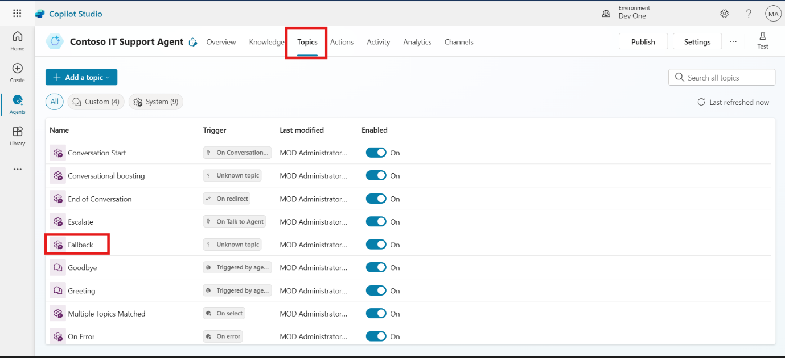

1.  Desplácese hacia abajo y vaya al nodo de mensajes. Actualice el
    mensaje como se indica a continuación:

    I’m sorry. This information is not available in my system. You can raise
the support ticket via mail for this issue.

    

2.  En la parte superior derecha, haga clic en el botón **Save** para
    guardar el tema.

    

Conclusión

A través de este ejercicio, los participantes adquirirán conocimientos
sobre:

- Cómo cargar e integrar una base de conocimientos para mejorar la
  funcionalidad del bot.

- Pasos para personalizar los mensajes de inicio de conversación para
  una experiencia de usuario más atractiva.

- Técnicas para actualizar las respuestas fallback para un mejor manejo
  de las consultas no soportadas.

## Ejercicio 4: Evaluación del agente

Este ejercicio guía a los participantes en la prueba Contoso IT Support
Agent para validar su funcionalidad. Los participantes verificarán cómo
el bot maneja los prompts utilizando la base de conocimientos y los
temas de fallback, asegurando una interacción y un escalado eficientes.

1.  En la esquina superior derecha, haga clic en el botón **Test.** A
    continuación, en la sección de pruebas, haga clic en **Map**,
    actívelo seleccionando **On** y, a continuación, haga clic en
    **Refresh.**

    

2.  Ingrese el prompt “**My printer is not working how to fix it.”.**
    Esto mostrará la solución basada en la fuente de conocimiento
    configurada en el agente.

    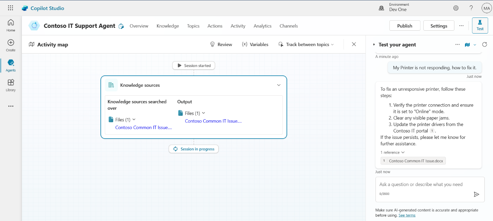

3.  Ingrese nuevamente el prompt **“Two factor Authentication (2FA)
    issue”.**

    

4.  Dado que el problema de 2FA y su solución no están disponibles en la
    fuente de conocimiento, el agente recurrirá a un tema alternativo y
    devolverá un mensaje relacionado con crear Ticket.

    

    **Nota:** Dado que los datos de **2FA** no están disponibles en la base
de conocimientos, normalmente el agente recurriría al tema de fallback.
Sin embargo, en algunas ocasiones, Copilot puede intentar utilizar la
información disponible en la base de conocimientos y proporcionar una
respuesta.

### Conclusión

A través de este ejercicio, los participantes adquirirán conocimientos
sobre:

- Cómo probar y activar un agente de IA para la resolución de problemas.

- Validación de la capacidad de respuesta del bot utilizando su base de
  conocimientos.

- Cómo los temas de fallback manejan consultas no soportadas y redirigen
  a los usuarios de manera efectiva.

## Ejercicio 5: Automatización de la creación de tickets de soporte con Power Automate

Este ejercicio demuestra cómo automatizar la creación de tickets de
soporte utilizando Power Automate e integrarlo con Contoso IT Support
Agent. Los participantes crearán un flujo para agilizar la gestión de
incidencias, registrar datos en Dataverse y notificar a los ingenieros
de soporte por correo electrónico.

1.  Vaya a la página de descripción general del agente, desplácese hacia
    abajo y haga clic en el botón **+ Add action**.

    

2.  En la ventana Add action, haga clic en **+ New action** y seleccione
    **New Power Automate flow**, se abrirá la ventana Power automate
    Flow.

    

3.  En Power automate flow, haga clic en **Run a flow from copilot** y
    luego seleccione **Add an Input**.

    

4.  Seleccione **Text** como tipo de datos de entrada y renombre la
    entrada como **Name**.

    

    

5.  Con el mismo procedimiento, cree más entradas según los siguientes
    detalles.

| **Nombre de entrada** | **Tipo de datos** |
|----------------|---------------|
| +++ID+++             | Texto          |
| +++Correo electrónico+++          | Texto          |
| +++Detalles+++        | Texto          |  

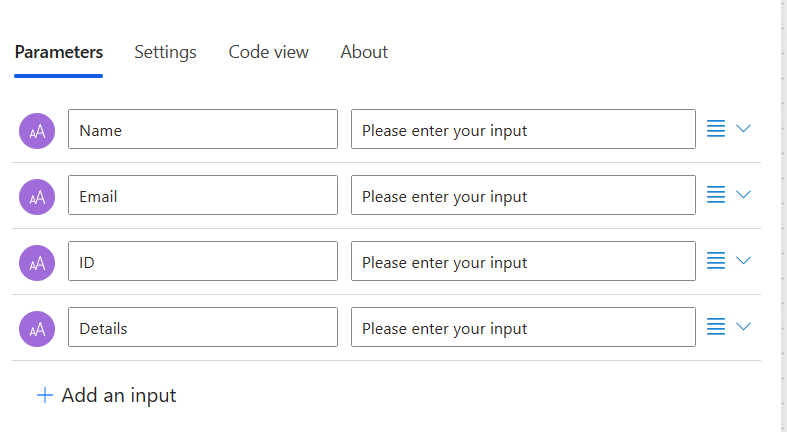

6.  Debajo de Run a flow from copilot, haga clic en el signo **(+)** y
    seleccione **Add an action.**

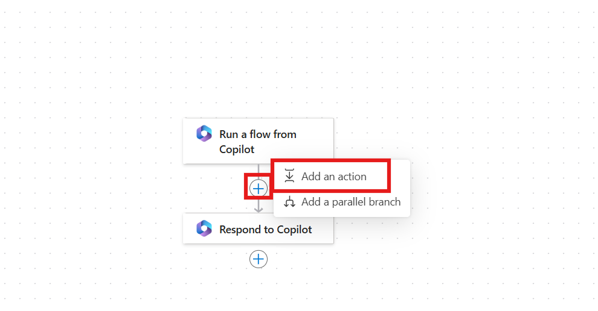

7.  En la barra de búsqueda **Add an action**, ingrese **Add a new
    row**. A continuación, seleccione **Add a new row** de la sección
    Microsoft Dataverse.

    

    **Nota:** A veces la conexión Dataverse no se crea automáticamente, por lo que los participantes deben iniciar sesión haciendo clic en **sign in** con sus credenciales, la autenticación debe ser **OAuth.**

    

8.  En la sección **Table Name** busque y seleccione **Employee
    Technical Support Record** (o su correspondiente nombre de tabla
    creada).

    

9.  Debajo del nombre de la tabla, seleccione **Show all** y, a
    continuación, haga clic en el campo correspondiente. Añada los datos
    utilizando el botón de contenido dinámico (**Thunderbolt**) según el
    campo indicado. En el caso del campo **Current Status**,
    selecciónelo en el menú desplegable y configúrelo como
    **Unresolved**.

    | Sección                      | Variable de entrada         |
    |-----------------------------|-------------------------|
    | Nombre del empleado            | Nombre (Entrada dinámica)  |
    | Dirección de correo electrónico              | Correo electrónico (Entrada dinámica)   |
    | ID del empleado                | ID (Entrada dinámica)     |
    |Descripción del problema técnico| Detalles (Entrada dinámica) |

    

    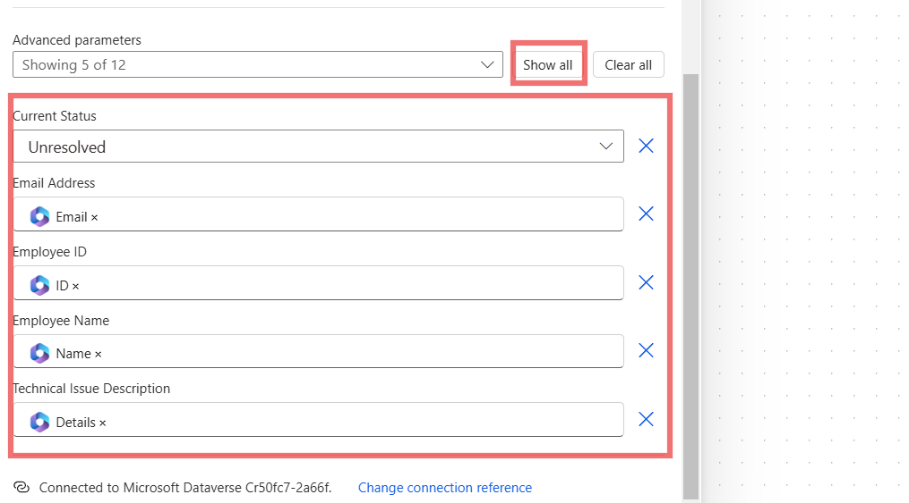

10. Debajo de la acción Add a new row, haga clic en (+) y seleccione
    **Add an action**.

    

11. En la sección **add an action**, ingrese **Send an email** en la
    barra de búsqueda y seleccione **send an email (V2)** desde la
    sección de office 365 outlook e **inicie sesión** si se le solicita.

    

12. En la sección de envío de correo electrónico, ingrese los siguientes
    datos en la sección correspondiente:

    **To**
    
    
    Enter support engineer email (**Use any email ID** - It will be to this id, the mail will be sent by the agent to when Support Ticket is raised) 


    **Subject**
    
    ```
    New Technical Support Ticket Raised 
    ```

    **Body**

    ```
    A new technical support ticket has been raised and requires your attention. Please find details below:
    
    Employee Name: Name (**Replace with Name** dynamic content variable (Thunder bolt))
    Employee ID: ID (**Replace with ID** dynamic content variable (Thunder bolt))
    Technical Issue: Details (**Replace with Details** Name dynamic content variable (Thunder Bolt))
    
    Thank you for your prompt attention to this matter.'
    
    Best Regards
    ```

    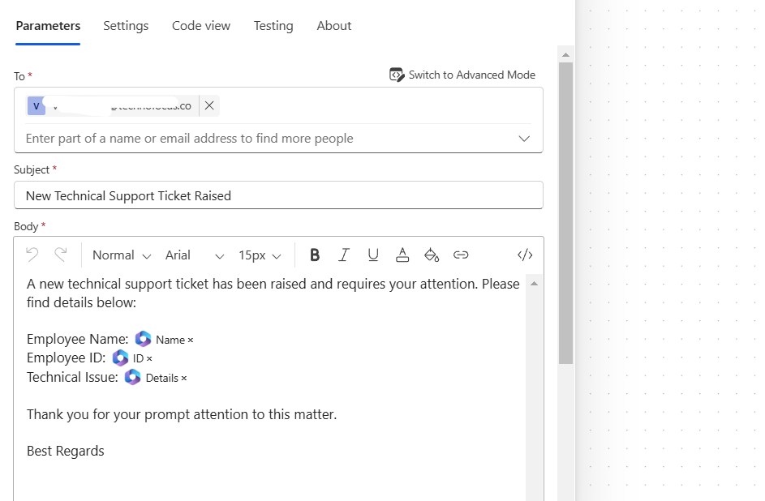

13. Desde la esquina superior izquierda renombre el flujo como
    **Employee Data.**

    

14. En la barra superior, haga clic en **Save draft** y, a continuación,
    en **Publish**.

    

15. Vuelva a la ventana Copilot y haga clic en el botón **Refresh.**

    

16. En la ventana Add action, seleccione el flujo **Employee Data.**

    

17. Haga clic en **Add action** para avanzar.

    

18. Navegue hasta la sección **Action** y haga clic en **Employee Data
    flow**.

    

19. Después de abrir el flujo de datos del empleado, haga clic en la
    sección **Input.**

    

20. Una vez ingresada la descripción, haga clic en el botón **Save**.

    | Section | Details |
    |----|----|
    | Name -- Description | +++Enter the name of the employee.+++ |
    | ID -- Description | +++Enter the employee ID in the field.+++ |
    | Email -- Description | +++Enter the email address of the employee from whom the email is received.+++ |
    | Details -- Description | +++Enter the email details of the employee.+++ |

    

    

### Conclusión

A través de este ejercicio, los participantes adquirirán conocimientos
sobre:

- Cómo integrar flujos de Power Automate con un agente Copilot para la
  creación de tickets.

- Pasos para recopilar y asignar datos de entrada dinámicamente a partir
  de las interacciones del usuario.

- Técnicas para automatizar las notificaciones por correo electrónico
  para el escalado de problemas técnicos.

- La capacidad de configurar flujos de trabajo para una gestión
  eficiente de los tickets de soporte.

## Ejercicio 6: Configuración de un desencadenador basado en correo electrónico para acciones automatizadas

Esta fase de la automatización de la creación de tickets de soporte se
enfoca en la configuración de un desencadenador en Contoso IT Support
Agent para vincular las solicitudes por correo electrónico con el flujo
automatizado de Power Automate. Los participantes configurarán los
desencadenadores y completarán la configuración del agente para su
implementación.

1.  Vaya a la página de descripción general del agente, desplácese hacia
    abajo y haga clic en **+ Add trigger**.

    

2.  A continuación, en la ventana Add trigger, seleccione el
    desencadenador **When a new email arrives (V3)**.

    

3.  Después de que la conexión entre **Copilot** y **Outlook** se haya
    realizado con éxito y aparezca la marca verde, haga clic en el botón
    **Next.**

    

4.  En el campo de la carpeta, seleccione el ícono de la carpeta
    **Inbox** y luego elija la carpeta **Create trigger.**

    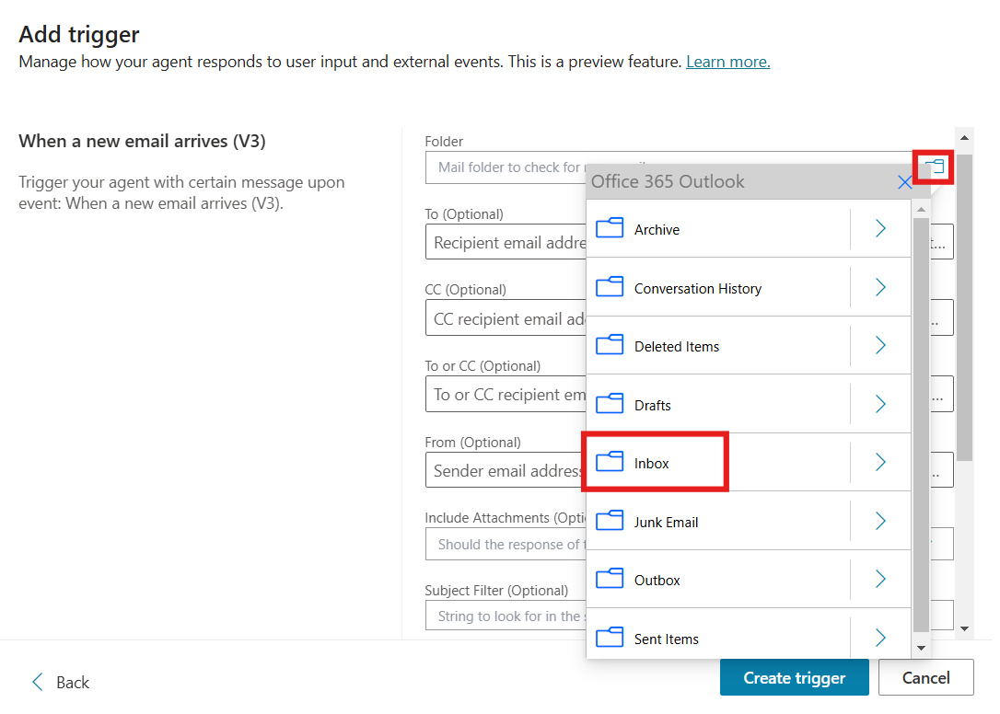

    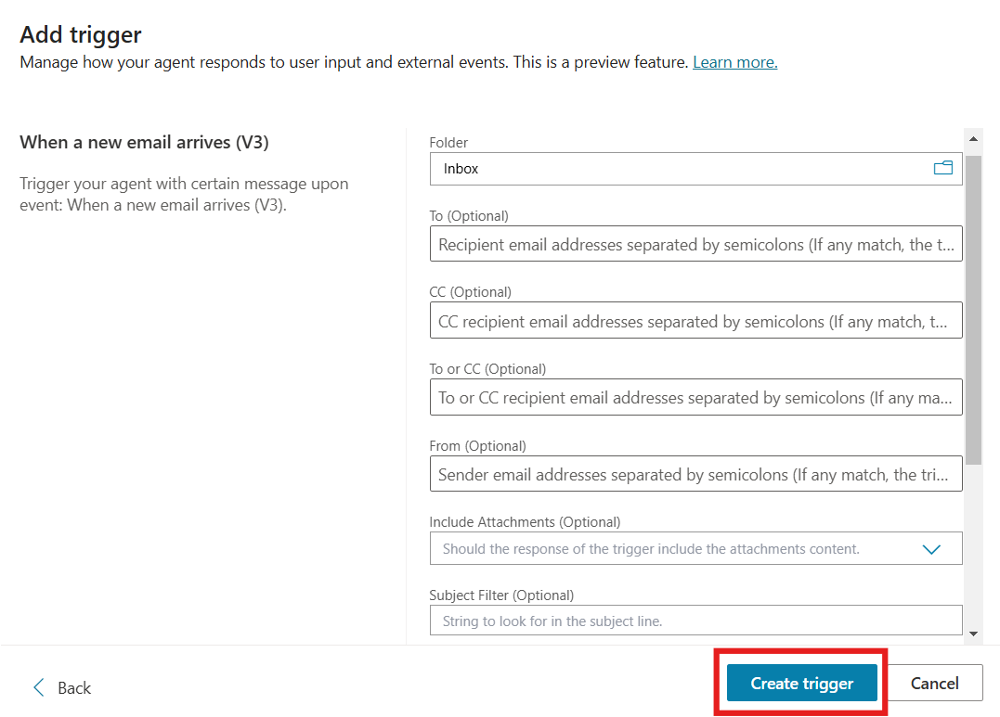

5.  **Cierre** la ventana **Time to test your trigger.** En la página de
    descripción general del agente de soporte desplácese hacia abajo, en
    la sección de desencadenadores haga clic en los tres puntos
    **(...)** y seleccione **Edit in Power Automate.**

    

    

6.  Haga clic con el botón derecho cuando llegue un nuevo correo
    electrónico y seleccione **Delete**.

    

7.  A continuación, haga clic en Add a trigger, busque **When new email
    arrives** y seleccione el desecandenador **When a new email
    arrives** desde la sección **Office 365 outlook**.

    

8.  Haga clic en **Send a prompt to the specified copilot for
    processing**, en la sección cuerpo/mensaje ingrese el mensaje, **Run
    Employee Data flow and use content from Body From**. Reemplace
    “Body” y “From” como variable de contenido dinámico (opción Thunder
    bolt).

    

9.  Haga clic en **Save** **draft** y **Publish** para publicar el
    flujo, cierre la ventana power automate y vuelva a la ventana
    copilot.

    

10. Vaya a la sección de descripción general y, desde la esquina
    superior derecha, haga clic en **Publish**. Luego, haga clic
    nuevamente en **Publish** para publicar el Copilot.

    

    

Conclusión

A través de este ejercicio, los participantes adquirirán conocimientos
sobre:

Cómo configurar desencadenadores en Copilot para automatizar flujos de trabajo basados en entradas de correo electrónico.
Pasos para asignar dinámicamente el contenido del correo electrónico a los flujos de Power Automate.
El proceso de publicación y finalización del agente de IA para su uso operativo.
Habilidades prácticas para vincular herramientas de comunicación como Outlook con flujos de trabajo automatizados. 

## Ejercicio 7: Pruebe el agente

Este ejercicio se centra en probar la integración del agente de soporte
de IT de Contoso con Power Automate y Outlook. Los participantes
verificarán cómo el agente procesa correos electrónicos, crea tickets de
soporte y desencadena flujos de trabajo automatizados de manera eficaz.

1.  Vaya a la página de descripción general del agente, desplácese hacia
    abajo, haga clic en **(...)** en el desencadenador y seleccione
    **Edit in power automate.**

    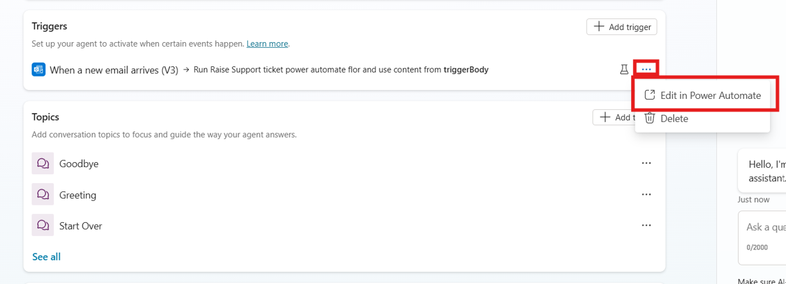

2.  En la barra superior, haga clic en el botón **Test**, luego
    seleccione **Manually** y, nuevamente, haga clic en **Test** para
    iniciar la prueba manual**.**

    

    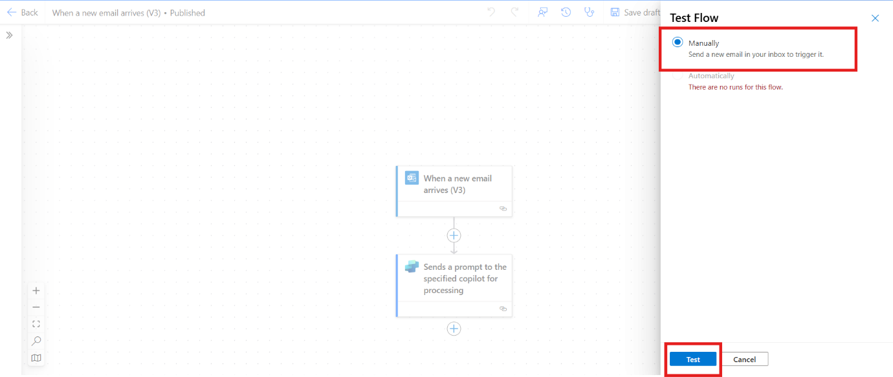

3.  **Envíe un correo electrónico** a la dirección de correo del
    administrador de 365 desde cualquier otro buzón para **desencadenar
    la acción**. El correo debe describir un problema e incluir sus
    datos, como el ID de empleado, similar al que aparece en la captura
    de pantalla a continuación:

    

    

4.  Vaya a la página de descripción general de copilot, desplácese hacia
    abajo y seleccione **Test trigger**.

    

5.  Haga clic en **Start testing**, iniciará las pruebas.

    

6.  En la sección de pruebas, haga clic en **Connect** para abrir la
    ventana de conexión.

    

7.  Vuelva a hacer clic en **Connect** y seleccione **Submit.**

    

    

8.  Navegue hasta la ventana de copilot studio y vuelva a ejecutar el
    programa **Test**.

    

9.  La solicitud de asistencia se genera automáticamente.

    

10. Acceda a Power Apps, vaya a la tabla de registro de incidencias de
    asistencia al empleado y verifique los detalles.

    

11. Verifique el correo de soporte que configuramos en el flujo de Power
    Automate para enviar un correo electrónico. El correo electrónico se
    envía automáticamente al equipo de soporte.

    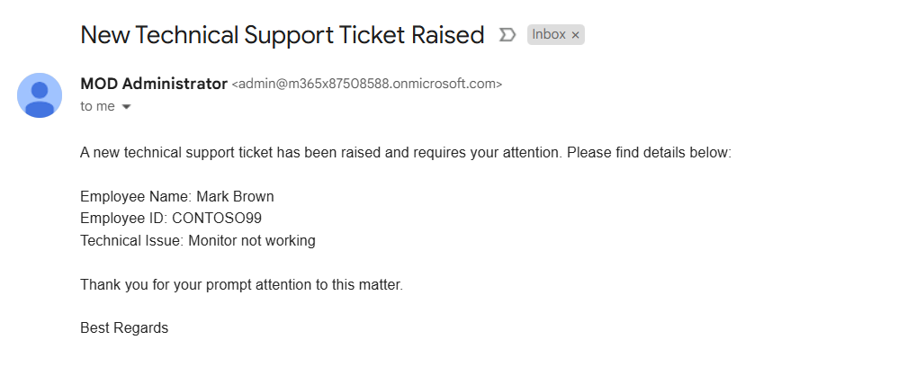

12. Vaya a la ventana de prueba y escriba la consulta como usuario
    **“Mark Brown Ticket Current Status”**. El estado de la incidencia
    aparece como **unresolved**.

    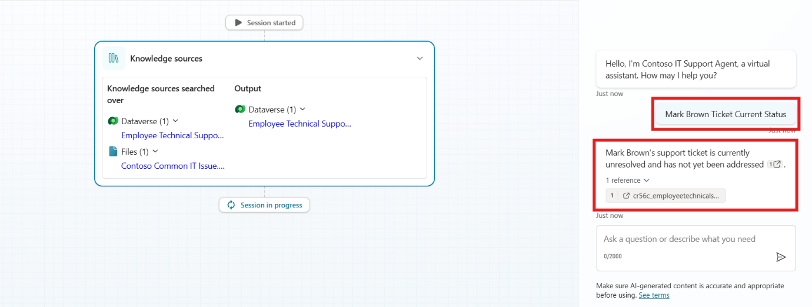

13. Como ingeniero de soporte, escriba un prompt en la sección de
    pruebas. “**I want to know about all Unresolved ticket**”.

    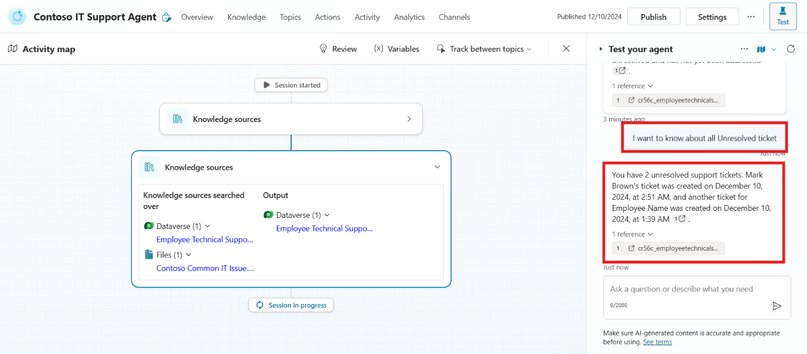

### Conclusión

A través de este ejercicio, los participantes adquirirán conocimientos
sobre:

- Cómo probar la funcionalidad del agente simulando escenarios reales.

- Pasos para validar los flujos de trabajo activados por correo
  electrónico y la generación de tickets en Power Automate.

- Cómo revisar los registros generados en Dataverse y garantizar el
  envío de notificaciones al equipo de soporte.

- Ideas prácticas para depurar y finalizar flujos de trabajo de
  automatización.

Conclusión final de la guía del Laboratorio

Esta guía del laboratorio brinda a los participantes una experiencia
práctica en la implementación de un agente Copilot Autónomo para el
servicio de soporte de IT de Contoso Solutions. Al seguir los ejercicios
paso a paso, los participantes pueden:

1.  **Configurar Copilot Studio**: Los participantes tienen la
    oportunidad de aprender a iniciar sesión en Copilot Studio, crear y
    configurar el agente de soporte de IT, y habilitar configuraciones
    esenciales como la inteligencia generativa y el orquestador para un
    diagnóstico efectivo y la automatización de tickets.

2.  **Navegar por Power Apps**: Los participantes adquieren
    conocimientos prácticos sobre cómo iniciar sesión en Power Apps,
    configurar una tabla en Dataverse e importar datos desde Excel para
    realizar un seguimiento y gestionar eficientemente los tickets de
    soporte.

3.  **Mejorar las capacidades del Bot**: Los ejercicios se centran en
    agregar una base de conocimientos al bot, personalizar los temas de
    inicio de conversación y los temas de respaldo para mejorar la
    interacción con el usuario, asegurándose de que el bot pueda manejar
    una amplia gama de escenarios de soporte de IT.

4.  **Automatizar tareas de soporte de IT**: Los participantes también
    aprenden a automatizar la creación de tickets de soporte mediante
    Power Automate, mejorando la capacidad del bot para gestionar
    problemas no resueltos y optimizar los flujos de trabajo del equipo
    de IT.

Al completar estos ejercicios, los participantes podrán implementar un
sistema de soporte autónomo sólido que mejora los tiempos de respuesta,
reduce la carga de trabajo manual y aumenta la productividad general de
las operaciones de soporte de IT. La integración de Copilot Studio,
Power Apps y Dataverse garantiza un flujo de información sin
interrupciones, automatiza las tareas rutinarias y optimiza los flujos
de trabajo de soporte, proporcionando soluciones inmediatas de
resolución de problemas a los empleados y gestión automatizada de
tickets para los problemas no resueltos.
