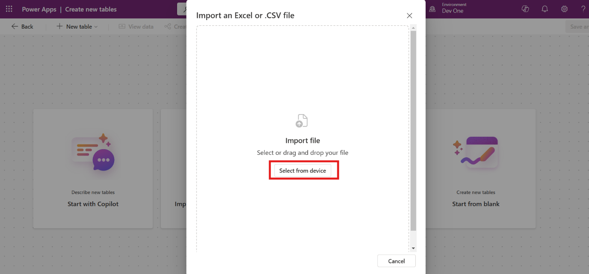

# Laboratório 2 – Simplificando as operações de suporte de TI com o Agente do Copilot Autônomo na Contoso Solutions

**Tempo estimado: 60 minutos**

## Objetivo

O objetivo deste laboratório é permitir que os participantes
simplifiquem as operações de suporte de TI na Contoso Solutions criando
um agente autônomo do Copilot. Os participantes aprenderão a configurar
o Microsoft Copilot Studio, configurar o Agente de Suporte de TI,
integrar o Power Apps e o Dataverse, aprimorar os recursos do bot com
uma base de dados de conhecimento e automatizar a criação de tíquetes
usando o Power Automate. Este laboratório prático equipará os usuários
com as habilidades para melhorar os fluxos de trabalho de TI, reduzir o
esforço manual e aumentar a eficiência do suporte.

## Solução

Os participantes criarão um Agente de Suporte de TI da Contoso
personalizado usando o Microsoft Copilot Studio. Eles configurarão um
ambiente de desenvolvimento, adicionarão fontes de conhecimento e
refinarão os fluxos de conversa do bot para uma melhor interação do
usuário. Ao aproveitar o Power Apps, os participantes criarão uma tabela
do Dataverse para gerenciar registros de suporte de TI. Usando o Power
Automate, eles automatizarão a criação de tíquetes e notificações por
e-mail para problemas não resolvidos. Por fim, os participantes testarão
o agente para validar sua precisão de solução de problemas e automação
do fluxo de trabalho, garantindo operações perfeitas de suporte de TI.

## Exercício 1: Introdução ao Power Apps

Este exercício apresenta aos participantes o Power Apps e o Dataverse. O
objetivo é fazer login no Power Apps, configurar um ambiente de trabalho
e criar uma tabela do Dataverse importando dados de um arquivo do Excel.
Os participantes aprenderão habilidades essenciais para trabalhar com
aplicativos orientados a dados.

### Tarefa 1: Fazendo login no Power Apps

1.  Navegue até
    +++https://www.microsoft.com/en-us/power-platform/products/power-apps+++
    do site do Power Apps e clique no botão **Try for free.**

    

2.  Insira o **Nome de usuário administrativo** da seção **Locatário do
    Office 365** da guia **Resources** no campo de e-mail e clique no
    botão **Start free.**

    

3.  Insira dados em **Country or Region, Business phone number**, marque
    as caixas de seleção e clique em **Get Started**.

    

4.  Confirme os detalhes da conta e clique em **Get Started**.

    

5.  Na guia **Stay signed in**, selecione **Yes**.

    

### Tarefa 2: Configurando uma tabela do Dataverse

1.  Na página inicial do Power Apps, na parte superior direita,
    selecione o **environment**. No nosso caso, é o **Dev One**, o
    participante pode escolher seu próprio ambiente.

    

2.  Na barra de navegação esquerda, selecione **Tables.** Na barra
    superior da seção de tabelas, clique em **+ New table** e selecione
    **Create new tables**.

    

3.  Selecione a opção **Import an Excel file or .CSV** para criar uma
    nova tabela.

    

4.  Clique na opção **Select form device** e selecione o arquivo
    **Support Ticket** da **pasta C:**\\**LabFiles** .

    

5.  Selecione a tabela e clique em **View data** para ver a tabela.

    **Observação:** no meu caso, a tabela é chamada de *Employee Technical
Support Record*. O nome pode variar a cada execução. Salve o nome da
tabela para referência futura.

    

6.  Vá para os dados da tabela, selecione o menu suspenso ao lado do
    campo **Technical Issue Description**, selecione **Edit column**,
    defina o tipo de dados como **Text,** **Multiple lines of text**,
    **Plain Text** e clique em **Update**. O nome da coluna pode ser
    diferente em cada caso.

    **Observação:** o nome da coluna pode ser um pouco diferente, mas será
algo semelhante à descrição do problema, pois é gerado pelo Copilot.

    

    

7.  Selecione a lista suspensa ao lado do campo **Current Status**,
    selecione **Edit column**, defina a opção como **Unresolved,
    Resolved, Processing**. Defina as opções padrão como **Unresolved**
    e clique em **Update**.

    

8.  No canto superior direito, clique em **Salve and exit** para salvar
    a tabela.

    

### Conclusão

Ao concluir este exercício, os participantes aprenderam:

- como acessar e navegar no Power Apps usando credenciais;

- as etapas para criar e configurar uma tabela do Dataverse importando
  dados;

- tiveram conhecimento prático de configuração de um ambiente para dar
  suporte a fluxos de trabalho de desenvolvimento de aplicativos.

## Exercício 2: Criando o agente de suporte de TI da Contoso

Este exercício se concentra em fazer login no Microsoft Copilot Studio e
criar um agente Copilot personalizado para operações de suporte de TI na
Contoso. Os participantes ganharão experiência prática navegando no
Copilot Studio, configurando ambientes e criando um agente com
inteligência artificial para simplificar os fluxos de trabalho de TI.

### Tarefa 1: Fazendo login no Microsoft Copilot Studio

1.  Navegue até o site do Copilot Studio
    +++https://www.microsoft.com/en-us/microsoft-copilot/microsoft-copilot-studio+++
    e clique em **Try free.**

    

2.  Insira o **Nome de usuário administrativo** da seção **Locatário do
    Office 365** da guia **Resources** no campo de e-mail e clique no
    botão **Start free**.

    **Observação:** para este laboratório, estamos usando credenciais de
locatário de administrador, o participante pode usar sua ID corporativa
ou de estudante para iniciar a avaliação gratuita.

    

    

3.  Insira o **Country or Region** e o **Business phone number** nos
    campos respeitados. Marque a caixa de seleção e clique no botão
    **Get Started**.

    

4.  Na seção de confirmação, clique novamente no botão **Get Started**.

    

5.  Selecione **Get Started** na tela de boas-vindas do Copilot Studio.

    

###  Tarefa 2: Criando e configurando o Agente de Suporte de TI da Contoso 

1.  Na seção inicial do Copilot Studio no canto superior direito,
    selecione o **environment** e escolha o ambiente **Dev One**.

    

2.  Na guia **Welcome to Copilot Studio**, clique em **Skip** para
    avançar.

    

3.  Na barra de navegação esquerda, selecione **Create** e, em seguida,
    selecione **New agent** para começar a criar um novo agente.

    

4.  No canto superior direito, clique no botão **Skip to configure**.

    

5.  Digite o **Name, Description** e **Instruction** do agente, conforme
    indicado abaixo, e clique no botão **Create**.

    Name: +++Contoso IT Support Agent+++

    **Description:** +++Create a Contoso IT Support Agent which transforms IT support at Contoso Solutions by providing instant troubleshooting for common issues, automating ticket creation for unresolved problems, and storing all interactions in Dataverse. This solution enhances response times, reduces manual workloads, and boosts employee productivity.+++

    **Instruction:** +++Create the Copilot Agent and configure it to handle IT support operations. Add a knowledge source containing solutions for common IT issues like hardware troubleshooting, connectivity, and software glitches. Set up a trigger to detect incoming emails from employees describing unresolved issues. Create an action to save these technical issues into a Dataverse table, ensuring all details are stored for tracking and reporting. Test the agent to validate its troubleshooting accuracy and ticket automation workflow before deployment.+++

    

6.  Na página de visão geral do Contoso IT Support Agent, **Enable** o
    orquestrador para o agente.

    

7.  Na página de visão geral do agente, **Disable** a opção "**Allow the
    AI to use its own general knowledge.**"

    

8.  No canto superior direito do agente, clique no botão **Settings**.

    

9.  Em seguida, vá para a seção **Generative AI**, selecione
    **Generative (Preview)**, defina a moderação de conteúdo como
    **Medium** e clique em **Save** para salvar a configuração.

    

###  Conclusão

Ao concluir este exercício, os participantes aprenderam:

- como acessar e configurar o Microsoft Copilot Studio;

- as etapas para criar e configurar um agente Copilot personalizado;

- habilidades práticas para habilitar configurações de Generative AI e
  orquestrador para o agente;

- maneiras de aprimorar as operações de TI automatizando a criação de
  tíquetes e como aproveitar a AI para solução de problemas.

## Exercício 3: Aprimorando os recursos do bot

Este exercício se concentra em aprimorar os recursos do Agente de
Suporte de TI da Contoso adicionando uma base de dados de conhecimento e
personalizando tópicos de bot para melhorar a interação. Os
participantes refinarão as respostas do bot e garantirão que ele ajude
efetivamente os usuários na solução de problemas e no escalonamento.

### Tarefa 1: Adicionar base de dados de conhecimento 

1.  Na página de visão geral do agente da Contoso, role para baixo e
    clique no botão **+ Add Knowledge**.

    

2.  Selecione o botão **Click to browse** para adicionar o arquivo de
    laboratório **Contoso Common IT Issue.docx** da pasta
    **C:\LabFiles** e clique em **Add** para salvar o arquivo.

    

    

3.  Novamente, vá para a página de visão geral do agente, role para
    baixo e clique em **+ Add knowledge.**

    

4.  Selecione a opção **Dataverse (preview)** como fonte de dados.

    

5.  Na barra de pesquisa do canto superior direito, digite e pesquise
    **Employee** e selecione a tabela **Employee Technical Support
    Record**. Em seguida, clique no botão **Next, Next** e **Add** para
    adicionar a fonte de conhecimento.

    **Observação:** o nome da tabela pode ser diferente no seu caso, pois é
gerada pelo Copilot.

    

    

### Tarefa 2: Personalizar o tópico de início de conversa

1.  Na opção da barra superior, clique em **Topics** e, em seguida,
    clique e abra o tópico **Conversation Start**.

    

2.  Role para baixo e vá para o nódulo da mensagem. Atualize a mensagem
    com o nome do bot, conforme indicado abaixo:

    Hello. I’m Bot Name, a virtual assistant. How can I help you?

    

3.  Na parte superior direita, clique em **Salve** para salvar o tópico.

    

###  Tarefa 3: Atualizar o tópico de fallback 

1.  Na opção da barra superior, clique em **Topics** e, em seguida,
    clique e abra o tópico **Fallback**.

    

2.  Role para baixo e vá para o nódulo da mensagem. Atualize a mensagem
    conforme abaixo:

    I’m sorry. This information is not available in my system. You can raise
the support ticket via mail for this issue.

    

3.  No canto superior direito, clique no botão **Salve** para salvar o
    tópico.

    

###  Conclusão

Ao concluir este exercício, os participantes aprenderam:

- como carregar e integrar uma base de dados de conhecimento para
  aprimorar a funcionalidade do bot;

- as etapas para personalizar as mensagens de início de conversa para
  uma experiência de usuário mais envolvente;

- técnicas para atualizar as respostas de fallback para melhor
  tratamento de consultas sem suporte.

## Exercício 4: Testar o agente

Este exercício orienta os participantes no teste do Agente de Suporte de
TI da Contoso para validar sua funcionalidade. Os participantes
verificarão como o bot lida com prompts usando a base de dados de
conhecimento e os tópicos de fallback para garantir interação e
escalonamento contínuos.

1.  No canto superior direito, clique no botão **Test**. Em seguida, na
    seção de teste, clique em **Map**, selecione **On** e clique em
    **Refresh**.

    

2.  Digite o prompt "**My printer is not working how to fix it."** Ele
    fornece a solução de acordo com a fonte de conhecimento.

    

3.  Novamente, dê o prompt **" Two factor Authentication (2FA) issue".**

    

4.  O problema e a solução de 2FA não estão disponíveis na fonte de
    conhecimento, portanto, ele irá para o tópico de fallback e
    retornará o prompt relacionado ao **Raise Ticket**.

    

**Observação:** os dados de 2FA não estão disponíveis na base de
conhecimento, portanto, geralmente eles retornam o tópico de fallback.
Mas às vezes o Copilot usa as informações da base de conhecimento e
tenta dar a resposta.

### Conclusão

Ao concluir este exercício, os participantes aprenderam:

- como testar e ativar um agente de AI para solução de problemas;

- a validar a capacidade de resposta do bot usando sua base de
  conhecimento;

- como os tópicos de fallback lidam com consultas sem suporte e
  redirecionam os usuários de forma eficaz.

## Exercício 5: Automatizando a criação de tíquetes de suporte com o Power Automate

Este exercício demonstra como automatizar a criação de tíquetes de
suporte usando o Power Automate e como integrá-lo ao Agente de Suporte
de TI da Contoso. Os participantes criarão um fluxo para simplificar os
relatórios de problemas, registrar dados no Dataverse e notificar os
engenheiros de suporte por e-mail.

1.  Vá para a página de visão geral do agente, role para baixo e clique
    em **+ Add action**.

    

2.  Na janela **+ Add action**, clique em **+ New action** e selecione
    **New Power Automate flow**, a janela de fluxo do Power Automate
    será aberta.

    

3.  No fluxo do Power Automate, clique em **Run a flow from Copilot** e
    selecione **+Add an input**.

    

4.  Selecione **Text** como tipo de dados de entrada e renomeie a
    entrada como **Name**.

    

    

5.  Com o mesmo procedimento, crie mais entradas de acordo com os
    detalhes abaixo.

    |  **Nome de entrada**  | **Tipo de dado**   |
    |:----|:-----|
    | ID   |  Texto  |
    | Email   | Texto   |
    | Details   |   Texto |

    

6.  Abaixo de Executar um fluxo do copiloto, clique no sinal **(+)** e
    selecione **Add an action**.

   

7.  Na barra de pesquisa de **Add an action**, insira **Add a new row.**
    Em seguida, selecione **Add a new row** na seção do Microsoft
    Dataverse.

    

    Observação: às vezes, a conexão do Dataverse não é criada automaticamente, portanto, o participante precisa **sign in** com sua credencial, a autenticação deve ser **OAuth.**

    

8.  Na seção **Table Name**, pesquise e selecione **Employee Technical
    Support Record** (ou o nome da tabela correspondente criada).

    

9.  Abaixo do nome da tabela, selecione **Show all**, clique no campo
    específico e adicione entrada com a ajuda do botão de conteúdo
    dinâmico (raio de trovão) conforme o campo fornecido abaixo. O campo
    **Current Status** deve ser selecionado com o menu suspenso como
    **Unresolved**.

    | **Seção**   | **Variável de entrada**   |
    |:--------|:--------|
    |  Email Address  |  E-mail (entrada dinâmica)  |
    |  Employee ID  |  ID (entrada dinâmica)  |
    | Employee Name   | Nome (Entrada Dinâmica)   |
    |  Technical Issue Description  |  Detalhes (Entrada Dinâmica)  |
    
    

    

10. Abaixo de **Add a new row**, clique em (**+**) e selecione **Add an
    action**.

    

11. Na seção **Add an action**, digite **Send an email** na barra de
    pesquisa e selecione **Send an email (V2)** na seção **Office 365
    Outlook** e **Sign in** se solicitado.

    

12. Na seção enviar um e-mail, insira os detalhes abaixo na seção
    respeitada:

    |  To  |  Insira o e-mail do engenheiro de suporte (Use qualquer ID de e-mail - será para este id, o e-mail será enviado pelo agente para quando o tíquete de suporte for levantado)  |
    |  Subject  |  New Technical Support Ticket Raised  |
    |   Body |  A new technical support ticket has been raised and requires your attention. Please find details below:

Employee Name: Nome (Substituir por Variável de conteúdo dinâmico Nome (Thunder bolt))
Employee ID: ID (Substituir pela variável de conteúdo dinâmico ID (Thunder bolt))
Technical Issue: Detalhes (Substituir pela variável de conteúdo dinâmico Detalhes (raio de trovão))

Thank you for your prompt attention to this matter.

Best Regards
  |    

    

13. No canto superior esquerdo, renomeie o fluxo como **Employee Data.**

    

14. Na barra superior, clique em **Save draft** e clique em **Publish**.

    

15. Volte para a janela do Copilot e clique no botão **Refresh**.

    

16. Na janela **Add action**, selecione **Employee Data Flow.**.

    

17. Clique em **Add action** para avançar.

    

18. Navegue até a seção **Actions** e clique em **Employee Data**.

    

19. Depois de abrir o fluxo de dados do funcionário, clique na seção
    **Inputs**.

    

20. Insira a descrição fornecida no campo de entrada respectivo, após
    inserir a descrição, clique no botão **Salve**.

    |  **Name** -- Descrição  | Insira o nome do funcionário.    |
    | **ID** -- Descrição   |  Insira a ID do funcionário no campo.  |
    |  **Email** -- Descrição  |  Insira o endereço de e-mail do funcionário de quem o e-mail é recebido.  |
    |  **Details** -- Descrição  |  Insira os detalhes de e-mail do funcionário   |

    

    

### Conclusão

Ao concluir este exercício, os participantes aprenderam:

- como integrar fluxos do Power Automate a um agente do Copilot para
  criação de tíquetes;

- as etapas para coletar e mapear dados de entrada dinamicamente a
  partir de interações do usuário;

- técnicas para automatizar notificações por e-mail para escalonamento
  de problemas técnicos;

- a capacidade de configurar fluxos de trabalho para gerenciamento
  eficiente de tíquetes de suporte.

## Exercício 6: Configurando um gatilho baseado em email para ações automatizadas

Essa continuação da automação da criação de tíquetes de suporte se
concentra na configuração de um gatilho no Agente de Suporte de TI da
Contoso para vincular entradas de e-mail ao fluxo automatizado do Power
Automate. Os participantes configurarão gatilhos e finalizarão o agente
para implantação.

1.  Vá para a página de visão geral do agente, role para baixo e clique
    em **+ Add trigger**.

    

2.  Em seguida, na janela **Add trigger**, selecione o gatilho **When a
    new email arrives (V3)**.

    

3.  Após a conexão bem-sucedida do copiloto e do Outlook e a marca verde
    aparecer, clique no botão **Next**.

    

4.  No campo de pasta, selecione o ícone de pasta e selecione **Inbox**
    e, em seguida, selecione **Create trigger.**

    

    

5.  Clique em **Close** no prompt **Time to test your trigger!** Na
    página de visão geral do agente de suporte, role para baixo, na
    seção de **Triggers**, clique nos três pontos **(...)** e selecione
    **Edit in Power Automate.**

    

    

6.  Clique com o botão direito do mouse no gatilho **When a new email
    arrives** **(V3)** e selecione **Delete**.

    

7.  Em seguida, clique em **Add a trigger**, pesquise **When new email
    arrives** e selecione **When a new email arrives (V3)** na seção
    **Office 365 Outlook**.

    

8.  Clique em **Sends a prompt to the specified copilot for
    processing**, na seção corpo/mensagem, insira o prompt, **Run
    Employee Data flow and use content from Body From.** Substitua "
    **Body** " e "**From**" como variável de conteúdo dinâmico (opção
    raio de trovão).

    

9.  Clique em **Save** **draft** e **Publish**, feche o Power Automate e
    volte para a janela do Copilot.

    

10. Vá para a seção de visão geral e, no canto superior direito, clique
    em **Publish** e clique novamente em **Publish** para publicar o
    Copilot.

    

    

### Conclusão

Ao concluir este exercício, os participantes aprenderam:

- como configurar gatilhos no Copilot para automatizar fluxos de
  trabalho com base em entradas de e-mail;

- as etapas para mapear dinamicamente o conteúdo do e-mail para fluxos
  do Power Automate;

- o processo de publicação e finalização do agente de AI para uso
  operacional;

- habilidades práticas para vincular ferramentas de comunicação como o
  Outlook a fluxos de trabalho automatizados.

## Exercício 7: Testar o agente

Este exercício se concentra em testar a integração do Agente de Suporte
de TI da Contoso com o Power Automate e o Outlook. Os participantes
verificarão a capacidade do agente de processar e-mails, criar tíquetes
de suporte e acionar fluxos de trabalho automatizados de forma eficaz.

1.  Vá para a página de visão geral do agente, role para baixo, clique
    em **(...)** em **Triggers** e selecione **Edit in Power Automate**.

    

2.  Ele navegará até o fluxo do Power Automate, na barra superior,
    clique no botão **Test** e selecione **Manually** e clique novamente
    em **Test**.

    

    

3.  **Envie um email** para a ID de e-mail do administrador do locatário
    365 de qualquer outra caixa de e-mail para **disparar** **o
    gatilho**. O e-mail deve descrever um problema e deve conter seus
    detalhes, como ID do funcionário, semelhante ao da captura de tela
    abaixo:

    

    

4.  Navegue até a página de visão geral do agente do Copilot, role para
    baixo e selecione **Test trigger**.

    

5.  Clique em **Start testing**, ele começará a testar.

    

6.  Na seção de teste, clique em **Connect**, ele abrirá a janela de
    conexão.

    

7.  Clique em **Connect** novamente e clique em **Submit.**

    

    

8.  Navegue até a janela do Copilot Studio e execute o **teste**
    novamente.

    

9.  A solicitação de suporte é gerada automaticamente.

    

10. Navegue até o Power Apps e vá para a tabela Employee Technical
    Support Ticket Record e verifique os detalhes.

    

11. Verifique o e-mail de suporte que configuramos no fluxo do Power
    Automate para enviar um e-mail. O e-mail é enviado automaticamente
    para a equipe de suporte.

    

12. Vá para a janela de teste e consulta do gravador como usuário
    **"Mark Brown Ticket Current Status".** Ele fornece o status do
    problema como **unresolved**.

    

13. Como engenheiro de suporte, escreva um prompt na seção de teste. "
    **I want to know about all Unresolved ticket**".

    

### Conclusão

Ao concluir este exercício, os participantes aprenderam:

- como testar a funcionalidade do agente simulando cenários do mundo
  real;

- as etapas para validar fluxos de trabalho disparados por e-mail e
  geração de tíquetes no Power Automate;

- como revisar os registros gerados no Dataverse e garantir que as
  notificações sejam enviadas para a equipe de suporte;

- os insights práticos sobre debugging e finalização de fluxos de
  trabalho de automação.

## Conclusão Final do Guia do Laboratório

Este guia de laboratório forneceu aos participantes uma experiência
prática na implantação de um Agente Copilot Autônomo para a central de
serviços de suporte de TI da Contoso Solutions. Seguindo os exercícios
passo a passo, os participantes foram capazes de:

1.  **Configurar o Copilot Studio**: os participantes aprenderam como
    fazer login no Copilot Studio, criar e configurar o agente de
    suporte de TI e habilitar configurações essenciais, como Generative
    AI e orquestrador, para solução de problemas eficaz e automação de
    tíquetes.

2.  **Navegar no Power Apps**: os participantes adquiriram conhecimento
    prático ao fazer login no Power Apps, configurar uma tabela do
    Dataverse e importar dados do Excel para rastrear e gerenciar
    tíquetes de suporte com eficiência.

3.  **Aprimorar os recursos do bot**: os exercícios se concentraram em
    adicionar uma base de dados de conhecimento ao bot, personalizar os
    tópicos de início e fallback da conversa para melhorar a interação
    do usuário e garantir que o bot pudesse lidar com uma ampla
    variedade de cenários de suporte de TI.

4.  **Automatizar as tarefas de suporte de TI**: os participantes também
    aprenderam a automatizar a criação de tíquetes de suporte usando o
    Power Automate, aprimorando a capacidade do bot de gerenciar
    problemas não resolvidos e melhorar os fluxos de trabalho da equipe
    de TI.

Ao concluir esses exercícios, os participantes foram capazes de
implementar um sistema de suporte autônomo robusto que melhora os tempos
de resposta, reduz a carga de trabalho manual e aumenta a produtividade
geral das operações de suporte de TI. A integração do Copilot Studio,
Power Apps e Dataverse garante um fluxo contínuo de informações,
automatiza tarefas rotineiras e otimiza os fluxos de trabalho de
suporte, fornecendo soluções imediatas a problemas de funcionários e
gerenciamento automatizado de tíquetes para problemas não resolvidos.
