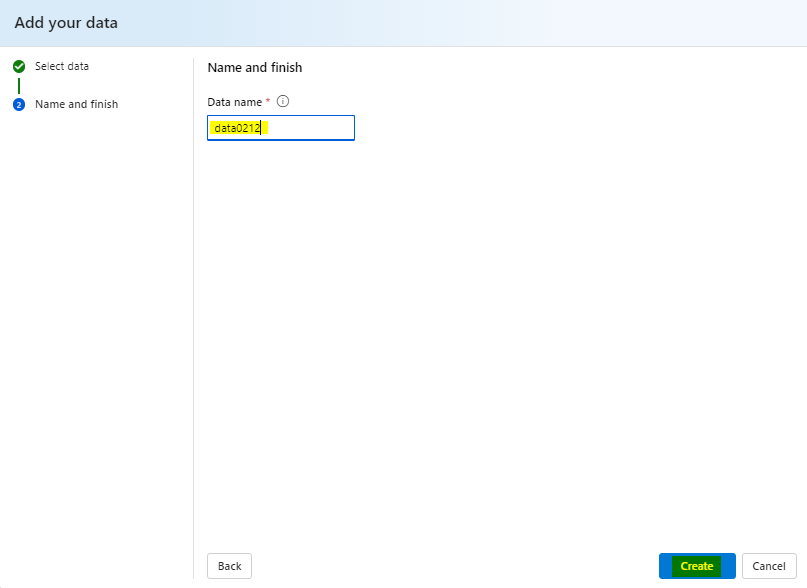
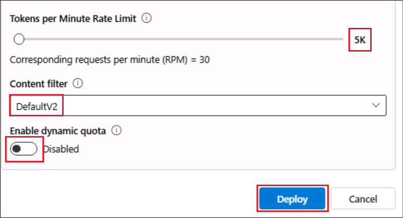
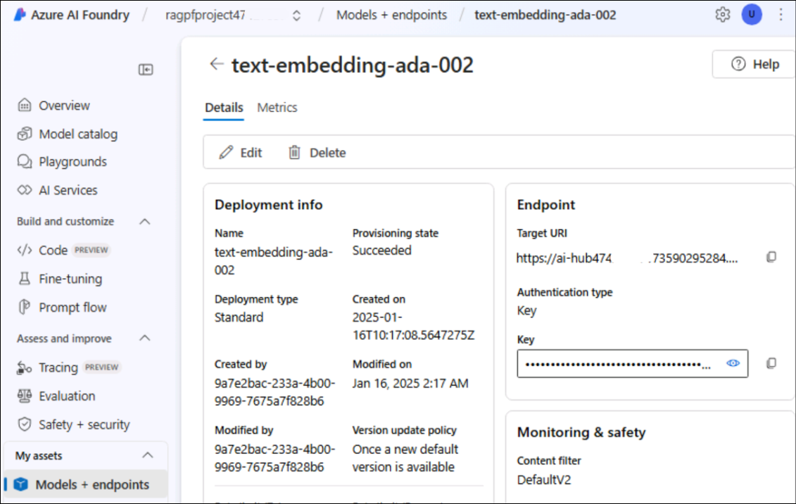
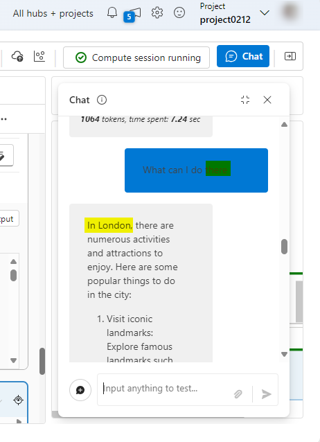
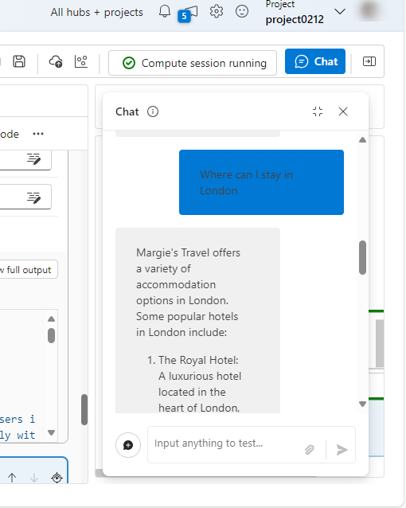

# 실습 3 - Azure AI Foundry와 검색 통합(search integration)을 활용한 맞춤형 AI 에이전트 생성

**예상 소요 시간: 45분**

**목표**

이 실습의 목표는 Azure AI 서비스와 검색 통합(Search integration) 기능을
활용해 AI 기반의 에이전트를 구축하는 방법을 안내하는 것입니다.
RAG(Retrieval-Augmented Generation)은 사용자 지정 데이터 소스를 검색해
generative AI 모델의 프롬프트에 통합하는 기술로, 챗봇과 같은 generative
AI 애플리케이션 개발에 널리 사용되는 방식입니다. 참가자들은 Azure AI
Foundry 포털을 사용해 맞춤형 데이터를 generative AI 프롬프트 흐름에
통합하는 방법을 배우게 될 것입니다.

솔루션

이 실습에서는 Azure AI 서비스와 고급 검색 기능을 통합하여 강력하고
지능적인 솔루션을 생성하는 데 중점을 둡니다. AI 기반 에이전트 구성,
데이터 검색의 자동화 맥락에 맞는 응답 제공을 가종합니다. AI와 검색
통합을 통해 워크플로우를 간소화하고,

의사결정을 개선하며, 사용자와의 상호작용을 직관적이고 효율적으로
향상시킬 수 있습니다.

## 작업 0: 호스트 환경 시간 동기화

1.  Lab 인터페이스의 Home 탭에 제공된 자격 증명로 Lab Virtual Machine에
    로그인하세요. 

2.  VM의 **Windows Search bar**에서 +++**Settings**+++을 검색한 후
    선택하세요.

     

3.  설정 창에서 **Time & language** 탐색한 후 클릭하세요.

     

4.  **Time & language** 페이지에서 **Date & time**을 탐색한 후
    클릭하세요. 

     

5.  아래로 스크롤하여 **Additional settings** 섹션으로 이동한 후, **Sync
    now** 버튼을 클릭하세요.  

     

6.  **Settings** 창을 닫으세요.  

     

## 작업 1: VM 및 자격 증명 이해

이번 작업에서는 실습 동안 사용할 자격 증명을 식별하고 이해하는 과정을
진행하게 될 것입니다.

1.  **Instructions** 탭에는 실습 동안 따라야 할 지침이 포함된 실습
    가이드가 있습니다.

2.  **Resources** 탭에는 실습을 실행하는 데 필요한 자격 증명이 있습니다.

    - **URL** – Azure Portal에 대한 URL

    - **Subscription** – 사용자에게 할당된 **subscription ID**

    - **Username** – **Azure services**에 **login**할 때 사용할 **user
      ID**.

    - **Password** – **Azure login password**.

이 자격 증명을 **Azure login credentials**라고 합니다. **Azure login
credentials**이 필요한 곳에서는 이 자격 증명을 사용합니다.

- **Resource Group** – 사용자에게 할당된 **Resource group**.
>[!Alert] **중요 사항**: 모든 리소스를 이 리소스 그룹에서 생성해야
합니다.

    

3.  **Help** 탭에는 지원 정보가 포함되어 있습니다. 여기서의 **ID** 값은
    실습 실행 중에 사용될 **Lab Instance ID**입니다.

    

## 작업 2: Azure AI Search 리소스 만들기

1.  웹 브라우져에서
    +++[https://portal.azure.com+++](https://portal.azure.com+++/) 로
    Azure Portal을 열고 **Azure login credentials** 사용해
    **login**하세요.

    

2.  홈 페이지에서 **+ Create a resource** 선택하세요.

    

3.   검색 차에서 +++**Azure AI Search**+++를 검색하여 선택하세요.

    

4.  **Create** 옆에 있는 드롭다운 메뉴를 선택하고 **Azure AI Search**
    선택하세요.

    

5.  Create a search service 페이지에서 다음 정보를 입력하고 **Review +
    create** 클릭하세요.

    - **Subscription**: 드롭다운에서 Azure 구독 서비스 선택

    - **Resource group**: 구독에 할당된 리소스 그룹(ResourceGroup1) 선택

    - **Service name**: **+++aisearch@lab.LabInstance.Id+++**

    - **Location**:  **Canada East** 지역 선택

    - **Pricing tier**: 표준

    

6.  설정을 검토한 후, **Create**를 클릭하세요.

    

7.  Azure AI Search 리소스 배포가 완료될 때까지 기다립니다.

    

>[!Note] **참고:** 이후에 Azure AI Search 리소스와 동일한 지역에 Azure
AI Hub(Azure OpenAI 서비스 포함)를 생성할 예정입니다. Azure OpenAI
리소스는 지역 할당량에 의해 테넌트 수준에서 제한됩니다. 나열된 지역은 이
실습에서 사용되는 모델 유형에 대한 기본 할당량을 포함하고 있습니다.
지역을 임의로 선택하면 다른 사용자와 테넌트를 공유하는 시나리오에서 단일
지역이 할당량 한도에 도달할 위험을 줄일 수 있습니다. 실습 후반에 할당량
한도에 도달하는 경우, 다른 지역에 또 다른 Azure AI Hub를 생성해야 할 수
있습니다.

## 작업 3: Azure AI 프로젝트 생성

1.  웹 브라우저에서
    +++https://ai.azure.com+++  **Azure AI
    Foundry portal** 을 열고 **Azure login credentials**을 사용해 **sign
    in**하세요.

    

2.  **Close** the **Help** 탭을 **Close**하고 **Streamlined from the
    start** 팝업 창에서 **Got it**을 선택하세요.

3.  홈페이지에서 **+ Create project** 선택하세요.

    

4.  **Create a project** 마법사에서 프로젝트명을 **+++ragpfproject@lab.LabInstance.Id+++**로 입력하고
    **Customize**를 클릭하세요.

    

5.  **Customize**에서 Azure AI Search 리소스에 연결하고 다음 정보를
    입력하세요. **Next**를 선택하고 구성 설정을 검토하세요.

    - **Hub name**: **+++hub@lab.LabInstance.Id+++**

    - **Azure Subscription**: **assigned Azure subscription**
      선택하세요.

    - **Resource group**: **assigned Resource Group** 선택하세요(여기서
      자동으로 채워지는 새로운 것이 아니라 **Resources** 탭에서 제공되는
      것을 선택해야 함)

    - **Location**: **Azure AI Search resource**와 동일한 **location**인
      **Canada East**를 선택하세요.

    - **Connect Azure AI Services or Azure OpenAI**: (새로 생성된)
      자동으로 허브 이름이 채워집니다.

    - **Connect Azure AI Search**:  Azure AI Search
      리소스 **+++aisearch@lab.LabInstance.Id+++**를 선택하세요.

    

6.  세부 정보를 검토한 후 **Create**를 클릭하고 프로세스가 완료될 때까지
    기다리세요.

    

7.  Explore and experiment 팝업 창을 **close**하세요.

    

8.  생성된 프로젝트 페이지로 이동하게 됩니다.

    

## 작업 3: 모델 배포

솔루션을 구현하기 위해 두 가지 모델이 필요합니다:

- 효율적인 인덱싱 및 처리를 위해 텍스트 데이터를 벡터화하는 임베딩 모델

- 데이터를 기반으로 질문에 대한 자연어 응답을 생성할 수 있는 모델

1.  왼쪽 창의 **My assets**에서**Models + endpoints**를 선택하세요.

    

2.  **Manage deployments of your models and services page**에서
    **+Deploy model** 클릭하고 **Deploy base model** 선택하세요.

    

3.  **Select a model** 페이지에서
    +++**text-embedding-ada-002**+++ 검색하고 선택하세요. **Confirm**
    클릭하세요.

    

4.  **Deploy model text-embedding-ada-002** 창에서 **Customize**을
    클릭하고 Deploy model 마법사에 다음 정보를 입력하세요:

    

    - **Deployment name**: text-embedding-ada-002
    
    - **Deployment type**: 표준
    
    - **Model version**: 기본 버전 선택
    
    - **AI resource**: 이전에 생성한 리소스를 선택하면 목록에 나타남
    
    - **Tokens per Minute Rate Limit (thousands)**: 5K
    
    - **Content filter**: DefaultV2
    
    - **Enable dynamic quota**: 비활성화
    
    
    
    
    
    

5.  이전 단계를 반복하여 **gpt-35-turbo-16k** 모델을 배포하고 배포
    이름을 gpt-35-turbo-16k로 설정하세요.

    

6.  이제 두 가지 배포가 준비되었습니다.

    

>[!Note] **참고**: Tokens Per Minute(TPM) 값을 줄이면 사용 중인 구독의
할당량을 초과하는 것을 방지할 수 있습니다. 이 실습에 사용되는 데이터에는
5,000 TPM이 충분합니다.

## 작업 4: 프로젝트에 데이터 추가

Copilot의 데이터는 가상의 여행사 Margie's Travel*에서 제공하는 PDF
형식의 여행 브로셔 세트로 구성됩니다*. 프로젝트에 추가해 보겠습니다.

1.  왼쪽 창의 **My assets**에서 **Data + indexes**를 선택하세요. **+ New
    data**를 선택하세요.

    

2.  **Add your data** 마법사의 드롭다운 메뉴에서 **Upload
    files/folders** 선택하세요.

    

3.  **Upload folder** 선택하고**C:\LabFiles**에서**brochures** 폴더를
    선택한 후**Upload** 클릭하세요.

    

    

4.  폴더가 업로드될 때까지 기다리고, 해당 폴더에 여러 개의 .pdf 파일이
    포함되어 있는지 확인하세요. 모든 파일이 업로드되면 **Next**
    선택하세요.

    

5.  다음 페이지에서 name 및
    finish에 **+++data@lab.LabInstance.Id+++**를 데이터 이름으로
    입력하고**Create** 클릭하세요.

    

    

## 작업 5: 데이터에 대한 인덱스 생성

이제 프로젝트에 데이터 소스를 추가했으므로 이를 사용하여 Azure AI Search
리소스에서 인덱스를 만들 수 있습니다.

1.  **Data + indexes** 페이지에서 **Indexes** 탭을 선택하세요.

    

2.  **Indexes** 탭에서 **+ New index** 선택하여 새 인덱스를 추가하세요.

    

3.  아래 정보를 입력하고 **Next** 클릭하세요.

    - **Data source** - **Data in Azure AI Foundry** 선택

나열된 **data source** 선택하고 **next** 클릭하세요.

    

4.  Create a vector index – Index configuration 페이지에서 아래의 정보를
    입력하고 **Next**를 클릭하세요.

    - **Select Azure AI Search service**:  **AzureAISearch** 선택

    - Vector index - +++**brochures-index**+++

    - **Virtual machine**: **Auto select** 선택

    

5.  Create a vector index – Search 설정 페이지에서,

**Vector settings** - **Add vector search to this search resource** 선택

기타 기본값을 그대로 두고 **Next** 선택하세요.

    

6.  **Review and finish** 페이지에서 세부 정보를 검토하고 **Create
    vector index**를 선택하세요.

    

7.  인덱싱 프로세스가 완료될 때까지 기다리세요. 이 과정은 몇 분이 걸릴
    수 있습니다. 인덱스 생성 작업에는 다음과 같은 작업이 포함됩니다:

    - 브로셔 데이터의 텍스트 토큰을 분해, 청크화 및 임베딩

    - Azure AI Search 인덱스 생성

    - 인덱스 자산 등록

    

    

## 작업 6: 인덱스 테스트하기

RAG 기반 프롬프트 플로우에서 인덱스를 사용하기 전에, 이를 통해
generative AI의 응답에 영향을 미칠 수 있는지 확인해봅시다.

1.  왼쪽 창에서 **Playgrounds**를 선택하고 **Try the Chat Playground**를
    선택하세요.

    

2.  **Show setup** 이 기본적으로 표시되지 않는 경우 클릭하세요.

    

3.  **gpt-35-turbo-16k** 모델 배포가 선택되어 있는지 확인하세요. 그런
    다음, 주요 채팅 세션 패널에서 프롬프트 +++**Where can I stay in New
    York?**+++ 을 제출하세요.

    

    

4.  응답을 검토하세요. 응답은 모델에서 제공하는 일반적인 답변이어야
    하며, 인덱스의 데이터는 포함되지 않습니다.

5.  설정 창에서 **Add your data** 필드를 확장하고, **brochures-index**
    프로젝트 인덱스를 선택한 후 **hybrid (vector + keyword)** 검색
    유형을 선택하세요.

    

>[!Note] **참고:** 일부 사용자는 새로 생성된 인덱스가 즉시 사용
불가능할 수 있습니다. 브라우저를 새로 고침하면 보통 해결되지만, 여전히
인덱스를 찾을 수 없는 문제가 발생하는 경우, 인덱스가 인식될 때까지
기다려야 할 수도 있습니다.

6.  데이터 소스를 추가하면 새로운 세션이 시작됩니다. 세션이 완료되면
    +++**Where can I stay in New York?**+++ 라는 프롬프트를 다시
    제출하세요.

    

7.  응답을 검토하고, 이제 응답이 인덱스의 데이터를 기반으로 제공된다는
    점을 확인하세요.

    

## 작업 7: 프롬프트 플로우에서 인덱스 사용

벡터 인덱스는 Azure AI Foundry 프로젝트에 저장되어 있어 프롬프트
플로우에서 쉽게 사용할 수 있습니다.

1.  왼쪽 탐색 창에서 **Build and customize** 아래의 **Prompt flow**를
    선택한 후 **Create**를 클릭하세요.

    

2.  Multi-Round Q&A on Your Data에서 **Clone** 선택하세요.

    

3.  폴더명을 +++**brochure-flow**+++로 지정하고 **Clone** 클릭하세요.

    

>[!Note] **참고:** 권한 오류가 발생하면 2분 후에 새 이름으로 다시
시도하면 플로우가 복제됩니다.

    

4.  프롬프트 플로우 디자이너 페이지가 열리면, **brochure-flow**를
    확인하세요. 해당 그래프는 다음 이미지와 유사해야 합니다:

    

    

사용 중인 샘플 프롬프트 플로우는 사용자가 채팅 인터페이스에 텍스트
입력을 반복적으로 제출할 수 있는 채팅 애플리케이션의 프롬프트 로직을
구현합니다. 대화의 기록은 유지되며, 각 반복에서 그 기록이 문맥에
포함됩니다. 프롬프트 플로우는 다음과 같은 도구들의 순서를 조정하여
진행됩니다:

- 대화 기록을 채팅 입력에 추가하여 질문의 맥락화된 형태로 프롬프트를
  정의

- 인덱스를 사용하여 컨텍스트를 검색하고 질문에 따라 선택한 쿼리 유형을
  검색

- 인덱스를 사용하여 프롬프트 컨텍스트를 생성하고 질문을 보강

- 시스템 메시지를 추가하고 채팅 기록을 구조화하여 프롬프트 변형 생성

- 프롬프트를 언어 모델에 제출하여 자연어 응답 생성

5.  **Start compute session** 버튼을 사용해 플로우에 대한 런타임
    컴퓨팅을 시작하세요.

실행 환경이 시작될 때까지 기다리세요. 이는 프롬프트 플로우를 위한 컴퓨팅
컨텍스트를 제공합니다. 기다리는 동안 Flow 탭에서 흐름에 포함된 도구
섹션을 검토하세요.

    

6.  **Inputs** 섹션에서 입력에 다음이 포함되는지 확인하세요:

    - **chat_history**

    - **chat_input**

이 샘플의 기본 채팅 기록에는 AI에 관한 일부 대화가 포함되어 있습니다.

7.  **Outputs**섹션에서 출력에 다음이 포함되어 있는지 확인하세요:

    - **chat_output**: 값은 ${chat_with_context.output}

8.  **modify_query_with_history** 섹션에서 다음 설정을 선택합니다(다른
    설정은 그대로 유지):

    - **Connection**:  나열되는 AI 허브에 대한 **Azure OpenAI resource**
      선택

    - **Api**: **chat** 선택

    - **deployment_name**: **gpt-35-turbo-16k** 선택

    - **response_format**: **{“type”:”text”}** 선택

    

9.  연산 세션이 시작되면, **lookup** 섹션에서 다음 파라미터 값들을
    설정하세요:

    - **mlindex_content**: *empty field to open the Generate pane* 선택

        **index_type**: **Registered Index** 선택

    - **mlindex_asset_id**: **brochures-index:1** 선택

    

    

    Lookup 섹션으로 돌아가서 아래 세부 정보를 입력하세요.
    
    - **queries**: ${modify_query_with_history.output}
    
    - **query_type**: 하이브리드(벡터 + 키워드)
    
    - **top_k**: 2

    

10. **generate_prompt_context** 섹션에서 Python 스크립트를 검토하고 이
    도구에 대한 **inputs**에 다음 매개 변수가 포함되어 있는지
    확인하세요:

    - **search_result** *(object)*: ${lookup.output}

    

11. **Prompt_variants** 섹션에서 Python 스크립트를 검토하고 이 도구의
    **inputs** 파라미터에 다음과 같은 항목들이 포함되어 있는지
    확인하세요::

    - **contexts** *(string)*: ${generate_prompt_context.output}

    - **chat_history** *(string)*: ${inputs.chat_history}

    - **chat_input** *(string)*: ${inputs.chat_input}

    

12. **chat_with_context** 섹션에서 다음 설정을 선택하세요(다른 설정은
    그대로 유지):

    - **Connection**: Default_AzureOpenAI

    - **Api**: Chat

    - **deployment_name**: gpt-35-turbo-16k

    - **response_format**: {“type”:”text”}

그런 다음 이 도구의 **inputs** 파라미터에 다음 항목들이 포함되어 있는지
확인하세요:

- **prompt_text** *(string)*: ${Prompt_variants.output}

    

13. 도구 모음에서 **Save** 버튼을 사용하여 프롬프트에서 변경한 내용을
    저장하세요.

    

14. 도구 모음에서 Chat을 선택하세요. 샘플 채팅 기록과 샘플 값을 기반으로
    이미 채워진 입력이 있는 채팅 창이 열립니다. 이 부분은 무시해도
    됩니다.

    

15. 채팅 창에서 기본 입력을 +++**Where can I stay in
    London?**+++ 질문으로 변경한 후 제출하세요.

    

17. 응답은 인덱스에 있는 데이터를 기반으로 생성됩니다.

18. 흐름 내 각 도구의 출력을 검토하세요.

    

18. 채팅 창에 질문 +++**What can I do there?**+++ 을 입력하세요.

19. 응답을 검토하세요. 이 응답은 인덱스에 있는 데이터를 기반으로
    생성되며, 채팅 기록을 반영하여 ("**there**"가 “**in London**"으로
    이해됨) 적절한 답변을 제공합니다.

    

20. 흐름 내 각 도구의 출력을 검토하세요. 각 도구가 어떻게 입력을
    처리하여 맥락화된 프롬프트를 준비하고 적절한 응답을 얻었는지
    확인하세요.

## 작업 8: 리소스 정리:

1.  Azure portal
    (+++https://portal.azure.com+++/)에서
    **ResourceGroup1**(사용자에게 할당된 그룹) 선택하세요.

2.  모든 리소스를 선택한 후 **Delete**를 클릭하세요.

    

3.  +++**delete**+++ 입력하고 **Delete** 버튼을 클릭하여 삭제를
    확인하세요. Delete confirmation 대화 상자에 **Delete**을 클릭하세요.

    

4.  삭제 확인 메시지를 통해 리소스가 삭제되었는지 확인하세요.

    

**요약:**

이번 실습에서는 **Azure AI Foundry** 활용해 나만의 데이터를 사용하는
맞춤형 에이전트를 생성하는 방법을 배웠습니다.
