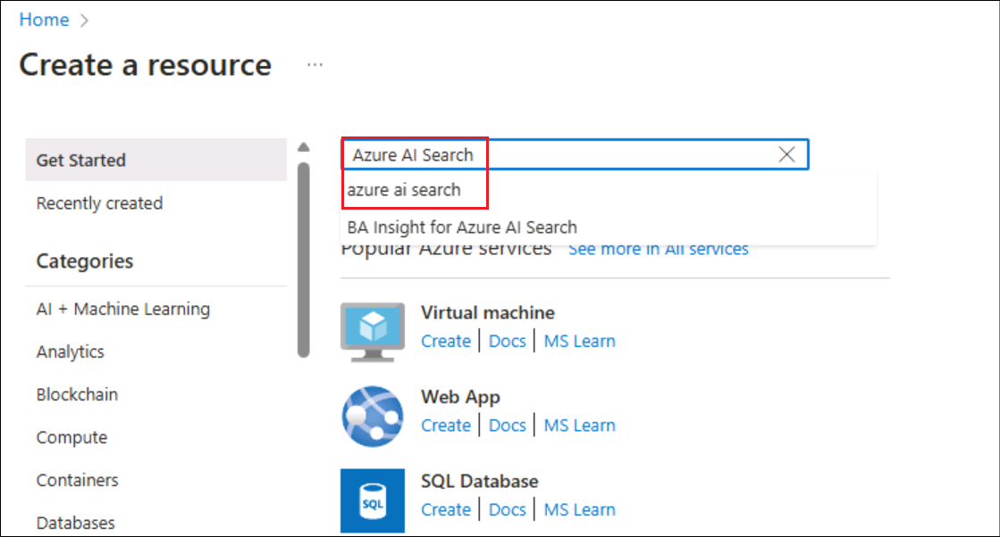
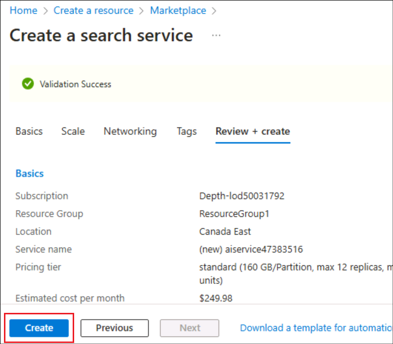
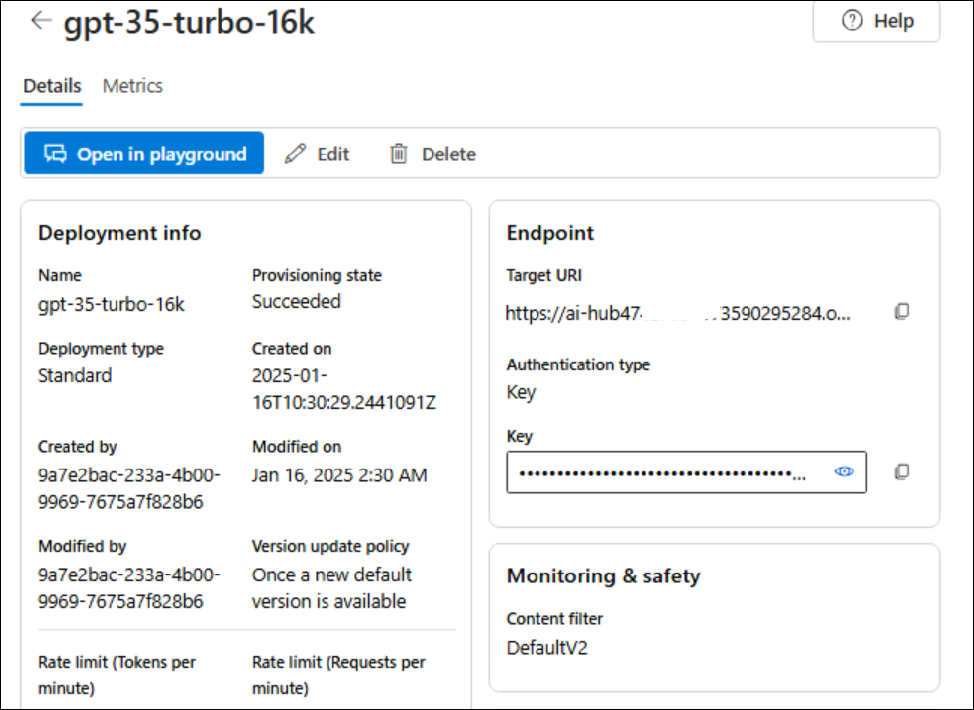
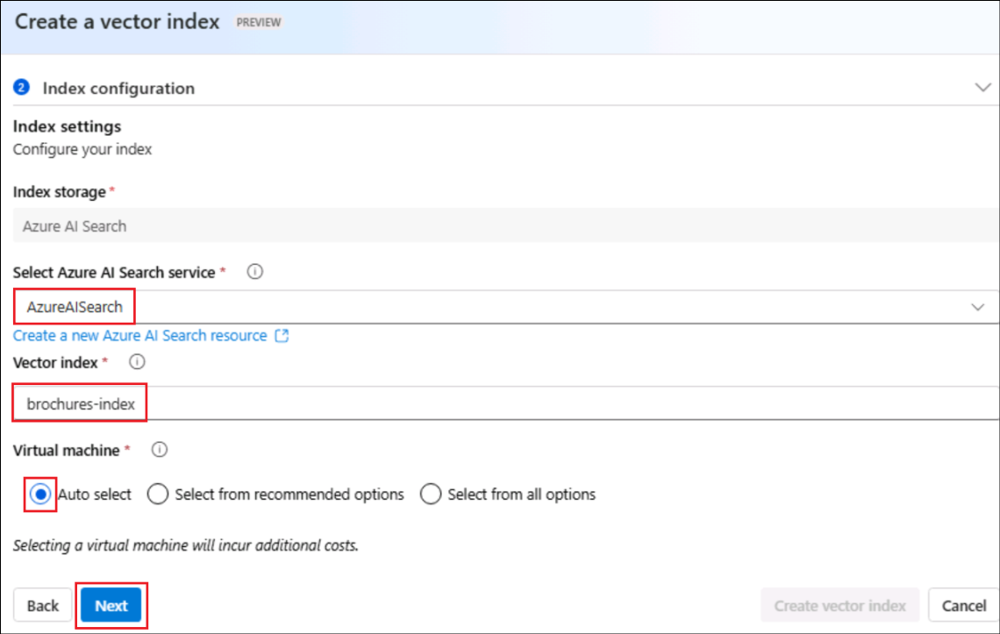
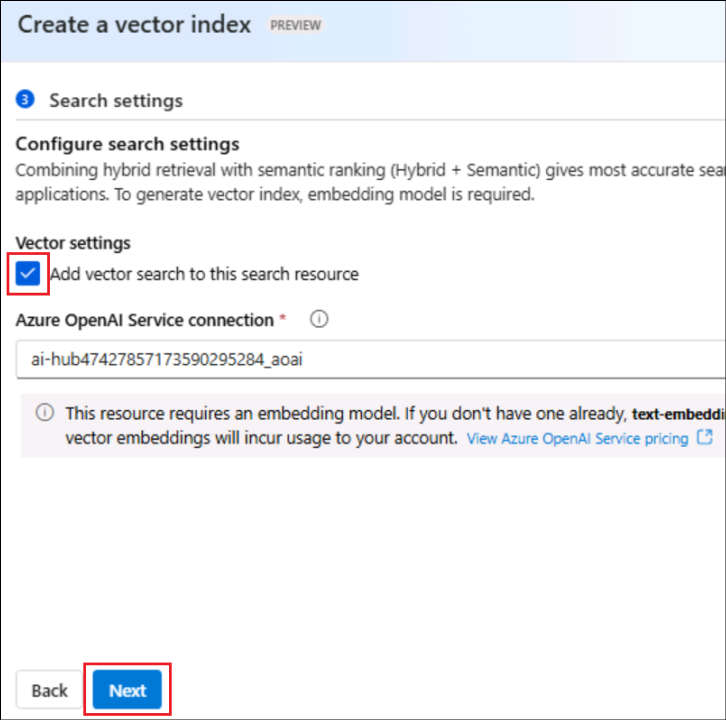
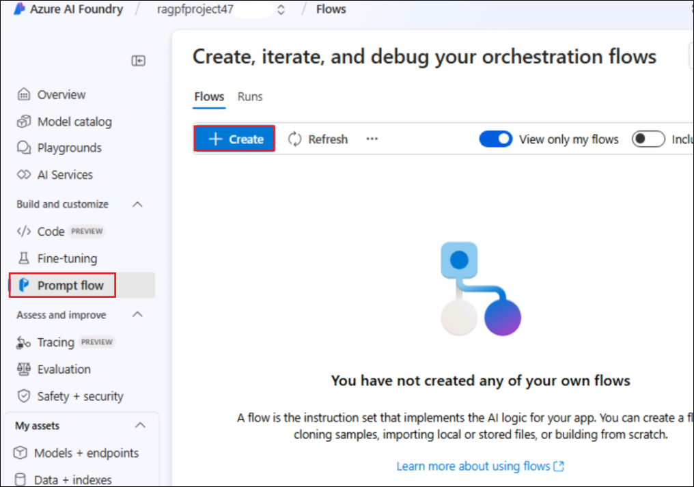

# Laboratorio 3 - Creación de un agente AI personalizado con Azure AI Foundry e integración de búsqueda

**Tiempo estimado: 45 minutos**

## Objetivo

El objetivo de este laboratorio es guiar a los participantes en la
construcción de un agente impulsado por IA utilizando los servicios de
**Azure AI** y la integración de **Search**. **Retrieval Augmented
Generation (RAG)** es una técnica utilizada para crear aplicaciones que
integran datos de fuentes personalizadas en una consulta para un modelo
de IA generativa. RAG es un patrón comúnmente utilizado en el desarrollo
de aplicaciones de IA generativa, como las aplicaciones basadas en chat,
que emplean un modelo de lenguaje para interpretar entradas y generar
respuestas apropiadas. Los participantes aprenderán a utilizar el portal
**Azure AI Foundry** para integrar datos personalizados en un flujo de
instrucciones para IA generativa.

Solución

Este laboratorio se centra en la integración de los servicios Azure AI
con capacidades de búsqueda avanzada para crear una solución sólida e
inteligente. Hace hincapié en la configuración de un agente impulsado
por IA, que permite la recuperación de datos de manera fluida y
proporciona respuestas contextuales. Al aprovechar la IA y la
integración de búsqueda, la solución tiene como objetivo agilizar los
flujos de trabajo, mejorar la toma de decisiones y aumentar el
compromiso del usuario mediante interacciones intuitivas y eficientes.

## Tarea 0: Sincronice la hora del entorno del host 

1.  Inicie sesión en la Máquina Virtual de laboratorio utilizando las
    credenciales proporcionadas en la pestaña inicio de la interfaz de
    laboratorio. 

&nbsp;

2.  En su máquina virtual, busque y seleccione +++**Settings**+++ en la
    **barra de búsqueda de Windows**.

     

3.  En la ventana **Settings**, navegue y haga clic en **Time &
    language**. 

     

3.  En la página de **Time & language,** desplácese y haga clic en
    **Date & time**. 

     

4.  Desplácese hacia abajo y vaya a la sección **Additional settings**
    y, a continuación, haga clic en el botón **Syn now**.

     

5.  Cierre la ventana **Settings**.  

     

## Tarea 1: Conozca la máquina virtual y las credenciales

En esta tarea, identificaremos y comprenderemos las credenciales que
utilizaremos a lo largo del laboratorio.

1.  La pestaña de **Instructions** contiene la guía del laboratorio con
    los pasos a seguir durante toda la práctica.

2.  La pestaña de **Resources** contiene las credenciales necesarias
    para ejecutar el laboratorio.

    - **URL** – URL del portal de Azure
    
    - **Subscription** – Es el **ID** de la **suscripción** que se le ha
      asignado.
    
    - **Username** –Es el **user id** con el que debe **iniciar sesión** en
      los **servicios Azure**.
    
    - **Password** – Es la **contraseña** de acceso a **Azure**.

    llamaremos a este nombre de usuario y contraseña como **Azure login credentials**.

    Utilizaremos estas credenciales siempre que mencionemos **Azure login credentials.**

    - **Resource Group** – Es el grupo de recursos que se le ha asignado.

    >[!Alert] **Importante**: Asegúrese de crear todos sus recursos en este grupo de recursos.

    

3.  La pestaña **Help** contiene la información de soporte. El valor
    **ID** es el **Lab instance ID** que se utilizará durante la
    ejecución del laboratorio.

    

## Tarea 2: Cree un recurso de Azure AI Search

1.  En un navegador web, abra el portal de Azure en
    +++https://portal.azure.com+++ e inicie sesión haciendo clic en
    **Sign in** con las **Azure login credentials**.

    

2.  En la página de inicio, seleccione **+ Create a resource.**

    

3.   En la barra de búsqueda, busque y seleccione +++**Azure AI
    Search**+++.

    

4.  Seleccione el menú desplegable junto a **Create** y seleccione
    **Azure AI Search**.

    

5.  En la página Create a search service, ingrese los siguientes datos y
    haga clic en **Review + create**.

    - **Subscription**: Seleccione su suscripción a Azure en el menú
      desplegable.

    - **Resource group**: Seleccione el grupo de recursos asignado a su
      suscripción (ResourceGroup1)

    - **Service name**: *+++*aisearch\<labinstanceid\>+++ (Reemplace el
      ID de la instancia del laboratorio con el valor obtenido en la
      pestaña de ayuda)

    - **Location**: Seleccione una **región** . En este caso, se utiliza Canada East.

    - **Pricing tier**: Standard

    

6.  Revise la configuración y haga clic en **Create**.

    

7.  Espere a que se complete la implementación de su recurso Azure AI
    Search.

    

    >[!Note] **Nota:** Más adelante, se creará un Azure AI Hub (que incluye un servicio Azure OpenAI) en la misma región que el recurso Azure AI Search. Los recursos de Azure OpenAI están sujetos a cuotas regionales a nivel del tenant. Las regiones enumeradas cuentan con cuotas predeterminadas para los tipos de modelo utilizados en este ejercicio. Seleccionar una región de manera aleatoria ayuda a minimizar el riesgo de que una sola región alcance su límite de cuota, especialmente en entornos donde el tenant es compartido con otros usuarios. Si el límite de cuota se alcanza durante el ejercicio, podría ser necesario crear otro Azure AI Hub en una región diferente.

## Tarea 3: Cree un proyecto Azure AI

1.  En un navegador web, abra el **Azure AI Foundry
    portal** en +++https://ai.azure.com+++ en
    inicie sesión haciendo clic en **sign in** con sus **Azure login
    credentials**.

    

2.  **Cierre** la pestaña **Help** y seleccione **Got it** en la ventana
    emergente **Streamlined from the start**.

3.  En la página de inicio, seleccione **+ Create project**.

    

4.  En el asistente para **Create a project,** ingrese el nombre del
    proyecto como +++**ragpfproject+++\<Lab instance ID\>** y sustituya
    **Lab instance ID** por el ID de instancia de laboratorio de su
    máquina virtual. A continuación, haga clic en **Customize.**

    

5.  **En Customize**, conéctese a su recurso Azure AI Search, ingrese
    los siguientes datos, seleccione **Next** y revise su configuración.

    - **Hub name**: +++**hub**+++**\<LabinstanceID\>** (Reemplace el ID
      de la instancia del laboratorio con el valor de su máquina
      virtual).

    - **Azure Subscription**: Seleccione la suscripción Azure que le ha
      sido asignada.

    - **Resource group**: Seleccione el Grupo de recursos que le ha sido
      asignado.

    - **Location**: Seleccione la misma **ubicación** que su recurso
      **Azure AI Search resource**, en este caso, Canada East.

    - **Connect Azure AI Services or Azure OpenAI**: (Nuevo) Se
      completará automáticamente con el nombre de su hub.

    - **Connect Azure AI Search**: Seleccione su recurso Azure AI
      Search, **aisearch\<Labinstance ID\>**

    

6.  Revise los detalles y haga clic en **Create** y espere a que el
    proceso finalice.

    

7.  Haga clic en **Close** para cerrar la ventana de Explore and
    experiment.

    

8.  Será redirigido a la página del proyecto creado.

    

## Tarea 3: Implemente los modelos

Se requieren dos modelos para implementar la solución:

- Un modelo de incrustación que vectoriza los datos de texto para
  indexarlos y procesarlos con eficacia.

- Un modelo que puede generar respuestas en lenguaje natural a preguntas
  basadas en sus datos.

1.  Seleccione **Models + endpoints** dentro de **My assets** en el
    panel izquierdo.

2.  En la página **Manage deployments of your models and services,**
    haga clic en **+Deploy model** y seleccione **Deploy base model.**

    

3.  En la página **Select a model**, busque y seleccione el
    modelo +++**text-embedding-ada-002**+++ y haga clic en **Confirm.**

    

4.  En la página de implementación del modelo **Deploy model
    text-embedding-ada-002**, haga clic en **Customize,** e ingrese los
    siguientes datos en el asistente de implementación.

    

    - **Deployment name**: text-embedding-ada-002
    
    - **Deployment type**: Standard
    
    - **Model version**: *Seleccione la versión predeterminada.*
    
    - **AI resource**: *Seleccione el recurso creado anteriormente que
      aparece en la lista.*
    
    - **Tokens per Minute Rate Limit (thousands)**: 5K
    
    - **Content filter**: DefaultV2
    
    - **Enable dynamic quota**: Disabled

    

    

    

5.  Repita los pasos anteriores para implementar un modelo
    **gpt-35-turbo-16k** con el nombre de implementación
    gpt-35-turbo-16k.

    

6.  Ya tenemos listas las dos implementaciones.

    

    >[!Note] **Nota:** Reducir los tokens por minuto (TPM) ayuda a evitar el uso excesivo de la cuota disponible en la suscripción utilizada. 5,000 TPM son suficientes para los datos empleados en este ejercicio.
    >
## Tarea 4: Añada datos a su proyecto

Los datos para su copilot consisten en un conjunto de folletos de viaje
en formato PDF de la agencia de viajes ficticia *Margie’s Travel*.
Agreguémoslos al proyecto.

1.  En el panel izquierdo, dentro de **My assets**, seleccione **Data +
    indexes**. Luego, haga clic en **+ New data**.

    

2.  En el asistente para **Add your data**, seleccione **Upload
    files/folders** en el menú desplegable.

    

3.  Seleccione **Upload folder** y seleccione la carpeta
    **brochures** en **C:\LabFiles,** luego haga clic en **Upload**.

    

    

4.  Espere a que se cargue la carpeta y observe que contiene varios
    archivos .pdf. 5. Seleccione **Next** una vez que se hayan cargado
    todos los archivos.

    

5.  En la página **Name and Finish**, ingrese el nombre de los datos
    como +++**data\<Lab instance ID\>**+++ (reemplazando el marcador de
    posición por el identificador de instancia de su laboratorio) y haga
    clic en **Create**.

    

    

## Tarea 5: Cree un índice para sus datos

Ahora que ha añadido una fuente de datos a su proyecto, puede utilizarla
para crear un índice en su recurso Azure AI Search.

1.  En la página **Data + indexes,** seleccione la pestaña **Indexes**.

    

2.  En la pestaña **Indexes**, seleccione **+ New index** para añadir un
    nuevo índice.

    

3.  Ingrese los siguientes datos y haga clic en **Next**.

    - **Data source** - Seleccione **Data in Azure AI Foundry**

    Seleccione la **data source** de la lista y luego, haga clic en
**Next**.

    

4.  Ingrese los siguientes datos en la página Create a vector index –
    Index configuration y haga clic en **Next.**

    - **Select Azure AI Search service**: Seleccione **AzureAISearch** 
    
    - Vector index - +++**brochures-index**+++
    
    - **Virtual machine**: Select **Auto select**

    

5.  In the Create a vector index – Search settings page,

    **Vector settings** - Select **Add vector search to this search
resource**

    Accept the other defaults and select **Next.**

    

6.  In the **Review and finish** page, review the details and select
    **Create vector index**.

    

7.  Wait for the indexing process to be completed, which can take
    several minutes. The index creation operation consists of the
    following jobs:

    - Crack, chunk, and embed the text tokens in your brochures data.

    - Create the Azure AI Search index.

    - Register the index asset.

    

    

## Task 6: Test the index

Before using your index in a RAG-based prompt flow, let’s verify that it
can be used to affect generative AI responses.

1.  Select the **Playgrounds** from the left pane and select **Chat
    Playground.**

    

2.  Click on **Show setup** if it is not visible by default.

    

3.  Ensure that your **gpt-35-turbo-16k** model deployment is selected.
    Then, in the main chat session panel, submit the prompt +++**Where
    can I stay in New York?**+++

    

    

4.  Review the response, which should be a generic answer from the model
    without any data from the index.

5.  In the Setup pane, expand the **Add your data** field,
    select **brochures-index** project index and select the **hybrid
    (vector + keyword)** search type.

    

> **Note**: Some users are finding newly created indexes unavailable
> right away. Refreshing the browser usually helps, but if you’re still
> experiencing the issue where it can’t find the index you may need to
> wait until the index is recognized.

6.  This addition of the data source starts a new session. Once that is
    done, resubmit the prompt +++**Where can I stay in New York?**+++

> 

7.  Review the response and note that now the response is based on data
    in the index.

> 

## Task 7: Use the index in a prompt flow

Your vector index has been saved in your Azure AI Foundry project,
enabling you to use it easily in a prompt flow.

1.  Select the **Prompt flow** under **Build and customize** from the
    left navigation pane and then click on **Create**.

    

2.  Select **Clone** under Multi-Round Q&A on Your Data.

    

3.  Give the folder name as +++**brochure-flow**+++ and click on
    **Clone**.

    

    >[!Note] **Note:** If you face permissions error, retry with a new name after 2 minutes and the flow will get cloned.

    

4.  When the prompt flow designer page opens, review **brochure-flow**.
    Its graph should resemble the following image:

    

    

> The sample prompt flow you are using implements the prompt logic for a
> chat application in which the user can iteratively submit text input
> to chat interface. The conversational history is retained and included
> in the context for each iteration. The prompt flow orchestrates a
> sequence of *tools* to:

- Append the history to the chat input to define a prompt in the form of
  a contextualized form of a question.

- Retrieve the context using your index and a query type of your own
  choice based on the question.

- Generate prompt context by using the retrieved data from the index to
  augment the question.

- Create prompt variants by adding a system message and structuring the
  chat history.

- Submit the prompt to a language model to generate a natural language
  response.

5.  Use the **Start compute session** button to start the runtime
    compute for the flow.

    > Wait for the runtime to start. This provides a compute context for the
    > prompt flow. While you’re waiting, in the **Flow** tab, review the
    > sections for the tools in the flow.

    

6.  In the **Inputs** section, ensure the inputs include:

    - **chat_history**

    - **chat_input**

The default chat history in this sample includes some conversation about
AI.

    

7.  In the **Outputs** section, ensure that the output includes:

    - **chat_output** with value ${chat_with_context.output}

    

8.  In the **modify_query_with_history** section, select the following
    settings (leaving others as they are):

    - **Connection**: Select the **Azure OpenAI resource** for your AI
      hub that gets listed

    - **Api**: Select **chat**

    - **deployment_name**: Select **gpt-35-turbo-16k**

    - **response_format**: Select **{“type”:”text”}**

> 

9.  Once the compute session has started, in the **lookup** section, set
    the following parameter values:

    - **mlindex_content**: *Select the empty field to open the Generate
      pane*

      - **index_type**: Select **Registered Index**

      &nbsp;

      - **mlindex_asset_id**: Select **brochures-index:1**

> 
>
> 
>
> Back in the Lookup section enter the below details

- **queries**: ${modify_query_with_history.output}

- **query_type**: Hybrid (vector + keyword)

- **top_k**: 2

> 

10. In the **generate_prompt_context** section, review the Python script
    and ensure that the **inputs** for this tool include the following
    parameter:

    - **search_result** *(object)*: ${lookup.output}

> 

11. In the **Prompt_variants** section, review the Python script and
    ensure that the **inputs** for this tool include the following
    parameters:

    - **contexts** *(string)*: ${generate_prompt_context.output}

    - **chat_history** *(string)*: ${inputs.chat_history}

    - **chat_input** *(string)*: ${inputs.chat_input}

> 

12. In the **chat_with_context** section, select the following settings
    (leaving others as they are):

    - **Connection**: Default_AzureOpenAI

    - **Api**: Chat

    - **deployment_name**: gpt-35-turbo-16k

    - **response_format**: {“type”:”text”}

Then ensure that the **inputs** for this tool include the following
parameters:

- **prompt_text** *(string)*: ${Prompt_variants.output}

> 

13. On the toolbar, use the **Save** button to save the changes you’ve
    made to the tools in the prompt flow.

> 

14. On the toolbar, select **Chat**. A chat pane opens with the sample
    conversation history and the input already filled in based on the
    sample values. You can ignore these.

> 

15. In the chat pane, replace the default input with the
    question +++**Where can I stay in London?**+++ and submit it.

> 

16. The response is based on data in the index.

17. Review the outputs for each tool in the flow.

> 

18. In the chat pane, enter the question +++**What can I do there?**+++

19. Review the response, which should be based on data in the index and
    it takes **chat history** into account (so “**there**” is understood
    as “**in London**”).

> 

20. Review the outputs for each tool in the flow, noting how each tool
    in the flow operated on its inputs to prepare a contextualized
    prompt and get an appropriate response.

21. ewqewqe

## Task 8: Clean up the resources:

1.  From the Azure portal (+++https://portal.azure.com+++), select the
    **ResourceGroup1**(the one assigned to you).

2.  Select all the resources under it and click on **Delete**.

> 

3.  Enter +++**delete**+++ and click on the **Delete** button to confirm
    deletion. Click on **Delete** in the Delete confirmation dialog box.

> 

4.  Ensure that the resources are deleted, by the delete confirmation
    message.

**Summary:**

In this lab, we have learnt to create a custom agent that uses your own
data from **Azure AI Foundry**.
