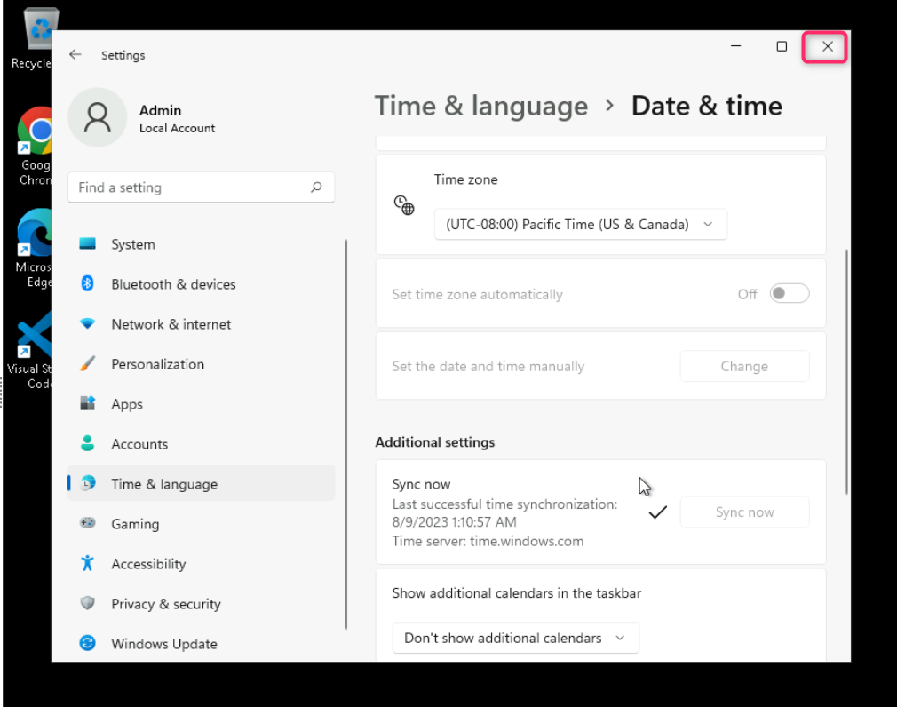
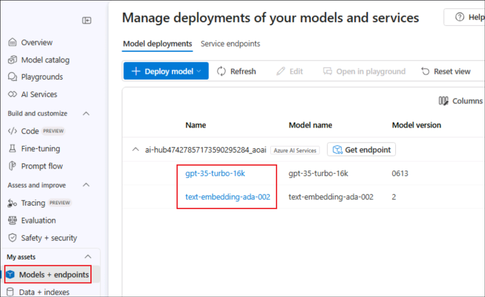
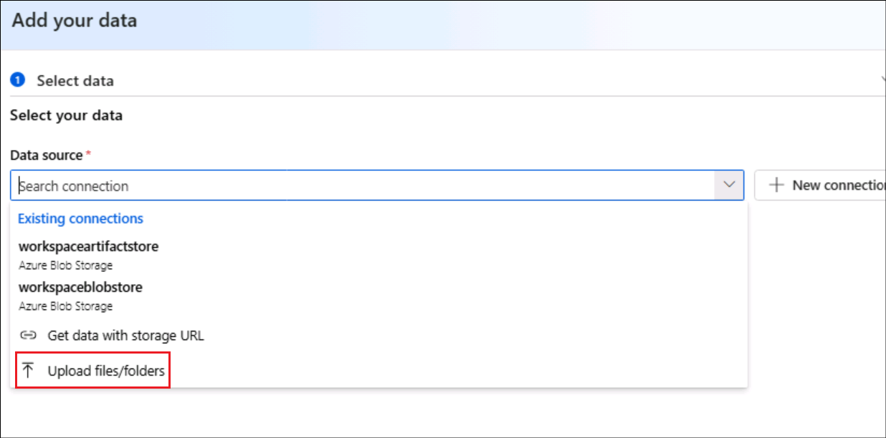
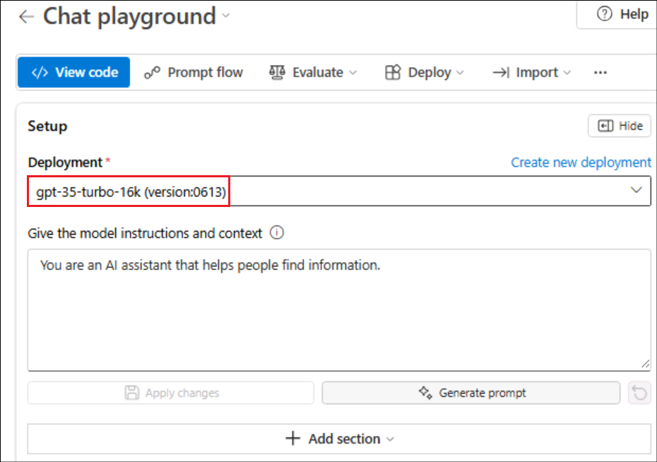
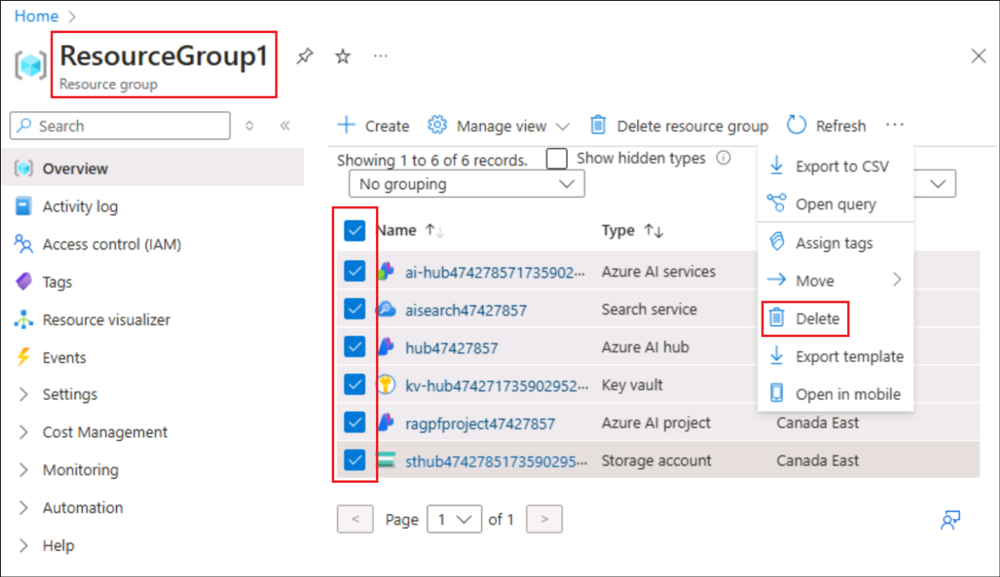

# Laboratorio 3 - Creación de un agente AI personalizado con Azure AI Foundry e integración de búsqueda

**Tiempo estimado: 45 minutos**

## Objetivo

El objetivo de este laboratorio es guiar a los participantes en la
construcción de un agente impulsado por IA utilizando los servicios de
**Azure AI** y la integración de **Search**. **Retrieval Augmented
Generation (RAG)** es una técnica utilizada para crear aplicaciones que
integran datos de fuentes personalizadas en una consulta para un modelo
de IA generativa. RAG es un patrón comúnmente utilizado en el desarrollo
de aplicaciones de IA generativa, como las aplicaciones basadas en chat,
que emplean un modelo de lenguaje para interpretar entradas y generar
respuestas apropiadas. Los participantes aprenderán a utilizar el portal
**Azure AI Foundry** para integrar datos personalizados en un flujo de
instrucciones para IA generativa.

Solución

Este laboratorio se centra en la integración de los servicios Azure AI
con capacidades de búsqueda avanzada para crear una solución sólida e
inteligente. Hace hincapié en la configuración de un agente impulsado
por IA, que permite la recuperación de datos de manera fluida y
proporciona respuestas contextuales. Al aprovechar la IA y la
integración de búsqueda, la solución tiene como objetivo agilizar los
flujos de trabajo, mejorar la toma de decisiones y aumentar el
compromiso del usuario mediante interacciones intuitivas y eficientes.

## Tarea 0: Sincronice la hora del entorno del host 

1.  Inicie sesión en la Máquina Virtual de laboratorio utilizando las
    credenciales proporcionadas en la pestaña inicio de la interfaz de
    laboratorio. 

&nbsp;

2.  En su máquina virtual, busque y seleccione +++**Settings**+++ en la
    **barra de búsqueda de Windows**.

     

3.  En la ventana **Settings**, navegue y haga clic en **Time &
    language**. 

     

3.  En la página de **Time & language,** desplácese y haga clic en
    **Date & time**. 

     

4.  Desplácese hacia abajo y vaya a la sección **Additional settings**
    y, a continuación, haga clic en el botón **Syn now**.

     

5.  Cierre la ventana **Settings**.  

     

## Tarea 1: Conozca la máquina virtual y las credenciales

En esta tarea, identificaremos y comprenderemos las credenciales que
utilizaremos a lo largo del laboratorio.

1.  La pestaña de **Instructions** contiene la guía del laboratorio con
    los pasos a seguir durante toda la práctica.

2.  La pestaña de **Resources** contiene las credenciales necesarias
    para ejecutar el laboratorio.

    - **URL** – URL del portal de Azure
    
    - **Subscription** – Es el **ID** de la **suscripción** que se le ha
      asignado.
    
    - **Username** –Es el **user id** con el que debe **iniciar sesión** en
      los **servicios Azure**.
    
    - **Password** – Es la **contraseña** de acceso a **Azure**.

    llamaremos a este nombre de usuario y contraseña como **Azure login credentials**.

    Utilizaremos estas credenciales siempre que mencionemos **Azure login credentials.**

    - **Resource Group** – Es el grupo de recursos que se le ha asignado.

    >[!Alert] **Importante**: Asegúrese de crear todos sus recursos en este grupo de recursos.

    

3.  La pestaña **Help** contiene la información de soporte. El valor
    **ID** es el **Lab instance ID** que se utilizará durante la
    ejecución del laboratorio.

    

## Tarea 2: Cree un recurso de Azure AI Search

1.  En un navegador web, abra el portal de Azure en
    +++https://portal.azure.com+++ e inicie sesión haciendo clic en
    **Sign in** con las **Azure login credentials**.

    

2.  En la página de inicio, seleccione **+ Create a resource.**

    

3.   En la barra de búsqueda, busque y seleccione +++**Azure AI
    Search**+++.

    

4.  Seleccione el menú desplegable junto a **Create** y seleccione
    **Azure AI Search**.

    

5.  En la página Create a search service, ingrese los siguientes datos y
    haga clic en **Review + create**.

    - **Subscription**: Seleccione su suscripción a Azure en el menú
      desplegable.

    - **Resource group**: Seleccione el grupo de recursos asignado a su
      suscripción (ResourceGroup1)

    - **Service name**: *+++*aisearch\<labinstanceid\>+++ (Reemplace el
      ID de la instancia del laboratorio con el valor obtenido en la
      pestaña de ayuda)

    - **Location**: Seleccione una **región** . En este caso, se utiliza Canada East.

    - **Pricing tier**: Standard

    

6.  Revise la configuración y haga clic en **Create**.

    

7.  Espere a que se complete la implementación de su recurso Azure AI
    Search.

    

    >[!Note] **Nota:** Más adelante, se creará un Azure AI Hub (que incluye un servicio Azure OpenAI) en la misma región que el recurso Azure AI Search. Los recursos de Azure OpenAI están sujetos a cuotas regionales a nivel del tenant. Las regiones enumeradas cuentan con cuotas predeterminadas para los tipos de modelo utilizados en este ejercicio. Seleccionar una región de manera aleatoria ayuda a minimizar el riesgo de que una sola región alcance su límite de cuota, especialmente en entornos donde el tenant es compartido con otros usuarios. Si el límite de cuota se alcanza durante el ejercicio, podría ser necesario crear otro Azure AI Hub en una región diferente.

## Tarea 3: Cree un proyecto Azure AI

1.  En un navegador web, abra el **Azure AI Foundry
    portal** en +++https://ai.azure.com+++ en
    inicie sesión haciendo clic en **sign in** con sus **Azure login
    credentials**.

    

2.  **Cierre** la pestaña **Help** y seleccione **Got it** en la ventana
    emergente **Streamlined from the start**.

3.  En la página de inicio, seleccione **+ Create project**.

    

4.  En el asistente para **Create a project,** ingrese el nombre del
    proyecto como +++**ragpfproject+++\<Lab instance ID\>** y sustituya
    **Lab instance ID** por el ID de instancia de laboratorio de su
    máquina virtual. A continuación, haga clic en **Customize.**

    

5.  **En Customize**, conéctese a su recurso Azure AI Search, ingrese
    los siguientes datos, seleccione **Next** y revise su configuración.

    - **Hub name**: +++**hub**+++**\<LabinstanceID\>** (Reemplace el ID
      de la instancia del laboratorio con el valor de su máquina
      virtual).

    - **Azure Subscription**: Seleccione la suscripción Azure que le ha
      sido asignada.

    - **Resource group**: Seleccione el Grupo de recursos que le ha sido
      asignado.

    - **Location**: Seleccione la misma **ubicación** que su recurso
      **Azure AI Search resource**, en este caso, Canada East.

    - **Connect Azure AI Services or Azure OpenAI**: (Nuevo) Se
      completará automáticamente con el nombre de su hub.

    - **Connect Azure AI Search**: Seleccione su recurso Azure AI
      Search, **aisearch\<Labinstance ID\>**

    

6.  Revise los detalles y haga clic en **Create** y espere a que el
    proceso finalice.

    

7.  Haga clic en **Close** para cerrar la ventana de Explore and
    experiment.

    

8.  Será redirigido a la página del proyecto creado.

    

## Tarea 3: Implemente los modelos

Se requieren dos modelos para implementar la solución:

- Un modelo de incrustación que vectoriza los datos de texto para
  indexarlos y procesarlos con eficacia.

- Un modelo que puede generar respuestas en lenguaje natural a preguntas
  basadas en sus datos.

1.  Seleccione **Models + endpoints** dentro de **My assets** en el
    panel izquierdo.

2.  En la página **Manage deployments of your models and services,**
    haga clic en **+Deploy model** y seleccione **Deploy base model.**

    

3.  En la página **Select a model**, busque y seleccione el
    modelo +++**text-embedding-ada-002**+++ y haga clic en **Confirm.**

    

4.  En la página de implementación del modelo **Deploy model
    text-embedding-ada-002**, haga clic en **Customize,** e ingrese los
    siguientes datos en el asistente de implementación.

    

    - **Deployment name**: text-embedding-ada-002
    
    - **Deployment type**: Standard
    
    - **Model version**: *Seleccione la versión predeterminada.*
    
    - **AI resource**: *Seleccione el recurso creado anteriormente que
      aparece en la lista.*
    
    - **Tokens per Minute Rate Limit (thousands)**: 5K
    
    - **Content filter**: DefaultV2
    
    - **Enable dynamic quota**: Disabled

    

    

    

5.  Repita los pasos anteriores para implementar un modelo
    **gpt-35-turbo-16k** con el nombre de implementación
    gpt-35-turbo-16k.

    

6.  Ya tenemos listas las dos implementaciones.

    

    >[!Note] **Nota:** Reducir los tokens por minuto (TPM) ayuda a evitar el uso excesivo de la cuota disponible en la suscripción utilizada. 5,000 TPM son suficientes para los datos empleados en este ejercicio.
    >
## Tarea 4: Añada datos a su proyecto

Los datos para su copilot consisten en un conjunto de folletos de viaje
en formato PDF de la agencia de viajes ficticia *Margie’s Travel*.
Agreguémoslos al proyecto.

1.  En el panel izquierdo, dentro de **My assets**, seleccione **Data +
    indexes**. Luego, haga clic en **+ New data**.

    

2.  En el asistente para **Add your data**, seleccione **Upload
    files/folders** en el menú desplegable.

    

3.  Seleccione **Upload folder** y seleccione la carpeta
    **brochures** en **C:\LabFiles,** luego haga clic en **Upload**.

    

    

4.  Espere a que se cargue la carpeta y observe que contiene varios
    archivos .pdf. 5. Seleccione **Next** una vez que se hayan cargado
    todos los archivos.

    

5.  En la página **Name and Finish**, ingrese el nombre de los datos
    como +++**data\<Lab instance ID\>**+++ (reemplazando el marcador de
    posición por el identificador de instancia de su laboratorio) y haga
    clic en **Create**.

    

    

## Tarea 5: Cree un índice para sus datos

Ahora que ha añadido una fuente de datos a su proyecto, puede utilizarla
para crear un índice en su recurso Azure AI Search.

1.  En la página **Data + indexes,** seleccione la pestaña **Indexes**.

    

2.  En la pestaña **Indexes**, seleccione **+ New index** para añadir un
    nuevo índice.

    

3.  Ingrese los siguientes datos y haga clic en **Next**.

    - **Data source** - Seleccione **Data in Azure AI Foundry**

    Seleccione la **data source** de la lista y luego, haga clic en
**Next**.

    

4.  Ingrese los siguientes datos en la página Create a vector index –
    Index configuration y haga clic en **Next.**

    - **Select Azure AI Search service**: Seleccione **AzureAISearch** 
    
    - Vector index - +++**brochures-index**+++
    
    - **Virtual machine**: Select **Auto select**

    

5.	En la página Crear un índice vectorial – Configuración de búsqueda, 

    **Vector settings** - Escoger **Add vector search to this search
resource**

    Acepte los demás valores predeterminados y seleccione **Next**.

    

6.	En **Review and finish** , revise los detalles y seleccione **Create vector index**.

    

7.  Espere a que se complete el proceso de indexación, que puede tardar varios minutos. La operación de creación de índices consta de los siguientes trabajos:

    - Descifre, fragmente e incruste los tokens de texto en los datos de sus folletos.
      
    - Cree el índice de Azure AI Search.

    - Registre el activo del índice.

    

    

## Tarea 6: Probar el índice

Antes de usar el índice en un flujo de solicitud basado en RAG, verifiquemos que se puede usar para afectar a las respuestas generativas de IA.

1.	Seleccione la opción **Playgrounds** en el panel izquierdo y seleccione **Chat Playground**.

    

2.	Haga clic en **Show setup** si no está visible de forma predeterminada.

    

3.  Asegúrese de que su **gpt-35-turbo-16k** Se selecciona la implementación del modelo. Luego, en el panel principal de la sesión de chat, envíe el mensaje +++Where can I stay in New York?+++

    

    

4.  Revise la respuesta, que debe ser una respuesta genérica del modelo sin ningún dato del índice.

5.	En el panel Configuración, expanda el icono **Add your data** field, escoger **brochures-index** Índice de proyecto y seleccione el **hybrid (vector + keyword)** Tipo de búsqueda.

    

    >[!Note] **Note**: Algunos usuarios encuentran que los índices recién creados no están disponibles de inmediato. Actualizar el navegador suele ayudar, pero si sigues experimentando el problema de que no puede encontrar el índice, es posible que tengas que esperar hasta que se reconozca el índice.

6. Esta adición de la fuente de datos inicia una nueva sesión. Una vez hecho esto, vuelva a enviar el mensaje+++Where can I stay in New York?+++

    

7.  Revise la respuesta y observe que ahora la respuesta se basa en los datos del índice.

    

## Tarea 7: Usar el índice en un flujo de solicitud

El índice vectorial se ha guardado en el proyecto de Azure AI Foundry, lo que le permite usarlo fácilmente en un flujo de solicitud.

1.  Seleccione la opción **Prompt flow** debajo **Build and customize** desde el panel de navegación izquierdo y, a continuación, haga clic en **Create**.

    

2.  Escoger **Clone** debajo Multi-Round Q&A on Your Data.

    

3.	Asigne el nombre de la carpeta como +++**brochure-flow**+++ y haga clic en **Clone**. 

    

    >[!Note] **Nota:** Si se enfrenta a un error de permisos, vuelva a intentarlo con un nuevo nombre después de 2 minutos y el flujo se clonará.

    

4.	Cuando se abra la página del diseñador de flujo de solicitudes, revise **brochure-flow**. Su gráfico debe parecerse a la siguiente imagen:

    

    

El flujo de solicitud de ejemplo que está utilizando implementa la lógica de solicitud para una aplicación de chat en la que el usuario puede enviar iterativamente una entrada de texto a la interfaz de chat. El historial conversacional se conserva y se incluye en el contexto de cada iteración. El flujo de solicitud organiza una secuencia de herramientas para:

- Agregue el historial a la entrada de chat para definir un mensaje en forma de una forma contextualizada de una pregunta.

- Recupere el contexto utilizando el índice y un tipo de consulta de su elección en función de la pregunta.

- Genere un contexto de solicitud mediante el uso de los datos recuperados del índice para aumentar la pregunta.

- Cree variantes de avisos agregando un mensaje del sistema y estructurando el historial de chat.

- Envíe el mensaje a un modelo de lenguaje para generar una respuesta de lenguaje natural.

5.  Utilice la función **Start compute session** para iniciar el proceso en tiempo de ejecución del flujo.

    Espere a que se inicie el tiempo de ejecución. Esto proporciona un contexto de proceso para el flujo de solicitudes. Mientras esperas, en el **Flow** tab, revise las secciones de las herramientas del flujo.

    

6.   En **Inputs** , asegúrese de que las entradas incluyan:

      - **chat_history**

      - **chat_input**

       El historial de chat predeterminado de este ejemplo incluye alguna conversación sobre la IA.

       

7.	En **Outputs** , asegúrese de que la salida incluya:

    - **chat_output** con valor ${chat_with_context.output}

    

8.  En **modify_query_with_history** , seleccione los siguientes ajustes (dejando los demás como están):

    - **Connection**: Seleccione la opción **Azure OpenAI resource** para el centro de IA que aparece en la lista

    - **Api**: Escoger **chat**

    - **deployment_name**: Escoger **gpt-35-turbo-16k**

    - **response_format**: Escoger  **{“type”:”text”}**

    

9.  Una vez iniciada la sesión de proceso, en el archive lookup , establezca los siguientes valores de parámetro:

    - **mlindex_content**: Seleccione el campo vacío para abrir el panel Generar

      - **index_type**: Escoger **Registered Index**

      - **mlindex_asset_id**: Escoger **brochures-index:1**

    

    

    De vuelta en la sección Búsqueda, ingrese los detalles a continuación 

    - **queries**: ${modify_query_with_history.output}
    
    - **query_type**: Hybrid (vector + keyword)
    
    - **top_k**: 2

    

10. En **generate_prompt_context** , revise el script de Python y asegúrese de que el **inputs** Para esta herramienta, incluya el siguiente parámetro:

    - **search_result** *(object)*: ${lookup.output}

    

11. En **Prompt_variants** , revise el script de Python y asegúrese de que el **inputs** Para esta herramienta, incluya los siguientes parámetros:

    - **contexts** *(string)*: ${generate_prompt_context.output}

    - **chat_history** *(string)*: ${inputs.chat_history}

    - **chat_input** *(string)*: ${inputs.chat_input}

    

12. En **chat_with_context** , seleccione los siguientes ajustes (dejando los demás como están):

    - **Connection**: Default_AzureOpenAI

    - **Api**: Chat

    - **deployment_name**: gpt-35-turbo-16k

    - **response_format**: {“type”:”text”}

    A continuación, asegúrese de que el inputs Para esta herramienta, incluya los siguientes parámetros:

    - **prompt_text** *(string)*: ${Prompt_variants.output}

    

13. En la barra de herramientas, utilice el botón **Save** para guardar los cambios que ha realizado en las herramientas en el flujo de solicitudes.

    

14. En la barra de herramientas, seleccione **Chat**. Se abre un panel de chat con el historial de conversaciones de muestra y la entrada ya rellenada en función de los valores de muestra. Puede ignorarlos.

    

15. En el panel de chat, reemplace la entrada predeterminada por la pregunta **+++Where can I stay in London?+++** y presentarlo.

    

16. La respuesta se basa en los datos del índice.

17. Revise las salidas de cada herramienta en el flujo.

    

18. En el panel de chat, escriba la pregunta **+++What can I do there?+++**

19. Revise la respuesta, que debe basarse en los datos del índice y toma **chat history** Tener en cuenta (por lo que “**there**” se entiende como “**in London**”).

> 

20. Revise los resultados de cada herramienta en el flujo, observando cómo cada herramienta en el flujo operó con sus entradas para preparar un mensaje contextualizado y obtener una respuesta adecuada.

## Task 8: Clean up the resources:

1.  Del Azure portal (+++https://portal.azure.com+++), Seleccione la opción **ResourceGroup1**(el que se le asigne a usted).

2.  Seleccione todos los recursos debajo de él y haga clic en **Delete**.

    

3.  Entrar +++**delete**+++ y haga clic en el botón Delete para confirmar la eliminación. Haga clic en **Delete** En Delete confirmation dialog box.

    

4.  Asegúrese de que los recursos se eliminen mediante el mensaje de confirmación de eliminación.

    

**Summary:**

En este laboratorio, hemos aprendido a crear un agente personalizado que utiliza sus propios datos de **Azure AI Foundry**.
