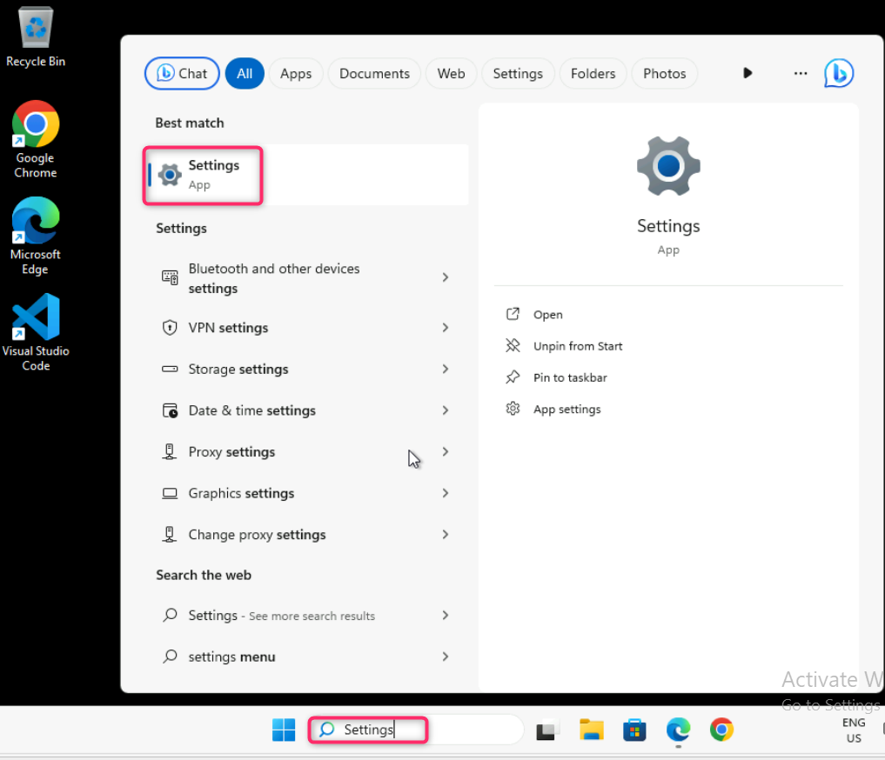
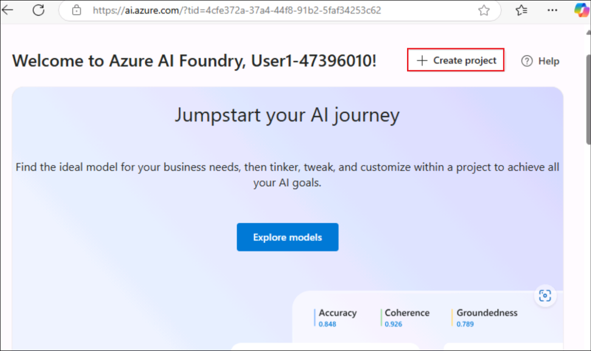
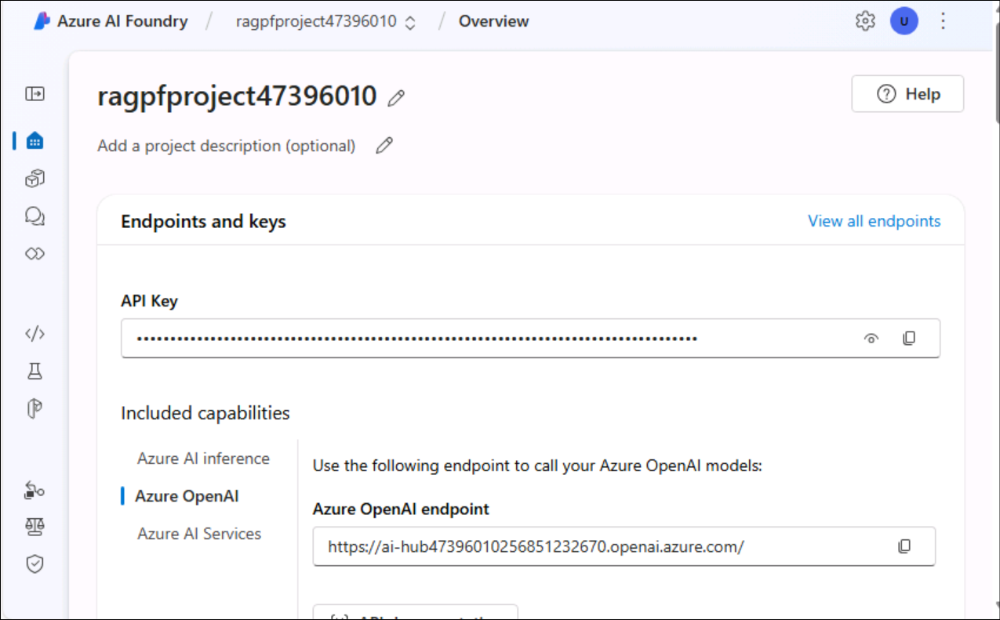
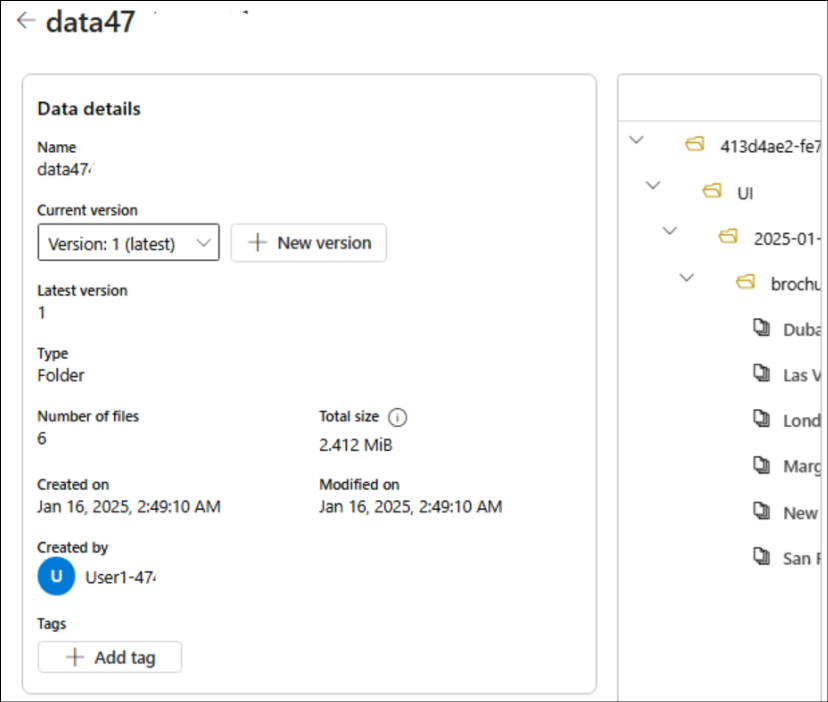
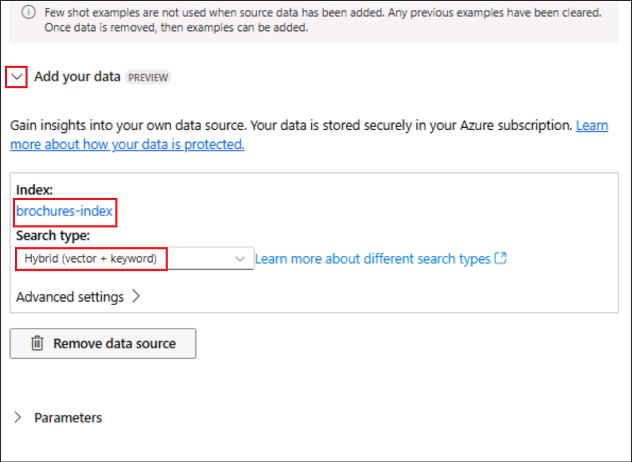
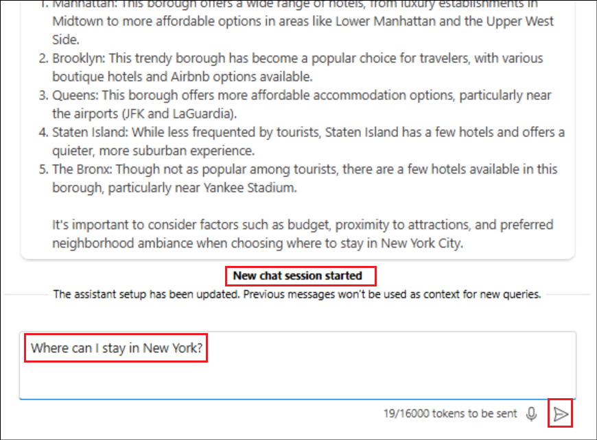
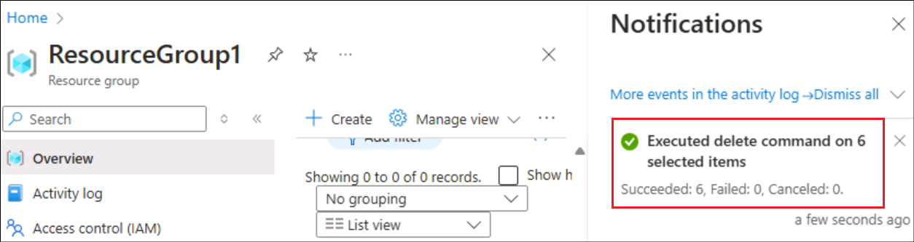

# Laboratório 3 – Criando um Agente de AI Personalizado com o Azure AI Foundry e integração de pesquisa

**Tempo estimado: 45 min**

## Objetivo

O objetivo deste laboratório é orientar os participantes na criação de
um agente com tecnologia de AI usando os serviços do Azure AI e a
integração de pesquisa. Retrieval Augmented Generation (RAG) é uma
técnica usada para criar aplicativos que integram dados de fontes de
dados personalizadas em um prompt para um modelo de generative AI. RAG é
um padrão comumente usado para desenvolver aplicativos de generative
AI - aplicativos baseados em chat que usam um modelo de linguagem para
interpretar entradas e gerar respostas apropriadas. Os participantes
aprenderão a usar o portal do Azure AI Foundry para integrar dados
personalizados em um fluxo de prompt de generative AI.

Solução

Este laboratório se concentra na integração dos serviços do Azure AI com
recursos avançados de pesquisa para criar uma solução robusta e
inteligente. Ele enfatiza a configuração de um agente alimentado por AI,
permitindo a recuperação contínua de dados e fornecendo respostas
contextuais. Ao alavancar a integração de AI e pesquisa, a solução visa
simplificar os fluxos de trabalho, melhorar a tomada de decisões e
aumentar o envolvimento do usuário por meio de interações intuitivas e
eficientes.

## Tarefa 0: Sincronizar a hora do ambiente do host 

1.  Faça login na Máquina Virtual do Laboratório usando as credenciais
    fornecidas na guia da Página Inicial de interface do Laboratório.

&nbsp;

2.  Em sua VM, pesquise e selecione +++ **Settings**+++ na barra de
    pesquisa do **Windows**.

     

2.  Na janela **Settings**, navegue e clique em **Time & language**.

     

3.  Na página **Time & language**, navegue e clique em **Date & time**.

     

4.  Role para baixo e navegue até a seção **Additional settings** e
    clique no botão **Sync now**.  

     

5.  Feche a janela **Settings**.  

     

## Tarefa 1: Entender a VM e as credenciais

Nesta tarefa, identificaremos e entenderemos as credenciais que usaremos
em todo o laboratório.

1.  A guia **Instructions** contém o guia do laboratório com as
    instruções a serem seguidas em todo o laboratório.

2.  A guia **Resources** tem as credenciais necessárias para executar o
    laboratório.

    - **URL** – URL para o portal do Azure
    
    - **Subscription** – este é o **ID** da **assinatura** atribuída a você
    
    - **Username** – o **ID de usuário** com a qual você precisa fazer
      **login** nos serviços do **Azure**.
    
    - **Password** – **senha** para o **login no Azure**.

    Vamos chamar esse nome de usuário e senha como **credenciais de login no Azure**. Usaremos essas credenciais sempre que mencionarmos **as credenciais de login no Azure**.

    - **Resource Group** – o **grupo de recursos** atribuído a você.

    >[!alert] **Importante**: certifique-se de criar todos os seus recursos neste grupo de recursos

    

3.  A guia **Help** contém as informações de suporte. O valor do **ID**
    aqui é o **ID da** **instância do laboratório** que será usado
    durante a execução do laboratório.

    

## Tarefa 2: Criar um recurso do Azure AI Search

1.  Em um navegador da web, abra o portal do Azure em
    +++<https://portal.azure.com>+++ e **sign in** usando as credenciais
    de **login no Azure**.

    

2.  Na página inicial, selecione **+ Create a resource.**

    

3.  Na barra de pesquisa, pesquise e selecione +++**Azure AI
    Search**+++.

> 

4.  Selecione a lista suspensa ao lado de **Create** e selecione **Azure
    AI Search**.

    

5.  Na página **Create a search service**, insira os detalhes abaixo e
    clique em **Review + create**.

    - **Subscription**: selecione sua assinatura do Azure na lista
      suspensa.

    - **Resource group**: selecione o grupo de recursos atribuído à sua
      assinatura (ResourceGroup1)

    - **Service name**: *+++*aisearch\<labinstanceid\>+++ (substitua o
      ID da instância do laboratório pelo valor da guia de ajuda)

    - **Location**: selecione uma **região**. O **Canada East** é usado aqui.

    - **Pricing tier**: Standard

    

6.  Revise as configurações e clique em **Create**.

    

7.  Aguarde a conclusão da implantação do recurso do Azure AI Search.

    

    **Observação:** posteriormente, você criará um Hub de IA do Azure (que inclui um serviço Azure OpenAI) na mesma região que o recurso do Azure AI Search. Os recursos do Azure OpenAI são restritos no nível do locatário por cotas regionais. As regiões listadas incluem cota padrão para os tipos de modelo usados neste exercício. A escolha aleatória de uma região reduz o risco de uma única região atingir seu limite de cota em cenários em que você está compartilhando um locatário com outros usuários. No caso de um limite de cota ser atingido posteriormente no exercício, talvez seja necessário criar outro hub de Azure AI em uma região diferente.

## Tarefa 3: Criar um projeto Azure AI

1.  Em um navegador da web, abra o **Portal do Azure AI Foundry** em +++https://ai.azure.com+++ e
    **sign in** usando suas **credenciais de login no Azure**.

    

2.  **Feche** a guia **Help** e selecione **Got it** no pop-up
    **Streamlined from the start**.

3.  Na página inicial, selecione **+ Create project**.

    

4.  No assistente **Create a project,** insira o nome do projeto como
    +++**ragpfproject+++\<ID da instância do laboratório**\>
    substituindo o **ID** **da instância do laboratório** pelo **ID da
    instância de laboratório da VM** e clique em **Customize**.

    

5.  Em **Customize**, conecte-se ao recurso do Azure AI Search, insira
    os detalhes a seguir, selecione **Next**  e examine sua
    configuração.

    - **Hub name**: +++hub+++\<**LabinstanceID\>** (substitua o ID da
      instância do laboratório pelo valor da VM)

    - **Azure Subscription**: selecione a assinatura do Azure atribuída

    - **Resource group**: selecione o grupo de recursos atribuído

    - **Location**: o mesmo **local** que o **recurso do Azure AI
      Search**, Canada East

    - **Connect Azure AI Services or Azure OpenAI:** (new) preenchimento
      automático com o nome do hub

    - **Connect Azure AI Search**: selecione o recurso do Azure AI
      Search, **aisearch\<Labinstance ID\>**

    

6.  Revise os detalhes e clique em **Create** e aguarde a conclusão do
    processo.

    

7.  Clique em **Close** no pop-up **Explore and experiment**.

    

8.  Você será direcionado para a página do projeto criado.

    

## Tarefa 3: Implementar modelos

Você precisa de dois modelos para implementar sua solução:

- um modelo de incorporação para vetorizar dados de texto para indexação
  e processamento eficientes;

- um modelo que pode gerar respostas em linguagem natural a perguntas
  com base em seus dados.

1.  Selecione **Models + endpoints** em **My assets** no painel
    esquerdo.

    

2.  Na página **Manage deployments of your models and services,** clique
    em **+Deploy model** e selecione **Deploy base model.**

    

3.  Na página **Select a model**, pesquise e selecione
    +++**text-embedding-ada-002**+++ modelo e clique em **Confirm.**

    

4.  No painel **Deploy model text-embedding-ada-002**, clique em
    **Customize** e insira os seguintes detalhes no assistente **Deploy
    model**:

    

    - **Deployment name**: text-embedding-ada-002
    
    - **Deployment type**: Standard
    
    - **Model version**: *selecione a versão padrão*
    
    - **AI resource**: *selecione o recurso criado anteriormente que é
      listado*
    
    - **Tokens per Minute Rate Limit:** 5K (5.000)
    
    - **Content filter**: DefaultV2
    
    - **Enable dynamic quota**: Disabled

    

    

    

5.  Repita as etapas anteriores para implantar um modelo
    **gpt-35-turbo-16k** com o nome de implantação **gpt-35-turbo-16k**.

    

6.  Agora temos as duas implementações prontas.

    

    **Observação**: reduzir os Tokens Per Minute (TPM) ajuda a evitar o uso excessivo da cota disponível na assinatura que você está usando. 5.000 TPM é suficiente para os dados usados neste exercício.

## Tarefa 4: Adicionar dados ao seu projeto

Os dados do seu Copilot consistem em um conjunto de folhetos de viagem
em formato PDF da agência de viagens fictícia *Margie's Travel*. Vamos
adicioná-los ao projeto.

1.  Selecione **Data + indexes** em **My assets** no painel esquerdo.
    Selecione **+ New data**.

    

2.  No assistente **Add your data**, selecione **Upload files/folders**
    no menu suspenso.

    

3.  Selecione **Upload folder** e selecione a pasta **brochuras** em
    **C:\LabFiles** e clique em **Upload**.

    

    

4.  Aguarde o carregamento da pasta e observe que ela contém vários
    arquivos .pdf. Selecione **Next** depois que todos os arquivos forem
    carregados.

    

5.  Na próxima página de nome e conclusão, insira o nome dos dados como
    +++**data\<ID da instância do laboratório\>**+++ (substituindo o
    espaço reservado pelo ID da instância do laboratório) e clique em
    **Create.**

    

    

## Tarefa 5: Criar um índice para seus dados

Agora que você adicionou uma fonte de dados ao seu projeto, pode usá-la
para criar um índice no recurso do Azure AI Search.

1.  Na página **Data + indexes**, selecione a guia **Indexes**.

    

2.  Na guia **Indexes**, selecione **+ New index** para adicionar um
    novo índice.

    

3.  Insira os detalhes abaixo e clique em **Next**.

    - **Data source** – selecione **Data in Azure AI Foundry**

    Selecione a **data source** listada e clique em **Next**.

    

4.  Insira os detalhes abaixo na página de configuração **Create a
    vector index** – **Index configuration** e clique em **Next.**

    - **Select Azure AI Search service**: selecione **AzureAISearch** 
    
    - **Vector index:** brochures-index
    
    - **Vector index:** +++ **brochures-index** +++
    
    - **Virtual machine**: selecione **Auto select**

    

5.  Na página **Create a vector index – Search settings**:

    **Vector settings** - selecione **Add vector search to this search
resource**

    Aceite os outros padrões e selecione **Next.**

    

6.  Na página **Review and finish**, revise os detalhes e selecione
    **Create vector index.**

    

7.  Aguarde a conclusão do processo de indexação, o que pode levar
    vários minutos. A operação de criação de índice consiste nos
    seguintes trabalhos:

    - **Cracking, chunking, and embedding** os tokens de texto em seus
      dados de brochuras.

    - **Creating** o Azure AI Search Index.

    - **Registering** o Index.

    

    

## Tarefa 6: Testar o índice

Antes de usar seu índice em um fluxo de prompt baseado em RAG, vamos
verificar se ele pode ser usado para afetar as respostas de generative
AI.

1.  Selecione **Playgrounds** no painel esquerdo e selecione **Chat
    playground.**

    

2.  Clique em **Show setup** se não estiver visível por padrão.

    

3.  Certifique-se de que a implantação do modelo **gpt-35-turbo-16k**
    esteja selecionada. Em seguida, no painel principal da sessão de
    chat, insira o prompt +++ **Where can I stay in New York?**+++

    

    

4.  Examine a resposta, que deve ser uma resposta genérica do modelo sem
    nenhum dado do índice.

5.  No painel **Setup**, expanda o campo **Add your data**, selecione o
    **Index** como **brochures-index** e selecione o tipo de pesquisa
    como **Hybrid (vector + keyword)** 

    
    
    **Observação:** alguns usuários estão descobrindo que os índices recém-criados estão indisponíveis imediatamente. Atualizar o navegador geralmente ajuda, mas se você ainda estiver enfrentando o problema em que ele não consegue encontrar o índice, talvez seja necessário aguardar até que o índice seja reconhecido.

6.  Essa adição da fonte de dados inicia uma nova sessão. Feito isso,
    insira novamente o prompt +++ **Where can I stay in New York?**+++

    

7.  Revise a resposta e observe que agora a resposta é baseada em dados
    no índice.

    

## Tarefa 7: Usar o índice em um fluxo de prompt

Seu índice de vetor foi salvo em seu projeto do Azure AI Foundry,
permitindo que você o use facilmente em um fluxo de prompt.

1.  Selecione **Prompt flow** em **Build and customize** no painel de
    navegação esquerdo e clique em **+ Create**.

    

2.  Selecione **Clone** em **Multi-Round Q&A on Your Data**.

    

3.  Dê o **Folder name** como +++**brochure-flow**+++ e clique em
    **Clone**.

    

    **Observação:** se você enfrentar um erro de permissão, tente novamente com um novo nome após dois minutos e o fluxo será clonado.

    

4.  Quando a página do designer de fluxo de prompt for aberta, revise o
    **brochure-flow**. Seu gráfico deve se parecer com a seguinte
    imagem:

    

    

    O fluxo de prompt de exemplo que você está usando implementa a lógica de prompt para um aplicativo de chat no qual o usuário pode enviar iterativamente a entrada de texto para a interface de chat. O histórico de conversação é retido e incluído no contexto de cada iteração. O fluxo de prompt orquestra uma sequência de ferramentas para:

    - anexar o histórico à entrada de chat para definir um prompt na forma
      de uma forma contextualizada de uma pergunta;
    
    - recuperar o contexto usando seu índice e um tipo de consulta de sua
      própria escolha com base na pergunta;
    
    - gerar contexto de prompt usando os dados recuperados do índice para
      aumentar a pergunta;
    
    - criar variantes de prompt adicionando uma mensagem do sistema e
      estruturando o histórico de chat;
    
    - enviar o prompt para um modelo de linguagem para gerar uma resposta de
      linguagem natural.

5.  Use o botão **Start compute session** para iniciar a computação de
    runtime para o fluxo.

    Aguarde o início do runtime. Isso fornece um contexto de computação para o fluxo de prompt. Enquanto aguarda, na guia Flow, revise as seções das ferramentas no fluxo.

    

6.  Na seção **Inputs**, verifique se as entradas incluem:

    - **chat_history**

    - **chat_input**

    O histórico de chat padrão neste exemplo inclui algumas conversas sobre
AI.

    

7.  Na seção **Outputs**, certifique-se de que a saída inclua:

    - **chat_output** com Value ${chat_with_context.output}

    

8.  Na seção **modify_query_with_history**, selecione as seguintes
    configurações (deixando as outras como estão):

    - **Connection**: selecione o **recurso Azure** **OpenAI** para o
      hub de AI listado

    - **Api**: selecione **chat**

    - **deployment_name**: selecione **gpt-35-turbo-16k**

    - **response_format**: selecione **{"type":"text"}**

    

9.  Depois que a sessão de computação for iniciada, na seção **lookup**,
    defina os seguintes valores de parâmetro:

    - **mlindex_content**: *selecione o campo vazio para abrir o painel
      Generate*

      - **index_type**: selecione **Registered Index**

      - **mlindex_asset_id**: selecione **brochures-index:1**

    

    

    De volta à seção **Lookup**, insira os detalhes abaixo
    
    - **queries**: ${modify_query_with_history.output}
    
    - **query_type**: Hybrid (vector + keyword)
    
    - **top_k**: 2

    

10. Na seção **generate_prompt_context**, revise o script Python e
    verifique se as **entradas** para essa ferramenta incluem o seguinte
    parâmetro:

    - **search_result** *(objeto):* ${lookup.output}

    

11. Na seção **Prompt_variants**, revise o script Python e verifique se
    as **entradas** para essa ferramenta incluem os seguintes
    parâmetros:

    - **contexts** *(string):* ${generate_prompt_context.output}

    - **chat_history** *(string):* ${inputs.chat_history}

    - **chat_input** *(string):* ${inputs.chat_input}

    

12. Na seção **chat_with_context**, selecione as seguintes configurações
    (deixando as outras como estão):

    - **Connection**: Default_AzureOpenAI

    - **Api**: chat

    - **deployment_name**: GPT-35-turbo-16K

    - **response_format**: {"type":"text"}

    Em seguida, certifique-se de que as **entradas** para essa ferramenta
incluam os seguintes parâmetros:

    - **prompt_text** *(string):* ${Prompt_variants.output}

    

13. Na barra de ferramentas, use o botão **Salve** para salvar as
    alterações feitas nas ferramentas no fluxo de prompt.

    

14. Na barra de ferramentas, selecione **Chat**. Um painel de chat é
    aberto com o histórico de conversas de exemplo e a entrada já
    preenchida com base nos valores de exemplo. Você pode ignorá-los.

    

15. No painel de **Chat**, substitua a entrada padrão pela pergunta +++
    **Where can I stay in London?**+++ e a envie.

    

16. A resposta é baseada nos dados do índice.

17. Revise as saídas de cada ferramenta no fluxo.

    

18. No painel de **Chat**, digite a pergunta +++ **What can I do
    there?**+++

19. Revise a resposta, que deve ser baseada nos dados do índice e leve
    em consideração o **histórico do chat** (portanto, "**lá**" é
    entendido como "**em Londres**").

    

20. Revise as saídas de cada ferramenta no fluxo, observando como cada
    ferramenta no fluxo operou em suas entradas para preparar um prompt
    contextualizado e obter uma resposta apropriada.

## Tarefa 8: Limpar os recursos:

1.  No portal do Azure (+++https://portal.azure.com+++), selecione o
    **ResourceGroup1** (aquele atribuído a você).

2.  Selecione todos os recursos abaixo dele e clique em **Delete**.

    

3.  Digite +++**delete**+++ e clique no botão **Delete** para confirmar
    a exclusão. Clique em **Delete** na caixa de diálogo **Delete
    confirmation**.

    

4.  Certifique-se de que os recursos sejam excluídos, pela mensagem de
    confirmação de exclusão.

    

**Resumo:**

Neste laboratório, aprendemos a criar um agente personalizado que usa
seus próprios dados do **Azure AI Foundry**.
