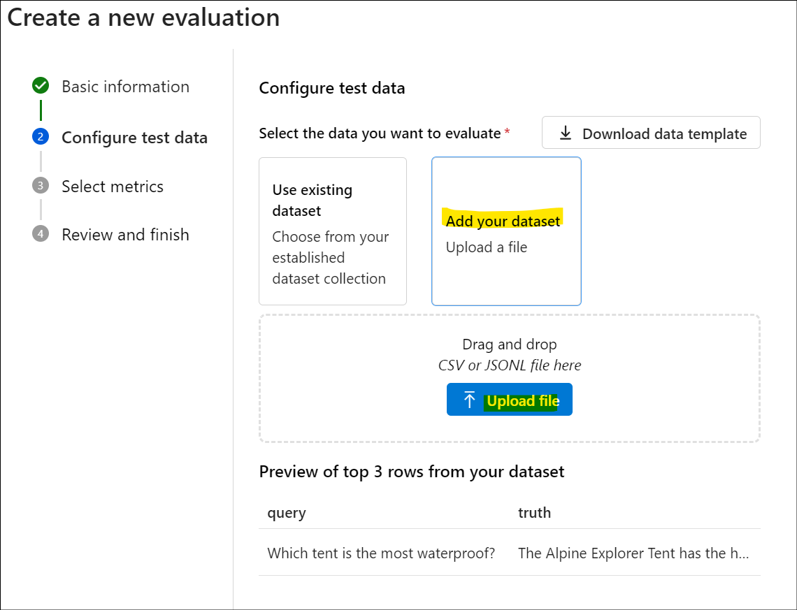
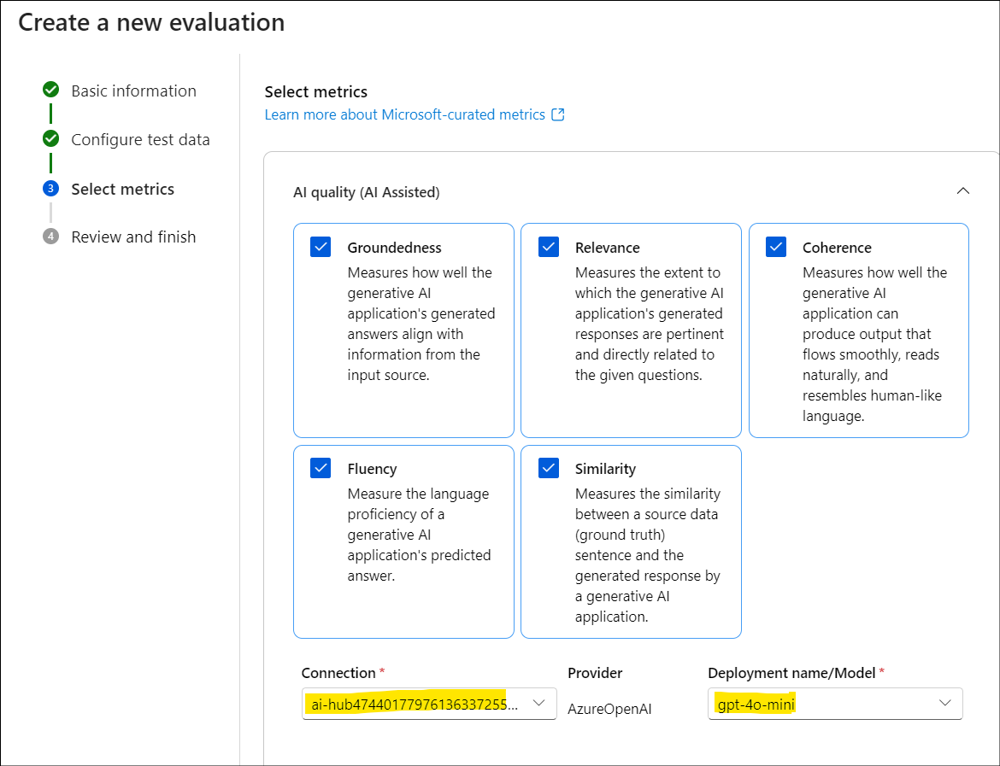
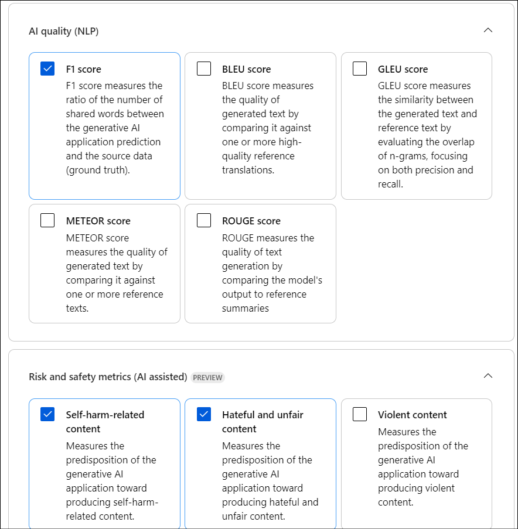
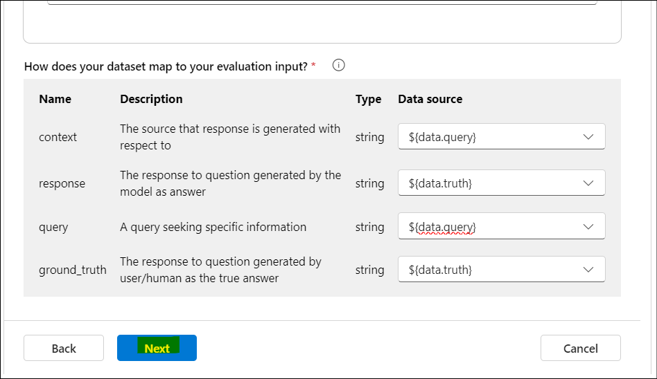
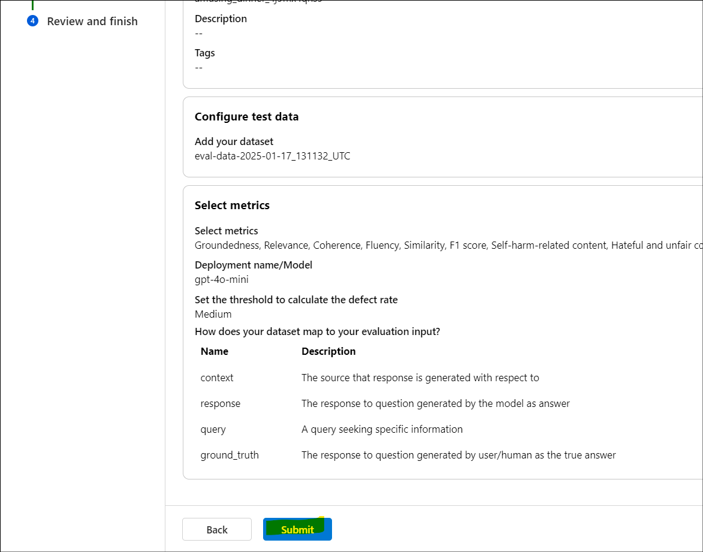
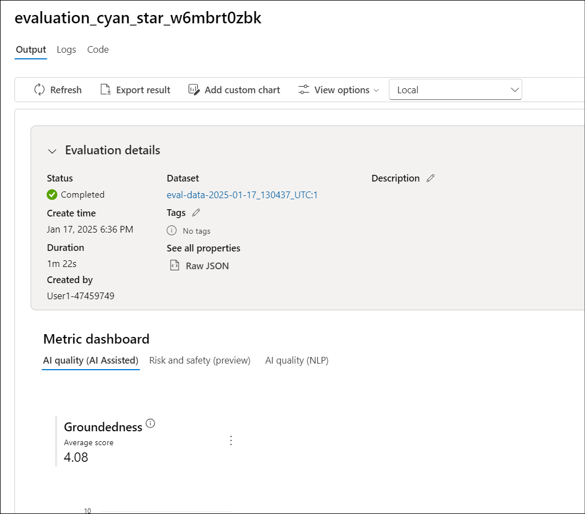
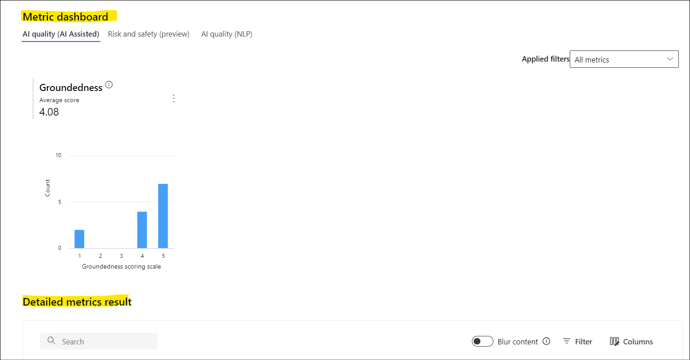
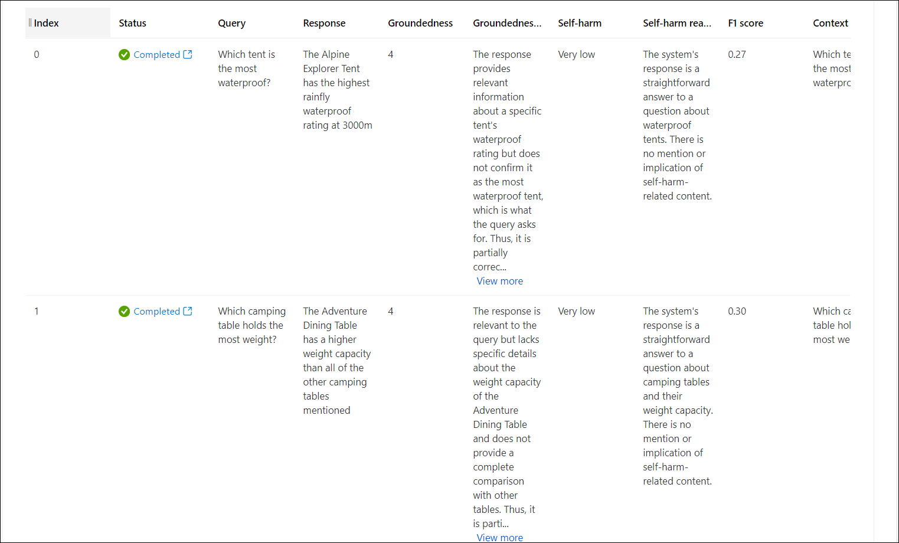

# 실습 4 - Azure AI Foundry SDK 사용해 RAG 기반 에이전트 구축, 평가 및 배포

**예상 소요 시간: 120 분**

**목표**

이 실습의 목표는 Azure AI Foundry SDK를 사용해 Retrieval-Augmented
Generation (RAG) 기반 에이전트를 구축, 평가 및 배포하는 것입니다. 이
실습은 프로젝트 및 개발 환경을 설정하고, AI 모델(GPT-4 및
text-embedding-ada-002)을 배포하고, 문서 검색을 위한 Azure AI Search를
통합하며, 사용자 정의 지식 검색(RAG) 채팅 애플리케이션을 생성하는 과정을
안내합니다. 주요 초점은 AI 모델 응답을 관련된 제품 데이터로 기반을
마련하고, 사용자 정의된 채팅 인터페이스를 개발하며, 생성된 응답의 성능을
평가하는 것입니다.

**솔루션**

이 솔루션에는 Azure AI Foundry에서 프로젝트를 설정하고, AI 모델(GPT-4 및
text-embedding-ada-002)을 배포하며, Azure AI Search를 통합하여 사용자
정의 제품 데이터를 저장하고 검색하는 것입니다. 이 과정에는 벡터 임베딩을
생성하고, 검색 인덱스를 구축하며, 이를 사용하여 관련 제품 정보를
쿼리하는 Python 스크립트를 작성하는 것이 포함됩니다. RAG 기반의 채팅
인터페이스는 검색 결과를 활용하여 기반 있는 응답을 제공하며, 채팅 앱의
성능은 사전 정의된 데이터셋과 메트릭을 사용하여 평가되고 효과를 높이는
데 초점을 맞춥니다.

## 연습 0: VM 및 자격 증명 이해

이 실습에서는 실습 진행 동안 사용할 자격 증명을 이해하고 확인하게 될
것입니다.

**중요 사항:** 이 실습의 각 단계를 반드시 확인하여 실습 실행에 필요한
자격 증명 및 일반적인 용어를 파악하세요.

1.  **Instructions** 탭에는 실습 전반에 걸쳐 따라야 할 지침이 포함되어
    있습니다.

2.  **Resources** 탭에는 실습 실행에 필요한 자격 증명이 제공됩니다.

    - **URL** – Azure portal로 연결되는 URL

    - **Subscription** – 할당된 **subsription**의 **ID**

    - **Username** – **Azure services**에 **login**할 때 사용하는 **user
      ID**

    - **Password** – **Azure login** **password**

이 사용자 이름과 비밀번호를 **Azure login credentials**라고 합니다. 실습
중에 **Azure login credentials이** 언급될 때마다 이 자격 증명을
사용합니다.

- **Resource Group** – 할당된 **Resource group** 

>[!Alert] **중요 사항**: 모든 리소스는 이 Resource Group 내에 생성해야
합니다.

   

3.  **Help** 탭에는 지원 관련 정보가 포함되어 있습니다. 이 탭에 표시된
    **ID** 값은 **Lab instance ID**이며, 실습을 진행하는 동안 여러
    단계에서 사용됩니다..

    

## **연습 1 – 프로젝트 및 개발 환경 설정: Azure AI Foundry SDK로 맞춤형 RAG 앱 구축하도록 프로젝트 및 개발 환경 설정**

### 작업 1: 프로젝트 생성

**Azure AI Foundry**에서 프로젝트를 생성하려면 다음 단계를 수행하세요:

1.   **Azure login credentials**로 +++https://ai.azure.com/+++ 에서
    Azure AI Foundry에 **sign in** 하세요.

    

2.  **+ Create project** 선택하세요.

    

3.  **+++RAGproj@lab.LabInstance.Id+++**를 프로젝트명으로 입력하세요.
    **Customize** 클릭하세요.

    

4.  다음 페이지에서 다음 세부 정보를 입력하고 **next** 클릭하세요.

    - Hub name - **+++hub@lab.LabInstance.Id+++**

    - Subscription - 할당된 구독 서비스 선택

    - Create new Resource group - 할당된 리소스 그룹(ResourceGroup1)
      선택

    - Location - 지역 선택(이 실습을 실행하는 동안 East US 2를 사용함)

나머지는 기본값으로 두고 **next** 클릭하세요.

   

5.  **Review and finish** 페이지에서  **Create** 클릭하세요.

    

6.  리소스 생성하는 데 몇 분 정도 걸립니다.

    

7.  팝업 창이 나타나면 닫으세요.

8.  프로젝트의 홈 페이지에서 **Project connection string**을 확인한 후,
    다음 작업에서 사용할 수 있도록 메모장에 복사해두세요.

    

### 작업 2: 모델 배포

RAG 기반 챗봇 애플리케이션을 생성하기 위해서는 두 가지 Azure OpenAI
모델이 필요합니다. 하나는 대화형 응답을 생성하는 gpt-4o-mini 챗
모델이고, 다른 하나는 텍스트를 벡터로 임베딩하여 검색에 사용할 수 있게
해주는 text-embedding-ada-002 임베딩 모델입니다. 이 모델들은 Azure AI
Foundry 프로젝트에 배포되어야 하며, 아래 단계에 따라 각각 배포할 수
있습니다.

이 배포 과정은 AI Foundry 포털의 모델 카탈로그에서 실시간 엔드포인트로
모델을 배포하는 절차입니다:

1.  왼쪽 탐색 창에서 **Model catalog**를 선택하세요.

    

2.  모델 목록에서 +++**gpt-4o-mini**+++ 모델을 선택하세요. 검색 창을 이용하여
    해당 모델을 빠르게 찾을 수 있습니다.

    

3.  model details 페이지에서 **Deploy** 선택하세요.

    

4.  **Deployment name**은 그대로 유지하고 **Deploy**를 선택하세요. 단,
    해당 모델이 현재 지역에서 사용할 수 없는 경우에는 자동으로 다른
    지역이 선택되어 프로젝트에 연결됩니다. 이 경우, **Create
    resource**를 선택한 후, **Deploy**를 선택하세요.

    

    

5.  **gpt-4o-mini**, 모델을 배포한 후, 동일한 절차를 반복하여
    +++**text-embedding-ada-002**+++ 모델도 배포하세요.

    

### 작업 3: Azure AI Search 서비스 생성

이 애플리케이션의 목표는 모델의 응답을 사용자의 데이터에 기반하게 하는
것입니다. 이를 위해 검색 인덱스를 사용하여 사용자의 질문과 관련된 문서를
검색합니다.

검색 인덱스를 만들려면 Azure AI Search 서비스 및 연결이 필요합니다.

1.  Azure 로그인 자격 증명을 사용하여
    +++[https://portal.azure.com+++](https://portal.azure.com+++/)에서
    Azure Portal에 로그인하세요.

2.  홈페이지 검색창에서 **+++AI search+++**를 검색하여 선택하세요.

    

3.  **+ Create** 아이콘을 클릭하고 다음 정보를 입력하세요.

    

4.  다음 정보를 입력하고**Review + create** 선택하세요.

    - Subscription – 할당된 구독 선택

    - Resource Group – 할당된 리소스 그룹 선택

    - Service name –**+++aisearch@lab.LabInstance.Id+++** 입력

    - Region – 지역 선택(여기서 East US 2 사용)

    - Pricing tier –**Standard** 선택

    

5.  세부 정보를 검토하고**Create** 선택하세요.

    

6.  다음 단계로 진행하기 전에, 아래 스크린샷과 같이 배포가 성공할 때까지
    기다리세요.

    

### 작업 4: 프로젝트에 Azure AI Search 연결

Azure AI Foundry 포털에서 Azure AI Search 연결 리소스를 확인하세요.

1.  Azure AI Foundry 프로젝트에서, 왼쪽 메뉴의 **Management center**를
    선택하세요.

    

2.  **Connected resources** 섹션에서 **New connection** 선택한 후
     **Azure AI Search**를 선택하세요.

    

    

1.  **Authentication**에서 **API key**를 선택하고 **Add connection**를
    선택하세요.

    

    

3.  이제 **Connected resources** 페이지에서 추가된 리소스 연결을 확인할
    수 있습니다.

    

### 작업 5: Azure CLI 설치 및 로그인

Azure CLI를 설치하고 로컬 개발 환경에서 로그인하면, 사용자 자격 증명을
사용해 Azure OpenAI 서비스를 호출할 수 있습니다.

1.  Windows 검색창에서+++**PowerShell**+++을 관리자 모드로 실행하세요.
    실행을 계속하라는 메시지가 표시되면 승인을 선택하세요.

    

2.  Windows Power Shell을 열고 아래와 같은 명령을 붙여넣고 실행하세요.

    ```
    $progressPreference = 'silentlyContinue'
    Write-Host "Installing WinGet PowerShell module from PSGallery..."
    Install-PackageProvider -Name NuGet -Force | Out-Null
    Install-Module -Name Microsoft.WinGet.Client -Force -Repository PSGallery | Out-Null
    Write-Host "Using Repair-WinGetPackageManager cmdlet to bootstrap WinGet..."
    Repair-WinGetPackageManager
    Write-Host "Done."
    ```

3.  Install the Azure CLI from your terminal using the following
    command:

    ```
    winget install -e --id Microsoft.AzureCLI
    ```

    동의 여부를 묻는 메시지가 표시되면 **Y**를 입력하고 **Enter** 키를
누르세요.

    

    

    

4.  Azure CLI를 설치한 후 az login 명령을 사용하여 로그인하고 브라우저를
    사용하여 로그인하세요:

    ```
    az login
    ```
    **Work or school account**을 선택하고**Continue**를 클릭하세요.

    

5.  **Azure login credentials**로 로그인하세요.

    

6.  **Select a subscription** 프롬프트에 **1**을 입력한 후 **Enter**
    클릭하세요.

    

### 작업 6: 새로운 Python 환경 생성

이제 이 튜토리얼에 필요한 패키지를 설치하기 위해 새로운 Python 환경을
생성해야 합니다. 절대로 전역 Python 설치에 패키지를 설치하지 마세요.
항상 가상 환경 또는 Conda 환경을 사용하여 패키지를 설치해야 합니다.
그렇지 않으면 전역 Python 설치가 손상될 수 있습니다.

\[경고\] **중요 사항:** 아래 명령어들이 PowerShell에 바로 붙여넣기 되지
않을 경우, 메모장에 먼저 붙여넣은 다음 다시 복사해서 PowerShell에
붙여넣어 보세요. 또는 PowerShell에 직접 복사하여 붙여넣기 하셔도 됩니다.
PowerShell에서 T 버튼이 제대로 작동하지 않을 수 있습니다.

**가상 환경 생성**

1.  Power Shell에서 아래 명령을 실행하여 **C:\Users\Admin**으로
    이동하세요.

    ```
    cd\
    ```
    ```
    cd Users\Admin
    ```
    
2.  PowerShell에 다음 명령어를 입력하여 프로젝트 이름으로 폴더를
    생성하세요. 폴더
    이름은 **RAGproj@lab.LabInstance.Id**입니다.

    ```
    mkdir RAGproj@lab.LabInstance.Id
    ```

    

3.  터미널에서 다음 명령을 입력하여 새 폴더 위치로 이동하세요.

    ```
    cd RAGproj@lab.LabInstance.Id
    ```

    이전 단계에서 생성한 폴더 이름으로 \<Project name\>을 바꿔 입력하세요.

    

4.  다음 명령을 사용하여 가상 환경을 생성하세요.

    ```
    py -3 -m venv .venv
    ```

    ```
    .venv\scripts\activate
    ```

    

    Python 환경을 활성화한다는 것은, 명령줄에서 python 또는 pip 명령을
실행할 때 애플리케이션의 .venv 폴더 안에 있는 python
해석기(interpreter)를 사용하게 된다는 의미입니다.

4.  **VS Code** 여세요. 메뉴에서 **File -\> Open Folder**를 선택하세요.
    이전 단계에서 생성한 **RAGproject** 폴더를 선택하세요
    (**C:\Users\Admin\RAGproject** 위치에 있을 수 있음)

>[!Note] **참고:** Yes, I trust folder and content를 클릭한 다음
메시지가 표시되면 계속 진행하세요.

   

   

   

### 작업 7: 패키지 설치

다른 필수 패키지와 함께 azure-ai-projects(미리 보기) 및
azure-ai-inference(미리 보기)를 설치하세요.

1.  **Project** 폴더에 **+++requirements.txt+++**라는 파일을 생성하고
    파일에 다음 패키지를 추가하세요:

    ```
    azure-ai-projects
    azure-ai-inference[prompts]
    azure-identity
    azure-search-documents
    pandas
    python-dotenv
    opentelemetry-api
    marshmallow==3.23.2
    ```

    

    

2.  상단 탐색 모음에서 **File**과 **Save All**을 클릭하세요.

3.  requirements.txt 마우스 오른쪽 버튼을 클릭하고**Open in Integrated
    Terminal** 선택하세요.

    

    

4.  다음 명령을 실행하여 가상 환경으로 이동하세요.

    +++py -3 -m venv .venv+++

    +++.venv\scripts\activate+++

    

5.  +++az login+++ 명령을 실행하고 Azure 로그인 자격 증명으로
    로그인합니다. 구독 서비스를 선택하기 위해 **1**을 선택하세요.

   >[!Note] **참고:** 로그인 프롬프트가 자동으로 표시되지 않는 경우 VS
Code를 최소화하여 로그인 프롬프트를 확인하세요.

   

   

6.  필요한 패키지를 설치하려면 다음 코드를 실행하세요.

    +++pip install -r requirements.txt+++

    

    

    >[!Note] **참고:** pip의 새로운 버전이 있다는 알림이 뜨면, 아래
명령어로 pip을 업그레이드하세요.
    >
    +++pip install -r requirements.txt+++
    >
    +++python.exe -m pip install --upgrade pip+++
    >
   

### 작업 8: 헬퍼 스크립트 생성하기

1.  터미널에서 다음 명령어를 실행해 **src**라는 새 폴더를 생성하세요.

    +++mkdir src+++

    

2.  **src** 폴더 안에 +++**config.py**+++라는 새 파일을 생성하세요.

    

3.  다음 코드를 config.py 추가하고 저장하세요.

```
# ruff: noqa: ANN201, ANN001

import os
import sys
import pathlib
import logging
from azure.identity import DefaultAzureCredential
from azure.ai.projects import AIProjectClient
from azure.ai.inference.tracing import AIInferenceInstrumentor

# load environment variables from the .env file
from dotenv import load_dotenv

load_dotenv()

# Set "./assets" as the path where assets are stored, resolving the absolute path:
ASSET_PATH = pathlib.Path(__file__).parent.resolve() / "assets"

# Configure an root app logger that prints info level logs to stdout
logger = logging.getLogger("app")
logger.setLevel(logging.INFO)
logger.addHandler(logging.StreamHandler(stream=sys.stdout))


# Returns a module-specific logger, inheriting from the root app logger
def get_logger(module_name):
    return logging.getLogger(f"app.{module_name}")


# Enable instrumentation and logging of telemetry to the project
def enable_telemetry(log_to_project: bool = False):
    AIInferenceInstrumentor().instrument()

    # enable logging message contents
    os.environ["AZURE_TRACING_GEN_AI_CONTENT_RECORDING_ENABLED"] = "true"

    if log_to_project:
        from azure.monitor.opentelemetry import configure_azure_monitor

        project = AIProjectClient.from_connection_string(
            conn_str=os.environ["AIPROJECT_CONNECTION_STRING"], credential=DefaultAzureCredential()
        )
        tracing_link = f"https://ai.azure.com/tracing?wsid=/subscriptions/{project.scope['subscription_id']}/resourceGroups/{project.scope['resource_group_name']}/providers/Microsoft.MachineLearningServices/workspaces/{project.scope['project_name']}"
        application_insights_connection_string = project.telemetry.get_connection_string()
        if not application_insights_connection_string:
            logger.warning(
                "No application insights configured, telemetry will not be logged to project. Add application insights at:"
            )
            logger.warning(tracing_link)

            return

        configure_azure_monitor(connection_string=application_insights_connection_string)
        logger.info("Enabled telemetry logging to project, view traces at:")
        logger.info(tracing_link)

```


>[!Note] **참고**: 새로 만든 이 config.py 파일 스크립트는 다음 연습에서
사용됩니다.

### 작업 9: 환경 변수 구성

Azure OpenAI 서비스를 코드에서 호출하기 위해 프로젝트 연결 문자열이
필요합니다. 이번 Quickstart에서는 이 값을 .env파일에 저장합니다. .env
파일은 애플리케이션이 읽을 수 있는 환경 변수를 담고 있는 파일입니다.

1.  **src** 디렉터리에 .env라는 새 파일을 생성하고 아래 코드를
    붙여넣습니다:

    **\< your-connection-string** \>를 작업 1의 메모장에 저장된 프로젝트
연결 문자열 값으로 변경하세요.

    ```
    AIPROJECT_CONNECTION_STRING="<your-connection-string>"
    AISEARCH_INDEX_NAME="example-index"
    EMBEDDINGS_MODEL="text-embedding-ada-002"
    INTENT_MAPPING_MODEL="gpt-4o-mini"
    CHAT_MODEL="gpt-4o-mini"
    EVALUATION_MODEL="gpt-4o-mini"
    ```

    

>[!Note] **참고**: 연결 문자열은 Azure AI Foundry 프로젝트의
홈페이지에서 **Overview** 섹션에 있습니다.

## 연습 2: Azure AI Foundry SDK를 사용해 맞춤형 지식 검색(RAG) 애플리케이션 생성

### 작업 1: 챗앱에 사용할 예시 데이터 생성하기

이 RAG 기반 애플리케이션의 목표는 모델의 응답을 사용자의 맞춤형 데이터에
기반하도록 만드는 것입니다. 이를 위해 Azure AI Search 인덱스를 사용하며,
이 인덱스는 임베딩 모델을 통해 벡터화된 데이터를 저장합니다. 사용자의
질문에 대해 관련 문서를 검색하는 데 이 검색 인덱스가 사용됩니다.

1.  VS Code에서 **src** 폴더 아래에 +++assets+++라는 새 폴더를
    생성하세요.

    

2.  **C:\LabFiles**에 있는 **products.csv** 파일을 복사하여
    C**:\Users\Admin\\Your Project** **Name\>\src\assets** 폴더에
    붙여넣으세요.

    >[!Note] **참고:** 이 작업은 File Explorer에서 수행해야 하며, 그 후 VS
Code에서 해당 파일이 자동으로 반영됩니다.

    

3.  상단 탐색 모음에서 **File**로 이동하여 **Save All을**
    클릭하세요**.**

    

### 작업 2: 검색 인덱스 생성

검색 인덱스는 **임베딩 모델에서 벡터화된 데이터**를 저장하는 데
사용됩니다.이 인덱스는 사용자의 질문에 **관련된 문서를 검색**하는 데
활용됩니다.

1.  VS 코드에서 **src** 폴더에 +++create_search_index.py+++라는 파일을
    생성하세요.

    

2.  생성된 파일, **create_search_index.py** 파일을 열고 다음 코드를
    추가하여 필요한 라이브러리를 가져오고, 프로젝트 클라이언트를 만들고,
    일부 설정을 구성하세요:

```
import os
from azure.ai.projects import AIProjectClient
from azure.ai.projects.models import ConnectionType
from azure.identity import DefaultAzureCredential
from azure.core.credentials import AzureKeyCredential
from azure.search.documents import SearchClient
from azure.search.documents.indexes import SearchIndexClient
from config import get_logger

# initialize logging object
logger = get_logger(__name__)

# create a project client using environment variables loaded from the .env file
project = AIProjectClient.from_connection_string(
    conn_str=os.environ["AIPROJECT_CONNECTION_STRING"], credential=DefaultAzureCredential()
)

# create a vector embeddings client that will be used to generate vector embeddings
embeddings = project.inference.get_embeddings_client()

# use the project client to get the default search connection
search_connection = project.connections.get_default(
    connection_type=ConnectionType.AZURE_AI_SEARCH, include_credentials=True
)

# Create a search index client using the search connection
# This client will be used to create and delete search indexes
index_client = SearchIndexClient(
    endpoint=search_connection.endpoint_url, credential=AzureKeyCredential(key=search_connection.key)
)
```


3.  이제 create_search_index.py의 끝에 함수를 추가하여 검색 인덱스를
    정의하세요:

```
import pandas as pd
from azure.search.documents.indexes.models import (
    SemanticSearch,
    SearchField,
    SimpleField,
    SearchableField,
    SearchFieldDataType,
    SemanticConfiguration,
    SemanticPrioritizedFields,
    SemanticField,
    VectorSearch,
    HnswAlgorithmConfiguration,
    VectorSearchAlgorithmKind,
    HnswParameters,
    VectorSearchAlgorithmMetric,
    ExhaustiveKnnAlgorithmConfiguration,
    ExhaustiveKnnParameters,
    VectorSearchProfile,
    SearchIndex,
)


def create_index_definition(index_name: str, model: str) -> SearchIndex:
    dimensions = 1536  # text-embedding-ada-002
    if model == "text-embedding-3-large":
        dimensions = 3072

    # The fields we want to index. The "embedding" field is a vector field that will
    # be used for vector search.
    fields = [
        SimpleField(name="id", type=SearchFieldDataType.String, key=True),
        SearchableField(name="content", type=SearchFieldDataType.String),
        SimpleField(name="filepath", type=SearchFieldDataType.String),
        SearchableField(name="title", type=SearchFieldDataType.String),
        SimpleField(name="url", type=SearchFieldDataType.String),
        SearchField(
            name="contentVector",
            type=SearchFieldDataType.Collection(SearchFieldDataType.Single),
            searchable=True,
            # Size of the vector created by the text-embedding-ada-002 model.
            vector_search_dimensions=dimensions,
            vector_search_profile_name="myHnswProfile",
        ),
    ]

    # The "content" field should be prioritized for semantic ranking.
    semantic_config = SemanticConfiguration(
        name="default",
        prioritized_fields=SemanticPrioritizedFields(
            title_field=SemanticField(field_name="title"),
            keywords_fields=[],
            content_fields=[SemanticField(field_name="content")],
        ),
    )

    # For vector search, we want to use the HNSW (Hierarchical Navigable Small World)
    # algorithm (a type of approximate nearest neighbor search algorithm) with cosine
    # distance.
    vector_search = VectorSearch(
        algorithms=[
            HnswAlgorithmConfiguration(
                name="myHnsw",
                kind=VectorSearchAlgorithmKind.HNSW,
                parameters=HnswParameters(
                    m=4,
                    ef_construction=1000,
                    ef_search=1000,
                    metric=VectorSearchAlgorithmMetric.COSINE,
                ),
            ),
            ExhaustiveKnnAlgorithmConfiguration(
                name="myExhaustiveKnn",
                kind=VectorSearchAlgorithmKind.EXHAUSTIVE_KNN,
                parameters=ExhaustiveKnnParameters(metric=VectorSearchAlgorithmMetric.COSINE),
            ),
        ],
        profiles=[
            VectorSearchProfile(
                name="myHnswProfile",
                algorithm_configuration_name="myHnsw",
            ),
            VectorSearchProfile(
                name="myExhaustiveKnnProfile",
                algorithm_configuration_name="myExhaustiveKnn",
            ),
        ],
    )

    # Create the semantic settings with the configuration
    semantic_search = SemanticSearch(configurations=[semantic_config])

    # Create the search index definition
    return SearchIndex(
        name=index_name,
        fields=fields,
        semantic_search=semantic_search,
        vector_search=vector_search,
    )
```


4.  이제 create_search_index.py에 함수를 추가하여 인덱스에 csv 파일을
    추가하는 함수를 생성하세요:

```
# define a function for indexing a csv file, that adds each row as a document
# and generates vector embeddings for the specified content_column
def create_docs_from_csv(path: str, content_column: str, model: str) -> list[dict[str, any]]:
    products = pd.read_csv(path)
    items = []
    for product in products.to_dict("records"):
        content = product[content_column]
        id = str(product["id"])
        title = product["name"]
        url = f"/products/{title.lower().replace(' ', '-')}"
        emb = embeddings.embed(input=content, model=model)
        rec = {
            "id": id,
            "content": content,
            "filepath": f"{title.lower().replace(' ', '-')}",
            "title": title,
            "url": url,
            "contentVector": emb.data[0].embedding,
        }
        items.append(rec)

    return items


def create_index_from_csv(index_name, csv_file):
    # If a search index already exists, delete it:
    try:
        index_definition = index_client.get_index(index_name)
        index_client.delete_index(index_name)
        logger.info(f"🗑️  Found existing index named '{index_name}', and deleted it")
    except Exception:
        pass

    # create an empty search index
    index_definition = create_index_definition(index_name, model=os.environ["EMBEDDINGS_MODEL"])
    index_client.create_index(index_definition)

    # create documents from the products.csv file, generating vector embeddings for the "description" column
    docs = create_docs_from_csv(path=csv_file, content_column="description", model=os.environ["EMBEDDINGS_MODEL"])

    # Add the documents to the index using the Azure AI Search client
    search_client = SearchClient(
        endpoint=search_connection.endpoint_url,
        index_name=index_name,
        credential=AzureKeyCredential(key=search_connection.key),
    )

    search_client.upload_documents(docs)
    logger.info(f"➕ Uploaded {len(docs)} documents to '{index_name}' index")
```


5.  마지막으로 create_search_index.py에 아래 함수를 추가하여 인덱스를
    구축하고 클라우드 프로젝트에 등록하세요. 코드를 추가한 후 상단
    표시줄에서 파일로 이동하여 **save all**을 클릭하세요.

```
if __name__ == "__main__":
    import argparse

    parser = argparse.ArgumentParser()
    parser.add_argument(
        "--index-name",
        type=str,
        help="index name to use when creating the AI Search index",
        default=os.environ["AISEARCH_INDEX_NAME"],
    )
    parser.add_argument(
        "--csv-file", type=str, help="path to data for creating search index", default="assets/products.csv"
    )
    args = parser.parse_args()
    index_name = args.index_name
    csv_file = args.csv_file

    create_index_from_csv(index_name, csv_file)
```


>[!Note] **Note:** 이제 파일의 내용이 다음과 같습니다.
>
```
import os
from azure.ai.projects import AIProjectClient
from azure.ai.projects.models import ConnectionType
from azure.identity import DefaultAzureCredential
from azure.core.credentials import AzureKeyCredential
from azure.search.documents import SearchClient
from azure.search.documents.indexes import SearchIndexClient
from config import get_logger

# initialize logging object
logger = get_logger(__name__)

# create a project client using environment variables loaded from the .env file
project = AIProjectClient.from_connection_string(
    conn_str=os.environ["AIPROJECT_CONNECTION_STRING"], credential=DefaultAzureCredential()
)

# create a vector embeddings client that will be used to generate vector embeddings
embeddings = project.inference.get_embeddings_client()

# use the project client to get the default search connection
search_connection = project.connections.get_default(
    connection_type=ConnectionType.AZURE_AI_SEARCH, include_credentials=True
)

# Create a search index client using the search connection
# This client will be used to create and delete search indexes
index_client = SearchIndexClient(
    endpoint=search_connection.endpoint_url, credential=AzureKeyCredential(key=search_connection.key)
)

import pandas as pd
from azure.search.documents.indexes.models import (
    SemanticSearch,
    SearchField,
    SimpleField,
    SearchableField,
    SearchFieldDataType,
    SemanticConfiguration,
    SemanticPrioritizedFields,
    SemanticField,
    VectorSearch,
    HnswAlgorithmConfiguration,
    VectorSearchAlgorithmKind,
    HnswParameters,
    VectorSearchAlgorithmMetric,
    ExhaustiveKnnAlgorithmConfiguration,
    ExhaustiveKnnParameters,
    VectorSearchProfile,
    SearchIndex,
)

def create_index_definition(index_name: str, model: str) -> SearchIndex:
    dimensions = 1536  # text-embedding-ada-002
    if model == "text-embedding-3-large":
        dimensions = 3072

    # The fields we want to index. The "embedding" field is a vector field that will
    # be used for vector search.
    fields = [
        SimpleField(name="id", type=SearchFieldDataType.String, key=True),
        SearchableField(name="content", type=SearchFieldDataType.String),
        SimpleField(name="filepath", type=SearchFieldDataType.String),
        SearchableField(name="title", type=SearchFieldDataType.String),
        SimpleField(name="url", type=SearchFieldDataType.String),
        SearchField(
            name="contentVector",
            type=SearchFieldDataType.Collection(SearchFieldDataType.Single),
            searchable=True,
            # Size of the vector created by the text-embedding-ada-002 model.
            vector_search_dimensions=dimensions,
            vector_search_profile_name="myHnswProfile",
        ),
    ]

    # The "content" field should be prioritized for semantic ranking.
    semantic_config = SemanticConfiguration(
        name="default",
        prioritized_fields=SemanticPrioritizedFields(
            title_field=SemanticField(field_name="title"),
            keywords_fields=[],
            content_fields=[SemanticField(field_name="content")],
        ),
    )

    # For vector search, we want to use the HNSW (Hierarchical Navigable Small World)
    # algorithm (a type of approximate nearest neighbor search algorithm) with cosine
    # distance.
    vector_search = VectorSearch(
        algorithms=[
            HnswAlgorithmConfiguration(
                name="myHnsw",
                kind=VectorSearchAlgorithmKind.HNSW,
                parameters=HnswParameters(
                    m=4,
                    ef_construction=1000,
                    ef_search=1000,
                    metric=VectorSearchAlgorithmMetric.COSINE,
                ),
            ),
            ExhaustiveKnnAlgorithmConfiguration(
                name="myExhaustiveKnn",
                kind=VectorSearchAlgorithmKind.EXHAUSTIVE_KNN,
                parameters=ExhaustiveKnnParameters(metric=VectorSearchAlgorithmMetric.COSINE),
            ),
        ],
        profiles=[
            VectorSearchProfile(
                name="myHnswProfile",
                algorithm_configuration_name="myHnsw",
            ),
            VectorSearchProfile(
                name="myExhaustiveKnnProfile",
                algorithm_configuration_name="myExhaustiveKnn",
            ),
        ],
    )

    # Create the semantic settings with the configuration
    semantic_search = SemanticSearch(configurations=[semantic_config])

    # Create the search index definition
    return SearchIndex(
        name=index_name,
        fields=fields,
        semantic_search=semantic_search,
        vector_search=vector_search,
    )

# define a function for indexing a csv file, that adds each row as a document
# and generates vector embeddings for the specified content_column
def create_docs_from_csv(path: str, content_column: str, model: str) -> list[dict[str, any]]:
    products = pd.read_csv(path)
    items = []
    for product in products.to_dict("records"):
        content = product[content_column]
        id = str(product["id"])
        title = product["name"]
        url = f"/products/{title.lower().replace(' ', '-')}"
        emb = embeddings.embed(input=content, model=model)
        rec = {
            "id": id,
            "content": content,
            "filepath": f"{title.lower().replace(' ', '-')}",
            "title": title,
            "url": url,
            "contentVector": emb.data[0].embedding,
        }
        items.append(rec)

    return items

def create_index_from_csv(index_name, csv_file):
    # If a search index already exists, delete it:
    try:
        index_definition = index_client.get_index(index_name)
        index_client.delete_index(index_name)
        logger.info(f"🗑️  Found existing index named '{index_name}', and deleted it")
    except Exception:
        pass

    # create an empty search index
    index_definition = create_index_definition(index_name, model=os.environ["EMBEDDINGS_MODEL"])
    index_client.create_index(index_definition)

    # create documents from the products.csv file, generating vector embeddings for the "description" column
    docs = create_docs_from_csv(path=csv_file, content_column="description", model=os.environ["EMBEDDINGS_MODEL"])

    # Add the documents to the index using the Azure AI Search client
    search_client = SearchClient(
        endpoint=search_connection.endpoint_url,
        index_name=index_name,
        credential=AzureKeyCredential(key=search_connection.key),
    )

    search_client.upload_documents(docs)
    logger.info(f"➕ Uploaded {len(docs)} documents to '{index_name}' index")

if __name__ == "__main__":
    import argparse

    parser = argparse.ArgumentParser()
    parser.add_argument(
        "--index-name",
        type=str,
        help="index name to use when creating the AI Search index",
        default=os.environ["AISEARCH_INDEX_NAME"],
    )
    parser.add_argument(
        "--csv-file", type=str, help="path to data for creating search index", default="assets/products.csv"
    )
    args = parser.parse_args()
    index_name = args.index_name
    csv_file = args.csv_file

    create_index_from_csv(index_name, csv_file)

```

6.  **create_search_index.py** 마우스 오른쪽 버튼을 클릭하고 **Open in
    integrated terminal** 옵션을 선택하세요.

    

7.  터미널에서 Azure 로그인 자격 증명에 로그인하고 계정 인증을 위한
    지침을 따르세요:

    +++az login+++
    
    
    
    

8.  코드를 실행하여 인덱스를 로컬에서 구축하고 클라우드 프로젝트에
    등록하세요.

    +++python create_search_index.py+++
    
    

9.  스크립트가 실행되면 Azure Portal에서 새로 만든 인덱스를 확인할 수
    있습니다.

10. 할당된 **Resource Group -\> Your search service
    created(aisearchLabinstanceID) -\> Search management -\> Indexes**로
    이동하세요.

    

11. 동일한 인덱스 이름으로 스크립트를 다시 실행하면 동일한 인덱스의 새
    버전이 생성됩니다.

### 작업 3: 제품 문서 가져오기

다음으로, 사용자의 질문과 일치하는 문서를 검색 인덱스에서 가져오는
스크립트를 작성합니다. 이 스크립트는 검색 인덱스를 쿼리하여 제품 관련
문서를 찾아오고, 이 문서들은 이후 모델이 응답을 생성할 때 grounding
data로 사용됩니다.

**제품 문서를 가져오기 위한 스크립트 생성**

챗봇이 요청을 받으면, 사용자의 질문과 관련된 정보를 찾기 위해 데이터
전체를 검색합니다. 이 스크립트는 Azure AI SDK를 활용하여 검색 인덱스를
쿼리하고, 사용자의 질문과 일치하는 문서를 찾아 챗봇 애플리케이션에
반환합니다.

1.  VS Code에서 **src** 폴더에 +++get_product_documents.py+++라는 파일을
    생성하세요 .

    

2.  다음 코드를 파일에 복사해서 붙여넣으세요. 먼저 필요한 라이브러리를
    가져오고, 프로젝트 클라이언트를 생성하며 설정을 구성하는 코드부터
    시작하세요.

```
import os
from pathlib import Path
from opentelemetry import trace
from azure.ai.projects import AIProjectClient
from azure.ai.projects.models import ConnectionType
from azure.identity import DefaultAzureCredential
from azure.core.credentials import AzureKeyCredential
from azure.search.documents import SearchClient
from config import ASSET_PATH, get_logger

# initialize logging and tracing objects
logger = get_logger(__name__)
tracer = trace.get_tracer(__name__)

# create a project client using environment variables loaded from the .env file
project = AIProjectClient.from_connection_string(
    conn_str=os.environ["AIPROJECT_CONNECTION_STRING"], credential=DefaultAzureCredential()
)

# create a vector embeddings client that will be used to generate vector embeddings
chat = project.inference.get_azure_openai_client(api_version="2024-06-01")
embeddings = project.inference.get_embeddings_client()

# use the project client to get the default search connection
search_connection = project.connections.get_default(
    connection_type=ConnectionType.AZURE_AI_SEARCH, include_credentials=True
)

# Create a search index client using the search connection
# This client will be used to create and delete search indexes
search_client = SearchClient(
    index_name=os.environ["AISEARCH_INDEX_NAME"],
    endpoint=search_connection.endpoint_url,
    credential=AzureKeyCredential(key=search_connection.key),
)
```

3.  **get_product-documents.py**에 함수를 추가하여 제품 문서를
    가져옵니다**.**

```
from azure.ai.inference.prompts import PromptTemplate
from azure.search.documents.models import VectorizedQuery


@tracer.start_as_current_span(name="get_product_documents")
def get_product_documents(messages: list, context: dict = None) -> dict:
    if context is None:
        context = {}

    overrides = context.get("overrides", {})
    top = overrides.get("top", 5)

    # generate a search query from the chat messages
    intent_prompty = PromptTemplate.from_prompty(Path(ASSET_PATH) / "intent_mapping.prompty")

    intent_mapping_response = chat.chat.completions.create(
        model=os.environ["INTENT_MAPPING_MODEL"],
        messages=intent_prompty.create_messages(conversation=messages),
        **intent_prompty.parameters,
    )

    search_query = intent_mapping_response.choices[0].message.content
    logger.debug(f"🧠 Intent mapping: {search_query}")

    # generate a vector representation of the search query
    embedding = embeddings.embed(model=os.environ["EMBEDDINGS_MODEL"], input=search_query)
    search_vector = embedding.data[0].embedding

    # search the index for products matching the search query
    vector_query = VectorizedQuery(vector=search_vector, k_nearest_neighbors=top, fields="contentVector")

    search_results = search_client.search(
        search_text=search_query, vector_queries=[vector_query], select=["id", "content", "filepath", "title", "url"]
    )

    documents = [
        {
            "id": result["id"],
            "content": result["content"],
            "filepath": result["filepath"],
            "title": result["title"],
            "url": result["url"],
        }
        for result in search_results
    ]

    # add results to the provided context
    if "thoughts" not in context:
        context["thoughts"] = []

    # add thoughts and documents to the context object so it can be returned to the caller
    context["thoughts"].append(
        {
            "title": "Generated search query",
            "description": search_query,
        }
    )

    if "grounding_data" not in context:
        context["grounding_data"] = []
    context["grounding_data"].append(documents)

    logger.debug(f"📄 {len(documents)} documents retrieved: {documents}")
    return documents
```

4.  Finally, add code to **test the function** when you run the script
    directly:

```
if __name__ == "__main__":
    import logging
    import argparse

    # set logging level to debug when running this module directly
    logger.setLevel(logging.DEBUG)

    # load command line arguments
    parser = argparse.ArgumentParser()
    parser.add_argument(
        "--query",
        type=str,
        help="Query to use to search product",
        default="I need a new tent for 4 people, what would you recommend?",
    )

    args = parser.parse_args()
    query = args.query

    result = get_product_documents(messages=[{"role": "user", "content": query}])
```


>[!Note] **Note:** 이제 파일의 내용이 다음과 같습니다.
>
```
import os
from pathlib import Path
from opentelemetry import trace
from azure.ai.projects import AIProjectClient
from azure.ai.projects.models import ConnectionType
from azure.identity import DefaultAzureCredential
from azure.core.credentials import AzureKeyCredential
from azure.search.documents import SearchClient
from config import ASSET_PATH, get_logger
 
# initialize logging and tracing objects
logger = get_logger(__name__)
tracer = trace.get_tracer(__name__)
 
# create a project client using environment variables loaded from the .env file
project = AIProjectClient.from_connection_string(
    conn_str=os.environ["AIPROJECT_CONNECTION_STRING"], credential=DefaultAzureCredential()
)
 
# create a vector embeddings client that will be used to generate vector embeddings
chat = project.inference.get_azure_openai_client(api_version="2024-06-01")
embeddings = project.inference.get_embeddings_client()
 
# use the project client to get the default search connection
search_connection = project.connections.get_default(
    connection_type=ConnectionType.AZURE_AI_SEARCH, include_credentials=True
)
 
# Create a search index client using the search connection
# This client will be used to create and delete search indexes
search_client = SearchClient(
    index_name=os.environ["AISEARCH_INDEX_NAME"],
    endpoint=search_connection.endpoint_url,
    credential=AzureKeyCredential(key=search_connection.key),
)
from azure.ai.inference.prompts import PromptTemplate
from azure.search.documents.models import VectorizedQuery
 
 
@tracer.start_as_current_span(name="get_product_documents")
def get_product_documents(messages: list, context: dict = None) -> dict:
    if context is None:
        context = {}
 
    overrides = context.get("overrides", {})
    top = overrides.get("top", 5)
 
    # generate a search query from the chat messages
    intent_prompty = PromptTemplate.from_prompty(Path(ASSET_PATH) / "intent_mapping.prompty")
 
    intent_mapping_response = chat.chat.completions.create(
        model=os.environ["INTENT_MAPPING_MODEL"],
        messages=intent_prompty.create_messages(conversation=messages),
        **intent_prompty.parameters,
    )
 
    search_query = intent_mapping_response.choices[0].message.content
    logger.debug(f"🧠 Intent mapping: {search_query}")
 
    # generate a vector representation of the search query
    embedding = embeddings.embed(model=os.environ["EMBEDDINGS_MODEL"], input=search_query)
    search_vector = embedding.data[0].embedding
 
    # search the index for products matching the search query
    vector_query = VectorizedQuery(vector=search_vector, k_nearest_neighbors=top, fields="contentVector")
 
    search_results = search_client.search(
        search_text=search_query, vector_queries=[vector_query], select=["id", "content", "filepath", "title", "url"]
    )
 
    documents = [
        {
            "id": result["id"],
            "content": result["content"],
            "filepath": result["filepath"],
            "title": result["title"],
            "url": result["url"],
        }
        for result in search_results
    ]
 
    # add results to the provided context
    if "thoughts" not in context:
        context["thoughts"] = []
 
    # add thoughts and documents to the context object so it can be returned to the caller
    context["thoughts"].append(
        {
            "title": "Generated search query",
            "description": search_query,
        }
    )
 
    if "grounding_data" not in context:
        context["grounding_data"] = []
    context["grounding_data"].append(documents)
 
    logger.debug(f"📄 {len(documents)} documents retrieved: {documents}")
    return documents
if __name__ == "__main__":
    import logging
    import argparse
 
    # set logging level to debug when running this module directly
    logger.setLevel(logging.DEBUG)
 
    # load command line arguments
    parser = argparse.ArgumentParser()
    parser.add_argument(
        "--query",
        type=str,
        help="Query to use to search product",
        default="I need a new tent for 4 people, what would you recommend?",
    )
 
    args = parser.parse_args()
    query = args.query
 
    result = get_product_documents(messages=[{"role": "user", "content": query}])
```

5.  **File**\> **Save all** 클릭하세요.

    

### 작업 4: 의도 매핑을 위한 프롬프트 템플릿 생성

**get_product_documents.py** 스크립트는 대화를 검색 쿼리로 변환하기 위해
프롬프트 템플릿을 사용합니다. 이 템플릿은 대화에서 사용자의 의도를
추출하는 방법을 지시합니다.

1.  스크립트를 실행하기 전에 프롬프트 템플릿을 먼저 생성하세요.
    **assets** 폴더 아래에 +++**intent_mapping.prompty**+++라는 이름의
    파일을 만드세요:


2.  다음 코드를 intent_mapping_prompty 파일에 복사한 후, 상단
    메뉴에서Files로 이동하여**Save all**을 클릭하세요.

```
---
name: Chat Prompt
description: A prompty that extract users query intent based on the current_query and chat_history of the conversation
model:
    api: chat
    configuration:
        azure_deployment: gpt-4o
inputs:
    conversation:
        type: array
---
system:
# Instructions
- You are an AI assistant reading a current user query and chat_history.
- Given the chat_history, and current user's query, infer the user's intent expressed in the current user query.
- Once you infer the intent, respond with a search query that can be used to retrieve relevant documents for the current user's query based on the intent
- Be specific in what the user is asking about, but disregard parts of the chat history that are not relevant to the user's intent.
- Provide responses in json format

# Examples
Example 1:
With a conversation like below:

 - user: are the trailwalker shoes waterproof?
 - assistant: Yes, the TrailWalker Hiking Shoes are waterproof. They are designed with a durable and waterproof construction to withstand various terrains and weather conditions.
 - user: how much do they cost?

Respond with:
{
    "intent": "The user wants to know how much the Trailwalker Hiking Shoes cost.",
    "search_query": "price of Trailwalker Hiking Shoes"
}

Example 2:
With a conversation like below:

 - user: are the trailwalker shoes waterproof?
 - assistant: Yes, the TrailWalker Hiking Shoes are waterproof. They are designed with a durable and waterproof construction to withstand various terrains and weather conditions.
 - user: how much do they cost?
 - assistant: The TrailWalker Hiking Shoes are priced at $110.
 - user: do you have waterproof tents?
 - assistant: Yes, we have waterproof tents available. Can you please provide more information about the type or size of tent you are looking for?
 - user: which is your most waterproof tent?
 - assistant: Our most waterproof tent is the Alpine Explorer Tent. It is designed with a waterproof material and has a rainfly with a waterproof rating of 3000mm. This tent provides reliable protection against rain and moisture.
 - user: how much does it cost?

Respond with:
{
    "intent": "The user would like to know how much the Alpine Explorer Tent costs.",
    "search_query": "price of Alpine Explorer Tent"
}

user:
Return the search query for the messages in the following conversation:
{{#conversation}}
 - {{role}}: {{content}}
{{/conversation}}

```


### 작업 5: 제품 문서 검색 스크립트 테스트

1. 아래 명령을 실행합니다.

   +++pip install openai+++

   


1.  N스크립트와 템플릿이 모두 있으면 스크립트를 실행하여 검색 인덱스가
    쿼리에서 반환하는 문서를 테스트합니다. 터미널 창에서 다음을
    실행합니다,

    +++python get_product_documents.py --query "I need a new tent for 4 people, what would you recommend?"+++

    

### 작업 6: 사용자 정의한 검색 증강 생성(RAG) 코드 개발하기

이제 기본 채팅 애플리케이션에 검색 증강 생성(RAG) 기능을 추가하는 사용자
정의 코드를 작성합니다.

**RAG 기능이 포함된 채팅 스크립트 생성하기**

1.  **src** 폴더 안에 +++**chat_with_products.py**+++라는 새 파일을
    생성하세요. 이 스크립트는 제품 문서를 검색하고 사용자의 질문에 대한
    응답을 생성합니다.

    

2.  코드를 추가하여 필요한 라이브러리를 가져오고, 프로젝트 클라이언트를
    만들고, 설정을 구성하세요:

```
import os
from pathlib import Path
from opentelemetry import trace
from azure.ai.projects import AIProjectClient
from azure.identity import DefaultAzureCredential
from config import ASSET_PATH, get_logger, enable_telemetry
from get_product_documents import get_product_documents


# initialize logging and tracing objects
logger = get_logger(__name__)
tracer = trace.get_tracer(__name__)

# create a project client using environment variables loaded from the .env file
project = AIProjectClient.from_connection_string(
    conn_str=os.environ["AIPROJECT_CONNECTION_STRING"], credential=DefaultAzureCredential()
)

# create a chat client we can use for testing
chat = project.inference.get_azure_openai_client(api_version="2024-06-01")
```


3.  chat_with_products.py 파일의 마지막에 RAG 기능을 활용하는 채팅 함수
    를 생성하는 코드를 추가하세요..

```
from azure.ai.inference.prompts import PromptTemplate


@tracer.start_as_current_span(name="chat_with_products")
def chat_with_products(messages: list, context: dict = None) -> dict:
    if context is None:
        context = {}

    documents = get_product_documents(messages, context)

    # do a grounded chat call using the search results
    grounded_chat_prompt = PromptTemplate.from_prompty(Path(ASSET_PATH) / "grounded_chat.prompty")

    system_message = grounded_chat_prompt.create_messages(documents=documents, context=context)
    response = chat.chat.completions.create(
        model=os.environ["CHAT_MODEL"],
        messages=system_message + messages,
        **grounded_chat_prompt.parameters,
    )
    logger.info(f"💬 Response: {response.choices[0].message}")

    # Return a chat protocol compliant response
    return {"message": response.choices[0].message, "context": context}
```


4.  F마지막으로, 채팅 기능을 실행하는 코드를 추가한 후 파일 메뉴로 가서
    **Save all**을 클릭하세요.

```
if __name__ == "__main__":
    import argparse

    # load command line arguments
    parser = argparse.ArgumentParser()
    parser.add_argument(
        "--query",
        type=str,
        help="Query to use to search product",
        default="I need a new tent for 4 people, what would you recommend?",
    )
    parser.add_argument(
        "--enable-telemetry",
        action="store_true",
        help="Enable sending telemetry back to the project",
    )
    args = parser.parse_args()
    if args.enable_telemetry:
        enable_telemetry(True)

    # run chat with products
    response = chat_with_products(messages=[{"role": "user", "content": args.query}])
```


### 작업 7: 기반이 되는 챗 프롬프트 템플릿 만들기

**chat_with_products.py** 스크립트는 사용자의 질문에 응답을 생성하기
위해 프롬프트 템플릿을 호출합니다. 이 템플릿은 사용자 질문과 검색된
문서를 기반으로 응답을 어떻게 생성할지에 대한 지침을 포함하고 있습니다.
이제 이 템플릿을 생성해 봅시다.

1.  **assets** 폴더에 +++**grounded_chat.prompty**+++ 파일을 추가하세요.

    

2.  다음 코드를 추가하세요 grounded_chat.prompty.

```
---
name: Chat with documents
description: Uses a chat completions model to respond to queries grounded in relevant documents
model:
    api: chat
    configuration:
        azure_deployment: gpt-4o
inputs:
    conversation:
        type: array
---
system:
You are an AI assistant helping users with queries related to outdoor outdooor/camping gear and clothing.
If the question is not related to outdoor/camping gear and clothing, just say 'Sorry, I only can answer queries related to outdoor/camping gear and clothing. So, how can I help?'
Don't try to make up any answers.
If the question is related to outdoor/camping gear and clothing but vague, ask for clarifying questions instead of referencing documents. If the question is general, for example it uses "it" or "they", ask the user to specify what product they are asking about.
Use the following pieces of context to answer the questions about outdoor/camping gear and clothing as completely, correctly, and concisely as possible.
Do not add documentation reference in the response.

# Documents

{{#documents}}

## Document {{id}}: {{title}}
{{content}}
{{/documents}}
```


3.  **File > Save all** 클릭하세요.

    

### 작업 8: RAG 기능을 사용하여 채팅 스크립트 실행

1.  이제 스크립트와 템플릿이 모두 준비되었으므로, RAG 기능이 포함된 챗
    애플리케이션을 테스트하기 위해 스크립트를 실행하세요:

+++python chat_with_products.py --query "I need a new tent for 4 people,
what would you recommend?"+++


### 작업 9: 원격 분석(telemetry) 로깅 추가

1.  Azure 포털에서 **Subscriptions**을 선택한 후, 왼쪽 탐색 메뉴에서
    **Settings** 아래에 있는 **Resource providers**를 선택하세요.

2.  +++**Microsoft.OperationalInsights**를 검색하여 선택한 후, 해당
    리소스 공급자의 오른쪽에 있는 점 세 개(...) 메뉴를 클릭하고
    **Register**를 선택하세요.

    

3.  동일한 절차에 따라 등록하세요+++microsoft.insights+++

4.  다음 단계를 진행하기 전에 등록에 대한 성공 메시지를 기다리세요.

    

5.  Azure AI Foundry에서 프로젝트를 열고, 왼쪽 메뉴의 **Access and
    improve** 섹션에서 **Tracing**을 선택하세요. **Create New**를
    선택하세요.

    

6.  이름을  **+++appinsight@lab.LabInstance.Id+++**로 제공하세요.

    

7.  리소스가 생성되었는지 확인하세요.

    

8.  다시 VS Code로 돌아가서, 프로젝트에 텔레메트리 로깅을 활성화하려면
    azure-monitor-opentelemetry 패키지를 설치하세요.

    +++pip install azure-monitor-opentelemetry+++

    

9.  chat_with_products.py 스크립트를 사용할 때 --enable-telemetry
    플래그를 추가하세요.

    +++python chat_with_products.py --query "I need a new tent for 4 people,
what would you recommend?" --enable-telemetry+++

    

## 연습 3: Azure AI Foundry SDK를 활용한 사용자 정의 채팅 애플리케이션 평가

### 작업 1: 채팅 앱 응답의 품질 평가

이제 챗 애플리케이션이 사용자 질문에, 대화 기록까지 반영하여 잘
응답한다는 것을 확인했으니, 다양한 평가 기준과 더 많은 데이터를 기반으로
성능을 평가해볼 차례입니다.

이제 평가 도구(evaluator)를 사용해 평가 데이터셋과 get_chat_response()
타겟 함수를 실행한 뒤, 해당 결과를 기반으로 챗봇 응답의 품질을 평가하게
됩니다.

평가를 실행한 후에는 시스템 프롬프트를 개선하거나 로직을 다듬는 등,
챗봇의 성능을 향상시킬 수 있는 개선 작업도 가능해집니다.

**평가 데이터셋 생성**

다음은 예시 질문과 예상되는 정답(Truth)을 포함한 평가 데이터셋입니다. 이
데이터셋을 사용하여 챗봇의 응답 품질을 평가할 수 있습니다.

1.  **assets** 폴더에 +++chat_eval_data.jsonl+++ 라는 파일을 생성하세요.

    

2.  이 데이터 세트를 파일에 붙여넣고 파일을 **save**하세요.

```
{"query": "Which tent is the most waterproof?", "truth": "The Alpine Explorer Tent has the highest rainfly waterproof rating at 3000m"}
{"query": "Which camping table holds the most weight?", "truth": "The Adventure Dining Table has a higher weight capacity than all of the other camping tables mentioned"}
{"query": "How much do the TrailWalker Hiking Shoes cost? ", "truth": "The Trailewalker Hiking Shoes are priced at $110"}
{"query": "What is the proper care for trailwalker hiking shoes? ", "truth": "After each use, remove any dirt or debris by brushing or wiping the shoes with a damp cloth."}
{"query": "What brand is TrailMaster tent? ", "truth": "OutdoorLiving"}
{"query": "How do I carry the TrailMaster tent around? ", "truth": " Carry bag included for convenient storage and transportation"}
{"query": "What is the floor area for Floor Area? ", "truth": "80 square feet"}
{"query": "What is the material for TrailBlaze Hiking Pants?", "truth": "Made of high-quality nylon fabric"}
{"query": "What color does TrailBlaze Hiking Pants come in?", "truth": "Khaki"}
{"query": "Can the warrenty for TrailBlaze pants be transfered? ", "truth": "The warranty is non-transferable and applies only to the original purchaser of the TrailBlaze Hiking Pants. It is valid only when the product is purchased from an authorized retailer."}
{"query": "How long are the TrailBlaze pants under warranty for? ", "truth": " The TrailBlaze Hiking Pants are backed by a 1-year limited warranty from the date of purchase."}
{"query": "What is the material for PowerBurner Camping Stove? ", "truth": "Stainless Steel"}
{"query": "Is France in Europe?", "truth": "Sorry, I can only queries related to outdoor/camping gear and equipment"}
```


### 작업 2: Azure AI 평가자를 사용하여 평가

이제 다음과 같은 평가 스크립트를 정의합니다. 이 스크립트는 다음 작업들을
수행합니다:

- 챗봇 앱 로직을 감싸는 타겟 함수를 생성

- 샘플 \`jsonl\` 데이터셋을 로드함

- 타겟 함수와 평가 데이터셋을 이용해 평가를 실행하고, 챗봇 응답과 병합

- GPT 기반 평가 지표(관련성, 근거성, 일관성)를 통해 응답의 품질을 분석.

- 결과를 로컬에 출력하고, 클라우드 프로젝트에도 로그 저장

이 스크립트를 사용하면 결과를 로컬에서, 명령줄에서 출력하여 json 파일로
결과를 검토할 수 있습니다.

또한 이 스크립트는 평가 결과를 클라우드 프로젝트에 기록하므로 UI에서
평가 실행을 비교할 수 있습니다.

1.  **src** 폴더 아래에 +++evaluate.py+++ 라는 파일을 생성하세요.


2.  다음 코드를 추가하여 필요한 라이브러리를 가져오고, 프로젝트
    클라이언트를 만들고, 일부 설정을 구성하세요:

```
import os
import pandas as pd
from azure.ai.projects import AIProjectClient
from azure.ai.projects.models import ConnectionType
from azure.ai.evaluation import evaluate, GroundednessEvaluator
from azure.identity import DefaultAzureCredential

from chat_with_products import chat_with_products

# load environment variables from the .env file at the root of this repo
from dotenv import load_dotenv

load_dotenv()

# create a project client using environment variables loaded from the .env file
project = AIProjectClient.from_connection_string(
    conn_str=os.environ["AIPROJECT_CONNECTION_STRING"], credential=DefaultAzureCredential()
)

connection = project.connections.get_default(connection_type=ConnectionType.AZURE_OPEN_AI, include_credentials=True)

evaluator_model = {
    "azure_endpoint": connection.endpoint_url,
    "azure_deployment": os.environ["EVALUATION_MODEL"],
    "api_version": "2024-06-01",
    "api_key": connection.key,
}

groundedness = GroundednessEvaluator(evaluator_model)
```


3.  Add code to create a wrapper function that implements the evaluation
    interface for query and response evaluation:

```
def evaluate_chat_with_products(query):
    response = chat_with_products(messages=[{"role": "user", "content": query}])
    return {"response": response["message"].content, "context": response["context"]["grounding_data"]}
```


4.  마지막으로, 평가를 실행하고 결과를 로컬에서 확인할 수 있도록 하는
    코드를 추가하세요. 이 코드는 또한 Azure AI Foundry 포털에서 평가
    결과를 확인할 수 있는 링크도 제공합니다.

```
# Evaluate must be called inside of __main__, not on import
if __name__ == "__main__":
    from config import ASSET_PATH

    # workaround for multiprocessing issue on linux
    from pprint import pprint
    from pathlib import Path
    import multiprocessing
    import contextlib

    with contextlib.suppress(RuntimeError):
        multiprocessing.set_start_method("spawn", force=True)

    # run evaluation with a dataset and target function, log to the project
    result = evaluate(
        data=Path(ASSET_PATH) / "chat_eval_data.jsonl",
        target=evaluate_chat_with_products,
        evaluation_name="evaluate_chat_with_products",
        evaluators={
            "groundedness": groundedness,
        },
        evaluator_config={
            "default": {
                "query": {"${data.query}"},
                "response": {"${target.response}"},
                "context": {"${target.context}"},
            }
        },
        azure_ai_project=project.scope,
        output_path="./myevalresults.json",
    )

    tabular_result = pd.DataFrame(result.get("rows"))

    pprint("-----Summarized Metrics-----")
    pprint(result["metrics"])
    pprint("-----Tabular Result-----")
    pprint(tabular_result)
    pprint(f"View evaluation results in AI Studio: {result['studio_url']}")
```


5.  상단 탐색 모음의 **File**에서 **Save all**을 클릭하세요.

### 작업 3: 평가 모델 구성

이 평가 스크립트는 모델을 여러 번 호출하므로, 평가 모델의 분당 토큰
수(Tokens per Minute) 제한을 높이는 것이 좋습니다.

초기 설정 시, gpt-4o-mini라는 평가 모델 이름을 지정한 **.env** 파일을
생성했을 것입니다. 가능한 할당량이 있다면, 이 모델의 분당 토큰 수 제한을
증가시켜 보세요..

1.  Azure AI Foundry 포털의 프로젝트에서 **Models + endpoints** 선택하고
    gpt-4o-mini를 선택하세요.

    

2.   **gpt-4o-mini** 선택하고 **Edit** 클릭하세요.

    

3.  **Tokens per Minute Rate Limit** 값을 허용된 최대치로 설정한 후,
    **Save and close**를 선택하세요.

    

### 작업 4: 평가 실행

1.  Azure AI Foundry에서 왼쪽 메뉴에서 **Evaluations**를 선택한 후, **+
    New Evaluation**을 선택하세요. **Create a new evaluation**를
    클릭하세요.

    

2.  **Dataset** 선택하세요.

    

3.  Basic information 페이지에서는 기본값을 그대로 유지하고 **Next**을
    클릭하세요.

    

4.  **Add your** **dataset** -\> **Upload file**을 선택한 후, **assets**
    폴더에서 생성한 **chat_eval_data.jsonl** 파일을 업로드하고
    **Next**을 클릭하세요.

    

6.  다음 스크린샷과 같이 AI 품질 및 위험 및 안전 지표(Risk and safety
    metrics) 아래의 **Metrics**를 선택하세요. 또한, AI 품질 항목에서는
    본인의 연결과 배포 이름도 선택해야 합니다.

    
    
    

6.  아래 스크린샷과 같이 데이터 소스 유형을 선택하고 요**next**
    클릭하세요.

    

7.  **Submit**을 선택하여 평가를 제출하세요.

    

8.  평가가 완료되면 결과를 확인해보세요.

    
    
    
    
    

## 연습 4: 리소스 삭제

1.  Azure Portal 홈페이지에서 할당된 리소스 그룹을 선택하세요. 리소스
    그룹의 모든 리소스를 선택하고 Delete를 선택하세요.

    

2.  +++delete+++를 입력하고 **Delete** 버튼을 클릭하여 삭제를
    확인하세요. **Delete confirmation** 대화 상자에서 Delete 클릭하세요.

    

3.  모든 리소스가 삭제되었는지 성공 메시지를 통해 확인하세요.

    

**요약:**

이 실습에서는 RAG 기반 애플리케이션을 구축, 평가 및 배포하는 방법을
배웠습니다.
