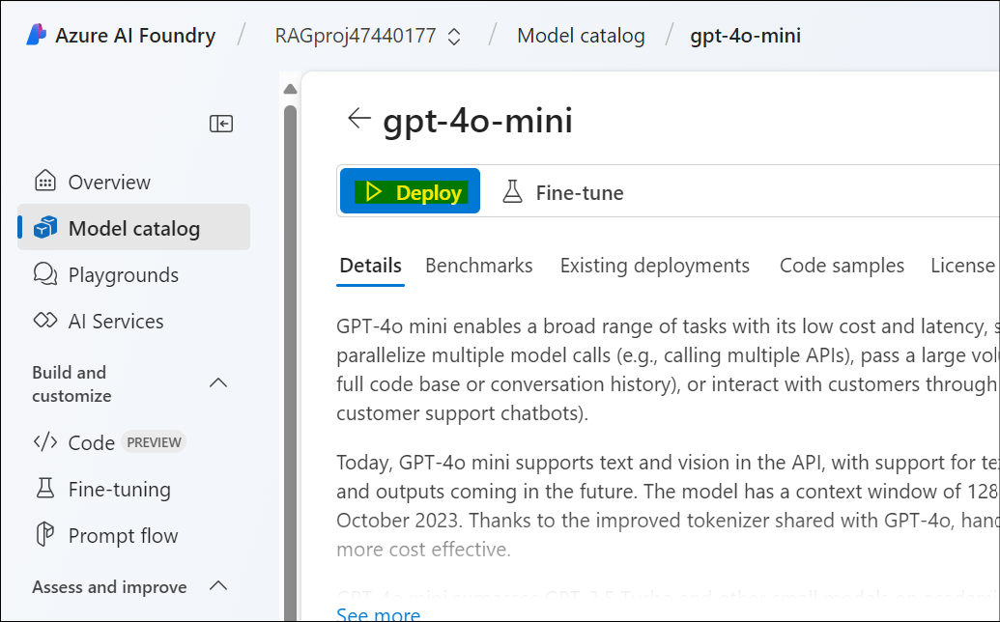
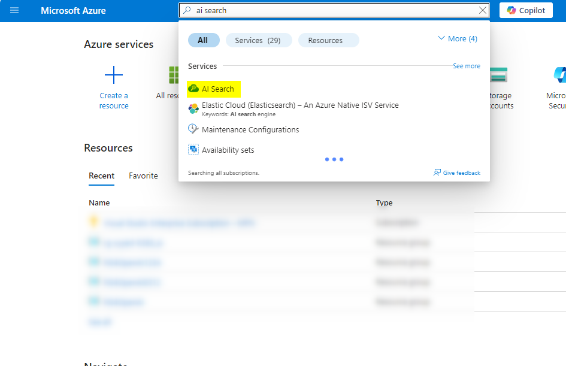
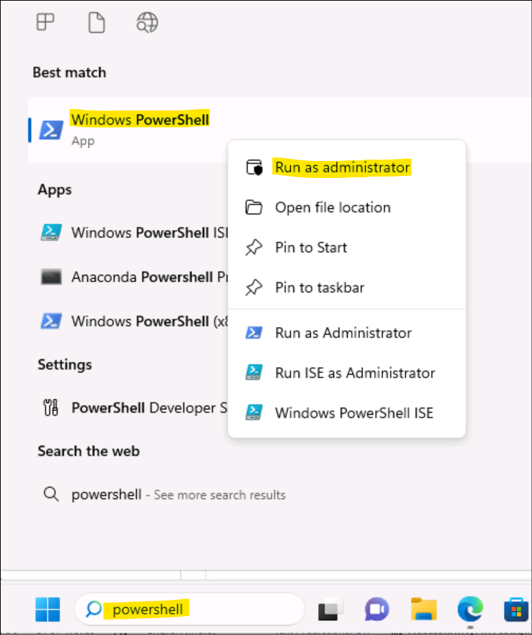
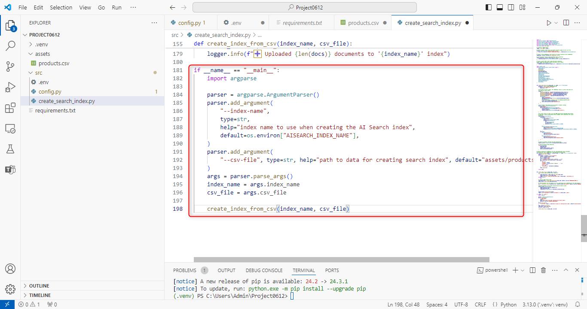
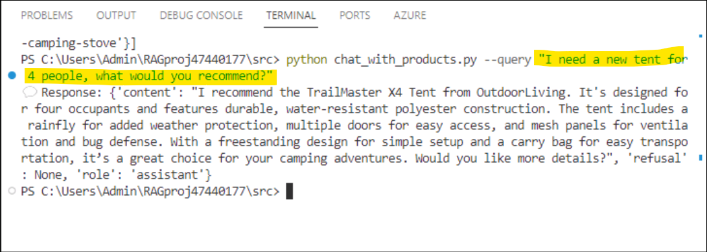
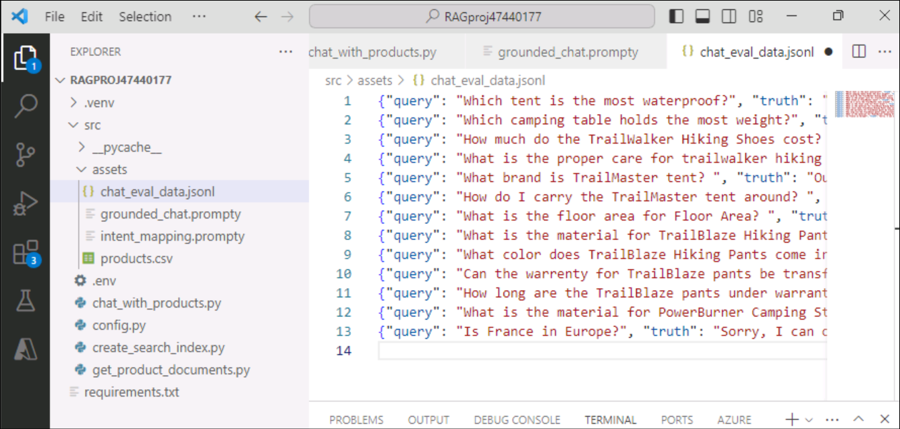
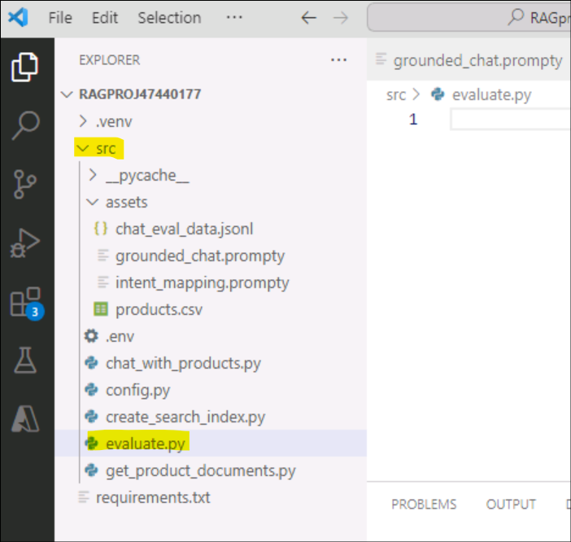

# Laboratório 4 – Criar, avaliar e implementar um agente baseado em RAG com o Azure AI Foundry SDK

**Tempo estimado: 120 minutos**

## Objetivo

O objetivo deste laboratório é criar, avaliar e implantar um agente
baseado em Retrieval-Augmented Generation (RAG) usando o Azure AI
Foundry SDK. O laboratório orienta você na configuração do ambiente de
projeto e desenvolvimento, na implantação de modelos de AI (por exemplo,
GPT-4 e text-embedding-ada-002), na integração do Azure AI Search para
recuperação de documentos e na criação de um aplicativo de chat de
recuperação de conhecimento personalizado (RAG). O foco está em
fundamentar as respostas do modelo de AI com dados relevantes do
produto, desenvolver uma interface de chat personalizada e avaliar o
desempenho das respostas geradas.

## Solução

A solução envolve a configuração de um projeto no Azure AI Foundry, a
implantação de modelos de AI (GPT-4 e text-embedding-ada-002) e a
integração do Azure AI Search para armazenar e recuperar dados
personalizados do produto. Inclui a criação de scripts Python para gerar
embeddings vetoriais, criar índices de pesquisa e consultá-los para
obter informações relevantes sobre o produto. Uma interface de chat
baseada em RAG é desenvolvida para fornecer respostas fundamentadas,
aproveitando os resultados da pesquisa e o desempenho do aplicativo de
chat é avaliado usando conjuntos de dados e métricas predefinidos para
aumentar sua eficácia.

## Exercício 0: Entender a VM e as credenciais

Neste exercício, identificaremos e entenderemos as credenciais que
usaremos em todo o laboratório.

**Importante:** passe por cada etapa deste exercício para conhecer os
termos genéricos e as credenciais que serão usadas para a execução do
laboratório.

1.  A guia **Instructions** contém o guia do laboratório com as
    instruções a serem seguidas em todo o laboratório.

2.  A guia **Resources** tem as credenciais necessárias para executar o
    laboratório.

    - **URL** – URL para o portal do Azure
    
    - **Subscription** – este é o **ID** da **assinatura** atribuída a você
    
    - **Username** – o **ID de usuário** com a qual você precisa fazer
      **login** nos serviços do **Azure**.
    
    - **Password** – **senha** para o **login no Azure**.

Vamos chamar esse nome de usuário e senha como **credenciais de login no Azure**. Usaremos essas credenciais sempre que mencionarmos **as credenciais de login no Azure**.

    - **Resource Group** – o **grupo de recursos** atribuído a você.

    >[!Alert] **Importante**: certifique-se de criar todos os seus recursos neste grupo de recursos

    

3.  A guia **Help** contém as informações de suporte. O valor do **ID**
    aqui é o **ID da** **instância do laboratório** que será usado
    durante a execução do laboratório.

    

## Exercício 1 – Configurar o ambiente de projeto e desenvolvimento para criar um aplicativo RAG (recuperação de conhecimento) personalizado com o Azure AI Foundry SDK

### Tarefa 1: Criar um projeto

Para criar um projeto no Azure AI Foundry, siga estas etapas:

1.  Faça login no Azure AI Foundry em +++<https://ai.azure.com/>+++
    **sign in** usando as credenciais de **login no Azure**.

    

2.  Selecione **+ Create project**.

    

3.  Insira +++**RAGproj\<Lab instance ID\>**+++ como nome do projeto,
    clique em **Customize**.

    **Observação:** substitua o **\<ID da instância do laboratório**\> pelo **ID da instância do laboratório**

    

4.  Na próxima página, insira os seguintes detalhes e clique em
    **Next.**

    **Hub name** - +++hub\<ID da instância do laboratório\>+++
    
    **Subscription** - selecione sua assinatura atribuída
    
    **Resource group** - Selecione o grupo de recursos atribuído (**ResourceGroup1**)
    
    **Location** - East US 2 or Sweden Central (usamos East US 2 durante a execução deste laboratório)
    
    Deixe o resto como padrão e clique em **Next**.

    

5.  Na página **Review and finish**, clique em **Create.**

    

6.  A criação do recurso levará alguns minutos.

    

7.  Feche a janela pop-up, se alguma aparecer.

8.  Na página inicial do projeto, anote a **Project connection string**
    em um bloco de notas para ser usada na próxima tarefa deste
    exercício.

    

### Tarefa 2: Implementar modelos

Você precisa de dois modelos para criar um aplicativo de chat baseado em
RAG: um modelo de chat do Azure OpenAI (gpt-4o-mini) e um modelo de
inserção do Azure OpenAI (text-embedding-ada-002). Implemente esses
modelos em seu projeto do Azure AI Foundry, usando este conjunto de
etapas para cada modelo.

Estas etapas implementam um modelo em um endpoint em tempo real do
catálogo de modelos do portal do AI Foundry:

1.  No painel de navegação esquerdo, selecione **Model catalog**.

    

2.  Selecione o modelo **gpt-4o-mini** na lista de modelos. Você pode
    usar a barra de pesquisa para encontrá-lo.

    

3.  Na página de detalhes do modelo, selecione **Deploy**.

    

4.  Deixe o **Deployment name** padrão, selecione **Deploy**. Ou, se o
    modelo não estiver disponível em sua região, uma região diferente
    será selecionada para você e conectada ao seu projeto. Nesse caso,
    selecione **Create resource and deploy**.

    

    

5.  Depois de implementar o **gpt-4o-mini**, repita as etapas para
    implantar o modelo +++**text-embedding-ada-002**++++.

    

### Tarefa 3: Criar um serviço Azure AI Search

O objetivo desse aplicativo é fundamentar as respostas do modelo em seus
dados personalizados. O índice de pesquisa é usado para recuperar
documentos relevantes com base na pergunta do usuário.

Você precisa de um serviço e uma conexão do Azure AI Search para criar
um índice de pesquisa.

1.  Faça login no portal do Azure em +++<https://portal.azure.com>+++
    usando as credenciais de login no Azure.

2.  Na barra de pesquisa da página inicial, procure por +++**AI
    search**+++ e selecione-o.

    

3.  Clique no ícone **+ Create** e preencha os seguintes detalhes.

    

4.  Insira os detalhes abaixo e selecione **Review + create**.

    - **Subscription** – selecione sua assinatura atribuída
    
    - **Resource Group** – selecione o grupo de recursos atribuído
    
    - **Service name** – insira +++**aisearch\<ID da instância do
      laboratório\>**+++ substituindo ao ID da instância do laboratório pelo
      ID da VM.
    
    - **Region** - selecione Sweden Central ou East US 2 (estamos usando
      East US 2 aqui)
    
    - **Pricing tier** – selecione **Standard**

    

5.  Examine os detalhes e selecione **Create**.

    

6.  Aguarde até que a implantação seja bem-sucedida, como na captura de
    tela abaixo, antes de prosseguir com a próxima etapa.

    

### Tarefa 4: Conectar o Azure AI Search ao seu projeto

No portal do Azure AI Foundry, verifique se há um recurso conectado do
Azure AI Search.

1.  No projeto no **Azure AI Foundry**, selecione **Management center** 
    no painel esquerdo.

    

2.  Na seção **Connected resources**, selecione **+ New connection** e,
    em seguida, selecione **Azure AI Search**.

    

    

3.  Selecione **API key** em **Authentication** e selecione **Add
    connection**.

    

    

4.  Na página **Connected resources**, você agora pode ver a conexão de
    recurso adicionada.

    

### Tarefa 5: Instalar a CLI do Azure e sign in

Você instala a CLI do Azure e entra no ambiente de desenvolvimento
local, para que possa usar suas credenciais de usuário para chamar o
serviço Azure OpenAI.

1.  Procure por +++**PowerShell**+++ na barra de pesquisa do Windows e
    abra-o no modo **administrator**.

    

2.  Abra o Windows Power Shell, cole o comando abaixo e execute-o.

    ```
    $progressPreference = 'silentlyContinue'
    Write-Host "Installing WinGet PowerShell module from PSGallery..."
    Install-PackageProvider -Name NuGet -Force | Out-Null
    Install-Module -Name Microsoft.WinGet.Client -Force -Repository PSGallery | Out-Null
    Write-Host "Using Repair-WinGetPackageManager cmdlet to bootstrap WinGet..."
    Repair-WinGetPackageManager
    Write-Host "Done."
    ```

3.  Instale a CLI do Azure do terminal usando o seguinte comando:

    +++winget install -e --id Microsoft.AzureCLI+++

    Selecione **Y** quando solicitado para aceitação.

    

    

    

4.  Depois de instalar a CLI do Azure, sign in usando o comando az login
    e sign in usando o navegador:

    +++az login+++

    Selecione **Work or school account** e clique em **Continue**.

    

5.  Faça login com suas **credenciais de login no Azure**.

    

6.  Digite **1** para o prompt **Select a subscription** e pressione
    **Enter**.

    

### Tarefa 6: Criar um novo ambiente Python

Primeiro, você precisa criar um novo ambiente Python para instalar o
pacote necessário para este tutorial. NÃO instale pacotes em sua
instalação global do Python. Você deve sempre usar um ambiente virtual
ou conda ao instalar pacotes Python, caso contrário, você pode
interromper sua instalação global do Python.

**Criar um ambiente virtual**

1.  No Power Shell, navegue até **C:\Users\Admin** executando os
    comandos abaixo.

    +++cd\\+++

    +++cd Users\Admin+++

2.  Crie uma pasta com o nome do seu projeto, **RAGproj\<Lab instance
    id\>, inserindo o seguinte comando em seu PowerShell.**

    >[!Note] **Nota:** substitua \<Nome do projeto\> pelo nome do seu projeto no
comando abaixo e execute-o.

    +++**mkdir \<Nome do projeto\>**+++

    

3.  No terminal, digite o seguinte comando para navegar até o novo local
    da pasta

    +++cd \<Nome do projeto\>+++

    Substitua \<Nome do projeto\> pelo nome da pasta que você criou na etapa
anterior.

    

4.  Crie um ambiente virtual usando os seguintes comandos

    +++py -3 -m venv .venv+++

    +++.venv\scripts\activate+++

    

    Ativar o ambiente Python significa que, ao executar Python ou pip a partir da linha de comando, você usa o interpretador Python contido na pasta .venv do seu aplicativo.

5.  Abra o **VS Code**. Selecione **File -\> Open Folder** e selecione
    **a pasta RAGproject** que criamos nas etapas anteriores (**de
    C:\Users\Admin**).

    

    

    

### Tarefa 7: Instalar pacotes

Instale azure-ai-projects(preview) e azure-ai-inference (preview),
juntamente com outros pacotes necessários.

1.  Crie um arquivo chamado +++**requirements.txt**+++ na pasta
    **Project** e adicione os seguintes pacotes ao arquivo:

    ```
    azure-ai-projects
    azure-ai-inference[prompts]
    azure-identity
    azure-search-documents
    Pandas
    python-dotenv
    opentelemetry-api
    ```

    

    

2.  Na barra de navegação superior, clique em **File** e **Save All**.

3.  Clique com o botão direito do mouse no requirements.txt e selecione
    **Open in Integrated Terminal**.

    

    

4.  Execute o seguinte comando para entrar no ambiente virtual:

    +++py -3 -m venv .venv+++

    +++.venv\scripts\activate+++

    

5.  Execute o comando +++az login+++ e faça login com suas credenciais
    de login no Azure. Selecione **1** para selecionar a assinatura.

    

    

6.  Para instalar os pacotes necessários, execute o código a seguir.

    +++pip install -r requirements.txt+++

    

    

    **Observação:** se você receber um aviso de uma nova versão do pip, execute os comandos abaixo para atualizar o pip

    +++pip install -r requirements.txt+++

    +++python.exe -m pip install --upgrade pip+++

    

### Tarefa 8: Criar um script auxiliar

1.  Crie uma nova pasta chamada **src**. Executando o seguinte comando
    no terminal:

    +++mkdir src+++

    

2.  Crie um novo arquivo na pasta **src** e nomeie-o +++**config.py**+++

    

3.  Adicione o código a seguir ao **config.py** e salve-o:

    ```
    import os
    import sys
    import pathlib
    import logging
    from azure.identity import DefaultAzureCredential
    from azure.ai.projects import AIProjectClient 
    from azure.ai.inference.tracing import AIInferenceInstrumentor
    
    # load environment variables from the .env file
    from dotenv import load_dotenv
    load_dotenv()
    
    # Set "./assets" as the path where assets are stored, resolving the absolute path:
    ASSET_PATH = pathlib.Path(__file__).parent.resolve() / "assets"
    
    # Configure an root app logger that prints info level logs to stdout
    logger = logging.getLogger("app")
    logger.setLevel(logging.INFO)
    logger.addHandler(logging.StreamHandler(stream=sys.stdout))
    
    # Returns a module-specific logger, inheriting from the root app logger
    def get_logger(module_name):
        return logging.getLogger(f"app.{module_name}")
    
    
    # Enable instrumentation and logging of telemetry to the project
    def enable_telemetry(log_to_project: bool = False):
        AIInferenceInstrumentor().instrument()
    
        # enable logging message contents
        os.environ["AZURE_TRACING_GEN_AI_CONTENT_RECORDING_ENABLED"] = "true"
    
        if log_to_project:
            from azure.monitor.opentelemetry import configure_azure_monitor
    
            project = AIProjectClient.from_connection_string(
                conn_str=os.environ["AIPROJECT_CONNECTION_STRING"], credential=DefaultAzureCredential()
            )
            tracing_link = f"https://ai.azure.com/tracing?wsid=/subscriptions/{project.scope['subscription_id']}/resourceGroups/{project.scope['resource_group_name']}/providers/Microsoft.MachineLearningServices/workspaces/{project.scope['project_name']}"
            application_insights_connection_string = project.telemetry.get_connection_string()
            if not application_insights_connection_string:
                logger.warning(
                    "No application insights configured, telemetry will not be logged to project. Add application insights at:"
                )
                logger.warning(tracing_link)
    
               return
            configure_azure_monitor(connection_string=application_insights_connection_string)
            logger.info("Enabled telemetry logging to project, view traces at:")
            logger.info(tracing_link)
    ```

    

    **Observação**: esse script de arquivo config.py recém-criado será usado
no próximo exercício.

### Tarefa 9: Configurar variáveis de ambiente

A cadeia de conexão do projeto é necessária para chamar o serviço Azure
OpenAI do seu código. Neste guia de início rápido, você salva esse valor
em um arquivo .env, que é um arquivo que contém variáveis de ambiente
que seu aplicativo pode ler.

1.  Crie um novo arquivo +++**.env+++** no diretório **src** e cole o
    seguinte código:

    Substitua a **\<your-connection-string\>** pelo valor da cadeia de
conexão do projeto salvo no bloco de notas na tarefa 1.

    ```
    AIPROJECT_CONNECTION_STRING=<your-connection-string>
    AISEARCH_INDEX_NAME="example-index"
    EMBEDDINGS_MODEL="text-embedding-ada-002"
    INTENT_MAPPING_MODEL="gpt-4o-mini"
    CHAT_MODEL="gpt-4o-mini"
    EVALUATION_MODEL="gpt-4o-mini"
    ```

    

    **Observação**: sua cadeia de conexão pode ser encontrada na página
inicial do projeto Azure AI Foundry em **Overview**.

## Exercício 2: Criar um aplicativo de recuperação de conhecimento personalizado (RAG) com o Azure AI Foundry SDK

### Tarefa 1: Criar dados de exemplo para seu aplicativo de chat

O objetivo desse aplicativo baseado em RAG é fundamentar as respostas do
modelo em seus dados personalizados. Você usa um índice do Azure AI
Search que armazena dados vetorizados do modelo de inserções. O índice
de pesquisa é usado para recuperar documentos relevantes com base na
pergunta do usuário.

1.  Na configuração do VS Code que está aberta, crie uma pasta chamada
    +++**assets**+++ na pasta **src**.

    

2.  Copie o arquivo **products.csv** de **C:\LabFiles** e cole-o em

    **C:\Users\Admin\\ a pasta Nome do projeto\>\src\assets** .

    **Observação:** isso precisa ser feito no **EXPLORER** e, em seguida,
será refletido no VS Code.

    

3.  Navegue até **File** na barra de navegação superior e clique em
    **Save All.**

    

### Tarefa 2: Criar um índice de pesquisa

O índice de pesquisa é usado para armazenar dados vetorizados do modelo de incorporações. O índice de pesquisa é usado para recuperar documentos relevantes com base na pergunta do usuário.

1.  No VS code, crie um arquivo chamado +++**create_search_index.py**+++
    na pasta **src**.

    

2.  Abra o arquivo criado, **create_search_index.py** arquivo e adicione
    o seguinte código para importar as bibliotecas necessárias, criar um
    cliente de projeto e definir algumas configurações:

    ```
    import os
    from azure.ai.projects import AIProjectClient
    from azure.ai.projects.models import ConnectionType
    from azure.identity import DefaultAzureCredential
    from azure.core.credentials import AzureKeyCredential
    from azure.search.documents import SearchClient
    from azure.search.documents.indexes import SearchIndexClient
    from config import get_logger
    # initialize logging object
    logger = get_logger(__name__)
    
    # create a project client using environment variables loaded from the .env file
    project = AIProjectClient.from_connection_string(
        conn_str=os.environ["AIPROJECT_CONNECTION_STRING"], credential=DefaultAzureCredential()
    )
    
    # create a vector embeddings client that will be used to generate vector embeddings
    embeddings = project.inference.get_embeddings_client()
    
    # use the project client to get the default search connection
    search_connection = project.connections.get_default(
        connection_type=ConnectionType.AZURE_AI_SEARCH, include_credentials=True
    )
    
    # Create a search index client using the search connection
    # This client will be used to create and delete search indexes
    index_client = SearchIndexClient(
        endpoint=search_connection.endpoint_url, credential=AzureKeyCredential(key=search_connection.key)
    )
    ```

    

3.  Agora adicione a função no final do **create_search_index.py** para
    definir um índice de pesquisa:

    ```
    import pandas as pd
    from azure.search.documents.indexes.models import (
        SemanticSearch,
        SearchField,
        SimpleField,
        SearchableField,
        SearchFieldDataType,
        SemanticConfiguration,
        SemanticPrioritizedFields,
        SemanticField,
        VectorSearch,
        HnswAlgorithmConfiguration,
        VectorSearchAlgorithmKind,
        HnswParameters,
        VectorSearchAlgorithmMetric,
        ExhaustiveKnnAlgorithmConfiguration,
        ExhaustiveKnnParameters,
        VectorSearchProfile,
        SearchIndex,
    )
    
    
    def create_index_definition(index_name: str, modelo: str) -> SearchIndex:
        dimensions = 1536  # text-embedding-ada-002
            if model == "text-embedding-3-large":
            dimensions = 3072
    
        # The fields we want to index. The "embedding" field is a vector field that will
        # be used for vector search.
        fields = [
            SimpleField(name="id", type=SearchFieldDataType.String, key=True),
            SearchableField(name="content", type=SearchFieldDataType.String),
            SimpleField(name="filepath", type=SearchFieldDataType.String),
            SearchableField(name="title", type=SearchFieldDataType.String),
            SimpleField(name="url", type=SearchFieldDataType.String),
            SearchField(
                name="contentVector",
                type=SearchFieldDataType.Collection(SearchFieldDataType.Single),
                searchable=True,
                # Size of the vector created by the text-embedding-ada-002 model.
                vector_search_dimensions=dimensions,
                vector_search_profile_name="myHnswProfile",
            ),
        ]
    
            # The "content" field should be prioritized for semantic ranking.
        semantic_config = SemanticConfiguration(
            nome="padrão",
            prioritized_fields=SemanticPrioritizedFields(
                title_field=SemanticField(field_name="title",
                keywords_fields=[],
                content_fields=[SemanticField(field_name="conteúdo")],
            ),
        )
    
        # For vector search, we want to use the HNSW (Hierarchical Navigable Small World)
        # algorithm (a type of approximate nearest neighbor search algorithm) with cosine
        # distance.
        vector_search = VectorSearch(
            algorithms=[
                HnswAlgorithmConfiguration(
                    name="myHnsw",
                    kind=VectorSearchAlgorithmKind.HNSW,
                    parameters=HnswParameters(
                        m=4,
                        ef_construction = 1000,
                        ef_search = 1000,
                        metric=VectorSearchAlgorithmMetric.COSINE,
                    ),
                ),
                ExhaustiveKnnAlgorithmConfiguration(
                    name="myExhaustiveKnn",
                    kind=VectorSearchAlgorithmKind.EXHAUSTIVE_KNN,
                    parameters=ExhaustiveKnnParameters(metric=VectorSearchAlgorithmMetric.COSINE),
                ),
            ],
            perfis=[
                VectorSearchProfile(
                    name="myHnswProfile",
                    algorithm_configuration_name="myHnsw",
                ),
                VectorSearchProfile(
                    name="myExhaustiveKnnProfile",
                    algorithm_configuration_name="myExhaustiveKnn",
                ),
            ],
        )
    
        # Create the semantic settings with the configuration
        semantic_search = SemanticSearch(configurações=[semantic_config])
    
    # Create the search index definition
        return SearchIndex(
            name=index_name,
            fields=fields,
            semantic_search=semantic_search,
            vector_search = vector_search,
        )
    ```

    

4.  Agora adicione a função em **create_search_index.py** para criar a
    função para adicionar um arquivo csv ao índice:

    ```
    # define a function for indexing a csv file, that adds each row as a document
    # and generates vector embeddings for the specified content_column
    def create_docs_from_csv(path: str, content_column: str, model: str) -> list[dict[str, any]]:
        produtos = pd.read_csv(caminho)
        itens = []
        products = pd.read_csv(path)
        items = []
        for product in products.to_dict("records"):
            content = product[content_column]
            id = str(product["id"])
            title = product["name"]
            url = f"/products/{title.lower().replace(' ', '-')}"
            emb = embeddings.embed(input=content, model=model)
            rec = {
                "content": content,
                "filepath": f"{title.lower().replace(' ', '-')}",
                "title": title,
                "url": url,
                "contentVector": emb.data[0].embedding,
            }
            items.append(rec)
    
        return items
    
    
    def create_index_from_csv(index_name, csv_file):
        # If a search index already exists, delete it:
        try:
            index_definition = index_client.get_index(index_name)
            index_client.delete_index(index_name)
     logger.info(f"🗑️  Found existing index named '{index_name}', and deleted it")
        except Exception:
            pass
    
        # create an empty search index
        index_definition = create_index_definition(index_name, model=os.environ["EMBEDDINGS_MODEL"])
        index_client.create_index(index_definition)
    
            # create documents from the products.csv file, generating vector embeddings for the "description" column
        docs = create_docs_from_csv(path=csv_file, content_column="description", model=os.environ["EMBEDDINGS_MODEL"])
    
        # Add the documents to the index using the Azure AI Search client
        search_client = SearchClient(
            endpoint=search_connection.endpoint_url,
            index_name=index_name,
            credential=AzureKeyCredential(key=search_connection.key),
        )
    
        search_client.upload_documents(documentos)
        logger.info(f"➕ Uploaded {len(docs)} documents to '{index_name}' index")
    ```

    

5.  Por fim, adicione as funções abaixo em **create_search_index.py**
    para criar o índice e registrá-lo no projeto de nuvem. Depois de
    adicionar o código, vá para **Files** na barra superior e clique em
    **Save All.**

    ```
    if __name__ == "__main__":
        import argparse
    
        parser = argparse. ArgumentParser()
        parser.add_argument(
            "--index-name",
            type=str,
    help="index name to use when creating the AI Search index",
            default=os.environ["AISEARCH_INDEX_NAME"],
        )
        parser.add_argument(
    "--csv-file", type=str, help="path to data for creating search index", default="assets/products.csv "
        )
        args = parser.parse_args()
        index_name = args.index_name
        csv_file = args.csv_file
        create_index_from_csv(index_name, csv_file)
    ```
    
    

6.  Clique com o botão direito do mouse no **create_search_index.py** e
    selecione a opção **Open in Integrated Terminal**.

    

7.  No terminal, faça login com a credencial de login no Azure e siga as
    instruções para autenticar sua conta:

    +++az login+++

    

    

8.  Execute o código para criar seu índice localmente e registre-o no
    projeto de nuvem:

    +++python create_search_index.py+++

    

9.  Depois que o script for executado, você poderá exibir o índice
    recém-criado no portal do Azure.

10. Navegue até o **Resource Group -\> Your search service
    created(aisearchLabinstanceID) -\> Search management -\> Indexes**.

    

11. Se você executar o script novamente com o mesmo nome de índice, ele
    criará uma nova versão do mesmo índice.

### Tarefa 3: Obter documentos do produto

Em seguida, você cria um script para obter documentos de produtos do índice de pesquisa. O script consulta o índice de pesquisa em busca de documentos que correspondam à pergunta de um usuário.

**Criar script para obter documentos do produto**

Quando o chat recebe uma solicitação, ele pesquisa seus dados para encontrar informações relevantes. Esse script usa o Azure AI SDK para consultar o índice de pesquisa em busca de documentos que correspondam à pergunta de um usuário. Em seguida, ele retorna os documentos para o aplicativo de chat.


1.  No VS Code, crie um arquivo chamado
    +++**get_product_documents.py**+++ na pasta **src**.

    

2.  Copie e cole o código a seguir no arquivo. Comece com o código para
    importar as bibliotecas necessárias, criar um cliente de projeto e
    definir as configurações.

    ```
    import os
    from pathlib import Path
    from opentelemetry import trace
    from azure.ai.projects import AIProjectClient
    from azure.ai.projects.models import ConnectionType
    from azure.identity import DefaultAzureCredential
    from azure.core.credentials import AzureKeyCredential
    from azure.search.documents import SearchClient
    from config import ASSET_PATH, get_logger
    
    # initialize logging and tracing objects
    logger = get_logger(__name__)
    tracer = trace.get_tracer(__name__)
    
    # create a project client using environment variables loaded from the .env file
    project = AIProjectClient.from_connection_string(
        conn_str=os.environ["AIPROJECT_CONNECTION_STRING"], credential=DefaultAzureCredential()
    )
    
    # create a vector embeddings client that will be used to generate vector embeddings
    chat = project.inference.get_chat_completions_client()
    embeddings = project.inference.get_embeddings_client()
    
    # use the project client to get the default search connection
    search_connection = project.connections.get_default(
        connection_type=ConnectionType.AZURE_AI_SEARCH, include_credentials=True
    )
    
    # Create a search index client using the search connection
    # This client will be used to create and delete search indexes
    search_client = SearchClient(
        index_name=os.environ["AISEARCH_INDEX_NAME"],
        endpoint=search_connection.endpoint_url,
        credential=AzureKeyCredential(key=search_connection.key),
    )
    ```

3.  Adicione a função em get_product-documents.py para **obter
    documentos do produto**.

    ```
    from azure.ai.inference.prompts import PromptTemplate
    from azure.search.documents.models import VectorizedQuery
    
    
    @tracer.start_as_current_span(name="get_product_documents")
    def get_product_documents(messages: list, context: dict = None) -> dict:
        if context is None:
            context = {}
    
            overrides = context.get("overrides", {})
        top = overrides.get("top", 5)
    
        # generate a search query from the chat messages
        intent_prompty = PromptTemplate.from_prompty(Path(ASSET_PATH) / "intent_mapping.prompty")
    
        intent_mapping_response = chat.complete(
            model=os.environ["INTENT_MAPPING_MODEL"],
            messages=intent_prompty.create_messages(conversation=messages),
            **intent_prompty.parameters,
        )
    
        search_query = intent_mapping_response.choices[0].message.content
        logger.debug(f"🧠 Intent mapping: {search_query}")
    
        # generate a vector representation of the search query
        embedding = embeddings.embed(model=os.environ["EMBEDDINGS_MODEL"], input=search_query)
        search_vector = embedding.data[0].embedding
    
        # search the index for products matching the search query
        vector_query = VectorizedQuery(vector=search_vector, k_nearest_neighbors=top, fields="contentVector")
    
        search_results = search_client.search(
            search_text=search_query, vector_queries=[vector_query], select=["id", "content", "filepath", "title", "url"]
        )
    
        documents = [
            {
                "id": result["id"],
                "content": result["content"],
                "filepath": result["filepath"],
                "title": result["title"],
                "url": result["url"],
            }
            for result in search_results
        ]
    
        # add results to the provided context
        if "thoughts" not in context:
            context["thoughts"] = []
    
        # add thoughts and documents to the context object so it can be returned to the caller
        context["thoughts"].append(
            {
                "title": "Generated search query",
                "description": search_query,
            }
        )
    
        if "grounding_data" not in context:
            context["grounding_data"] = []
        context["grounding_data"].append(documents)
    
        logger.debug(f"📄 {len(documents)} documents retrieved: {documents}")
        return documents
    ```

4.  Por fim, adicione código para **testar a função** ao executar o
    script diretamente:

    ```
    if __name__ == "__main__":
        import logging
        import argparse
    
        # set logging level to debug when running this module directly
        logger.setLevel(logging.DEBUG)
    
        # load command line arguments
        parser = argparse.ArgumentParser()
        parser.add_argument(
            "--query",
            type=str,
            help="Query to use to search product",
            default="I need a new tent for 4 people, what would you recommend?",
        )
    
        args = parser.parse_args()
        query = args.query
    
        result = get_product_documents(messages=[{"role": "user", "content": query}])
    ```

    

5.  Clique em **File**\> **Save All**.

    

### Tarefa 4: Criar modelo de prompt para mapeamento de intenção

    O script **get_product_documents.py** usa um modelo de prompt para converter a conversa em uma consulta de pesquisa. O modelo instrui como extrair a intenção do usuário da conversa.

1.  Antes de executar o script, crie o modelo de prompt. Crie um arquivo
    chamado +++**intent_mapping.prompty**+++ na pasta **assets**:

    

2.  Copie o código a seguir para o arquivo **intent_mapping_prompty** e,
    na barra superior, vá para **File** e clique em **Save All.**

    ```
    ---
    name: Chat Prompt
    description: A prompty that extract users query intent based on the current_query and chat_history of the conversation
    model:
        api: chat
        configuration:
            azure_deployment: gpt-4o
    inputs:
        conversation:
            type: array
    ---
    system:
    # Instructions
    - You are an AI assistant reading a current user query and chat_history.
    - Given the chat_history, and current user's query, infer the user's intent expressed in the current user query.
    - Once you infer the intent, respond with a search query that can be used to retrieve relevant documents for the current user's query based on the intent
    - Be specific in what the user is asking about, but disregard parts of the chat history that are not relevant to the user's intent.
    - Provide responses in json format
    
    # Examples
    Example 1:
    With a conversation like below:
    ```
     - user: are the trailwalker shoes waterproof?
     - assistant: Yes, the TrailWalker Hiking Shoes are waterproof. They are designed with a durable and waterproof construction to withstand various terrains and weather conditions.
     - user: how much do they cost?
    ```
    Respond with:
    {
        "intent": "The user wants to know how much the Trailwalker Hiking Shoes cost.",
        "search_query": "price of Trailwalker Hiking Shoes"
    }
    
    Example 2:
    With a conversation like below:
    ```
     - user: are the trailwalker shoes waterproof?
     - assistant: Yes, the TrailWalker Hiking Shoes are waterproof. They are designed with a durable and waterproof construction to withstand various terrains and weather conditions.
     - user: how much do they cost?
     - assistant: The TrailWalker Hiking Shoes are priced at $110.
     - user: do you have waterproof tents?
     - assistant: Yes, we have waterproof tents available. Can you please provide more information about the type or size of tent you are looking for?
     - user: which is your most waterproof tent?
     - assistant: Our most waterproof tent is the Alpine Explorer Tent. It is designed with a waterproof material and has a rainfly with a waterproof rating of 3000mm. This tent provides reliable protection against rain and moisture.
     - user: how much does it cost?
    ```
    Respond with:
    {
        "intent": "The user would like to know how much the Alpine Explorer Tent costs.",
        "search_query": "price of Alpine Explorer Tent"
    }
    
    user:
    Return the search query for the messages in the following conversation:
    {{#conversation}}
     - {{role}}: {{content}}
    {{/conversation}}
    
    ```

    

### Tarefa 5: Testar o script de recuperação do documento do produto

1.  Agora que você tem o script e o modelo, execute o script para testar
    quais documentos o índice de pesquisa retorna de uma consulta. Na
    janela do terminal, execute:

    +++python get_product_documents.py --query "I need a new tent for 4 people, what would you recommend?"+++

    

### Tarefa 6: Desenvolver código de recuperação de conhecimento personalizado (RAG)

Em seguida, você cria um código personalizado para adicionar recursos de retrieval augmented generation (RAG) a um aplicativo de chat básico.

**Criar um script de chat com recursos RAG**

1.  Na pasta **src**, crie um novo arquivo chamado
    +++**chat_with_products.py**+++. Esse script recupera documentos do
    produto e gera uma resposta à pergunta de um usuário.

    

2.  Adicione o código para importar as bibliotecas necessárias, criar um
    cliente de projeto e definir as configurações:

    ```
    import os
    from pathlib import Path
    from opentelemetry import trace
    from azure.ai.projects import AIProjectClient
    from azure.identity import DefaultAzureCredential
    from config import ASSET_PATH, get_logger, enable_telemetry
    from get_product_documents import get_product_documents
    
    
    # initialize logging and tracing objects
    logger = get_logger(__name__)
    tracer = trace.get_tracer(__name__)
    
    # create a project client using environment variables loaded from the .env file
    project = AIProjectClient.from_connection_string(
        conn_str=os.environ["AIPROJECT_CONNECTION_STRING"], credential=DefaultAzureCredential()
    )
    
    # create a chat client we can use for testing
    chat = project.inference.get_chat_completions_client()
    
    ```

    

3.  Adicione o código no final do **chat_with_products.py** para criar a
    função de chat que usa os recursos RAG.

    ```
    from azure.ai.inference.prompts import PromptTemplate
    
    
    @tracer.start_as_current_span(name="chat_with_products")
    def chat_with_products(messages: list, context: dict = None) -> dict:
        if context is None:
            context = {}
    
        documents = get_product_documents(messages, context)
    
        # do a grounded chat call using the search results
        grounded_chat_prompt = PromptTemplate.from_prompty(Path(ASSET_PATH) / "grounded_chat.prompty")
    
        system_message = grounded_chat_prompt.create_messages(documents=documents, context=context)
        response = chat.complete(
            model=os.environ["CHAT_MODEL"],
            messages=system_message + messages,
            **grounded_chat_prompt.parameters,
        )
        logger.info(f"💬 Response: {response.choices[0].message}")
    
        # Return a chat protocol compliant response
        return {"message": response.choices[0].message, "context": context}
    ```

    

4.  Por fim, adicione o código para executar a **função de chat** e, em
    seguida, vá para **File** e clique em **Save All**.

    ```
    if __name__ == "__main__":
        import argparse
    
            # load command line arguments
        parser = argparse.ArgumentParser()
        parser.add_argument(
            "--query",
            type=str,
            help="Query to use to search product",
            default="I need a new tent for 4 people, what would you recommend?",
        )
        parser.add_argument(
            "--enable-telemetry",
            action="store_true",
            help="Enable sending telemetry back to the project",
        )
        args = parser.parse_args()
        if args.enable_telemetry:
            enable_telemetry(True)
    
        # run chat with products
        response = chat_with_products(messages=[{"role": "user", "content": args.query}])
    ```

    

### Tarefa 7: Criar um modelo de prompt de chat fundamentado

O script chat_with_products.py chama um modelo de prompt para gerar uma resposta à pergunta do usuário. O modelo instrui como gerar uma resposta com base na pergunta do usuário e nos documentos recuperados. Crie este modelo agora.

1.  Na pasta **assets**, adicione o arquivo +++**grounded_chat.prompty**+++

    

2.  Adicione o seguinte código **grounded_chat.prompty**.

    ```
    ---
    name: Chat with documents
    description: Uses a chat completions model to respond to queries grounded in relevant documents
    model:
        api: chat
        configuration:
            azure_deployment: gpt-4o
    inputs:
        conversation:
            type: array
    ---
    system:
    You are an AI assistant helping users with queries related to outdoor outdooor/camping gear and clothing.
    If the question is not related to outdoor/camping gear and clothing, just say 'Sorry, I only can answer queries related to outdoor/camping gear and clothing. So, how can I help?'
    Don't try to make up any answers.
    If the question is related to outdoor/camping gear and clothing but vague, ask for clarifying questions instead of referencing documents. If the question is general, for example it uses "it" or "they", ask the user to specify what product they are asking about.
    Use the following pieces of context to answer the questions about outdoor/camping gear and clothing as completely, correctly, and concisely as possible.
    Do not add documentation reference in the response.
    
    # Documents
    
    {{#documents}}
    
    ## Document {{id}}: {{title}}
    {{content}}
    {{/documents}}
    ```

    

3.  Clique em **File\> Save All.**

    

### Tarefa 8: Executar o script de chat com recursos RAG

1.  Agora que você tem o script e o modelo, execute o script para testar
    seu aplicativo de chat com recursos RAG:

    +++python chat_with_products.py --query "I need a new tent for 4 people, what would you recommend?"+++

    

### Tarefa 9: Adicionar log de telemetria

1.  No portal do Azure, selecione **Subscriptions**, selecione sua
    assinatura e, em seguida, selecione **Resource providers** em
    **Settings** no painel de navegação esquerdo.

2.  Pesquise e selecione +++**Microsoft.OperationalInsights**+++ e
    clique nos três pontos desse provedor de recursos e selecione
    **Register**.

    

3.  Siga o mesmo procedimento para registrar o
    +++**microsoft.insights**+++

4.  Aguarde uma mensagem de sucesso no registro antes de prosseguir para
    a próxima etapa.

    

5.  No seu projeto no Azure AI Foundry, selecione **Tracing** **Access
    and improve** no painel esquerdo. Selecione **Create New**.

    

6.  Forneça o nome como **+++appinsight+++\<ID da instância do
    laboratório\>**

    

7.  Certifique-se de que o recurso seja criado.

    

8.  De volta ao VS Code, para habilitar o log de telemetria em seu
    projeto, instale azure-monitor-opentelemetry.

    +++pip install azure-monitor-opentelemetry+++

    

9.  Adicione o script **--enable-telemetry flag when you use
    the chat_with_products.py**:

    +++python chat_with_products.py --query "I need a new tent for 4 people, what would you recommend?" --enable-telemetry+++

    

## Exercício 3: Avaliar o aplicativo de chat personalizado com o Azure AI Foundry SDK

### Tarefa 1: Avaliar a qualidade das respostas do aplicativo de chat

Agora que você sabe que seu aplicativo de chat responde bem às suas
perguntas, inclusive com o histórico do chat, é hora de avaliar como ele
se sai em algumas métricas diferentes e mais dados.

Use um avaliador com um conjunto de dados de avaliação e a função de
destino **get_chat_response()** e, em seguida, avalie os resultados da
avaliação.

Depois de executar uma avaliação, você pode fazer melhorias em sua
lógica, como melhorar o prompt do sistema e observar como as respostas
do aplicativo de chat mudam e melhoram.

**Criar conjunto de dados de avaliação**

Use o conjunto de dados de avaliação a seguir, que contém exemplos de
perguntas e respostas esperadas (verdade).

1.  Crie um arquivo chamado +++**chat_eval_data.jsonl**+++ na pasta
    **assets**.

    

2.  Cole esse conjunto de dados no arquivo e **salve** o arquivo.

    ```
    {"query": "Which tent is the most waterproof?", "truth": "The Alpine Explorer Tent has the highest rainfly waterproof rating at 3000m"}
    {"query": "Which camping table holds the most weight?", "truth": "The Adventure Dining Table has a higher weight capacity than all of the other camping tables mentioned"}
    {"query": "How much do the TrailWalker Hiking Shoes cost? ", "truth": "The Trailewalker Hiking Shoes are priced at $110"}
    {"query": "What is the proper care for trailwalker hiking shoes? ", "truth": "After each use, remove any dirt or debris by brushing or wiping the shoes with a damp cloth."}
    {"query": "What brand is TrailMaster tent? ", "truth": "OutdoorLiving"}
    {"query": "How do I carry the TrailMaster tent around? ", "truth": " Carry bag included for convenient storage and transportation"}
    {"query": "What is the floor area for Floor Area? ", "truth": "80 square feet"}
    {"query": "What is the material for TrailBlaze Hiking Pants?", "truth": "Made of high-quality nylon fabric"}
    {"query": "What color does TrailBlaze Hiking Pants come in?", "truth": "Khaki"}
    {"query": "Can the warrenty for TrailBlaze pants be transfered? ", "truth": "The warranty is non-transferable and applies only to the original purchaser of the TrailBlaze Hiking Pants. It is valid only when the product is purchased from an authorized retailer."}
    {"query": "How long are the TrailBlaze pants under warranty for? ", "truth": " The TrailBlaze Hiking Pants are backed by a 1-year limited warranty from the date of purchase."}
    {"query": "What is the material for PowerBurner Camping Stove? ", "truth": "Stainless Steel"}
    {"query": "Is France in Europe?", "truth": "Sorry, I can only queries related to outdoor/camping gear and equipment"}
    ```
    
    

### Tarefa 2: Avaliar com avaliadores do Azure AI

Agora, defina um script de avaliação que:

- gere um wrapper de função de destino em torno da lógica do nosso
  aplicativo de chat;

- carregue o conjunto de dados .jsonl de exemplo;

- execute a avaliação, que usa a função de destino e mescla o conjunto
  de dados de avaliação com as respostas do aplicativo de chat;

- gere um conjunto de métricas assistidas por GPT (relevância,
  fundamentação e coerência) para avaliar a qualidade das respostas do
  aplicativo de chat;

- produza os resultados localmente e registre os resultados no projeto
  de nuvem.

O script permite que você revise os resultados localmente, gerando os
resultados na linha de comando e em um arquivo json.

O script também registra os resultados da avaliação no projeto de nuvem
para que você possa comparar as execuções de avaliação na interface do
usuário.

1.  Crie um arquivo chamado +++**evaluate.py**+++ na pasta **src**.

    

2.  Adicione o seguinte código para importar as bibliotecas necessárias,
    criar um cliente de projeto e definir algumas configurações:

    ```
    import os
    import pandas as pd
    from azure.ai.projects import AIProjectClient
    from azure.ai.projects.models import ConnectionType
    from azure.ai.evaluation import evaluate, GroundednessEvaluator
    from azure.identity import DefaultAzureCredential
    
    from chat_with_products import chat_with_products
    
    # load environment variables from the .env file at the root of this repo
    from dotenv import load_dotenv
    
    load_dotenv()
    
    # create a project client using environment variables loaded from the .env file
    project = AIProjectClient.from_connection_string(
        conn_str=os.environ["AIPROJECT_CONNECTION_STRING"], credential=DefaultAzureCredential()
    )
    
    connection = project.connections.get_default(connection_type=ConnectionType.AZURE_OPEN_AI, include_credentials=True)
    
    evaluator_model = {
        "azure_endpoint": connection.endpoint_url,
        "azure_deployment": os.environ["EVALUATION_MODEL"],
        "api_version": "2024-06-01",
        "api_key": connection.key,
    }
    
    groundedness = GroundednessEvaluator(evaluator_model)
    ```

    

3.  Adicione código para criar uma função wrapper que implemente a
    interface de avaliação para avaliação de consulta e resposta:

    ```
    def evaluate_chat_with_products(query):
        response = chat_with_products(messages=[{"role": "user", "content": query}])
        return {"response": response["message"].content, "context": response["context"]["grounding_data"]}
    ```

    

4.  Por fim, adicione código para executar a avaliação, exibir os
    resultados localmente e fornecer um link para os resultados da
    avaliação no portal AI Foundry.

    ```
    # Evaluate must be called inside of __main__, not on import
    if __name__ == "__main__":
        from config import ASSET_PATH
    
        # workaround for multiprocessing issue on linux
        from pprint import pprint
        from pathlib import Path
        import multiprocessing
        import contextlib
    
        with contextlib.suppress(RuntimeError):
            multiprocessing.set_start_method("spawn", force=True)
    
        # run evaluation with a dataset and target function, log to the project
        result = evaluate(
            data=Path(ASSET_PATH) / "chat_eval_data.jsonl",
            target=evaluate_chat_with_products,
            evaluation_name="evaluate_chat_with_products",
            evaluators={
                "groundedness": groundedness,
            },
            evaluator_config={
                "default": {
                    "query": {"${data.query}"},
                    "response": {"${target.response}"},
                    "context": {"${target.context}"},
                }
            },
            azure_ai_project=project.scope,
            output_path="./myevalresults.json",
        )
    
        tabular_result = pd.DataFrame(result.get("rows"))
    
        pprint("-----Summarized Metrics-----")
        pprint(result["metrics"])
        pprint("-----Tabular Result-----")
        pprint(tabular_result)
        pprint(f"View evaluation results in AI Studio: {result['studio_url']}")
    ```

    

5.  Clique em **Save All** em **File** na barra de navegação superior.

### Tarefa 3: Configurar o modelo de avaliação

Como o script de avaliação chama o modelo muitas vezes, talvez você
queira aumentar o número de tokens por minuto para o modelo de
avaliação.

Inicialmente, você criou um arquivo **.env** que especifica o nome do
modelo de avaliação, **gpt-4o-mini**. Tente aumentar o limite de tokens
por minuto para este modelo, se você tiver cota disponível. Se você não
tiver cota suficiente para aumentar o valor, não se preocupe, o script
foi projetado para lidar com erros de limite.

1.  No seu projeto no portal do Azure AI Foundry, selecione **Models +
    endpoints** e selecione **gpt-4o-mini**.

    

2.  Selecione **gpt-4o-mini**, clique em **Edit.**

    

3.  Defina o valor de **Tokens per Minute Rate Limit** para o limite
    máximo permitido e clique em **Save and close**.

    

### Tarefa 4: Executar a avaliação 

1.  No Azure AI Foundry, selecione **Evaluations** no painel esquerdo e
    selecione **+ New evaluation**.

    

2.  Selecione **Dataset**.

    

3.  Aceite os padrões na página **Basic information** e clique em
    **Next**.

    

4.  Selecione **Add your** **dataset** -\> **Upload file** e carregue o
    **chat_eval_data.jsonl** que criamos na pasta **assets** e clique em
    **Next**.

    

5.  Selecione as **Metrics** em **AI quality** e **Risk and safety
    metrics**.

    Além disso, em **AI quality**, selecione sua conexão e o nome da
implementação.

    

    

6.  Selecione os tipos de fonte de dados como na captura de tela abaixo
    e clique em **Next**.

    

7.  Selecione **Submit** para enviar a avaliação.

    

8.  Quando a avaliação for concluída, analise os resultados.

    

    

    

## Exercício 4: Excluir os recursos

1.  Na página inicial do portal do Azure, selecione o grupo Recursos
    atribuído. Selecione todos os recursos no grupo de recursos e
    selecione **Delete**.

    

2.  Digite +++**delete**+++ e clique no botão **Delete** para confirmar
    a exclusão. Clique em **Delete** na caixa de diálogo de confirmação
    para excluir.

    

3.  Confirme que todos os recursos foram excluídos ao receber a seguinte
    mensagem de êxito:

    

**Resumo:**

Neste laboratório, aprendemos a criar, avaliar e implementar um aplicativo baseado em RAG.
