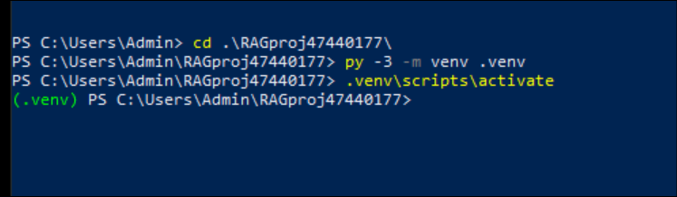
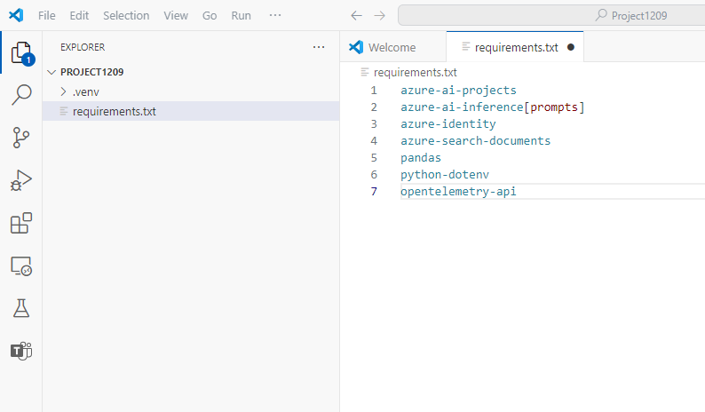
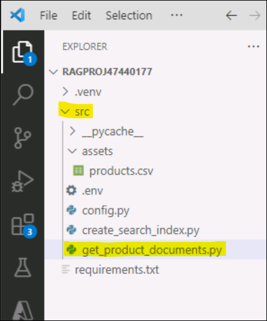
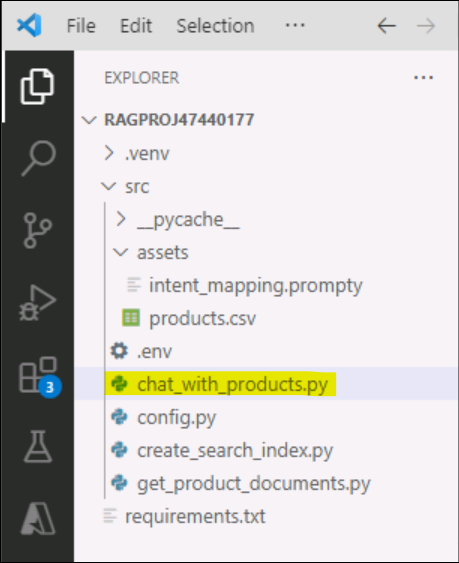
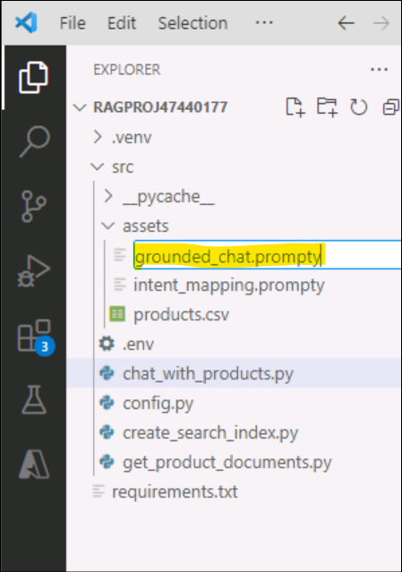
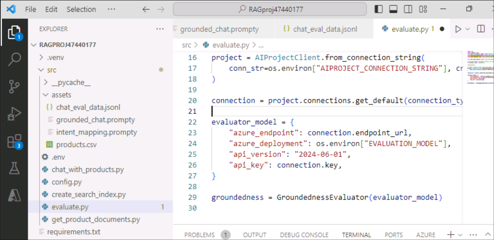

# Laboratorio 4 - Crear, evaluar e implementar un agente basado en RAG con Azure AI Foundry SDK

**Tiempo estimado: 120 minutos**

## Objetivo

El objetivo de este laboratorio es crear, evaluar e implementar un
agente basado en Retrieval-Augmented Generation (RAG) utilizando el SDK
de Azure AI Foundry. A lo largo del laboratorio, se explica cómo
configurar el proyecto y el entorno de desarrollo, implementar modelos
de IA (como GPT-4 y text-embedding-ada-002), integrar Azure AI Search
para la recuperación de documentos y desarrollar una aplicación de chat
con recuperación de conocimiento personalizada (RAG). El enfoque
principal es fundamentar las respuestas del modelo de IA con datos de
productos relevantes, diseñar una interfaz de chat personalizada y
evaluar el rendimiento de las respuestas generadas.

## Solución 

La solución implica configurar un proyecto en Azure AI Foundry,
implementar modelos de IA (GPT-4 y text-embedding-ada-002) e integrar
Azure AI Search para almacenar y recuperar datos personalizados de
productos. También incluye la creación de scripts en Python para generar
incrustaciones vectoriales, construir índices de búsqueda y consultarlos
en busca de información relevante sobre los productos. Se desarrolla una
interfaz de chat basada en RAG para ofrecer respuestas fundamentadas
aprovechando los resultados de búsqueda, y se evalúa el rendimiento de
la aplicación de chat utilizando conjuntos de datos predefinidos y
métricas para mejorar su efectividad.

## Ejercicio 0: Conozca la máquina virtual y las credenciales

En este ejercicio, identificaremos y comprenderemos las credenciales que
utilizaremos a lo largo del laboratorio.

**Importante:** Repase cada paso de este ejercicio para conocer los
términos genéricos y las credenciales que se utilizarán para la
ejecución del laboratorio.

1.  La pestaña **Instructions** contiene la guía del laboratorio con los
    pasos a seguir durante su desarrollo.

2.  La pestaña **Resources** contiene las credenciales necesarias para
    ejecutar el laboratorio.

    - **URL** – URL del portal de Azure.
    
    - **Subscription** – Este es el **ID** de la **suscripción** que se le
      ha asignado.
    
    - **Username** – El **ID** del usuario con el que debe **iniciar
      sesión** en los **servicios de Azure**.
    
    - **Password** – **Contraseña** de **acceso** a **Azure**.

    Llamemos a este nombre de usuario y contraseña como **Azure login credentials**.

    Utilizaremos estas credenciales siempre que mencionemos **Azure login credentials**.

    - **Resource Group** – El **grupo de recursos** que se le ha asignado.

    >[!Alert] **Importante:** Asegúrese de crear todos sus recursos en este grupo de recursos.

    

3.  La pestaña **Help** contiene la información de soporte. El valor
    **ID** aquí es el **Lab instance ID** que se utilizará durante la
    ejecución del laboratorio.

    

## Ejercicio 1: Configuración del proyecto y del entorno de desarrollo para crear una aplicación de recuperación de conocimiento (RAG) con Azure AI Foundry SDK

### Tarea1- Cree un proyecto 

Para crear un proyecto en Azure AI Foundry, siga estos pasos:

1.  Inicie sesión en Azure AI Foundry en +++<https://ai.azure.com/>+++
    utilizando las **Azure login credentials**.

    

2.  Seleccione **+ Create project**.

    

3.  Ingrese +++**RAGproj\<Lab instance ID\>**+++ como nombre para el
    proyecto, haga clic en **Customize**.

    >[!Note] **Nota:** Sustituya **\<Lab instance ID\>** por su **Lab instance ID.**

    

4.  En la siguiente página, ingrese los siguientes datos y haga clic en
    **Next.**

    Hub name - +++hub\< ID de la instancia de laboratorio \>+++
    
    Subscription - Seleccione la suscripción asignada.

    Create new Resource group - Seleccione el grupo de recursos asignado (ResourceGroup1)

    Location - East US 2 o Sweden Central (Hemos utilizado East US 2 durante la ejecución de este laboratorio)

    Mantenga el resto de las opciones con su configuración predeterminada y seleccione **Next** para continuar.

    

5.  En la página **Review and finish,** haga clic en **Create.**

    

6.  La creación del recurso tardará unos minutos.

    

7.  Cierre cualquier ventana emergente que pueda aparecer.

8.  Desde la página de inicio del proyecto, anote la **Project
    connection string** en un bloc de notas para utilizarla en la
    siguiente tarea de este ejercicio.

    

### Tarea 2: Implemente modelos

Se requieren dos modelos para crear una aplicación de chat basada en
RAG: un modelo de chat de Azure OpenAI (gpt-4o-mini) y un modelo de
incrustaciones de Azure OpenAI (text-embedding-ada-002). Implemente
estos modelos en su proyecto de Azure AI Foundry siguiendo estos pasos
para cada uno.

Estos pasos implementan un modelo en un endpoint en tiempo real desde el
portal de AI Foundry  [model
catalogue](https://learn.microsoft.com/en-us/azure/ai-studio/how-to/model-catalog-overview):

1.  En el panel de navegación izquierdo, seleccione **Model catalog**.

    

2.  Seleccione el modelo **gpt-4o-mini**  de la lista de modelos. Puede
    utilizar la barra de búsqueda para encontrarlo.

    

3.  En la página de detalles del modelo, seleccione **Deploy**.

    

4.  Mantenga el **Deployment name** predeterminado y seleccione
    **Deploy**. Si el modelo no está disponible en su región, se
    seleccionará automáticamente una región diferente y se conectará a
    su proyecto. En ese caso, seleccione **Create resource and deploy.**

    

    

5.  Después de implementar **gpt-4o-mini**, repita los pasos para
    implementar el modelo +++**text-embedding-ada-002**+++.

    

### Tarea 3: Cree un servicio de Azure AI Search

El objetivo de esta aplicación es basar las respuestas del modelo en sus
datos personalizados. El índice de búsqueda se utiliza para recuperar
documentos relevantes basados en la pregunta del usuario.

Necesita un servicio Azure AI Search y una conexión para crear un índice
de búsqueda.

1.  Inicie sesión en el portal de Azure en
    +++<https://portal.azure.com>+++ utilizando las credenciales de
    inicio de sesión de Azure.

2.  En la barra de búsqueda de la página de inicio, busque +++**AI
    search**+++ y selecciónelo.

    

3.  Haga clic en el ícono **+ Create** y complete los siguientes datos.

    

4.  Ingrese los siguientes datos y seleccione **Review + create**.

    - Subscription – Seleccione la suscripción asignada.
    
    - Resource Group – Seleccione el grupo de recursos asignado.
    
    - Service name – Ingrese +++**aisearch\<Lab instance ID\>**+++
      sustituyendo Lab instance id por el id de su VM.
    
    - Region - Seleccione Sweden Central o East US 2 (En este caso
      utilizamos East US 2).
    
    - Pricing tier – Seleccione **Standard.**

    

5.  Revise los detalles y seleccione **Create**.

    

6.  Espere hasta que la implementación tenga éxito como en la siguiente
    captura de pantalla antes de proceder con el siguiente paso.

    

### Tarea 4: Conecte Azure AI Search a su proyecto

En el portal de Azure AI Foundry, compruebe si hay un recurso conectado
a Azure AI Search.

1.  Desde su proyecto en Azure AI Foundry, seleccione **Management
    center** en el panel izquierdo.

    

2.  En la sección  **Connected resources** , seleccione **New
    connection**  y, a continuación, **Azure AI Search**.

    

    

3.  Seleccione la **API key** en **Authentication** y seleccione **Add
    connection.**

    

    

4.  En la página **Connected resources,** ahora puede ver la conexión de
    recursos añadida.

    

### Tarea 5: Instale Azure CLI e inicie sesión

Instale Azure CLI e inicie sesión desde su entorno de desarrollo local,
de modo que pueda utilizar sus credenciales de usuario para llamar al
servicio Azure OpenAI.

1.  Busque +++ **PowerShell** +++ en la barra de búsqueda de Windows y
    ábralo en modo Administrador.

    

2.  Abra windows power shell y pegue el siguiente comando y ejecútelo:

    ```
    $progressPreference = 'silentlyContinue'
    Write-Host "Installing WinGet PowerShell module from PSGallery..."
    Install-PackageProvider -Name NuGet -Force | Out-Null
    Install-Module -Name Microsoft.WinGet.Client -Force -Repository PSGallery | Out-Null
    Write-Host "Using Repair-WinGetPackageManager cmdlet to bootstrap WinGet..."
    Repair-WinGetPackageManager
    Write-Host "Done."
    ```

3.  Instale el Azure CLI desde su terminal utilizando el siguiente
    comando:

    ```
    winget install -e --id Microsoft.AzureCLI
    ```

    Seleccione **Y,** cuando se le pida aceptación.

    
    
    
    
    

4.  Una vez instalada la CLI de Azure, inicie sesión con el comando az
    login e inicie sesión con el navegador:

    +++az login+++

    Seleccione **Work or school account** y haga clic en **Continue**.

    

5.  Inicie sesión con sus **Azure login credentials**.

    

6.  Ingrese **1** para **Select a subscription** y haga clic en
    **Enter**.

    

### Tarea 6: Cree un nuevo entorno Python

Primero, es necesario crear un nuevo entorno de Python para instalar los
paquetes requeridos en este tutorial. No se deben instalar paquetes en
la instalación global de Python. Es recomendable utilizar siempre un
entorno virtual o Conda al instalar paquetes de Python para evitar
posibles conflictos que puedan afectar la instalación global.

**Cree un entorno virtual**

1.  Desde su Power Shell, navegue a **C:\Users\Admin** ejecutando los
    siguientes comandos:

    +++cd\\++
    
    +++cd Users\Admin+++

2.  Cree una carpeta con el nombre de su proyecto, **RAGproj\<Lab
    instance id\>, by entering the following command in your
    powershell.**

    **Nota:** Sustituya \<Nombre del proyecto\> con el nombre de su proyecto
en el siguiente comando y ejecútelo:

    ```
    mkdir ProjectXXXX
    ```

    

3.  En su terminal ingrese el siguiente comando para navegar a la nueva
    ubicación de la carpeta:

    +++**cd \<Project name\>**+++

    Sustituya \<Nombre del proyecto\> por el nombre de la carpeta que ha
creado en el paso anterior.

    

4.  Cree un entorno virtual utilizando los siguientes comandos:

    +++py -3 -m venv .venv+++

    +++.venv\scripts\activate+++

    

    Activar el entorno de Python permite que, al ejecutar python o pip desde la línea de comandos, se utilice el  intérprete de Python ubicado en la carpeta **.venv** de la aplicación.

5.  Abra **VS Code**. Seleccione **File -\> Open Folder** y seleccione
    la carpeta **RAGproject** que hemos creado en los pasos anteriores
    (**desde C:\Users\Admin**).

    

    

    

### Tarea 7: Instale los paquetes necesarios

Instale azure-ai-projects(preview) y azure-ai-inference (preview), junto
con otros paquetes necesarios.

1.  Cree un archivo llamado +++**requirements.txt**+++ en la carpeta
    **Project** y agregue los siguientes paquetes al archivo:

    ```
    azure-ai-projects
    azure-ai-inference[prompts]
    azure-identity
    azure-search-documents
    pandas
    python-dotenv
    opentelemetry-api
    marshmallow==3.23.2
    ```

    

    

2.  En la barra de navegación superior, haga clic en archivo y **save
    all**.

3.  Haga clic con el botón derecho en requirements.txt y seleccione
    **Open in Integrated Terminal**.

    

    

4.  Ejecute el siguiente comando para entrar en el entorno virtual:

    ```
    py -3 -m venv .venv
    ```
    
    ```
    .venv\scripts\activate
    ```

    

5.  Ejecute el comando +++az login+++ e inicie sesión con sus
    credenciales de inicio de sesión de Azure. Luego, seleccione **1**
    para elegir la suscripción.

    

    

6.  Para instalar los paquetes necesarios, ejecute el siguiente comando:

    +++pip install -r requirements.txt+++

    

    

    >[!Note] **Nota:** si recibe un aviso de una nueva versión de pip, ejecute los siguientes comandos para actualizar pip:

    +++pip install -r requirements.txt+++

    +++python.exe -m pip install --upgrade pip+++

    

### Tarea 8: Cree un helper script

1.  Cree una nueva carpeta llamada **src,** ejecutando el siguiente
    comando en su terminal:

    ```
    mkdir src
    ```

    

2.  Cree un nuevo archivo en la carpeta **src** y nómbrelo
    como +++**config.py**+++.

    

3.  Agregue el siguiente código a **config.py** y guárdelo.

    ```
    # ruff: noqa: ANN201, ANN001
    
    import os
    import sys
    import pathlib
    import logging
    from azure.identity import DefaultAzureCredential
    from azure.ai.projects import AIProjectClient
    from azure.ai.inference.tracing import AIInferenceInstrumentor
    
    # load environment variables from the .env file
    from dotenv import load_dotenv
    
    load_dotenv()
    
    # Set "./assets" as the path where assets are stored, resolving the absolute path:
    ASSET_PATH = pathlib.Path(__file__).parent.resolve() / "assets"
    
    # Configure an root app logger that prints info level logs to stdout
    logger = logging.getLogger("app")
    logger.setLevel(logging.INFO)
    logger.addHandler(logging.StreamHandler(stream=sys.stdout))
    
    
    # Returns a module-specific logger, inheriting from the root app logger
    def get_logger(module_name):
        return logging.getLogger(f"app.{module_name}")
    
    
    # Enable instrumentation and logging of telemetry to the project
    def enable_telemetry(log_to_project: bool = False):
        AIInferenceInstrumentor().instrument()
    
        # enable logging message contents
        os.environ["AZURE_TRACING_GEN_AI_CONTENT_RECORDING_ENABLED"] = "true"
    
        if log_to_project:
            from azure.monitor.opentelemetry import configure_azure_monitor
    
            project = AIProjectClient.from_connection_string(
                conn_str=os.environ["AIPROJECT_CONNECTION_STRING"], credential=DefaultAzureCredential()
            )
            tracing_link = f"https://ai.azure.com/tracing?wsid=/subscriptions/{project.scope['subscription_id']}/resourceGroups/{project.scope['resource_group_name']}/providers/Microsoft.MachineLearningServices/workspaces/{project.scope['project_name']}"
            application_insights_connection_string = project.telemetry.get_connection_string()
            if not application_insights_connection_string:
                logger.warning(
                    "No application insights configured, telemetry will not be logged to project. Add application insights at:"
                )
                logger.warning(tracing_link)
    
                return
    
            configure_azure_monitor(connection_string=application_insights_connection_string)
            logger.info("Enabled telemetry logging to project, view traces at:")
            logger.info(tracing_link)
    
    ```

    

    >[!Note] **Nota**: este script config.py recién creado se utilizará en el
siguiente ejercicio.

### Tarea 9: Configure las variables de entorno

La cadena de conexión de su proyecto es necesaria para llamar al
servicio de Azure OpenAI desde el código. En este inicio rápido, guarde
este valor en un archivo .env, que almacena variables de entorno
accesibles por su aplicación.

1.  Cree un nuevo archivo +++**.env**+++ en el directorio **src**, y
    pegue el siguiente código:

    Sustituya **\<your-connection-string\>** por el valor de la cadena de
conexión del proyecto guardado en el bloc de notas en la tarea 1.

    ```
    AIPROJECT_CONNECTION_STRING=<your-connection-string>
    AISEARCH_INDEX_NAME="example-index"
    EMBEDDINGS_MODEL="text-embedding-ada-002"
    INTENT_MAPPING_MODEL="gpt-4o-mini"
    CHAT_MODEL="gpt-4o-mini"
    EVALUATION_MODEL="gpt-4o-mini"
    ```

    

    >[!Note] **Nota**: Puede encontrar su cadena de conexión en la página de inicio
del proyecto Azure AI Foundry en  **Overview**.

## Ejercicio 2: Cree una aplicación personalizada de recuperación de conocimiento (RAG) con Azure AI Foundry SDK

### Tarea 1: Cree datos de ejemplo para su aplicación de chat

El objetivo de esta aplicación basada en RAG es fundamentar las
respuestas del modelo en sus datos personalizados. Se utiliza un índice
de Azure AI Search que almacena datos vectorizados a partir del modelo
de incrustaciones. Este índice de búsqueda se emplea para recuperar
documentos relevantes en función de la pregunta del usuario.

1.  Desde la configuración de VS Code abierta, cree una carpeta llamada
    +++**assets**+++ en la carpeta **src.**

    

2.  Copie el archivo **products.csv** de **C:\LabFiles** y péguelo en la
    carpeta

    **C:\Users\Admin\\ Your Project Name\>\src\assets.**

    >[!Note] **Nota:** Esto debe hacerse en el Explorador de archivos y luego se
reflejará en el Código VS.

    

3.  Vaya al **File** en la barra de navegación superior y haga clic en
    **Save All.**

    

### Tarea 2: Cree un índice de búsqueda

El índice de búsqueda se utiliza para almacenar los datos vectorizados del modelo de incrustación. El índice de búsqueda se utiliza para recuperar los documentos pertinentes en función de la pregunta del usuario.

1.  En el código VS, cree un archivo llamado
    +++**create_search_index.py**+++ en su carpeta **src**.

    

2.  Abra el archivo creado, **create_search_index.py** y agregue el
    siguiente código para importar las librerías necesarias, crear un
    cliente de proyecto y configurar algunos parámetros:

    ```
    import os
    from azure.ai.projects import AIProjectClient
    from azure.ai.projects.models import ConnectionType
    from azure.identity import DefaultAzureCredential
    from azure.core.credentials import AzureKeyCredential
    from azure.search.documents import SearchClient
    from azure.search.documents.indexes import SearchIndexClient
    from config import get_logger
    
    # initialize logging object
    logger = get_logger(__name__)
    
    # create a project client using environment variables loaded from the .env file
    project = AIProjectClient.from_connection_string(
        conn_str=os.environ["AIPROJECT_CONNECTION_STRING"], credential=DefaultAzureCredential()
    )
    
    # create a vector embeddings client that will be used to generate vector embeddings
    embeddings = project.inference.get_embeddings_client()
    
    # use the project client to get the default search connection
    search_connection = project.connections.get_default(
        connection_type=ConnectionType.AZURE_AI_SEARCH, include_credentials=True
    )
    
    # Create a search index client using the search connection
    # This client will be used to create and delete search indexes
    index_client = SearchIndexClient(
        endpoint=search_connection.endpoint_url, credential=AzureKeyCredential(key=search_connection.key)
    )
    ```

    

3.  Ahora, agregue la función al final de **create_search_index.py**
    para definir un índice de búsqueda:

    ```
    import pandas as pd
    from azure.search.documents.indexes.models import (
        SemanticSearch,
        SearchField,
        SimpleField,
        SearchableField,
        SearchFieldDataType,
        SemanticConfiguration,
        SemanticPrioritizedFields,
        SemanticField,
        VectorSearch,
        HnswAlgorithmConfiguration,
        VectorSearchAlgorithmKind,
        HnswParameters,
        VectorSearchAlgorithmMetric,
        ExhaustiveKnnAlgorithmConfiguration,
        ExhaustiveKnnParameters,
        VectorSearchProfile,
        SearchIndex,
    )
    
    
    def create_index_definition(index_name: str, model: str) -> SearchIndex:
        dimensions = 1536  # text-embedding-ada-002
        if model == "text-embedding-3-large":
            dimensions = 3072
    
        # The fields we want to index. The "embedding" field is a vector field that will
        # be used for vector search.
        fields = [
            SimpleField(name="id", type=SearchFieldDataType.String, key=True),
            SearchableField(name="content", type=SearchFieldDataType.String),
            SimpleField(name="filepath", type=SearchFieldDataType.String),
            SearchableField(name="title", type=SearchFieldDataType.String),
            SimpleField(name="url", type=SearchFieldDataType.String),
            SearchField(
                name="contentVector",
                type=SearchFieldDataType.Collection(SearchFieldDataType.Single),
                searchable=True,
                # Size of the vector created by the text-embedding-ada-002 model.
                vector_search_dimensions=dimensions,
                vector_search_profile_name="myHnswProfile",
            ),
        ]
    
        # The "content" field should be prioritized for semantic ranking.
        semantic_config = SemanticConfiguration(
            name="default",
            prioritized_fields=SemanticPrioritizedFields(
                title_field=SemanticField(field_name="title"),
                keywords_fields=[],
                content_fields=[SemanticField(field_name="content")],
            ),
        )
    
        # For vector search, we want to use the HNSW (Hierarchical Navigable Small World)
        # algorithm (a type of approximate nearest neighbor search algorithm) with cosine
        # distance.
        vector_search = VectorSearch(
            algorithms=[
                HnswAlgorithmConfiguration(
                    name="myHnsw",
                    kind=VectorSearchAlgorithmKind.HNSW,
                    parameters=HnswParameters(
                        m=4,
                        ef_construction=1000,
                        ef_search=1000,
                        metric=VectorSearchAlgorithmMetric.COSINE,
                    ),
                ),
                ExhaustiveKnnAlgorithmConfiguration(
                    name="myExhaustiveKnn",
                    kind=VectorSearchAlgorithmKind.EXHAUSTIVE_KNN,
                    parameters=ExhaustiveKnnParameters(metric=VectorSearchAlgorithmMetric.COSINE),
                ),
            ],
            profiles=[
                VectorSearchProfile(
                    name="myHnswProfile",
                    algorithm_configuration_name="myHnsw",
                ),
                VectorSearchProfile(
                    name="myExhaustiveKnnProfile",
                    algorithm_configuration_name="myExhaustiveKnn",
                ),
            ],
        )
    
        # Create the semantic settings with the configuration
        semantic_search = SemanticSearch(configurations=[semantic_config])
    
        # Create the search index definition
        return SearchIndex(
            name=index_name,
            fields=fields,
            semantic_search=semantic_search,
            vector_search=vector_search,
        )
    ```

    

4.  Después, agregue la función en create_search_index.py para incluir
    un archivo CSV en el índice.

    ```
    # define a function for indexing a csv file, that adds each row as a document
    # and generates vector embeddings for the specified content_column
    def create_docs_from_csv(path: str, content_column: str, model: str) -> list[dict[str, any]]:
        products = pd.read_csv(path)
        items = []
        for product in products.to_dict("records"):
            content = product[content_column]
            id = str(product["id"])
            title = product["name"]
            url = f"/products/{title.lower().replace(' ', '-')}"
            emb = embeddings.embed(input=content, model=model)
            rec = {
                "id": id,
                "content": content,
                "filepath": f"{title.lower().replace(' ', '-')}",
                "title": title,
                "url": url,
                "contentVector": emb.data[0].embedding,
            }
            items.append(rec)
    
        return items
    
    
    def create_index_from_csv(index_name, csv_file):
        # If a search index already exists, delete it:
        try:
            index_definition = index_client.get_index(index_name)
            index_client.delete_index(index_name)
            logger.info(f"🗑️  Found existing index named '{index_name}', and deleted it")
        except Exception:
            pass
    
        # create an empty search index
        index_definition = create_index_definition(index_name, model=os.environ["EMBEDDINGS_MODEL"])
        index_client.create_index(index_definition)
    
        # create documents from the products.csv file, generating vector embeddings for the "description" column
        docs = create_docs_from_csv(path=csv_file, content_column="description", model=os.environ["EMBEDDINGS_MODEL"])
    
        # Add the documents to the index using the Azure AI Search client
        search_client = SearchClient(
            endpoint=search_connection.endpoint_url,
            index_name=index_name,
            credential=AzureKeyCredential(key=search_connection.key),
        )
    
        search_client.upload_documents(docs)
        logger.info(f"➕ Uploaded {len(docs)} documents to '{index_name}' index")
    ```

    

5.  Finalmente, agregue las siguientes funciones en
    create_search_index.py para construir el índice y registrarlo en el
    proyecto Cloud. Después de agregar el código, vaya a **File** en la
    barra superior y haga clic en **Save all.**

    ```
    if __name__ == "__main__":
        import argparse
    
        parser = argparse.ArgumentParser()
        parser.add_argument(
            "--index-name",
            type=str,
            help="index name to use when creating the AI Search index",
            default=os.environ["AISEARCH_INDEX_NAME"],
        )
        parser.add_argument(
            "--csv-file", type=str, help="path to data for creating search index", default="assets/products.csv"
        )
        args = parser.parse_args()
        index_name = args.index_name
        csv_file = args.csv_file
    
        create_index_from_csv(index_name, csv_file)
    ```

    

7.  Haga clic derecho sobre el archivo **create_search_index.py** y
    seleccione la opción **Open in integrated terminal.**

    

7.  Desde su terminal, inicie sesión con sus credenciales de acceso a
    Azure y siga las instrucciones para autenticar su cuenta:

    ```
    az login
    ```
    
    

    

8.  Ejecute el código para crear su índice localmente y registrar el
    proyecto en la nube:

    ```
    python create_search_index.py
    ```
    

9.  Una vez ejecutado el script, puede ver el índice recién creado en el
    portal de Azure.

10. Navegue hasta **Resource Group -\> Your search service
    created(aisearchLabinstanceID) -\> Search management -\> Indexes**.

    

11. Si ejecuta de nuevo el script con el mismo nombre de índice, crea
    una nueva versión del mismo índice.

### Tarea 3: Obtenga los documentos del producto

A continuación, cree un script para obtener los documentos del
producto desde el índice de búsqueda. El script consulta el índice de
búsqueda para encontrar documentos que coincidan con la pregunta del
usuario.

**Cree un script para obtener documentos de producto**

Cuando el chat recibe una solicitud, busca a través de sus datos para
encontrar información relevante. Este script utiliza el Azure AI SDK
para consultar el índice de búsqueda en busca de documentos que
coincidan con la pregunta del usuario. Luego, devuelve los documentos
a la aplicación de chat.

1.  Desde VS Code, cree un archivo llamado
    +++**get_product_documents.py**+++ en la carpeta **src.**

    

2.  Copie y pegue el siguiente código en el archivo. Comience con el
    código para importar las bibliotecas necesarias, crear un cliente de
    proyecto y configurar los ajustes.

    ```
    import os
    from pathlib import Path
    from opentelemetry import trace
    from azure.ai.projects import AIProjectClient
    from azure.ai.projects.models import ConnectionType
    from azure.identity import DefaultAzureCredential
    from azure.core.credentials import AzureKeyCredential
    from azure.search.documents import SearchClient
    from config import ASSET_PATH, get_logger
    
    # initialize logging and tracing objects
    logger = get_logger(__name__)
    tracer = trace.get_tracer(__name__)
    
    # create a project client using environment variables loaded from the .env file
    project = AIProjectClient.from_connection_string(
        conn_str=os.environ["AIPROJECT_CONNECTION_STRING"], credential=DefaultAzureCredential()
    )
    
    # create a vector embeddings client that will be used to generate vector embeddings
    chat = project.inference.get_chat_completions_client()
    embeddings = project.inference.get_embeddings_client()
    
    # use the project client to get the default search connection
    search_connection = project.connections.get_default(
        connection_type=ConnectionType.AZURE_AI_SEARCH, include_credentials=True
    )
    
    # Create a search index client using the search connection
    # This client will be used to create and delete search indexes
    search_client = SearchClient(
        index_name=os.environ["AISEARCH_INDEX_NAME"],
        endpoint=search_connection.endpoint_url,
        credential=AzureKeyCredential(key=search_connection.key),
    )
    ```

3.  Agregue la función en get_product-documents.py a **get product
    documents**.

    ```
    from azure.ai.inference.prompts import PromptTemplate
    from azure.search.documents.models import VectorizedQuery
    
    
    @tracer.start_as_current_span(name="get_product_documents")
    def get_product_documents(messages: list, context: dict = None) -> dict:
        if context is None:
            context = {}
    
        overrides = context.get("overrides", {})
        top = overrides.get("top", 5)
    
        # generate a search query from the chat messages
        intent_prompty = PromptTemplate.from_prompty(Path(ASSET_PATH) / "intent_mapping.prompty")
    
        intent_mapping_response = chat.complete(
            model=os.environ["INTENT_MAPPING_MODEL"],
            messages=intent_prompty.create_messages(conversation=messages),
            **intent_prompty.parameters,
        )
    
        search_query = intent_mapping_response.choices[0].message.content
        logger.debug(f"🧠 Intent mapping: {search_query}")
    
        # generate a vector representation of the search query
        embedding = embeddings.embed(model=os.environ["EMBEDDINGS_MODEL"], input=search_query)
        search_vector = embedding.data[0].embedding
    
        # search the index for products matching the search query
        vector_query = VectorizedQuery(vector=search_vector, k_nearest_neighbors=top, fields="contentVector")
    
        search_results = search_client.search(
            search_text=search_query, vector_queries=[vector_query], select=["id", "content", "filepath", "title", "url"]
        )
    
        documents = [
            {
                "id": result["id"],
                "content": result["content"],
                "filepath": result["filepath"],
                "title": result["title"],
                "url": result["url"],
            }
            for result in search_results
        ]
    
        # add results to the provided context
        if "thoughts" not in context:
            context["thoughts"] = []
    
        # add thoughts and documents to the context object so it can be returned to the caller
        context["thoughts"].append(
            {
                "title": "Generated search query",
                "description": search_query,
            }
        )
    
        if "grounding_data" not in context:
            context["grounding_data"] = []
        context["grounding_data"].append(documents)
    
        logger.debug(f"📄 {len(documents)} documents retrieved: {documents}")
        return documents
    ```

4.  Finalmente, agregue el código para **probar la función** cuando
    ejecute el script directamente:

    ```
    if __name__ == "__main__":
        import logging
        import argparse
    
        # set logging level to debug when running this module directly
        logger.setLevel(logging.DEBUG)
    
        # load command line arguments
        parser = argparse.ArgumentParser()
        parser.add_argument(
            "--query",
            type=str,
            help="Query to use to search product",
            default="I need a new tent for 4 people, what would you recommend?",
        )
    
        args = parser.parse_args()
        query = args.query
    
        result = get_product_documents(messages=[{"role": "user", "content": query}])
    ```

    

5.  Haga clic en **File**\> **Save all**.

    

### Tarea 4: Cree una plantilla de prompt para mapeo de intenciones

El script **get_product_documents.py** utiliza una plantilla de prompt
para convertir la conversación en una consulta de búsqueda. La plantilla
instruye sobre cómo extraer la intención del usuario de la conversación.

1.  Antes de ejecutar el script, cree la plantilla de consulta. Cree un
    archivo llamado +++**intent_mapping.prompty**+++ en su carpeta de
     **assets.**

    

4.  Copie el siguiente código en el archivo intent_mapping_prompty y en
    la barra superior vaya a **File** y haga clic en **Save all.**

    ```
    ---
    name: Chat Prompt
    description: A prompty that extract users query intent based on the current_query and chat_history of the conversation
    model:
        api: chat
        configuration:
            azure_deployment: gpt-4o
    inputs:
        conversation:
            type: array
    ---
    system:
    # Instructions
    - You are an AI assistant reading a current user query and chat_history.
    - Given the chat_history, and current user's query, infer the user's intent expressed in the current user query.
    - Once you infer the intent, respond with a search query that can be used to retrieve relevant documents for the current user's query based on the intent
    - Be specific in what the user is asking about, but disregard parts of the chat history that are not relevant to the user's intent.
    - Provide responses in json format
    
    # Examples
    Example 1:
    With a conversation like below:
    
     - user: are the trailwalker shoes waterproof?
     - assistant: Yes, the TrailWalker Hiking Shoes are waterproof. They are designed with a durable and waterproof construction to withstand various terrains and weather conditions.
     - user: how much do they cost?
    
    Respond with:
    {
        "intent": "The user wants to know how much the Trailwalker Hiking Shoes cost.",
        "search_query": "price of Trailwalker Hiking Shoes"
    }
    
    Example 2:
    With a conversation like below:
    
     - user: are the trailwalker shoes waterproof?
     - assistant: Yes, the TrailWalker Hiking Shoes are waterproof. They are designed with a durable and waterproof construction to withstand various terrains and weather conditions.
     - user: how much do they cost?
     - assistant: The TrailWalker Hiking Shoes are priced at $110.
     - user: do you have waterproof tents?
     - assistant: Yes, we have waterproof tents available. Can you please provide more information about the type or size of tent you are looking for?
     - user: which is your most waterproof tent?
     - assistant: Our most waterproof tent is the Alpine Explorer Tent. It is designed with a waterproof material and has a rainfly with a waterproof rating of 3000mm. This tent provides reliable protection against rain and moisture.
     - user: how much does it cost?
    
    Respond with:
    {
        "intent": "The user would like to know how much the Alpine Explorer Tent costs.",
        "search_query": "price of Alpine Explorer Tent"
    }
    
    user:
    Return the search query for the messages in the following conversation:
    {{#conversation}}
     - {{role}}: {{content}}
    {{/conversation}}
    
    ```

    

### Tarea 5: Pruebe el script de recuperación de documentos de producto

1.  Ahora que se dispone tanto del script como de la plantilla, ejecute
    el script para probar qué documentos devuelve el índice de búsqueda
    a partir de una consulta. Desde la ventana del terminal, ejecute:

    ```
    python get_product_documents.py --query "I need a new tent for 4 people, what would you recommend?"
    ```
    
    

### Tarea 6: Desarrolle un código de recuperación de conocimiento personalizado (RAG)

A continuación, cree un código personalizado para añadir funciones de
generación aumentada de recuperación (RAG) a una aplicación de chat
básica.

**Cree un script de chat con funciones RAG**

1.  En su carpeta **src**, cree un nuevo archivo llamado +++
    **chat_with_products.py** +++. Este script recupera documentos de
    productos y genera una respuesta a la pregunta de un usuario.

    

2.  Agregue el código para importar las bibliotecas necesarias, crear un
    cliente de proyecto y configurar los ajustes:

    ```
    import os
    from pathlib import Path
    from opentelemetry import trace
    from azure.ai.projects import AIProjectClient
    from azure.identity import DefaultAzureCredential
    from config import ASSET_PATH, get_logger, enable_telemetry
    from get_product_documents import get_product_documents
    
    
    # initialize logging and tracing objects
    logger = get_logger(__name__)
    tracer = trace.get_tracer(__name__)
    
    # create a project client using environment variables loaded from the .env file
    project = AIProjectClient.from_connection_string(
        conn_str=os.environ["AIPROJECT_CONNECTION_STRING"], credential=DefaultAzureCredential()
    )
    
    # create a chat client we can use for testing
    chat = project.inference.get_chat_completions_client()
    ```

    

3.  Agregue el código al final de chat_with_products.py, para crear la
    función de chat que utiliza las capacidades RAG.

    ```
    from azure.ai.inference.prompts import PromptTemplate
    
    
    @tracer.start_as_current_span(name="chat_with_products")
    def chat_with_products(messages: list, context: dict = None) -> dict:
        if context is None:
            context = {}
    
        documents = get_product_documents(messages, context)
    
        # do a grounded chat call using the search results
        grounded_chat_prompt = PromptTemplate.from_prompty(Path(ASSET_PATH) / "grounded_chat.prompty")
    
        system_message = grounded_chat_prompt.create_messages(documents=documents, context=context)
        response = chat.complete(
            model=os.environ["CHAT_MODEL"],
            messages=system_message + messages,
            **grounded_chat_prompt.parameters,
        )
        logger.info(f"💬 Response: {response.choices[0].message}")
    
        # Return a chat protocol compliant response
        return {"message": response.choices[0].message, "context": context}
    ```
    
    

4.  Por último, añada el código para ejecutar **chat** **function** y
    luego vaya a archivos y haga clic en **Save all**.

    ```
    if __name__ == "__main__":
        import argparse
    
        # load command line arguments
        parser = argparse.ArgumentParser()
        parser.add_argument(
            "--query",
            type=str,
            help="Query to use to search product",
            default="I need a new tent for 4 people, what would you recommend?",
        )
        parser.add_argument(
            "--enable-telemetry",
            action="store_true",
            help="Enable sending telemetry back to the project",
        )
        args = parser.parse_args()
        if args.enable_telemetry:
            enable_telemetry(True)
    
        # run chat with products
        response = chat_with_products(messages=[{"role": "user", "content": args.query}])
    ```
    
    

### Tarea 7: Cree una plantilla de prompt para chat fundamentado

El script chat_with_products.py llama a una plantilla de prompt para
generar una respuesta a la pregunta del usuario. La plantilla instruye
sobre cómo generar una respuesta basada en la pregunta del usuario y los
documentos recuperados. Cree esta plantilla ahora.

1.  En su carpeta **assets** , añada el archivo
    +++**grounded_chat.prompty**+++

    

2.  Añada el siguiente código grounded_chat.prompty.

    ```
    ---
    name: Chat with documents
    description: Uses a chat completions model to respond to queries grounded in relevant documents
    model:
        api: chat
        configuration:
            azure_deployment: gpt-4o
    inputs:
        conversation:
            type: array
    ---
    system:
    You are an AI assistant helping users with queries related to outdoor outdooor/camping gear and clothing.
    If the question is not related to outdoor/camping gear and clothing, just say 'Sorry, I only can answer queries related to outdoor/camping gear and clothing. So, how can I help?'
    Don't try to make up any answers.
    If the question is related to outdoor/camping gear and clothing but vague, ask for clarifying questions instead of referencing documents. If the question is general, for example it uses "it" or "they", ask the user to specify what product they are asking about.
    Use the following pieces of context to answer the questions about outdoor/camping gear and clothing as completely, correctly, and concisely as possible.
    Do not add documentation reference in the response.
    
    # Documents
    
    {{#documents}}
    
    ## Document {{id}}: {{title}}
    {{content}}
    {{/documents}}
    ```

    

3.  Haga clic en **File\> Save all.**

    

### Tarea 8: Ejecute el script de chat con capacidades RAG

1.  Ahora que se dispone tanto del script como de la plantilla, ejecute
    el script para probar su aplicación de chat con capacidades RAG:

    ```
    python chat_with_products.py --query "I need a new tent for 4 people, what would you recommend?"
    ```
    

### Tarea 9: Agregue registros de telemetría

1.  Desde el portal de Azure, seleccione **Subscriptions**, luego
    seleccione su suscripción y después seleccione **Resource
    providers** bajo **Settings** en el panel de navegación izquierdo.

2.  Busque y seleccione +++**Microsoft.OperationalInsights**+++ y haga
    clic en los tres puntos de este proveedor de recursos y seleccione
    **Register**.

    

3.  Siga el mismo procedimiento para registrarse
    +++microsoft.insights+++

4.  Espere a recibir un mensaje de éxito en el registro antes de
    proceder al siguiente paso.

    

5.  Desde su proyecto en Azure AI Foundry, seleccione **Tracing** en
    **Access and improve** del panel izquierdo. Luego, seleccione
    **Create New**.

    

6.  Proporcione el nombre como **+++appinsight+++\< ID de instancia de
    laboratorio \>.**

    

7.  Asegúrese de que se crea el recurso.

    

8.  De vuelta en VS Code, para habilitar el registro de telemetría en su
    proyecto, instale azure-monitor-opentelemetry.

    +++pip install azure-monitor-opentelemetry+++

    

9.  Agregue el --enable-telemetry flag cuando utilice el script
    chat_with_products.py:

    ```
    python chat_with_products.py --query "I need a new tent for 4 people, what would you recommend?" --enable--telemetry
    ```

    

## Ejercicio 3: Evalúe la aplicación de chat personalizada con Azure AI Foundry SDK

### Tarea 1: Evalúe la calidad de las respuestas de la aplicación de chat

Ahora que sabe que su aplicación de chat responde bien a sus consultas,
incluyendo el historial de chat, es momento de evaluar su desempeño en
diversas métricas y con más datos.

Utiliza un evaluador con un conjunto de datos de evaluación y la función
objetivo get_chat_response(), luego evalúa los resultados de la
evaluación.

Una vez que haya ejecutado una evaluación, podrá realizar mejoras en su
lógica, como mejorar su system prompt, y observar cómo cambian y mejoran
las respuestas de la aplicación de chat.

**Cree un conjunto de datos de evaluación**

Utilice el siguiente conjunto de datos de evaluación, que contiene
ejemplos de preguntas y respuestas esperadas (Verdaderas).

1.  Cree un archivo llamado +++**chat_eval_data.jsonl**+++ en su carpeta
    de  **assets.**

    

2.  Pegue este conjunto de datos en el archivo y guárdelo, haciendo clic
    en **save.**

    ```
    {"query": "Which tent is the most waterproof?", "truth": "The Alpine Explorer Tent has the highest rainfly waterproof rating at 3000m"}
    {"query": "Which camping table holds the most weight?", "truth": "The Adventure Dining Table has a higher weight capacity than all of the other camping tables mentioned"}
    {"query": "How much do the TrailWalker Hiking Shoes cost? ", "truth": "The Trailewalker Hiking Shoes are priced at $110"}
    {"query": "What is the proper care for trailwalker hiking shoes? ", "truth": "After each use, remove any dirt or debris by brushing or wiping the shoes with a damp cloth."}
    {"query": "What brand is TrailMaster tent? ", "truth": "OutdoorLiving"}
    {"query": "How do I carry the TrailMaster tent around? ", "truth": " Carry bag included for convenient storage and transportation"}
    {"query": "What is the floor area for Floor Area? ", "truth": "80 square feet"}
    {"query": "What is the material for TrailBlaze Hiking Pants?", "truth": "Made of high-quality nylon fabric"}
    {"query": "What color does TrailBlaze Hiking Pants come in?", "truth": "Khaki"}
    {"query": "Can the warrenty for TrailBlaze pants be transfered? ", "truth": "The warranty is non-transferable and applies only to the original purchaser of the TrailBlaze Hiking Pants. It is valid only when the product is purchased from an authorized retailer."}
    {"query": "How long are the TrailBlaze pants under warranty for? ", "truth": " The TrailBlaze Hiking Pants are backed by a 1-year limited warranty from the date of purchase."}
    {"query": "What is the material for PowerBurner Camping Stove? ", "truth": "Stainless Steel"}
    {"query": "Is France in Europe?", "truth": "Sorry, I can only queries related to outdoor/camping gear and equipment"}
    ```
    
    

### Tarea 2: Realice la evaluación utilizando los evaluadores de Azure AI

A continuación, se presenta un script de evaluación que ejecuta los
pasos mencionados:

- Genera un envoltorio de función objetivo alrededor de la lógica de la
  aplicación de chat.

- Carga el conjunto de datos de ejemplo .jsonl.

- Ejecuta la evaluación, que toma la función objetivo y fusiona el
  conjunto de datos de evaluación con las respuestas de la aplicación de
  chat.

- Genera un conjunto de métricas asistidas por GPT (relevancia,
  fundamentación y coherencia) para evaluar la calidad de las respuestas
  de la aplicación de chat.

- Genera la salida de los resultados localmente y registra los
  resultados del proyecto en la nube.

El script permite revisar los resultados localmente, mostrando los
resultados en la línea de comandos y en un archivo json.

El script también registra los resultados de la evaluación del proyecto
en la nube para que se puedan comparar las ejecuciones de evaluación en
la interfaz de usuario.

1.  Cree un archivo llamado +++**evaluate.py**+++ en el archivo **src.**

    

2.  Agregue el siguiente código para importar las librerías necesarias,
    crear un cliente de proyecto y configurar algunos parámetros:

    ```
    import os
    import pandas as pd
    from azure.ai.projects import AIProjectClient
    from azure.ai.projects.models import ConnectionType
    from azure.ai.evaluation import evaluate, GroundednessEvaluator
    from azure.identity import DefaultAzureCredential
    
    from chat_with_products import chat_with_products
    
    # load environment variables from the .env file at the root of this repo
    from dotenv import load_dotenv
    
    load_dotenv()
    
    # create a project client using environment variables loaded from the .env file
    project = AIProjectClient.from_connection_string(
        conn_str=os.environ["AIPROJECT_CONNECTION_STRING"], credential=DefaultAzureCredential()
    )
    
    connection = project.connections.get_default(connection_type=ConnectionType.AZURE_OPEN_AI, include_credentials=True)
    
    evaluator_model = {
        "azure_endpoint": connection.endpoint_url,
        "azure_deployment": os.environ["EVALUATION_MODEL"],
        "api_version": "2024-06-01",
        "api_key": connection.key,
    }
    
    groundedness = GroundednessEvaluator(evaluator_model)
    ```

    

3.  Agregue un código para crear una función envolvente que implemente
    la interfaz de evaluación para la evaluación de consultas y
    respuestas:

    ```
    def evaluate_chat_with_products(query):
        response = chat_with_products(messages=[{"role": "user", "content": query}])
        return {"response": response["message"].content, "context": response["context"]["grounding_data"]}
    ```

    

4.  Finalmente, agregue un código para ejecutar la evaluación, ver los
    resultados localmente y proporcionar un enlace a los resultados de
    la evaluación en el portal de AI Foundry.

    ```
    # Evaluate must be called inside of __main__, not on import
    if __name__ == "__main__":
        from config import ASSET_PATH
    
        # workaround for multiprocessing issue on linux
        from pprint import pprint
        from pathlib import Path
        import multiprocessing
        import contextlib
    
        with contextlib.suppress(RuntimeError):
            multiprocessing.set_start_method("spawn", force=True)
    
        # run evaluation with a dataset and target function, log to the project
        result = evaluate(
            data=Path(ASSET_PATH) / "chat_eval_data.jsonl",
            target=evaluate_chat_with_products,
            evaluation_name="evaluate_chat_with_products",
            evaluators={
                "groundedness": groundedness,
            },
            evaluator_config={
                "default": {
                    "query": {"${data.query}"},
                    "response": {"${target.response}"},
                    "context": {"${target.context}"},
                }
            },
            azure_ai_project=project.scope,
            output_path="./myevalresults.json",
        )
    
        tabular_result = pd.DataFrame(result.get("rows"))
    
        pprint("-----Summarized Metrics-----")
        pprint(result["metrics"])
        pprint("-----Tabular Result-----")
        pprint(tabular_result)
        pprint(f"View evaluation results in AI Studio: {result['studio_url']}")
    ```

    

5.  Haga clic en **Save all** en **File** en la barra de navegación
    superior

### Tarea 3: Configure el modelo de evaluación

Dado que el script de evaluación llama al modelo muchas veces, es
posible que desee aumentar el número de tokens por minuto para el modelo
de evaluación.

Inicialmente, creó un archivo **.env** que especifica el nombre del
modelo de evaluación, **gpt-4o-mini**. Intente aumentar el límite de
tokens por minuto para este modelo, si tiene cuota disponible. Si no
tiene suficiente cuota para aumentar el valor, no se preocupe. El script
está diseñado para manejar errores de límite.

1.  Desde su proyecto en el portal Azure AI Foundry, seleccione
     **Models + endpoints** y seleccione **gpt-4o-mini**.

    

2.  Seleccione **gpt-4o-mini**, haga clic en **Edit.**

    

3.  Establezca el valor **Tokens per Minute Rate Limit** en el límite
    máximo permitido y seleccione **Save and close.**

    

### Tarea 4: Ejecute la evaluación 

1.  En Azure AI Foundry, en el panel izquierdo, seleccione
    **Evaluations** y luego haga clic en **+ New Evaluation**.

    

2.  Seleccione **Dataset**.

    

3.  Acepte los valores predeterminados en la página de información
    básica y haga clic en **Next**.

    

4.  Seleccione **Add your** **dataset** -\> **Upload file** y cargue el
    **chat_eval_data.jsonl** que hemos creado en la carpeta **assets.**
    Haga clic en **Next**.

    

5.  Seleccione **Metrics** bajo AI quality, Risk y safety metrics.

    Además, bajo AI quality, seleccione su conexión y el nombre de la
implementación.

    

    

6.  Seleccione los tipos de fuentes de datos como en la siguiente
    captura de pantalla y haga clic en **Next**.

    

7.  Seleccione **Submit** para enviar la evaluación.

    

8.  Una vez finalizada la evaluación, explore los resultados.

    

    

    

## Ejercicio 4: Elimine los recursos

1.  En la página de inicio del portal de Azure, seleccione el grupo de
    recursos asignado. Luego, seleccione todos los recursos dentro del
    grupo de recursos y haga clic en **Delete**.

    

2.  Ingrese +++**delete**+++ y haga clic en el botón **Delete** para
    confirmar la eliminación. Haga clic en **Delete** en el cuadro de
    diálogo de confirmación de eliminación.

    

3.  Confirme la eliminación de todos los recursos con un mensaje de
    éxito.

    

**Resumen:**

 En este laboratorio, hemos aprendido a construir, evaluar e implementar una aplicación basada en RAG.
