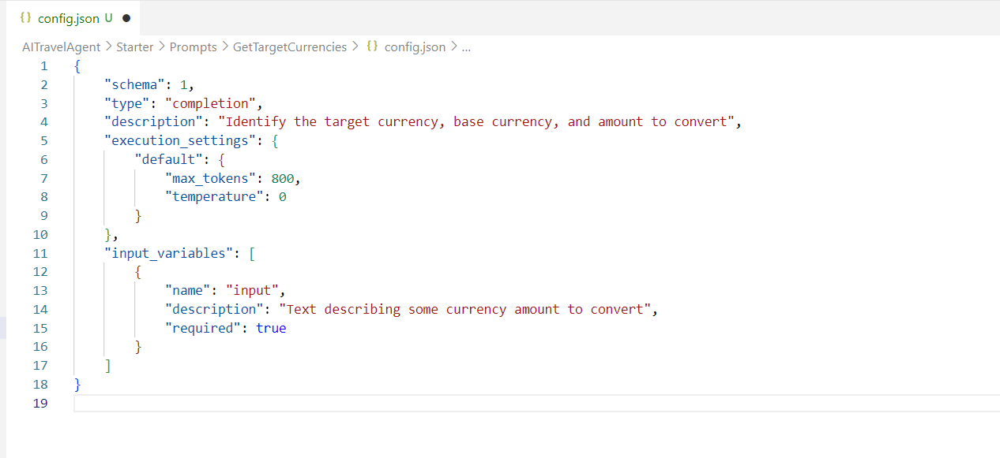

# 실습 5 - Azure OpenAI 및 Semantic Kernel SDK를 사용해 Contoso AI 여행 어시스턴트 에이전트 개발하기

**예상 소요 시간: 40분**

**목표**

이 실습에서는 참가자들이 Azure OpenAI와 Semantic Kernel SDK 활용해
Contoso 위한 AI 기반 여행 에이전트를 구축하게 됩니다. 목표는 AI 기술을
활용하여 사용자 질문을 이해하고, 여행 추천을 제공하며, 항공편 예약, 호텔
예약, 일정 관리와 같은 작업을 수행할 수 있는 대화형 에이전트를 만드는
방법을 시연하는 것입니다. 실습이 끝나면 참가자들은 AI 모델을 실제
애플리케이션에 통합하는 실습 경험을 쌓고, Semantic Kernel SDK를 활용해
여행 에이전트의 기능을 향상시키며, 시뮬레이션 환경에서 에이전트의 성능을
테스트하게 될 것입니다.

**솔루션 중점 영역**

이 실습은 Azure OpenAI와 Semantic Kernel SDK를 활용해 AI 기반 여행
에이전트를 구축하는 데 중점을 둡니다. 항공편 예약, 숙소 예약, 여행 추천
등 여행 계획과 관련된 사용자 문의를 처리할 수 있도록 자연어 처리(NLP)
기능을 구현합니다.

이 실습은 사용자와 상호작용하며 질문에 답변하고 여행 관련 작업을
지원하는 대화형 AI 인터페이스 생성에 중점을 둡니다. Semantic Kernel
SDK로 일정 관리와 같은 작업을 오케스트레이션하고, 실시간 여행 데이터를
위한 API 통합도 수행합니다.

이 솔루션은 개인 맞춤형이고 반응성이 뛰어난 여행 지원 서비스를
제공함으로써 사용자 경험을 향상시키는 것을 목표로 합니다. 일반적인 여행
관련 작업을 자동화하여 워크플로우를 최적화하고, 여행 계획 과정을 보다
효율적으로 만듭니다.

## 연습 1: VM 및 자격 증명 이해

이 연습에서는 실습 전체에서 사용할 자격 증명을 식별하고 이해합니다.

1.  **Instructions** 탭에는 실습 전체에서 따라야 할 지침이 담긴 랩
    가이드가 포함되어 있습니다.

2.  **Resources** 탭에는 랩을 실행하는 데 필요한 자격 증명이 있습니다.

    - **URL** – Azure 포털에 접속할 수 있는 URL

    - **Subscription** – 할당된**subscription**  **ID** 

    - **Username** – **Azure services**에 **login**할 때 사용할 **user
      ID**

    - **Password** – **Azure login**을 위한 **password**

이제 이 Username과 Password를 **Azure login credentials**이라고
하겠습니다. 앞으로 **Azure login credentials**이 언급되는 모든 곳에서 이
정보를 사용할 것입니다..

    - **Resource Group** – 할당된 **Resource group** 

>[Alert] **중요 사항**: 모든 리소스를 반드시 이 리소스 그룹 내에
생성하도록 하세요.

 

3.  **Help** 탭에는 지원 정보가 포함되어 있습니다. 이 탭에 표시된 **ID**
    값은 실습을 진행하는 동안 사용될 **Lab Instance ID**입니다.

 

## 연습 2: Azure OpenAI 리소스 및 모델 배포 생성

1.  +++https://portal.azure.com/+++ 에 Azure 로그인 자격 증명을 사용해 로그인하세요. 검색창에
    Azure OpenAI를 입력하고 검색 결과에서 선택하세요.

    

2.  **+ Create** 선택하세요.

    

3.  **Basics** 탭에서 아래 정보를 입력하고 **Next** 선택하세요.

    - Subscription – 할당된 **subscription** 선택

    - Resource group – 할당된**Resource group** 선택

    - Region – 가장 가까운 **region** 선택(여기서 East US 2사용됨)

    - Name – **+++AOAI@lab.LabInstance.Id+++**

    - Pricing tier – **Standard**

    

4.  **Network** and **Tags** 페이지에서 기본값을 수락 하고 **Review +
    submit** 페이지에서 **Create** 클릭하세요.

    

5.  생성되면 **Go to resource** 클릭하세요.


6.  **Resource Management**에서 **Keys and Endpoint**  선택하세요. 이
    실습에서 나중에 사용할 수 있도록 **Key 1** 및 **Endpoint** 값을
    메모장에 복사하세요.

    

7.  Azure OpenAI 리소스 **Overview** 페이지에서 **Go to Azure AI Foundry
    portal** 선택하세요.

    

8.  왼쪽 창에서 **Deployments** 선택하세요.

    

9.  **+ Deploy model** -\> **Deploy base model** 선택하세요.

    

10. +++**gpt-35-turbo**+++를 검색해 선택하세요. **Confirm**을
    클릭하세요.

    

11. 기본값을 적용하고 **Deploy**를 선택하세요.

    

## 연습 3: Azure OpenAI 서비스로 AI 여행사 프로젝트 설정

이번 실습에서는 Visual Studio Code에서 프로젝트 폴더를 설정하고, 이를
Azure OpenAI 서비스와 통합하도록 구성합니다. 단계를 따라가면서 로컬 개발
환경을 설정하고, 프로젝트 파일을 수정하며, Azure OpenAI 배포 정보를
사용해 애플리케이션을 실행할 준비를 하게 됩니다.

1.  **Command Prompt** 여세요.

    

2.  아래 명령어들을 하나씩 순서대로 실행하세요.

    +++dotnet nuget list source+++
    
    +++dotnet nuget add source https://api.nuget.org/v3/index.json --name nuget.org+++

    

3.  Visual Studio Code 여세요. **File** -\> **Open folder** 선택하세요.

    

4.  **C:\LabFiles**로 이동해 **AITravelAgent** 폴더를 선택한
    후, **Select Folder** 클릭하세요. 폴더가 VS Code에서 열립니다.

>[!Note] **참고:** 알림 창이 뜨면 내용을 신뢰(Trust) 하세요.

    

5.  Explorer 창에서 **AITravelAgent/Starter** 폴더로 이동하세요. 폴더를
    마우스 오른쪽 버튼으로 클릭한 후 **Open in Integrated Terminal**를
    선택하세요.

    

6.  Explorer 창에서 Starter 폴더를 확장하면 Plugins 폴더, Prompts 폴더
    및 Program.cs 파일을 확인할 수 있습니다.

    

7.  **Starter/Program.cs** 파일을 열고, 아래 변수들을 사용자의 Azure
    OpenAI Services 배포 이름, API 키, 엔드포인트로 업데이트하세요.
    변경을 완료한 후, Ctrl + S를 눌러 파일을 저장하세요:

    - string yourDeploymentName = +++**gpt-35-turbo-16k**+++

    -  string yourEndpoint = 이전에 저장한 Azure OpenAI 리소스
        엔드포인트 값

    - string yourKey = 이전에 저장한 AOAI 리소스의 Key1

    

## 연습 4: Semantic Kernel로 환율 변환 플러그인 생성 및 테스트

이 연습에서는 Semantic Kernel을 사용하여 환율 변환 플러그인을
생성합니다. 사전에 정의된 환율을 기준으로 한 통화에서 다른 통화로 금액을
변환하는 함수를 작성하고 테스트하게 됩니다. 이 과정을 통해 사용자 정의된
플러그인 생성 및 호출, 기능 설명을 위한 데코레이터(decorators) 활용 및
플러그인을 애플리케이션에 통합하는 방법을 배우게 됩니다.

>[!Alert] **중요 사항:** 다음 단계에서 코드를 추가할 때 VS Code에
오류가 표시될 수 있지만, 이는 무시해도 괜찮습니다. 아래 단계를 차근차근
따라 진행하세요.

1.  **Stater/Plugins/ConvertCurrency** 폴더에
    +++CurrencyConverter.cs+++라는 새 파일을 생성하세요.


2.  **CurrencyConverter.cs** 파일에서 다음 코드를 추가하여 플러그인
    함수를 생성하세요.

    ```
    using Microsoft.SemanticKernel;
    using System.ComponentModel;
    using AITravelAgent;
    
    class CurrencyConverter
    {
        [KernelFunction, 
        Description("Convert an amount from one currency to another")]
        public static string ConvertAmount(
        {
            var currencyDictionary = Currency.Currencies;
        }
    }
    ```

    

이 코드에서는 KernelFunction 데코레이터를 사용해 네이티브 함수를
정의하고, Description 데코레이터를 통해 함수의 기능을 설명하는 문장을
추가합니다. 또한 Currency.Currencies라는 화폐 정보 목록을 사용하여, 각
화폐에 대한 환율 데이터를 불러올 수 있습니다. 이제 사용자가 입력한
금액을 기준 통화에서 대상 통화로 변환하는 로직을 추가해보겠습니다.

3.  **ConvertAmount** 함수 수정하세요. 기존 코드를 아래 코드로
    변경하세요.

```
using Microsoft.SemanticKernel;
using System.ComponentModel;
using AITravelAgent;

class CurrencyConverter
{
    [KernelFunction, Description(@"Converts an amount from one currency to another
        and returns a friendly message with the results")]
    public static string ConvertAmount(
        [Description("The starting currency code")] string baseCurrencyCode,
        [Description("The target currency code")] string targetCurrencyCode, 
        [Description("The amount to convert")] string amount)
    {
        var currencyDictionary = Currency.Currencies;
        Currency targetCurrency = currencyDictionary[targetCurrencyCode];
        Currency baseCurrency = currencyDictionary[baseCurrencyCode];
        
        if (targetCurrency == null)
        {
            return targetCurrencyCode + " was not found";
        }
        else if (baseCurrency == null)
        {
            return baseCurrencyCode + " was not found";
        }
        else
        {
            double amountInUSD = Double.Parse(amount) * baseCurrency.USDPerUnit;
            double result = amountInUSD * targetCurrency.UnitsPerUSD;
            return $"${amount} {baseCurrencyCode} is approximately {result.ToString("C")} in {targetCurrency.Name}s ({targetCurrencyCode})";
        }
    }
}
```  

이 코드에서는 Currency.Currencies dictionary를 사용해 대상 통화와 기준
통화에 해당하는 Currency 항목을 가져옵니다. 그 후, 해당 Currency 항목을
사용해 기준 통화에서 대상 통화로 금액을 변환합니다. 마지막으로, 변환된
금액을 포함한 문자열을 반환합니다. 이제 플러그인을 테스트해 보겠습니다.


>[!Note] **참고:** 자신의 프로젝트에서 Semantic Kernel SDK를 사용할 때,
파일에 데이터를 하드코딩할 필요는 없습니다. RESTful API에 접근할 수
있다면, **Plugins.Core.HttpClient** 플러그인을 사용해 API로부터 데이터를
가져올 수 있습니다.

4.  Starter/Program.cs 파일에서 다음 코드를 사용하여 새 플러그인 함수를
    가져오고 호출합니다. (아래 코드를 삭제하세요. var kernel =
    builder.Build(); 아래와 같은 코드로 교체)

    ```
    kernel.ImportPluginFromType<CurrencyConverter>();
    kernel.ImportPluginFromType<ConversationSummaryPlugin>();
    var prompts = kernel.ImportPluginFromPromptDirectory("Prompts");
    
    var result = await kernel.InvokeAsync("CurrencyConverter", 
        "ConvertAmount", 
        new() {
            {"targetCurrencyCode", "USD"}, 
            {"amount", "52000"}, 
            {"baseCurrencyCode", "VND"}
        }
    );
    
    Console.WriteLine(result);
    ```

Console.WriteLine(result); 이 코드에서는 ImportPluginFromType 방법을
사용해 플러그인을 가져옵니다. 그다음 InvokeAsync 방법을 사용해 플러그인
함수를 호출합니다. InvokeAsync는 플러그인 이름, 함수 이름 및 파라미터
딕셔너리를 사용합니다. 마지막으로 결과를 콘솔에 출력합니다. 이제 코드를
실행해서 작동하는지 확인해보세요.


5.  상단 표시줄에서 파일로 이동하여 **save all**을 선택하세요.


6.  터미널에+++**dotnet run**+++를 입력하세요입니다. 다음 출력이
    표시되어야 합니다:

출력: $52000 VND is approximately $2.13 in US Dollars (USD)


이제 플러그인이 정상적으로 작동하니, 사용자의 자연어 입력에서 변환하려는
통화와 금액을 정확하게 파악할 수 있는 프롬프트를 생성할 것입니다.

## 연습 5: 시맨틱 처리를 위한 대상 통화 프롬프트 구성하기

이 연습에서는 사용자의 입력에서 대상 통화, 기준 통화 및 금액을 식별할 수
있도록 프롬프트 시스템을 구성합니다. 구성 파일과 프롬프트 파일을
생성하고 설정함으로써, AI가 자연어로 된 환율 변환 요청을 어떻게 해석하고
처리할지를 정의하게 됩니다.

1.  Visual Studio Code에서 **Starter/Prompts** 폴더를 찾으세요. 이
    폴더로 이동해 다음 단계를 준비하세요.

    

2.  **Starter/Prompts** 폴더 내에 +++GetTargetCurrencies+++라는 새
    폴더를 생성하세요. 이 폴더에는 이 연습과 관련된 모든 파일이
    포함됩니다.

    

3.  **GetTargetCurrencies** 폴더 내에 +++config.json+++라는 새 파일을
    생성하세요.

    

4.  Visual Studio Code에서 새로 만든 **config.json** 파일을 여세요. 다음
    코드를 복사하여 파일에 붙여넣으세요.

    ```
    {
        "schema": 1,
        "type": "completion",
        "description": "Identify the target currency, base currency, and amount to convert",
        "execution_settings": {
            "default": {
                "max_tokens": 800,
                "temperature": 0
            }
        },
        "input_variables": [
            {
                "name": "input",
                "description": "Text describing some currency amount to convert",
                "required": true
            }
        ]
    }
    ```
    
    

    **Ctrl + S**를 눌러 파일을 저장하세요. 이 구성은 AI 시스템이 사용자
입력을 해석하고 처리하는 방법을 정의합니다.

5.  **GetTargetCurrencies** 폴더 내에서 +++skprompt.txt+++라는 새로운
    파일을 생성하세요.

    

6.  텍스트 편집기에서 **skprompt.txt** 파일을 열고 다음 내용을
    붙여넣으세요:

    ```
    <message role="system">Identify the target currency, base currency, and 
    amount from the user's input in the format target|base|amount</message>
    
    For example: 
    
    <message role="user">How much in GBP is 750.000 VND?</message>
    <message role="assistant">GBP|VND|750000</message>
    
    <message role="user">How much is 60 USD in New Zealand Dollars?</message>
    <message role="assistant">NZD|USD|60</message>
    
    <message role="user">How many Korean Won is 33,000 yen?</message>
    <message role="assistant">KRW|JPY|33000</message>
    
    <message role="user">{{$input}}</message>
    <message role="assistant">target|base|amount</message>
    ```

    

파일을 **Ctrl + S**를 눌러 저장하세요. 이 스크립트는 환율 변환 요청을
처리하기 위한 프롬프트 로직을 정의합니다.

## 실습 6: 여행 일정 추천을 위한 프롬프트 시스템 구성하기

이 실습에서는 사용자의 여행지 정보를 바탕으로 일정 및 추천 장소를 제안할
수 있도록 프롬프트 시스템을 구성합니다. AI가 자연어 입력을 이해하고,
목적지에 맞는 맞춤형 추천을 생성할 수 있도록, 프롬프트의 구조와 설정을
직접 구성해 보겠습니다.

1.  Visual Studio Code에서 **Starter/Prompts/SuggestActivities** 폴더로
    이동하세요.

    

2.  SuggestActivities 폴더 내에서 config.json 파일을 찾아 여세요.

    

3.  config.json **파일의** 기존 코드를 다음으로 변경하세요:

    ```
    {
        "schema": 1,
        "type": "completion",
        "description": "Suggest activities and points of interest at a given destination",
        "execution_settings": {
            "default": {
                "max_tokens": 4000,
                "temperature": 0.5
            }
        },
        "input_variables": [
            {
                "name": "history",
                "description": "Some background information about the user",
                "required": false
            },
            {
                "name": "destination",
                "description": "The destination a user wants to visit",
                "required": true
            }
        ]
      }
    ```

    

변경을 완료한 후, **Ctrl + S**를 눌러 파일을 저장하세요. 이 파일은
사용자의 입력을 처리하고 여행 추천 일정을 생성하는 시스템을 구성합니다.

4.  SuggestActivities 폴더 안에 있는 **skprompt.txt** 파일을 찾아
    편집기에서 여세요..

    

5.  **skprompt.txt**의 기존 내용을 다음 텍스트로 변경하세요:

    ```
    You are an experienced travel agent. 
    You are helpful, creative, and very friendly. 
    Consider the traveler's background: {{$history}}
    The traveler would like some activity recommendations for their trip to {{$destination}}.
    Please suggest a list of things to do, see, and points of interest.
    ```

    

파일을 저장하기 위해 **Ctrl + S** 누르세요. 이 스크립트는 추천 일정을
생성할 때 시스템의 행동 방식 및 톤을 설정합니다.

## 연습 7: AI 워크플로우를 위한 주요 프로그램 구성

이 연습에서는 Program.cs 주요 파일을 설정해 Azure OpenAI 서비스 및
Microsoft Semantic Kernel과 통합합니다. 코드를 맞춤 설정함으로써 환율
변환, 추천 일정, 여행 제안과 같은 기능을 사용할 수 있게 됩니다. 이
설정은 플러그인과 프롬프트 기반 로직을 활용하여, 사용자의 질문을
이해하고 반응하는 강력한 AI 기반 워크플로우를 구축합니다.

1.  Visual Studio Code에서 프로젝트를 연 상태에서,
    **Starter/Program.cs** 파일로 이동해 열어주세요. 이제 이 파일을
    수정할 준비가 되었습니다.

    

2.  **Program.cs** 파일의 전체 내용을 아래 코드로 교체한 후, **Ctrl +
    S** 를 눌러 저장하세요.

>[!Note] **참고:** 코드를 교체한 후, 이전과 같이 endpoint, key 및
deployment name을 다시 추가하세요.

```
using System.Text;
using Microsoft.SemanticKernel;
using Microsoft.SemanticKernel.ChatCompletion;
using Microsoft.SemanticKernel.Connectors.OpenAI;
using Microsoft.SemanticKernel.Plugins.Core;
#pragma warning disable SKEXP0050 
#pragma warning disable SKEXP0060

string yourDeploymentName = "gpt-35-turbo";
string yourEndpoint = "EndPoint";
string yourApiKey = "API Key";

var builder = Kernel.CreateBuilder();
builder.Services.AddAzureOpenAIChatCompletion(
    yourDeploymentName,
    yourEndpoint,
    yourApiKey,
    "gpt-35-turbo");
var kernel = builder.Build();

kernel.ImportPluginFromType<CurrencyConverter>();
kernel.ImportPluginFromType<ConversationSummaryPlugin>();
var prompts = kernel.ImportPluginFromPromptDirectory("Prompts");

// Note: ChatHistory isn't working correctly as of SemanticKernel v 1.4.0
StringBuilder chatHistory = new();

OpenAIPromptExecutionSettings settings = new()
{
    ToolCallBehavior = ToolCallBehavior.AutoInvokeKernelFunctions
};

string input;

do {
    Console.WriteLine("What would you like to do?");
    input = Console.ReadLine()!;

    var intent = await kernel.InvokeAsync<string>(
        prompts["GetIntent"], 
        new() {{ "input",  input }}
    );

    switch (intent) {
        case "ConvertCurrency": 
            var currencyText = await kernel.InvokeAsync<string>(
                prompts["GetTargetCurrencies"], 
                new() {{ "input",  input }}
            );
            
            var currencyInfo = currencyText!.Split("|");
            var result = await kernel.InvokeAsync("CurrencyConverter", 
                "ConvertAmount", 
                new() {
                    {"targetCurrencyCode", currencyInfo[0]}, 
                    {"baseCurrencyCode", currencyInfo[1]},
                    {"amount", currencyInfo[2]}, 
                }
            );
            Console.WriteLine(result);
            break;
        case "SuggestDestinations":
            chatHistory.AppendLine("User:" + input);
            var recommendations = await kernel.InvokePromptAsync(input!);
            Console.WriteLine(recommendations);
            break;
        case "SuggestActivities":

            var chatSummary = await kernel.InvokeAsync(
                "ConversationSummaryPlugin", 
                "SummarizeConversation", 
                new() {{ "input", chatHistory.ToString() }});

            var activities = await kernel.InvokePromptAsync(
                input!,
                new () {
                    {"input", input},
                    {"history", chatSummary},
                    {"ToolCallBehavior", ToolCallBehavior.AutoInvokeKernelFunctions}
            });

            chatHistory.AppendLine("User:" + input);
            chatHistory.AppendLine("Assistant:" + activities.ToString());

            Console.WriteLine(activities);
            break;
        case "HelpfulPhrases":
        case "Translate":
            var autoInvokeResult = await kernel.InvokePromptAsync(input, new(settings));
            Console.WriteLine(autoInvokeResult);
            break;
        default:
            Console.WriteLine("Sure, I can help with that.");
            var otherIntentResult = await kernel.InvokePromptAsync(input);
            Console.WriteLine(otherIntentResult);
            break;
    }
} 
while (!string.IsNullOrWhiteSpace(input));
```

이 프로그램은 텍스트 처리를 위한 System.Text와 AI 기반 대화형 워크플로를
위한 Microsoft.SemanticKernel과 같은 필수 네임스페이스를 가져오는 것부터
시작합니다. Microsoft.SemanticKernel.Connectors.OpenAI 네임스ㅍ이스 통해
Microsoft Azure OpenAI 서비스와 통합하여 GPT 모델(gpt-35-turbo-16k
모델)과의 연결을 가능하게 합니다. 구성에서는 yourDeploymentName,
yourEndpoint, yourApiKey 같은 변수를 설정하여 Azure OpenAI 엔드포인트에
인증하고 연결하는 과정을 포함합니다.

Semantic Kernel은 빌더 패턴을 사용해 초기화됩니다. 여기에
CurrencyConverter, ConversationSummaryPlugin와 같은 추가 기능용
플러그인들이 함께 가져와집니다. 또한, Prompts 디렉터리에 저장된 프롬프트
파일들을 동적으로 로드하여 사용자의 의도를 인식하고, 그에 맞는 작업을
실행할 수 있도록 지원합니다.

프로그램의 메인 루프는 사용자에게 입력을 받아 GetIntent 프롬프트를 통해
의도를 파악합니다. 파악된 의도에 따라 프로그램은 각기 다른 기능으로
분기되어 작동합니다:

1.  **통화 변환**: 사용자의 의도가 통화 변환일 경우, 프로그램은
    GetTargetCurrencies 프롬프트를 사용해 기준 통화, 대상 통화, 변환할
    금액 등의 정보를 추출합니다. 그 후, CurrencyConverter 플러그인의
    ConvertAmount method 호출해 결과를 계산하고 화면에 출력합니다.

2.  **여행지 추천**: 사용자의 의도가 여행지 추천인 경우, 프로그램은
    Semantic Kernel의 InvokePromptAsync method 사용해 사용자 입력을
    바탕으로 여행지 추천을 제공합니다.

3.  **추천 일정**: 이 기능은 대화 요약 플러그인인
    ConversationSummaryPlugin을 활용해 상황에 맞는 추천 일정을
    제공합니다. 대화의 흐름은 StringBuilder 객체를 사용해 대화 기록을
    유지하며, 이를 통해 지속적인 대화가 가능합니다.

4.  **유용한 문구 및 번역**: "HelpfulPhrases" 또는 "Translate"와 같은
    의도에 대해서는 kernel이 자동으로 입력과 설정에 맞는 관련 함수를
    호출합니다.

그 외의 사용자의 의도는 프롬프트 시스템을 통해 일반적으로 처리되어,
다양한 반응을 유연하게 제공할 수 있습니다. 상호작용 루프는 사용자가 빈
문자열을 입력할 때까지 계속됩니다.

## 연습 8: 애플리케이션 테스트하기

이 연습에서는 통화 변환, 여행지 추천 및 추천 일정에 대한 쿼리를 실행하여
애플리케이션의 기능을 테스트합니다. 이를 통해 AI 기반 시스템이 의도한
대로 작동하고 정확하며 상황에 맞는 출력을 제공하는지 확인할 수 있습니다.

**테스트 단계**

1.  **애플리케이션 실행**

    - Starter 폴더를 마우스 오른쪽 버튼으로 클릭하고 **Open in
      Integrated Terminal을** 선택하세요.

    - 터미널에서 다음 명령을 입력하여 애플리케이션을 실행하세요:

      +++dotnet run+++

2.  **통화 변환 테스트**

    - 메시지가 표시되면 다음과 같은 통화 변환 쿼리를 입력합니다:  
      +++How much is 60 USD in New Zealand dollars?+++

    - 예상 출력 결과:  
      "$60 USD is approximately $97.88 in New Zealand Dollars (NZD)."

    

3.  **여행지 추천 테스트**

    - 여행지 추천을 위한 쿼리를 입력하고, 관련된 배경 정보를 제공합니다.
      예를 들어:  
      +++I'm planning an anniversary trip with my spouse, but they are
      currently using a wheelchair and accessibility is a must. What are
      some destinations that would be romantic for us?+++

    - 예상 출력 결과: A list of accessible romantic destinations, such
      as:

      1.  그리스 산토리니: 로맨틱한 석양을 즐길 수 있으며, 일부 지역에는
          휠체어가 접근 가능한 경로가 있습니다.

      2.  이탈리아 베니스: 휠체어 탑승이 가능한 곤돌라 여행을 경험할 수
          있습니다.

      3.  하와이 마우이: 아름다운 풍경과 휠체어 접근이 가능한 리조트들이
          있습니다.

4.  **추천 일정 테스트**

    - 특정 목적지에서 추천할 만한 일정을 질문해 보세요. 예를 들어:  
      +++What are some things to do in Barcelona?+++

    - 예상 출력 결과: 목적지에 맞춘 추천 내용, 예를 들어:

      1.  사그라다 파밀리아 방문: 가우디의 걸작으로 휠체어 접근이 가능한
          시설이 제공됩니다.

      2.  구엘 공원 탐방: 독특한 모자이크 디자인과 휠체어 액세스 가능한
          경로가 마련되어 있습니다.

      3.  피카소 미술관 탐방: 휠체어 접근이 가능한 예술 전시 공간입니다.

## 연습 9: 리소스 정리

1.  Azure
    Portal(+++[https://portal.azure.com+++](https://portal.azure.com+++/))에서
    할당된 리소스 그룹을 선택하세요.

2.  리소스 그룹에 있는 리소스를 선택하고 **Delete**을 클릭하세요.

    

3.  삭제 확인 텍스트 상자에 +++delete+++를 입력하고 **요Delete**
    클릭하세요 .

4.  삭제 확인 대화 상자에서 **Delete** 선택하세요.

5.  리소스 삭제 확인 알림을 확인하세요.

**요약:**

이번 실습에서는 Semantic Kernel 및 Azure OpenAI Service 사용해
에이전트를 생성하는 방벙을 배웠습니다.
