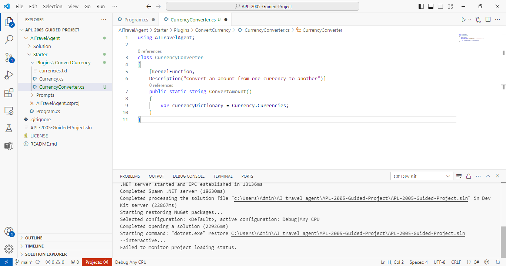
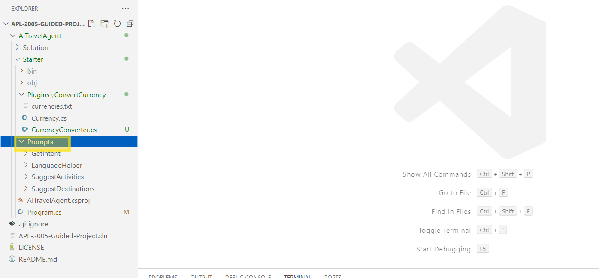

# Laboratorio 5 - Desarrollar un agente asistente de viajes de Contoso utilizando Azure OpenAI y el SDK de Semantic Kernel

**Tiempo estimado: 40 minutos**

## Objetivo

En este laboratorio, los participantes desarrollarán un agente de viajes
impulsado por IA para Contoso utilizando Azure OpenAI y el SDK de
Semantic Kernel. El objetivo es demostrar cómo aprovechar las
tecnologías de IA para crear un agente conversacional capaz de entender
consultas de los usuarios, proporcionar recomendaciones de viaje y
realizar tareas como la reserva de vuelos, hoteles y la gestión de
itinerarios. Al final del laboratorio, los participantes tendrán
experiencia práctica en la integración de modelos de IA con aplicaciones
del mundo real, utilizando el SDK de Semantic Kernel para mejorar las
capacidades del agente de viajes y evaluando su rendimiento en un
entorno simulado.

## Área de enfoque de la solución

El laboratorio se centra en la creación de un agente de viajes impulsado
por IA utilizando Azure OpenAI y el SDK de Semantic Kernel. Permite el
procesamiento de lenguaje natural (NLP) para manejar consultas de
usuarios relacionadas con la planificación de viajes, como la reserva de
vuelos, alojamientos y la provisión de recomendaciones de viaje.  
El laboratorio pone énfasis en la creación de una interfaz
conversacional de IA que interactúa con los usuarios, respondiendo
preguntas y asistiendo con tareas relacionadas con viajes. Utilizando el
SDK de Semantic Kernel, organiza tareas como la gestión de itinerarios e
integra APIs para datos de viaje en tiempo real.  
La solución tiene como objetivo mejorar la experiencia del usuario
proporcionando asistencia personalizada y reactiva en los viajes.
Automatiza tareas comunes de viajes para optimizar flujos de trabajo y
agilizar los procesos de planificación de viajes.

## Ejercicio 1: Conozca la máquina virtual y las credenciales

En este ejercicio, identificaremos y comprenderemos las credenciales que
utilizaremos a lo largo del laboratorio.

1.  Pestaña de **Instrucciones** sujeta la guía de laboratorio con las
    instrucciones a seguir a lo largo del laboratorio.

2.  La pestaña **Recursos** contiene las credenciales necesarias para
    realizar el laboratorio.

    - **URL** – URL del portal Azure.
    
    - **Subscription** – Este es el **ID** de la **suscripción** que se le
      ha asignado.
    
    - **Username** – El **identificador de usuario** con el que debe
      **iniciar sesión** en los **servicios Azure**.
    
    - **Password** – **Contraseña** de acceso a **Azure**.

    Llamemos a este nombre de usuario y contraseña como **Azure login credentials**.

    Utilizaremos estas credenciales cada vez que mencionemos **Azure login credentials**.

    - **Resource Group** – El **grupo de recursos** que se le ha asignado.

    >[!Alert] **Importante:** Asegúrese de crear todos sus recursos en este grupo de recursos.
    
    

3.  La pestaña **Help** contiene la información de Soporte. El valor
    **ID** aquí es el **ID de la instancia de laboratorio** que se
    utilizará durante la ejecución del laboratorio.

    

## Ejercicio 2: Creación de recursos Azure OpenAI e implementación de modelos

**Requisitos previos**: Se requiere una cuenta de GitHub para completar
este laboratorio. Si no tiene una cuenta, cree una desde aquí
+++https://github.com/+++, seleccionando **Sign up**.

    

1.  Inicie sesión +++**https://portal.azure.com**+++ utilizando las
    credenciales de inicio de sesión de Azure. Busque +++**Azure
    OpenAI**+++ en la barra de búsqueda y selecciónelo.

    

2.  Seleccione **+ Create**.

    

3.  Complete los siguientes datos en la pestaña **Basics** y seleccione
    **Next**.

    - Subscription – Seleccione la **suscripción** asignada
    
    - Resource group – Seleccione el **grupo de recursos** que se le ha
      asignado.
    
    - Region – Seleccione su **región** más cercana (aquí se utiliza East US
      2)
    
    - Name – +++AOAI\<ID de instancia de laboratorio\>+++ (Sustituya \<**ID
      de instancia de laboratorio**\> por el ID de su máquina virtual)
    
    - Pricing tier – **Standard**

    

4.  Acepte los valores predeterminados en las páginas **Network** y
    **Tags.**  
    Haga clic en **Create** en la página **Review + submit.**

    

5.  Una vez creado, haga clic en **Go to resource**.

    

6.  Seleccione **Keys and Endpoint,** debajo de **Resource Management**.
    Copie los valores de **Key 1** y **Endpoint** en un bloc de notas
    para utilizarlos en el futuro en este laboratorio.

    

7.  En la página Azure OpenAI resource **Overview**, seleccione **Go to
    Azure AI Foundry portal**.

    

8.  En el panel izquierdo, seleccione **Deployments**.

    

9.  Seleccione **+ Deploy model** -\> **Deploy base model**

    

10. Busque y seleccione +++**gpt-35-turbo-16k**+++. Haga clic en
    **Confirm**.

    

11. Acepte los valores por defecto y seleccione **Deploy**.

    

## Ejercicio 3: Configuración del proyecto AI Travel Agent con Azure OpenAI Services

En este ejercicio, configurará su carpeta de proyecto en Visual Studio
Code y la integrará con Azure OpenAI Services. Al seguir los pasos,
aprenderá cómo configurar un entorno de desarrollo local, modificar los
archivos del proyecto y preparar la aplicación para su ejecución
utilizando los detalles de su implementación de Azure OpenAI.

1.  Abra el **Command Prompt.**

    

2.  Ejecute los siguientes comandos uno a uno:

    ```
    dotnet nuget list source
    ```
    
    ```
    dotnet nuget add source https://api.nuget.org/v3/index.json --name nuget.org
    ```

3.  Abra Visual Studio Code. Seleccione **File** -\> **Open folder**.

    

4.  Navegue hasta **C:\LabFiles** y seleccione la carpeta
    **AITravelAgent** y haga clic en **Select Folder**. La carpeta se
    abrirá en VS Code.

    

5.  En el panel explorador, navegue hasta la carpeta
    **AITravelAgent/Starter**. Haga clic con el botón derecho en la
    carpeta y seleccione **Open in Integrated Terminal.**

    

7.  En el panel explorador, expanda la carpeta Starter, y debería ver la
    carpeta Plugins, la carpeta Prompts y el archivo Program.cs.

    

7.  Abra el archivo Starter/Program.cs y actualice las siguientes
    variables con el nombre de implementación, la clave de API y el
    endpoint de sus servicios Azure OpenAI. Después de realizar los
    cambios, presione Ctrl + S para guardar el archivo:

    -    string yourDeploymentName = +++**gpt-35-turbo-16k**+++

    -    string yourEndpoint = El valor del Endpoint del recurso Azure OpenAI que guardamos anteriormente.

    -    string yourKey = La clave1 del recurso AOAI que guardamos anteriormente.

    

## Ejercicio 4: Creación y prueba de un plugin de conversión de divisas con Semantic Kernel

En este ejercicio, creará un complemento de conversión de divisas
utilizando Semantic Kernel. Escribirá y probará una función que
convierte una cantidad de una moneda a otra utilizando tasas de cambio
predefinidas. Este ejercicio le ayudará a comprender cómo construir e
invocar complementos personalizados, utilizar decoradores para la
funcionalidad y descripciones, e integrar complementos en una aplicación
más grande.

1.  Cree un nuevo archivo llamado +++CurrencyConverter.cs+++ en la
    carpeta **Stater/Plugins/ConvertCurrency**.

    

2.  En el archivo **CurrencyConverter.cs**, añada el siguiente código para
    crear una función plugin.

    ```
    using Microsoft.SemanticKernel;
    using System.ComponentModel;
    using AITravelAgent;
    
    class CurrencyConverter
    {
        [KernelFunction, 
        Description("Convert an amount from one currency to another")]
        public static string ConvertAmount(
        {
            var currencyDictionary = Currency.Currencies;
        }
    }
    ```

    

    En este código, se utiliza el decorador KernelFunction para declarar la función nativa. También se emplea el decorador Description para agregar una descripción de lo que hace la función. Se puede usar Currency.Currencies para obtener un diccionario de monedas y sus tasas de cambio. Luego, se agrega lógica para convertir una cantidad dada de una moneda a otra.

3.  Modifique su función ConvertAmount. Sustituya el código existente
    por el siguiente:

    ```
    using Microsoft.SemanticKernel;
    using System.ComponentModel;
    using AITravelAgent;
    
    class CurrencyConverter
    {
        [KernelFunction, Description(@"Converts an amount from one currency to another
            and returns a friendly message with the results")]
        public static string ConvertAmount(
            [Description("The starting currency code")] string baseCurrencyCode,
            [Description("The target currency code")] string targetCurrencyCode, 
            [Description("The amount to convert")] string amount)
        {
            var currencyDictionary = Currency.Currencies;
            Currency targetCurrency = currencyDictionary[targetCurrencyCode];
            Currency baseCurrency = currencyDictionary[baseCurrencyCode];
            
            if (targetCurrency == null)
            {
                return targetCurrencyCode + " was not found";
            }
            else if (baseCurrency == null)
            {
                return baseCurrencyCode + " was not found";
            }
            else
            {
                double amountInUSD = Double.Parse(amount) * baseCurrency.USDPerUnit;
                double result = amountInUSD * targetCurrency.UnitsPerUSD;
                return $"${amount} {baseCurrencyCode} is approximately {result.ToString("C")} in {targetCurrency.Name}s ({targetCurrencyCode})";
            }
        }
    }
    ```

    En este código, se utiliza el diccionario Currency.Currencies para obtener el objeto Currency de las monedas base y destino. Luego, se usa el objeto Currency para convertir la cantidad de la moneda base a la moneda destino. Finalmente, se devuelve una cadena con la cantidad convertida. A continuación, probemos su complemento.


    

    >[!Note] **Nota:** Al usar el SDK de Semantic Kernel en sus propios proyectos, no es necesario codificar datos directamente en los archivos si tiene acceso a APIs RESTful. En su lugar, puede utilizar el complemento Plugins.Core.HttpClient para recuperar datos de las APIs.

4.  En el archivo **Starter/Program.cs**, importe e invoque su nueva
    función de complemento con el siguiente código. (Elimine el código
    debajo de **var kernel = builder.Build();** y reemplácelo con el
    código proporcionado a continuación).

    ```
    kernel.ImportPluginFromType<CurrencyConverter>();
    kernel.ImportPluginFromType<ConversationSummaryPlugin>();
    var prompts = kernel.ImportPluginFromPromptDirectory("Prompts");
    
    var result = await kernel.InvokeAsync("CurrencyConverter", 
        "ConvertAmount", 
        new() {
            {"targetCurrencyCode", "USD"}, 
            {"amount", "52000"}, 
            {"baseCurrencyCode", "VND"}
        }
    );
    
    Console.WriteLine(result);
    ```

    En este código, se utiliza el método ImportPluginFromType para importar su plugin. Luego, se usa el método InvokeAsync para invocar la función de su plugin. El método InvokeAsync toma el nombre del plugin, el nombre de la función y un diccionario de parámetros. Finalmente, se imprime el resultado en la consola. A continuación, ejecute el código para asegurarse de que funcione.
    
    

5.  Vaya a Files desde la barra superior y seleccione **Save all.**

    

6.  En la terminal, ingrese **dotnet run**. Debería ver la siguiente
    respuesta:

    Respuesta: $52000 VND is approximately $2.13 in US Dollars (USD)

    

    Ahora que su complemento está funcionando correctamente, vamos a crear un prompt en lenguaje natural que pueda detectar qué monedas y cantidad desea convertir el usuario.

## Ejercicio 5: Configuración de un prompt de Target Currency para el procesamiento semántico

En este ejercicio, configurará un sistema de prompts para identificar
**Target Currency**, monedas base y cantidades a partir de la entrada
del usuario. Al crear y configurar los archivos de configuración y de
prompts, definirá cómo la IA interpreta y procesa solicitudes en
lenguaje natural para conversiones de divisas.

1.  Desde Visual Studio Code, localice la carpeta Starter/Prompt.
    Navegue dentro de esta carpeta para prepararse para los siguientes
    pasos.

    

2.  Dentro de la carpeta Starter/Prompt, cree una nueva carpeta llamada
    +++**GetTargetCurrencies**+++. Esta carpeta contendrá todos los
    archivos relacionados con este ejercicio.

    

3.  Dentro de la carpeta **GetTargetCurrencies**, cree un nuevo archivo
    llamado +++**config.json**+++.

    

4.  Abra el archivo **config.json** recién creado en Visual Studio Code.
    Copie y pegue el siguiente código en el archivo.

    ```
    {
        "schema": 1,
        "type": "completion",
        "description": "Identify the target currency, base currency, and amount to convert",
        "execution_settings": {
            "default": {
                "max_tokens": 800,
                "temperature": 0
            }
        },
        "input_variables": [
            {
                "name": "input",
                "description": "Text describing some currency amount to convert",
                "required": true
            }
        ]
    }
    ```

    

    Guarde el archivo presionando Ctrl + S. Esta configuración define cómo el sistema de IA debe interpretar y procesar la entrada del usuario.

5.  Aún dentro de la carpeta **GetTargetCurrencies**, cree otro nuevo
    archivo llamado +++**skprompt.txt**+++.

    

6.  Abra el archivo **skprompt.txt** en su editor de texto y pegue el
    siguiente contenido:

    ```
    <message role="system">Identify the target currency, base currency, and 
    amount from the user's input in the format target|base|amount</message>
    
    For example: 
    
    <message role="user">How much in GBP is 750.000 VND?</message>
    <message role="assistant">GBP|VND|750000</message>
    
    <message role="user">How much is 60 USD in New Zealand Dollars?</message>
    <message role="assistant">NZD|USD|60</message>
    
    <message role="user">How many Korean Won is 33,000 yen?</message>
    <message role="assistant">KRW|JPY|33000</message>
    
    <message role="user">{{$input}}</message>
    <message role="assistant">target|base|amount</message>
    ```

    

    Guarde el archivo presionando Ctrl + S. Este script define la lógica para procesar las solicitudes de conversión de divisas.
    
## Ejercicio 6: Configuración de un sistema de prompts para recomendaciones de actividades de viaje.

En este ejercicio, configurará y personalizará un sistema de **prompts**
para sugerir actividades y puntos de interés según el destino de viaje
del usuario. Al editar los archivos de configuración y los **prompts**,
definirá el comportamiento del sistema, el tono y los requisitos de
entrada para generar recomendaciones de viaje personalizadas y
creativas.

1.  En Visual Studio Code, vaya a la carpeta
    **Starter/Prompts/SuggestActivities**.

    

2.  Localice el archivo **config.json** dentro de la carpeta
    SuggestActivities y ábralo.

    

3.  Sustituya el código existente en el archivo **config.json** por el
    siguiente:

    ```
    {
        "schema": 1,
        "type": "completion",
        "description": "Suggest activities and points of interest at a given destination",
        "execution_settings": {
            "default": {
                "max_tokens": 4000,
                "temperature": 0.5
            }
        },
        "input_variables": [
            {
                "name": "history",
                "description": "Some background information about the user",
                "required": false
            },
            {
                "name": "destination",
                "description": "The destination a user wants to visit",
                "required": true
            }
        ]
      }
    ```

    

    Guarde el archivo después de hacer los cambios presionando Ctrl + S. Este archivo configura el sistema para procesar las entradas del usuario y generar sugerencias para las actividades.

4.  Permanezca dentro de la carpeta SuggestActivities y localice el
    archivo **skprompt.txt**. Abra este archivo en el editor.

    

5.  Sustituya el contenido existente de **skprompt.txt** por el
    siguiente texto:

    ```
    You are an experienced travel agent. 
    You are helpful, creative, and very friendly. 
    Consider the traveler's background: {{$history}}
    The traveler would like some activity recommendations for their trip to {{$destination}}.
    Please suggest a list of things to do, see, and points of interest.
    ```

    

    Guarde el archivo presionando Ctrl + S. Este script establece el comportamiento y el tono del sistema a la hora de generar recomendaciones de actividad.

## Ejercicio 7: Configuración del programa principal para el flujo de trabajo de IA

En este ejercicio, configurará el archivo principal **Program.cs** para
integrarlo con los servicios de Azure OpenAI y el Microsoft Semantic
Kernel. Al personalizar el código, habilitará funcionalidades como
conversión de divisas, sugerencias de actividades y recomendaciones de
viajes. Esta configuración establece un flujo de trabajo sólido
impulsado por IA para la interacción con el usuario y el reconocimiento
de intenciones, aprovechando complementos y lógica basada en prompts.

1.  Desde su proyecto en Visual Studio Code, navegue hasta el archivo
    **Starter/Program.cs** y ábralo para editarlo.

    

2.  Sustituya todo el contenido del archivo **Program.cs** por el
    siguiente código y, a continuación, presione **cntrl + S** para
    guardar el código.

    >[!Note] **Nota:** Después de reemplazar el código, por favor, agregue nuevamente
el **endpoint**, la **clave** y el **nombre de la implementación** en la
sección correspondiente del código.

    ```
    using System.Text;
    using Microsoft.SemanticKernel;
    using Microsoft.SemanticKernel.ChatCompletion;
    using Microsoft.SemanticKernel.Connectors.OpenAI;
    using Microsoft.SemanticKernel.Plugins.Core;
    #pragma warning disable SKEXP0050 
    #pragma warning disable SKEXP0060
    
    string yourDeploymentName = "gpt-35-turbo-16k";
    string yourEndpoint = "EndPoint";
    string yourApiKey = "API Key";
    
    var builder = Kernel.CreateBuilder();
    builder.Services.AddAzureOpenAIChatCompletion(
        yourDeploymentName,
        yourEndpoint,
        yourApiKey,
        "gpt-35-turbo-16k");
    var kernel = builder.Build();
    
    kernel.ImportPluginFromType<CurrencyConverter>();
    kernel.ImportPluginFromType<ConversationSummaryPlugin>();
    var prompts = kernel.ImportPluginFromPromptDirectory("Prompts");
    
    // Note: ChatHistory isn't working correctly as of SemanticKernel v 1.4.0
    StringBuilder chatHistory = new();
    
    OpenAIPromptExecutionSettings settings = new()
    {
        ToolCallBehavior = ToolCallBehavior.AutoInvokeKernelFunctions
    };
    
    string input;
    
    do {
        Console.WriteLine("What would you like to do?");
        input = Console.ReadLine()!;
    
        var intent = await kernel.InvokeAsync<string>(
            prompts["GetIntent"], 
            new() {{ "input",  input }}
        );
    
        switch (intent) {
            case "ConvertCurrency": 
                var currencyText = await kernel.InvokeAsync<string>(
                    prompts["GetTargetCurrencies"], 
                    new() {{ "input",  input }}
                );
                
                var currencyInfo = currencyText!.Split("|");
                var result = await kernel.InvokeAsync("CurrencyConverter", 
                    "ConvertAmount", 
                    new() {
                        {"targetCurrencyCode", currencyInfo[0]}, 
                        {"baseCurrencyCode", currencyInfo[1]},
                        {"amount", currencyInfo[2]}, 
                    }
                );
                Console.WriteLine(result);
                break;
            case "SuggestDestinations":
                chatHistory.AppendLine("User:" + input);
                var recommendations = await kernel.InvokePromptAsync(input!);
                Console.WriteLine(recommendations);
                break;
            case "SuggestActivities":
    
                var chatSummary = await kernel.InvokeAsync(
                    "ConversationSummaryPlugin", 
                    "SummarizeConversation", 
                    new() {{ "input", chatHistory.ToString() }});
    
                var activities = await kernel.InvokePromptAsync(
                    input!,
                    new () {
                        {"input", input},
                        {"history", chatSummary},
                        {"ToolCallBehavior", ToolCallBehavior.AutoInvokeKernelFunctions}
                });
    
                chatHistory.AppendLine("User:" + input);
                chatHistory.AppendLine("Assistant:" + activities.ToString());
    
                Console.WriteLine(activities);
                break;
            case "HelpfulPhrases":
            case "Translate":
                var autoInvokeResult = await kernel.InvokePromptAsync(input, new(settings));
                Console.WriteLine(autoInvokeResult);
                break;
            default:
                Console.WriteLine("Sure, I can help with that.");
                var otherIntentResult = await kernel.InvokePromptAsync(input);
                Console.WriteLine(otherIntentResult);
                break;
        }
    } 
    while (!string.IsNullOrWhiteSpace(input));
    ```

    El programa comienza importando los espacios de nombres esenciales como System.Text para el manejo de texto y Microsoft.SemanticKernel para flujos de trabajo conversacionales impulsados por IA. Integra los servicios de Microsoft Azure OpenAI a través del espacio de nombres
    
    Microsoft.SemanticKernel.Connectors.OpenAI, lo que permite la comunicación con el modelo GPT (gpt-35-turbo-16k). La configuración implica establecer variables como yourDeploymentName, yourEndpoint y yourApiKey para autenticar y conectar con el punto de acceso de Azure OpenAI.
    
    **Semantic Kernel** se inicializa utilizando un patrón de construcción. Se importan complementos para funcionalidades adicionales, como CurrencyConverter y ConversationSummaryPlugin. Además, se cargan dinámicamente los prompts almacenados en un directorio (Prompts) para facilitar el reconocimiento de intenciones y la ejecución de tareas.

    El ciclo principal del programa interactúa con el usuario solicitando entrada y determinando la intención mediante el prompt GetIntent. Según la intención, el programa se ramifica en diferentes funcionalidades:

    1. **Conversión de divisas**: Si la intención es convertir divisas, el programa extrae los detalles (moneda de destino, moneda base y cantidad) utilizando el prompt GetTargetCurrencies. Luego, llama al método ConvertAmount del complemento CurrencyConverter y muestra el resultado.

    2. **Sugerencias de destinos:** Si la intención es sugerir destinos, el programa utiliza el método InvokePromptAsync del Semantic Kernel para proporcionar recomendaciones basadas en la entrada del usuario.

    3. **Sugerencias de actividades**: Esta funcionalidad aprovecha la resumificación de conversaciones a través del ConversationSummaryPlugin para proporcionar sugerencias de actividades contextualmente relevantes. El historial de la conversación se mantiene utilizando un objeto StringBuilder para un flujo continuo del diálogo.

    4. **Frases útiles y traducción**: Para intenciones como "HelpfulPhrases" o "Translate", el kernel invoca automáticamente las funciones relevantes según la entrada y la configuración. 

    Otros intentos de usuario se manejan de manera genérica invocando el sistema de prompts, asegurando flexibilidad en las respuestas. El ciclo de interacción continúa hasta que el usuario no proporcione entrada (una cadena vacía).

## Ejercicio 8: Verificación de la aplicación

En este ejercicio, probará la funcionalidad de su aplicación ejecutando
consultas de conversión de divisas, sugerencias de destinos y
recomendaciones de actividades. De este modo, se asegurará de que su
sistema basado en IA funciona según lo previsto y proporciona resultados
precisos y sensibles al contexto.

**Pasos para la prueba**

1.  **Ejecute la aplicación**

    - Haga clic con el botón derecho en la carpeta Starter y seleccione
      **Open in Integrated Terminal**.

    - En el terminal, ingrese el siguiente comando para ejecutar la
      aplicación:

      +++dotnet run+++

2.  **Prueba de conversión de divisas**

    - Cuando se le solicite, ingrese una consulta de conversión de
      divisas, por ejemplo:  
      +++How much is 60 USD in New Zealand dollars?+++

    - Resultados esperados:  
      "$60 USD is approximately $97.88 in New Zealand Dollars (NZD)."

3.  **Sugerencias de destino de prueba**

    - Ingrese una consulta para obtener sugerencias de destinos,
      proporcionando contexto. Por ejemplo:  
      +++I'm planning an anniversary trip with my spouse, but they are
      currently using a wheelchair and accessibility is a must. What are
      some destinations that would be romantic for us?+++

    - Resultados esperados: Una lista de destinos románticos accesibles,
      como:

      1.  Santorini, Grecia: puestas de sol románticas y senderos
          accesibles para sillas de ruedas en determinadas áreas.

      2.  Venecia, Italia: paseos en góndola con opciones de embarque
          accesible.

      3.  Maui, Hawai: vistas impresionantes y complejos turísticos con
          acceso para personas con movilidad reducida.

4.  **Sugerencias de actividades de prueba**

    - Ingrese una consulta para recomendaciones de actividades en un
      destino específico. Por ejemplo:  
      +++What are some things to do in Barcelona?+++

    - Resultados esperados: Recomendaciones adaptadas al destino, como:

      1.  Visite la sagrada familia: una obra maestra de Gaudí con
          instalaciones accesibles.

      2.  Explore el Park Güell: diseños de mosaicos únicos con rutas
          accesibles para sillas de ruedas.

      3.  Visite el Museo Picasso: un espacio de arte accesible para
          personas en silla de ruedas.

## Ejercicio 7: Elimine los recursos innecesarios

1.  En el portal de Azure (+++https://portal.azure.com+++), seleccione
    el Grupo de recursos que se le ha asignado.

2.  Seleccione los recursos que están bajo él y haga clic en **Delete**.

    

3.  Escriba +++delete+++ en el cuadro de texto de confirmación de
    eliminación y haga clic en **Delete**.

4.  Seleccione **Delete** en el cuadro de diálogo de confirmación de
    eliminación.

5.  Busque una notificación de confirmación de eliminación de recurso.

**Resumen:**

En este laboratorio, hemos aprendido a crear un agente utilizando
Semantic Kernel y Azure OpenAI Service.
